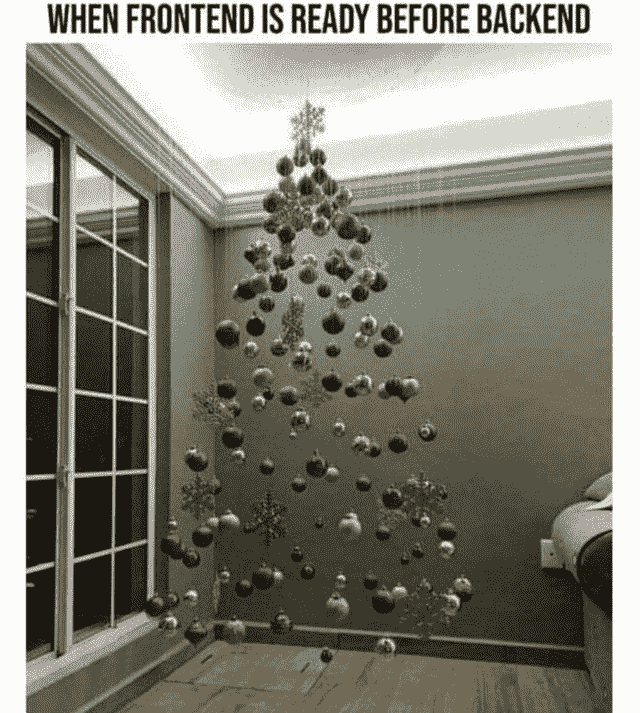
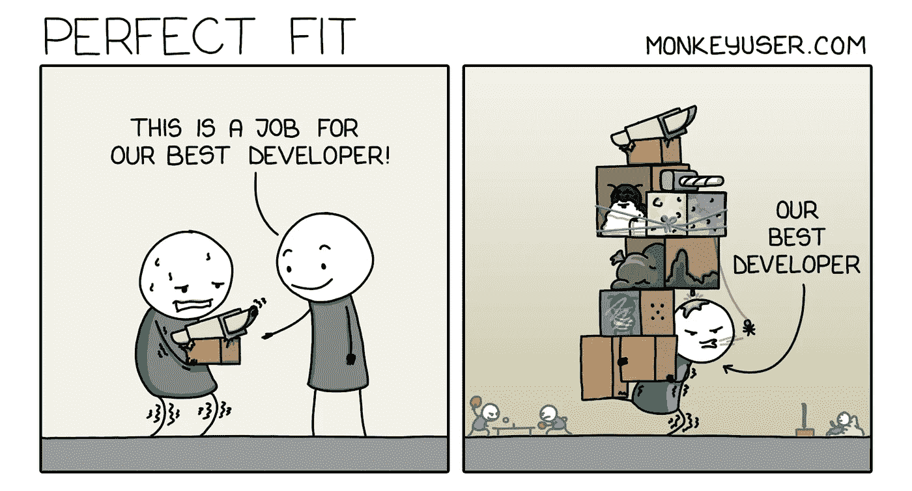
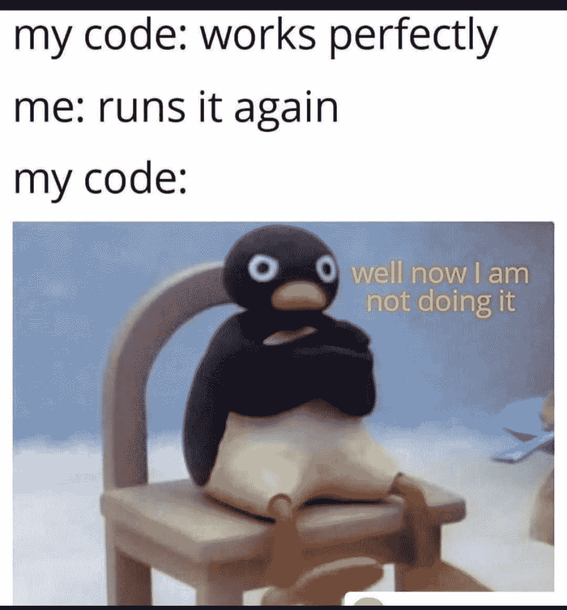
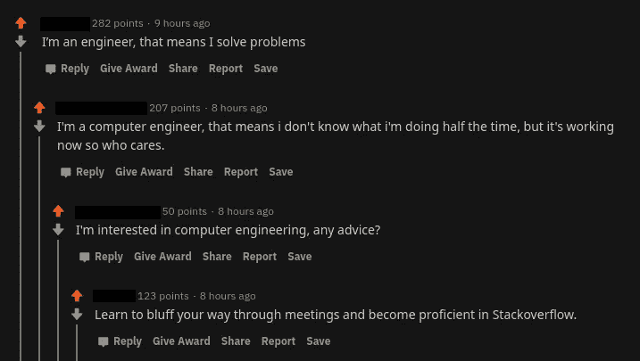

# 编笑话让你开怀大笑…

> 原文：<https://javascript.plainenglish.io/programming-jokes-to-make-you-laugh-hard-cf8ff6c44492?source=collection_archive---------0----------------------->

## 最佳编程迷因汇编…

Photo by [Surface](https://unsplash.com/@surface?utm_source=medium&utm_medium=referral) on [Unsplash](https://unsplash.com?utm_source=medium&utm_medium=referral)

***模因和快乐有什么联系吗？*** 如果你是我这种类型的人，那么你可能也爱在下班后查看手机。猜猜我在那里看到了什么？

我主要是在互联网上看到**视频、抖音和模因**。我不知道为什么，但这有助于我提神醒脑，减轻工作压力。这就是为什么我相信*笑是人类最好的刷新按钮。*

在这篇文章中，我收集了一些我喜欢的网络迷因。

# 当前端开发在前面，而后端有依赖关系时…

Picture Credit:[https://www.reddit.com/r/ProgrammerHumor/](https://www.reddit.com/r/ProgrammerHumor/)

# 不要碰代码…它处于冻结模式。

Picture Credit:[https://www.reddit.com/r/ProgrammerHumor/](https://www.reddit.com/r/ProgrammerHumor/)

# 任何人都可以联系起来吗？

Picture Credit:[https://www.reddit.com/r/ProgrammerHumor/](https://www.reddit.com/r/ProgrammerHumor/)

# 黑咖啡总是说实话..英雄联盟

Picture Credit:[https://www.reddit.com/r/ProgrammerHumor/](https://www.reddit.com/r/ProgrammerHumor/)

# 超出范围…需要预算…

Picture Credit:[https://www.reddit.com/r/ProgrammerHumor/](https://www.reddit.com/r/ProgrammerHumor/)

# 当你申请的 CSS 不起作用时…

Picture Credit:[https://www.reddit.com/r/ProgrammerHumor/](https://www.reddit.com/r/ProgrammerHumor/)

# 你认为编码是什么？

Picture Credit:[https://www.reddit.com/r/ProgrammerHumor/](https://www.reddit.com/r/ProgrammerHumor/)

# 当你有下一个冲刺计划的时候？

Picture Credit:[https://www.reddit.com/r/ProgrammerHumor/](https://www.reddit.com/r/ProgrammerHumor/)

# 最佳开发者阅读这个迷因就像…

[https://www.monkeyuser.com/](https://www.monkeyuser.com/)

# 为什么说真话…当你可以用谎言去解决…

[https://www.facebook.com/javascriptJS/photos/a.1387402908063976/2150614578409468/](https://www.facebook.com/javascriptJS/photos/a.1387402908063976/2150614578409468/)

# 当我的高级开发人员询问每一行时…

[https://www.facebook.com/ProgrammersCreateLife](https://www.facebook.com/ProgrammersCreateLife)

# 敏捷…

Picture Credit:[https://www.reddit.com/r/ProgrammerHumor/](https://www.reddit.com/r/ProgrammerHumor/)

# 当来自互联网的回答完美地工作…

Picture Credit:[https://programmerhumor.io/](https://programmerhumor.io/page/2/)

# git push — force

Picture Credit:[https://programmerhumor.io/](https://programmerhumor.io/page/2/)

# 奖励内容:

# 丑陋的事实…

[https://www.facebook.com/DZoneInc/photos/a.336758034711/10159517902774712/](https://www.facebook.com/DZoneInc/photos/a.336758034711/10159517902774712/)

# 让我们找到错误的根本原因…时间到了…

[https://www.monkeyuser.com/2018/root-cause/?sc=true&dir=random](https://www.monkeyuser.com/2018/root-cause/?sc=true&dir=random)

# 你的地址是什么？我的是…

[https://www.facebook.com/photo?fbid=4265063180221311&set=gm.2872966899620618](https://www.facebook.com/photo?fbid=4265063180221311&set=gm.2872966899620618)

# 我的代码感觉不好，如果我怀疑他…

[https://www.facebook.com/photo?fbid=1741999619316996&set=gm.2873716776212297](https://www.facebook.com/photo?fbid=1741999619316996&set=gm.2873716776212297)

# 不要挑战程序员的幽默

[https://www.reddit.com/r/ProgrammerHumor/comments/okr5j0/programmers_humor_touching_the_sky/](https://www.reddit.com/r/ProgrammerHumor/comments/okr5j0/programmers_humor_touching_the_sky/)

# 我随时准备释放…

[https://www.reddit.com/r/ProgrammerHumor/comments/okcd9m/minimum_viable_product/](https://www.reddit.com/r/ProgrammerHumor/comments/okcd9m/minimum_viable_product/)

# 如果它不起作用，让我们用更高的优先级来修复错误…

[https://programmerhumor.io/programming-memes/daily-life/](https://programmerhumor.io/programming-memes/daily-life/)

# 硬编码变量就像

[https://programmerhumor.io/programming-memes/hard-coding-variables-be-like-2/](https://programmerhumor.io/programming-memes/hard-coding-variables-be-like-2/)

# 太具体的建议…

[https://programmerhumor.io/programming-memes/that-felt-a-little-bit-too-specific/](https://programmerhumor.io/programming-memes/that-felt-a-little-bit-too-specific/)

# 希望你笑得很开心…