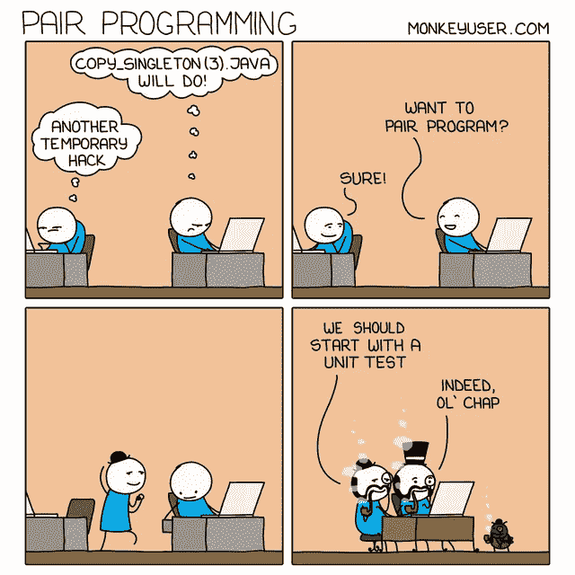

# 编笑话让你开心

> 原文：<https://javascript.plainenglish.io/programming-jokes-to-make-your-day-74caca3e224a?source=collection_archive---------1----------------------->

## 医生为 IT 专业人士开出的幽默模因每日汇编。

Photo by [JC Gellidon](https://unsplash.com/@jcgellidon?utm_source=medium&utm_medium=referral) on [Unsplash](https://unsplash.com?utm_source=medium&utm_medium=referral)

我们很多人都有打开脸书或 Instagram 开始新一天的习惯。像我这样的一些人喜欢在忙碌了一天后恢复心情，或者我们只是喜欢脸上带着微笑。

在这里，我正在创建一个每日文章系列，可能需要 1-2 分钟来阅读，但保证会让你脸上带着微笑。

# 我们开始吧

# 当自动化脚本错过场景时…

Picture credit:[https://www.monkeyuser.com/](https://www.monkeyuser.com/)

# 有时候你假装懂，其实什么都不懂…

Picture Credit:[https://www.facebook.com/yuva.krishna.memes](https://www.facebook.com/yuva.krishna.memes)

# 当我在 YouTube 上找到随机的项目教程时…让我们也创建这个吧…

Picture Credit:[https://programmerhumor.io/programming-memes](https://programmerhumor.io/programming-memes)

# 我不认为一个设计师和一个开发人员可以如此同步…

Picture Credit:[https://programmerhumor.io/programming-memes](https://programmerhumor.io/programming-memes)

# 计划的架构与实际的实施…

Picture credit:[https://www.monkeyuser.com/](https://www.monkeyuser.com/)

# 嗯…当漏洞在 log4j 中被引入时，就发生了这种情况…

Picture Credit:[https://programmerhumor.io/programming-memes](https://programmerhumor.io/programming-memes)

# 我在那里…

Picture Credit: [https://www.facebook.com/javascriptJS](https://www.facebook.com/javascriptJS)

# 没有任何类型了…

Picture Credit:[https://www.facebook.com/javascript.shitposting](https://www.facebook.com/javascript.shitposting)

# 两个不同之处…

Picture credit:[https://www.monkeyuser.com/](https://www.monkeyuser.com/)

[https://programmerhumor.io/programming-memes](https://programmerhumor.io/programming-memes)

# 哇！最好的告白…

[https://programmerhumor.io/programming-memes](https://programmerhumor.io/programming-memes)

# 他们为什么费心通知我？

[https://programmerhumor.io/programming-memes](https://programmerhumor.io/programming-memes)

# 你试过这种编程方法吗？

Picture credit:[https://www.monkeyuser.com/](https://www.monkeyuser.com/)

# 我什么都知道一点…

# 奖励内容:

# “我能做的最好的事是……”——《典当之星》中最好的对白之一

[https://www.facebook.com/jokesvala/photos/a.2330223400336101/6284001301624938/](https://www.facebook.com/jokesvala/photos/a.2330223400336101/6284001301624938/)

# 别担心…我们稍后会修复缺陷…让我们专注于特性…

[https://www.facebook.com/jokesvala/photos/a.2330223400336101/6283984434959958/](https://www.facebook.com/jokesvala/photos/a.2330223400336101/6283984434959958/)

# 我感觉很幸运…哈哈

[https://www.reddit.com/r/ProgrammerHumor/comments/ort8im/i_got_your_back/](https://www.reddit.com/r/ProgrammerHumor/comments/ort8im/i_got_your_back/)

# 感觉棒极了…因为我现在必须开始…

[https://www.reddit.com/r/ProgrammerHumor/comments/oryzuy/github_stars_be_like/](https://www.reddit.com/r/ProgrammerHumor/comments/oryzuy/github_stars_be_like/)

# 如何知道自己写的代码好不好？让我们来看一个最好的测量结果…

[https://www.reddit.com/r/ProgrammerHumor/comments/os2nf8/how_code_reviews_happens/](https://www.reddit.com/r/ProgrammerHumor/comments/os2nf8/how_code_reviews_happens/)

# 如果你成为项目经理…

[https://www.reddit.com/r/ProgrammerHumor/comments/orwx1p/when_you_get_promoted_as_subproject_manager/](https://www.reddit.com/r/ProgrammerHumor/comments/orwx1p/when_you_get_promoted_as_subproject_manager/)

# 我知道捷径…但有时它们会出错…

[https://www.facebook.com/yuva.krishna.memes/photos/a.105527467815845/379862280382361/](https://www.facebook.com/yuva.krishna.memes/photos/a.105527467815845/379862280382361/)

# 填空:你正在编写真正的代码

[https://www.facebook.com/yuva.krishna.memes/photos/a.105527467815845/379491883752734/](https://www.facebook.com/yuva.krishna.memes/photos/a.105527467815845/379491883752734/)

# 当 BA 要求您添加您想要的文本时…

[https://www.facebook.com/photo/?fbid=2950599335268534&set=gm.6472478532777876](https://www.facebook.com/photo/?fbid=2950599335268534&set=gm.6472478532777876)

# 祝你度过快乐的一天。

*更多内容看* [***说白了。报名参加我们的***](https://plainenglish.io/) **[***免费周报***](http://newsletter.plainenglish.io/) *。关注我们关于*[***Twitter***](https://twitter.com/inPlainEngHQ)*和*[***LinkedIn***](https://www.linkedin.com/company/inplainenglish/)*。加入我们的* [***社区***](https://discord.gg/GtDtUAvyhW) *。***