# 编笑话让你开心

> 原文：<https://javascript.plainenglish.io/programming-jokes-to-make-your-day-9f0ecea95dc4?source=collection_archive---------6----------------------->

## 一些最搞笑和最流行的编程迷因汇编。

Photo by [Brooke Cagle](https://unsplash.com/@brookecagle?utm_source=medium&utm_medium=referral) on [Unsplash](https://unsplash.com?utm_source=medium&utm_medium=referral)

***模因和快乐有什么联系吗？*** 如果你是我这种类型的人，那么你可能也爱在下班后查看手机。猜猜我在那里看到了什么？

我主要是在互联网上看到**视频、抖音和模因**。我不知道为什么，但这有助于我提神醒脑，减轻工作压力。这就是为什么我相信

# "*笑是人类最好的刷新按钮."*

在这篇文章中，我收集了一些我喜欢的网络迷因。

# 当其他团队没有回复您的电子邮件时…

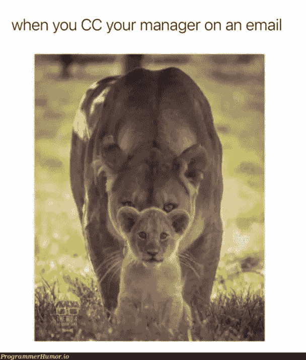

Picture Credit:[https://programmerhumor.io/](https://programmerhumor.io/)

# 当客户希望在截止日期前看到进度时…

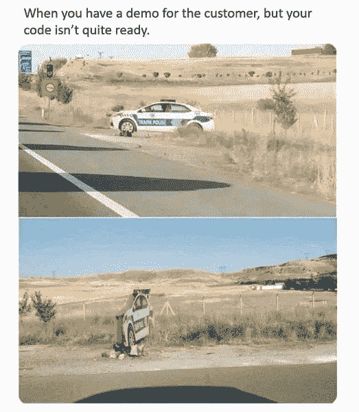

Picture Credit:[https://www.facebook.com/ProgrammersCreateLife](https://www.facebook.com/ProgrammersCreateLife)

# 怀旧时刻…

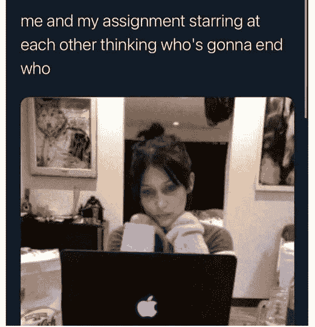

Picture Credit:[https://www.facebook.com/ProgrammersCreateLife](https://www.facebook.com/ProgrammersCreateLife)

# ctrl+c 和 ctrl+v 的艺术

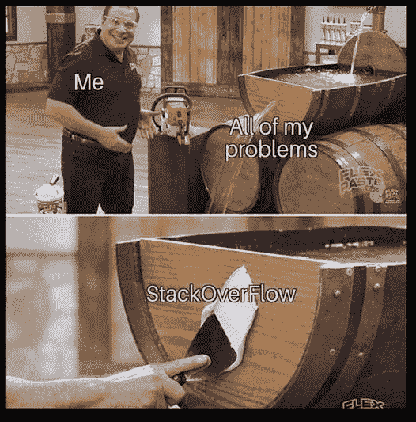

Picture Credit:[https://www.facebook.com/ProgrammersCreateLife](https://www.facebook.com/ProgrammersCreateLife)

# 不要玩弄我的感情

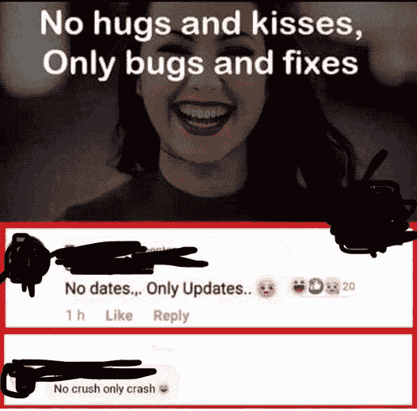

Picture Credit:[https://www.facebook.com/jokesvala/](https://www.facebook.com/jokesvala/)

# 这里少了哪个词？PErl？

Picture Credit:[https://www.facebook.com/jokesvala/](https://www.facebook.com/jokesvala/)

# 当有人让我解释代码时…

Picture Credit:[https://www.facebook.com/jokesvala/](https://www.facebook.com/jokesvala/)

# 计划与实际…

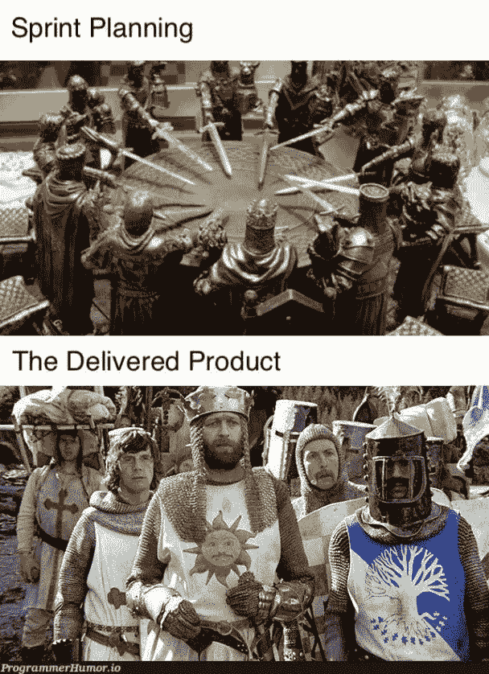

Picture Credit:[https://programmerhumor.io/](https://programmerhumor.io/)

# 现实生活中的 CSS 错误…

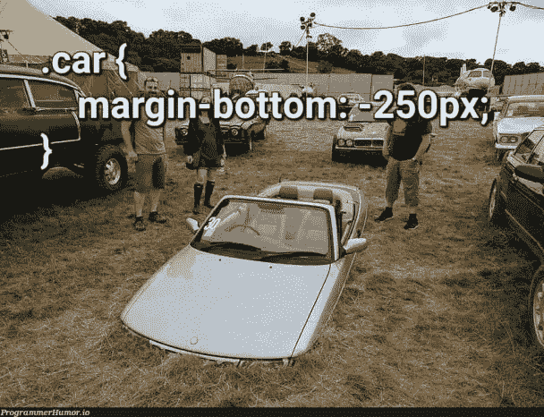

Picture Credit:[https://programmerhumor.io/](https://programmerhumor.io/)

# 救生员…

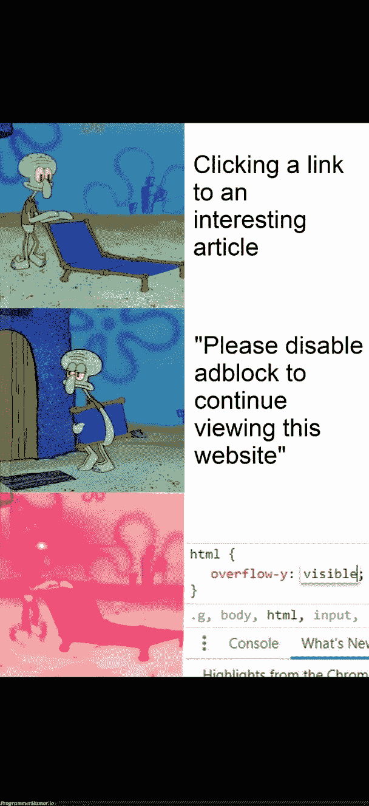

Picture Credit:[https://programmerhumor.io/](https://programmerhumor.io/)

# 真相…

Picture Credit:[https://programmerhumor.io/](https://programmerhumor.io/)

# 当我开始学习人工智能时…这将是我的第一个项目..

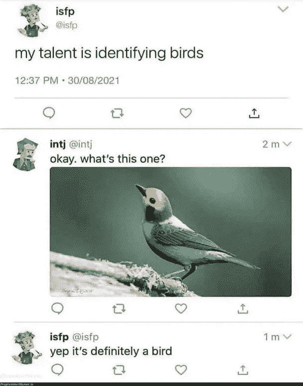

Picture Credit:[https://programmerhumor.io/](https://programmerhumor.io/)

# 最佳命名创意…

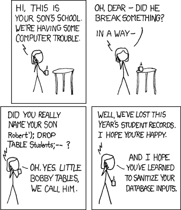

Picture Credit:[https://programmerhumor.io/](https://programmerhumor.io/)

# Windows update 就像…

Picture Credit:[https://programmerhumor.io/](https://programmerhumor.io/)

# 我最喜欢的…

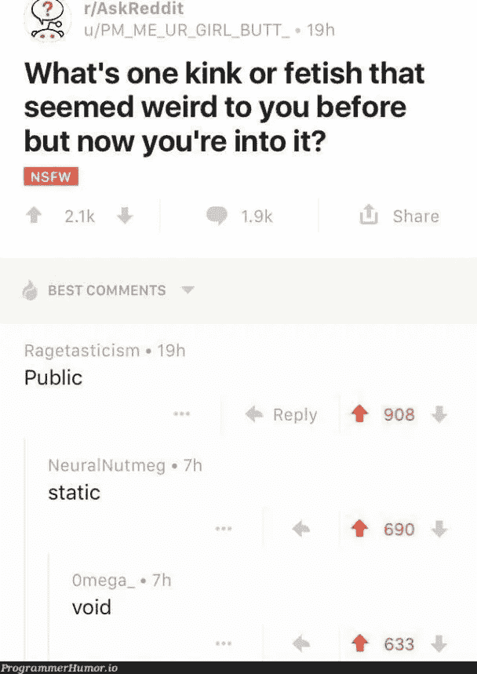

Picture Credit:[https://programmerhumor.io/](https://programmerhumor.io/)

# 更多的乐趣…

# 肾上腺素激增…

Picture Credit: [https://www.monkeyuser.com/](https://www.monkeyuser.com/)

# 这在我身上发生了很多…它总是藏起来。

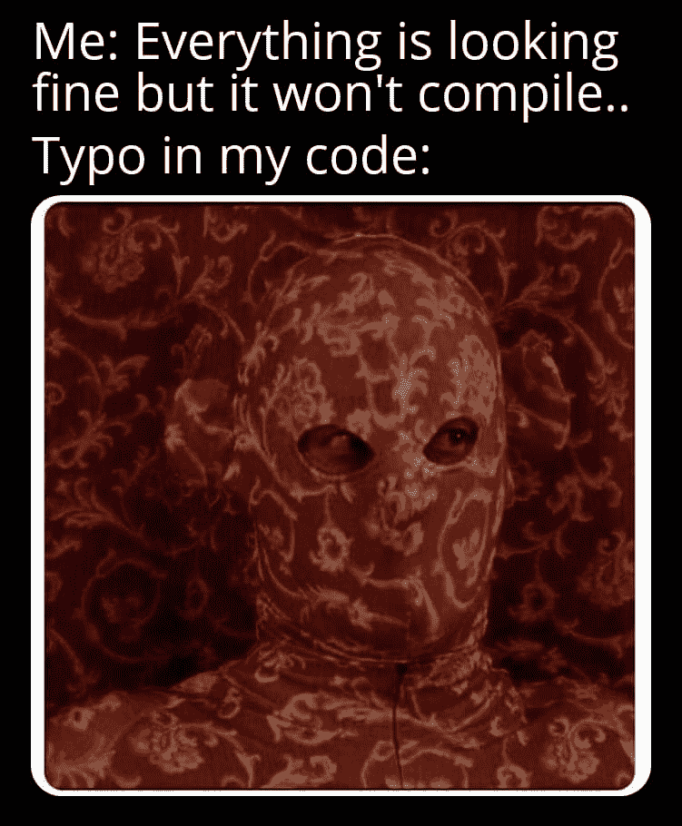

Picture Credit: [https://www.facebook.com/yuva.krishna.memes/photos/a.105527467815845/466010861767502/](https://www.facebook.com/yuva.krishna.memes/photos/a.105527467815845/466010861767502/)

# 指针…你还记得 C 语言吗？

Picture Credit: [https://www.facebook.com/yuva.krishna.memes/](https://www.facebook.com/yuva.krishna.memes/photos/a.105527467815845/466010861767502/)

# 那种感觉，当你的构建失败时…

Picture Credit: [https://www.facebook.com/yuva.krishna.memes/](https://www.facebook.com/yuva.krishna.memes/photos/a.105527467815845/466010861767502/)

# 一旦我们进入舒适区…我会死在这个洞里…

Picture Credit: [https://www.facebook.com/yuva.krishna.memes/](https://www.facebook.com/yuva.krishna.memes/photos/a.105527467815845/466010861767502/)

# 你又回来了吗？

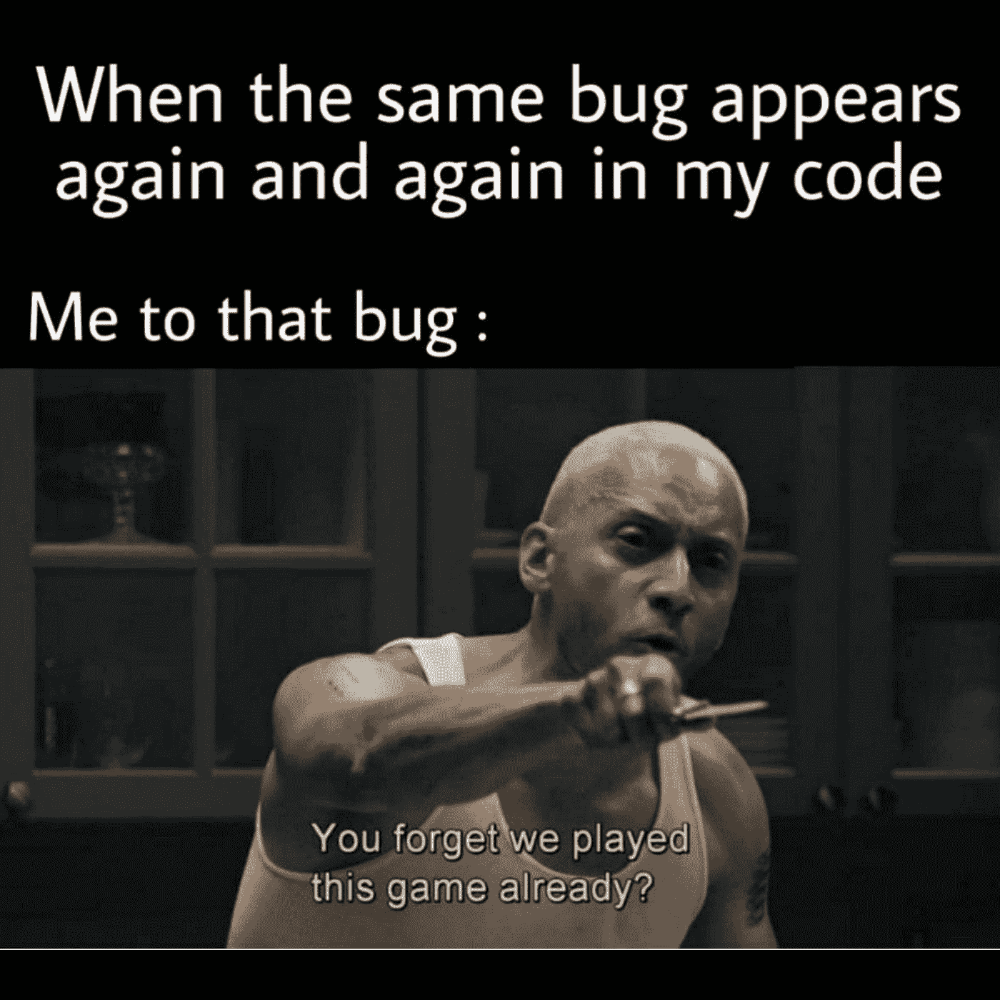

Picture Credit:[https://www.facebook.com/jokesvala](https://www.facebook.com/jokesvala)

# 为什么开发人员要离开公司？

Picture Credit:[https://www.facebook.com/jokesvala](https://www.facebook.com/jokesvala)

# 抱歉，问题无效或被标记为重复…

Picture Credit:[https://www.facebook.com/jokesvala](https://www.facebook.com/jokesvala)

# 解决问题后的感受…

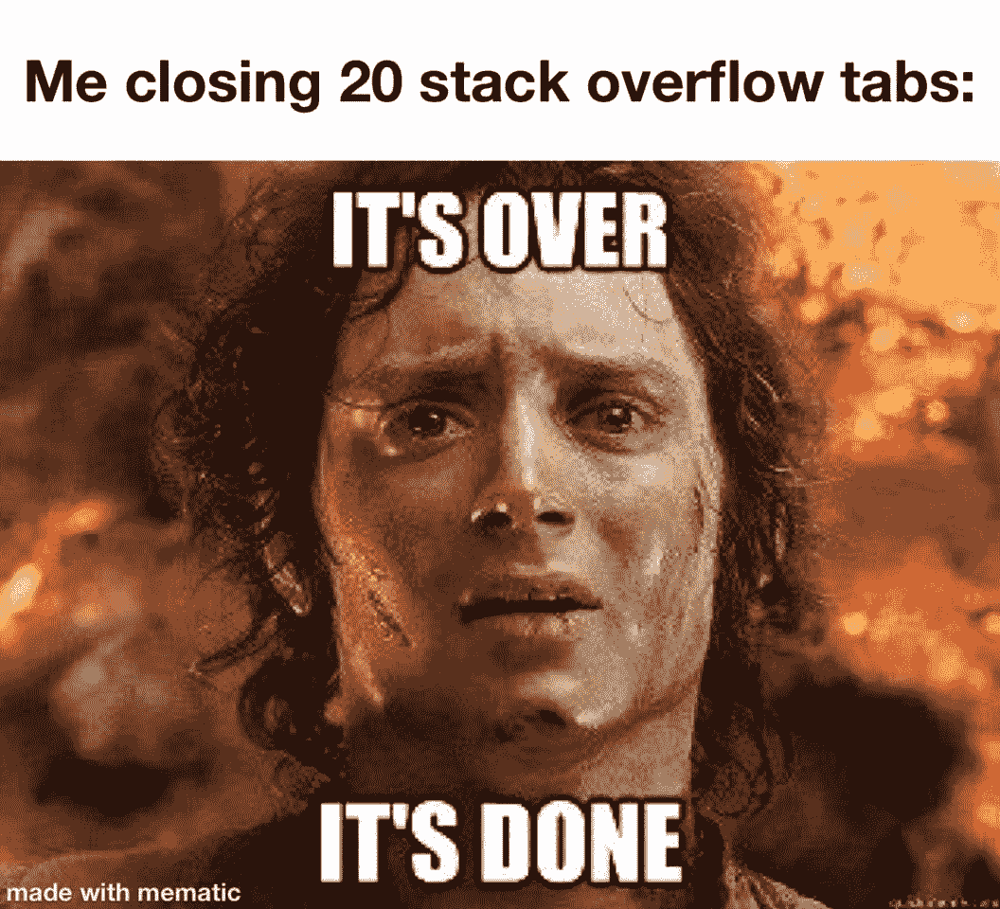

Picture Credit:[https://www.facebook.com/jokesvala](https://www.facebook.com/jokesvala)

# 万一发生火灾…

Picture Credit:[https://programmerhumor.io/](https://programmerhumor.io/page/3/)

# 是真的…

Picture Credit:[https://programmerhumor.io/](https://programmerhumor.io/page/3/)

# 那么错误是什么呢？情绪浏览器…

Picture Credit:[https://programmerhumor.io/](https://programmerhumor.io/page/3/)

# 你的语言能做到这一点吗？

Picture Credit:[https://programmerhumor.io/](https://programmerhumor.io/page/3/)

*更多内容请看*[***plain English . io***](https://plainenglish.io/)*。报名参加我们的* [***免费周报***](http://newsletter.plainenglish.io/) *。关注我们关于*[***Twitter***](https://twitter.com/inPlainEngHQ)[***LinkedIn***](https://www.linkedin.com/company/inplainenglish/)*[***YouTube***](https://www.youtube.com/channel/UCtipWUghju290NWcn8jhyAw)***，以及****[***不和***](https://discord.gg/GtDtUAvyhW) *对成长黑客感兴趣？检查* [***电路***](https://circuit.ooo/) ***。*****