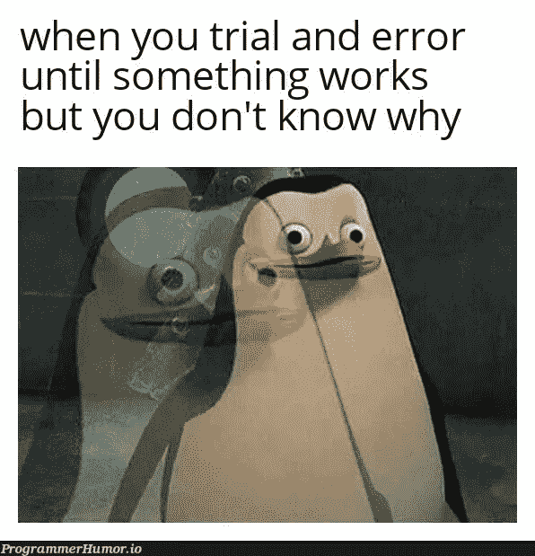

# 编笑话让你开心

> 原文：<https://javascript.plainenglish.io/programming-jokes-to-make-your-day-b0c6b1819c8d?source=collection_archive---------2----------------------->

## 最佳编程迷因汇编。

Photo by [Allef Vinicius](https://unsplash.com/@seteph?utm_source=medium&utm_medium=referral) on [Unsplash](https://unsplash.com?utm_source=medium&utm_medium=referral)

***笑话和快乐有什么联系吗？*** 如果你是我这种类型的人，那么你可能也爱在下班后查看手机。猜猜我在那里看到了什么？

我主要是在网上看到**的视频、抖音和笑话**。我不知道为什么，但这有助于我提神醒脑，减轻工作压力。

# 这就是为什么我相信笑是人类最好的刷新按钮。

在这篇文章中，我收集了一些我喜欢的网络迷因。

# 让我们从一个笑话开始…

Picture Credit:[https://www.reddit.com/r/ProgrammerHumor/](https://www.reddit.com/r/ProgrammerHumor/)

# 修复生产代码中的错误…

Picture Credit:[https://www.reddit.com/r/ProgrammerHumor/](https://www.reddit.com/r/ProgrammerHumor/)

# 你喜欢哪一个？

Picture Credit:[https://www.reddit.com/r/ProgrammerHumor/](https://www.reddit.com/r/ProgrammerHumor/)

# 我们试试加个括号，不行的话再加一个…

Picture Credit:[https://www.reddit.com/r/ProgrammerHumor/](https://www.reddit.com/r/ProgrammerHumor/)

# 真的…更多的文件，更少的详细审查…

Picture Credit:[https://programmerhumor.io/](https://programmerhumor.io/)

# 没有文档就开始工作是正常的…

Picture Credit:[https://www.reddit.com/r/ProgrammerHumor/](https://www.reddit.com/r/ProgrammerHumor/)

# 当 YouTubers 在 1 小时的视频中完成整个项目时...我努力增加一个功能…

Picture Credit:[https://programmerhumor.io/](https://programmerhumor.io/)

# 当有人强行推进你的树枝时…

Picture Credit:[https://programmerhumor.io/](https://programmerhumor.io/)

# 哪个位置合适？相对还是绝对？

Picture Credit:[https://programmerhumor.io/](https://programmerhumor.io/)

# 没有人能打败 StackOverflow 社区…

Picture Credit:[https://programmerhumor.io/](https://programmerhumor.io/)

# 回忆过去的日子？当你的领导改变了你写的整个代码？

Picture Credit:[https://programmerhumor.io/](https://programmerhumor.io/)

# 经过 10 次试验和错误后，它开始工作了…是庆祝的时候了，不要抱怨…

Picture Credit:[https://programmerhumor.io/](https://programmerhumor.io/)

# 你见过有人用 SQL 存储 JSON 的吗？

Picture Credit:[https://programmerhumor.io/](https://programmerhumor.io/)

# 一切都很好…

# 额外内容

## 当有人问你是如何开始这个项目的…

[https://www.monkeyuser.com/2018/production-ready/?sc=true&dir=random](https://www.monkeyuser.com/2018/production-ready/?sc=true&dir=random)

**来源:**[https://www.monkeyuser.com](https://www.monkeyuser.com/2018/production-ready/?sc=true&dir=random)

## 添加功能…添加功能…等等…我们来重构一下

[https://www.monkeyuser.com/2020/features/?sc=true&dir=random](https://www.monkeyuser.com/2020/features/?sc=true&dir=random)

**来源:**[https://www.monkeyuser.com](https://www.monkeyuser.com/2018/production-ready/?sc=true&dir=random)

# 哈哈…有意思，但是我的非程序员朋友盯着我的屏幕问的时候我就用这个…

[https://www.reddit.com/r/ProgrammerHumor/comments/p5thip/my_secret_weapon/](https://www.reddit.com/r/ProgrammerHumor/comments/p5thip/my_secret_weapon/)

**来源:**[https://www.reddit.com/r/ProgrammerHumor/](https://www.reddit.com/r/ProgrammerHumor/comments/p5thip/my_secret_weapon/)

## 不能抱怨用户…LOL

[https://programmerhumor.io/programming-memes/page/4/](https://programmerhumor.io/programming-memes/page/4/)

**来源:【https://programmerhumor.io/programming-memes/】T22**

## 我也是这么想的…

[https://www.reddit.com/r/ProgrammerHumor/comments/p62a26/we_use_agile_but/](https://www.reddit.com/r/ProgrammerHumor/comments/p62a26/we_use_agile_but/)

**来源:**[https://www.reddit.com/r/ProgrammerHumor/](https://www.reddit.com/r/ProgrammerHumor/comments/p62a26/we_use_agile_but/)

## 用户界面设计器调色板…

[https://programmerhumor.io/programming-memes/%f0%9f%a4%94%f0%9f%91%a9%e2%80%8d%f0%9f%8e%a8/](https://programmerhumor.io/programming-memes/%f0%9f%a4%94%f0%9f%91%a9%e2%80%8d%f0%9f%8e%a8/)

**来源:**[https://programmerhumor.io/programming-memes/](https://programmerhumor.io/programming-memes/%f0%9f%a4%94%f0%9f%91%a9%e2%80%8d%f0%9f%8e%a8/)

## QA 如何看待测试过马路场景…

[https://www.reddit.com/r/ProgrammerHumor/comments/p67c54/qa/](https://www.reddit.com/r/ProgrammerHumor/comments/p67c54/qa/)

**来源:**【https://www.reddit.com/r/ProgrammerHumor】T2

## 哇…编程幽默也能给你关系建议…

[https://www.facebook.com/photo/?fbid=3918974688212255&set=gm.953267221898555](https://www.facebook.com/photo/?fbid=3918974688212255&set=gm.953267221898555)

【https://www.facebook.com/groups/151139362111349】来源:

## 等等…我们稍后会用到它…

[https://programmerhumor.io/programming-memes/unused-variables-2/](https://programmerhumor.io/programming-memes/unused-variables-2/)

**来源:**[https://programmerhumor.io/](https://programmerhumor.io/programming-memes/unused-variables-2/)

# 希望你有美好的一天。

*更多内容看* [***说白了。报名参加我们的***](https://plainenglish.io/) **[***免费周报***](http://newsletter.plainenglish.io/) *。关注我们*[***Twitter***](https://twitter.com/inPlainEngHQ)*和*[***LinkedIn***](https://www.linkedin.com/company/inplainenglish/)*。查看我们的* [***社区不和谐***](https://discord.gg/GtDtUAvyhW) *加入我们的* [***人才集体***](https://inplainenglish.pallet.com/talent/welcome) *。***