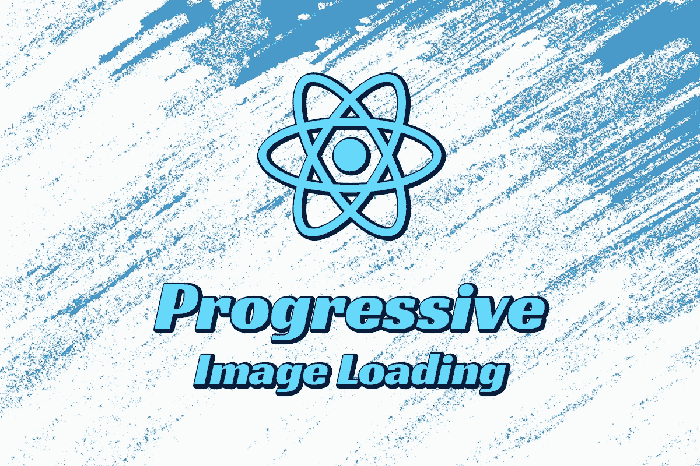

# React 中的渐进式图像加载

> 原文：<https://javascript.plainenglish.io/progressive-image-loading-in-react-754953449924?source=collection_archive---------7----------------------->

## 关于如何在 React 中实现渐进式图像加载的指南。

图像是任何网站的重要组成部分，它们可以增强或破坏用户体验，这取决于它们是如何实现的。加载高质量的图像可能需要很长时间，这会对用户体验产生负面影响。为了解决这个问题，我们需要一些加载机制，不像 spinners 那样让用户感到美观。

进入渐进式加载。

所以我们可以从这里开始:

Without progressive loading

如果图像需要一些时间来渲染，请执行以下操作:

With progressive loading

实现它相对容易，可以通过以下步骤完成:

*   呈现占位符图像。
*   在后台加载原始图像。
*   加载完成后，渲染图像以代替占位符。

对于占位符图像，您需要原始图像的一个小版本，最好≤ 2kb，您可以通过降低其尺寸和质量来进行试验，直到达到该大小。

因此，让我们从创建一个处理上述步骤的定制组件开始。

## 创建自定义图像组件

我们需要一个接收这些属性的组件:

*   图像源
*   预览图像源(占位符)
*   宽度
*   高度

我们需要创建一个状态来保存当前正在使用的图像源，占位符最初就是在这里使用的。

我们需要一个加载原始图像的效果，然后在它完成加载时将它放入我们的状态中。

现在，让我们来看看我们的组件:

我们还对我们的图像应用了一个自定义样式，当占位符被使用时，它会使图像变得模糊，当放置我们的原始图像时，它会消除模糊。和平滑模糊变化的过渡动画。

您可以将`blue(5px)`中的模糊和`filter 0.1s ease-out`中的动画持续时间调整为适合您的值。

## 使用我们的定制组件

现在，剩下的就是在需要的地方导入组件，并传入我们的图像、占位符、宽度和高度。

就这样，我们的图像将会像上面的例子一样逐渐加载，你的用户在浏览你的网站时会有很好的体验。

我希望这篇文章对你有所帮助，如果你有任何进一步的问题，请在评论区留言，我会尽力回答。

*更多内容请看*[***plain English . io***](https://plainenglish.io/)*。报名参加我们的* [***免费周报***](http://newsletter.plainenglish.io/) *。关注我们关于*[***Twitter***](https://twitter.com/inPlainEngHQ)[***LinkedIn***](https://www.linkedin.com/company/inplainenglish/)*，以及* [***不和***](https://discord.gg/GtDtUAvyhW) *。*