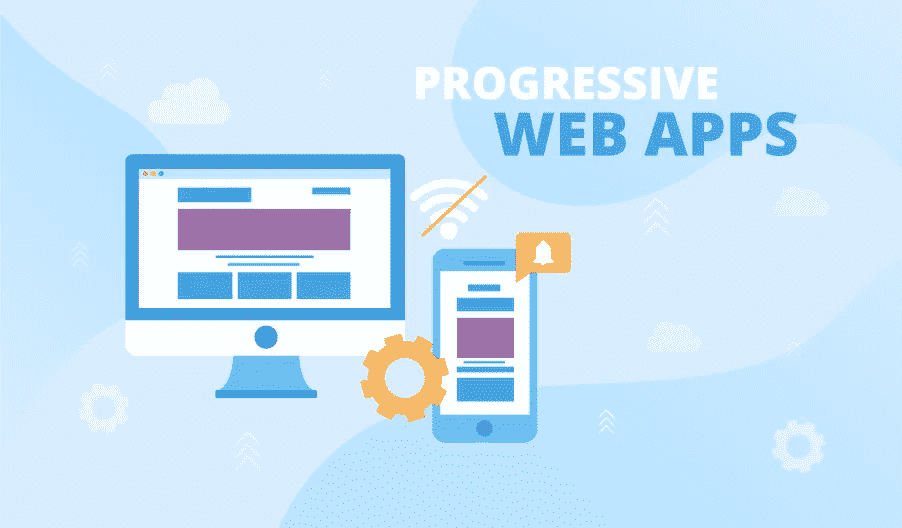

# 渐进式 Web 应用程序(PWAs):特性、用法和优势

> 原文：<https://javascript.plainenglish.io/progressive-web-applications-pwas-features-usage-and-benefits-c90fae68b358?source=collection_archive---------22----------------------->

## 了解渐进式网络应用程序(pwa)的特性。

假设你感觉饿了，你既没有心情出去，也没有心情在家做饭。你是做什么的？答案是，你把智能手机拿在手中，去一个送餐应用程序，点你想吃的任何东西。想订火车票？没必要去火车站。你可以用手机上的应用程序订票。你甚至可以通过应用程序订购药品。事实上，如今什么都有一个应用程序——从点餐、看视频到买股票和购物——你说出它的名字，你就有了它。智能手机无处不在，为了与他们的目标群体联系，无论大小，组织都必须拥有一个应用程序。

然而，构建和维护一个应用程序需要花费金钱和其他资源。拥有必要资源的大型组织可以这样做，但是预算有限的小型企业如何能够负担得起雇佣 IT 服务提供商来开发自己的应用程序呢？

答案在于技术的快速进步，事实证明这是小企业的福音。如今，技术进步使得将应用程序的功能与 web 开发中采用的技术相结合来创建负担得起的应用程序成为可能，这就是所谓的渐进式 Web 应用程序。

让我们深入探讨一下，以便更好地理解 PWAs 的功能。

# **什么是渐进式网络应用？**

渐进式 web 应用程序(PWAs)是用最新的 web 技术(HTML、CSS 和 JavaScript)构建的应用程序，结合了 Web 和移动应用程序的最佳功能。你可以把它想象成一个使用最新网络技术开发的网站，感觉就像一个应用程序。

缓存和推送 API 的最新进展允许图像文件存储在浏览器的缓存中，这反过来大大提高了网页加载的速度。PWAs 配备了类似 ***离线网站访问、推送通知和后台数据同步*** 等功能。

根据调查报告，预计到 2027 年，PWA 市场规模有望达到 104.4 亿美元

PWAs 利用了更大的网络生态系统，其中包括插件和社区，与原生应用相比，PWAs 提供了相对更容易部署和维护网站的优势。

pwa 在 Android 和 iOS 平台上无缝运行的能力吸引了许多大公司，如 Twitter、Pinterest、Spotify 和优步等，将他们的产品作为 pwa。

# 什么时候应该使用渐进式网络应用程序？

报告显示，从用户第一次接触应用程序到用户实际开始使用应用程序的最后阶段，一个应用程序平均会失去超过 20%的受众。一般情况下，一个找应用的人去 app store，找到应用，下载安装，然后开始使用应用。相比之下，在 PWAs 的情况下，应用程序随时可以使用，无需经历整个下载和安装阶段。后续使用的用户将被提示安装该应用程序，并将其提升到全屏体验。

## 渐进式网络应用的关键特性

雇用 **web 开发服务**提供商开发 PWA 时需要牢记的重要因素如下:

## **响应能力**

观众使用不同屏幕尺寸的不同科技产品。因此，开发人员有责任确保打开网页的人拥有无缝的浏览体验，不管屏幕大小和正在使用的小工具如何。因此，确保该应用程序可以在任何屏幕尺寸上使用而没有任何麻烦或故障，并且在任何视口尺寸下内容质量保持不变始终是一个好主意。

## **更高水平的可发现性**

众所周知，大多数 pwa 都是经过改造的网站。因此，如果他们很容易被搜索引擎发现和索引，他们的事业会大大加强。在 SERP 上排名更高可以提高在线知名度，并为应用程序带来更多流量。此外，他们在这个部门的得分超过了搜索引擎无法发现的原生应用。

## **跨平台兼容性**

PWAs 首先作为 web 应用程序开发；这意味着它们需要具备跨平台的兼容性，也就是说，可以在所有的浏览器/系统上工作，而不仅仅是在选定的几个浏览器/系统上工作。对这种应用感兴趣的人应该能够在他/她选择的任何浏览器上无缝地使用该应用。

## **离线连接**

独立或离线连接对于吸引用户的注意力很重要。即使在没有连接的情况下，让浏览者参与到应用程序中也是保持浏览者对应用程序感兴趣的好方法。它提供了一个更加一致和愉快的体验，而不是在连接中断时将浏览者发送到一个离线页面。

一个很好的例子来说明离线连接的重要性可能是一个音乐应用程序。使用特定应用程序的人应该能够听保存的歌曲，即使在没有互联网连接的情况下。另一个很好的例子可能是 Twitter 应用程序，它允许用户返回并阅读之前可能错过的推文。

# 为什么渐进式网络应用将取代本地移动应用

PWAs 和原生应用的主要区别在于，原生应用的开发和维护成本**很高**。在本地应用的情况下，你需要拥有不同编程语言的**知识**来为 Android 和 iOS 开发应用。在这个过程中，你还需要为应用程序的升级和维护花钱。

另一方面，你可以雇佣一家好的网络开发公司，这也是要花钱的。

相比之下，在 PWA 的情况下，为不同的操作平台开发应用程序需要一个**单一代码库。由于 pwa 不需要从头开始构建，因此**耗时也更少**。你只需要重新配置你当前的网站。**

如果你选择雇佣[网络开发公司的服务，](https://www.q3tech.com/web-application-development/)成本会更低，因为你只需要一个开发者的服务。

*更多内容看* [***说白了。报名参加我们的***](https://plainenglish.io/) **[***免费周报***](http://newsletter.plainenglish.io/) *。关注我们*[***Twitter***](https://twitter.com/inPlainEngHQ)*和*[***LinkedIn***](https://www.linkedin.com/company/inplainenglish/)*。加入我们的* [***社区***](https://discord.gg/GtDtUAvyhW) *。***