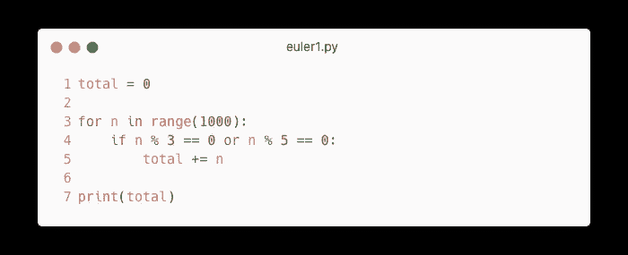
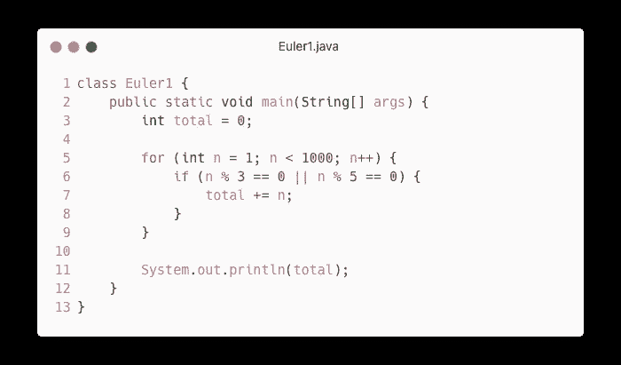
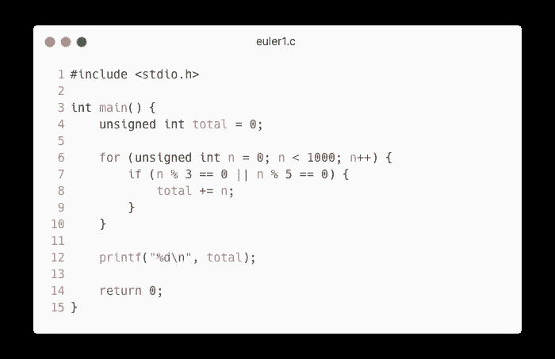

# 欧拉项目#1 解决方案:3 或 5 的倍数

> 原文：<https://javascript.plainenglish.io/project-euler-1-solution-multiples-of-3-or-5-a35613b89bfe?source=collection_archive---------8----------------------->

## Python、JavaScript/TypeScript、Java 和 C 语言的解决方案


> 欧拉项目是一系列具有挑战性的数学/计算机编程问题，解决这些问题需要的不仅仅是数学洞察力。虽然数学将帮助你找到优雅而有效的方法，但是使用计算机和编程技巧将是解决大多数问题所必需的。
> 
> 启动欧拉项目及其延续的动机是为探究的头脑提供一个平台，在有趣和娱乐的背景下深入研究不熟悉的领域并学习新概念。

⚠️ **剧透提示:**本文将揭示一个工程欧拉问题的解决方案。如果你想自己解决这个问题，请不要继续阅读。只有当你不知道为什么你的解决方案不起作用或者你是个骗子时，才继续阅读。

# 问题描述

> 如果我们列出所有小于 10 的自然数，它们是 3 或 5 的倍数，我们得到 3、5、6 和 9。这些倍数之和是 23。
> 
> 求 1000 以下所有 3 或 5 的倍数之和。

🔗[查看欧拉项目问题](https://projecteuler.net/problem=1)

# 该算法

解决方案非常简单。只需浏览从 1 到 1000(不含)的所有数字。对于每个数字，检查它是否能被`3`或`5`整除。如果当前数字能被`3`或`5`整除，那么将其添加到累加器中(变量`total`)。

# 解决方法

## 在 Python 中



Python solution to Project Euler #1

```
Solution: 233168
Runtime: 60 milliseconds
```

## 在 JavaScript/TypeScript 中


JavaScript/TypeScript solution to Project Euler #1

```
Solution: 233168
Runtime: 75 milliseconds
```

## 在 Java 中



Java solution to Project Euler #1

```
Solution: 233168
Runtime: 90 milliseconds
```

## 在 C 中



C solution to Project Euler #1

```
Solution: 233168
Runtime: 8 milliseconds
```

*更多内容请看*[***plain English . io***](https://plainenglish.io/)*。报名参加我们的* [***免费周报***](http://newsletter.plainenglish.io/) *。关注我们关于*[***Twitter***](https://twitter.com/inPlainEngHQ)*和*[***LinkedIn***](https://www.linkedin.com/company/inplainenglish/)*。查看我们的* [***社区不和谐***](https://discord.gg/GtDtUAvyhW) *加入我们的* [***人才集体***](https://inplainenglish.pallet.com/talent/welcome) *。*