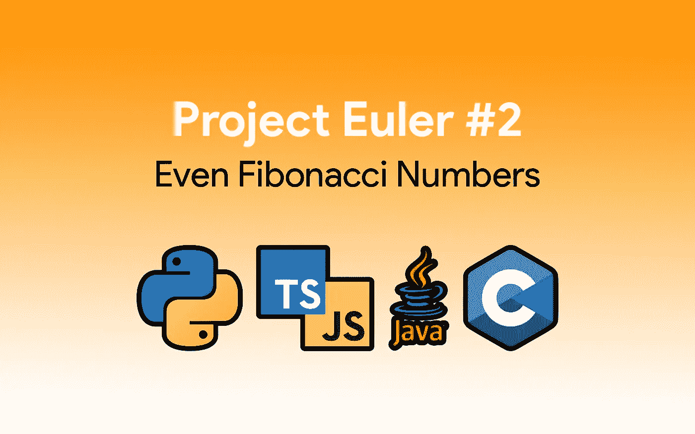
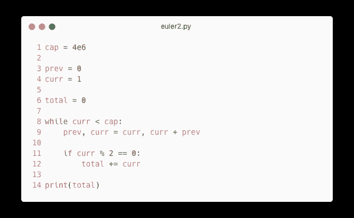
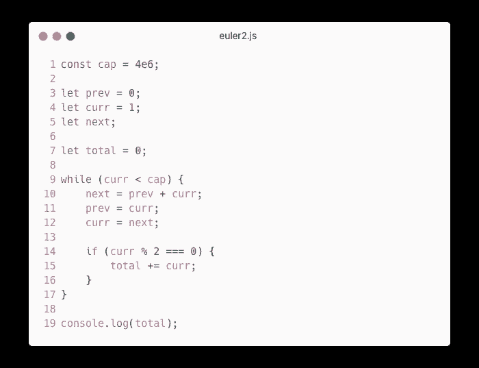
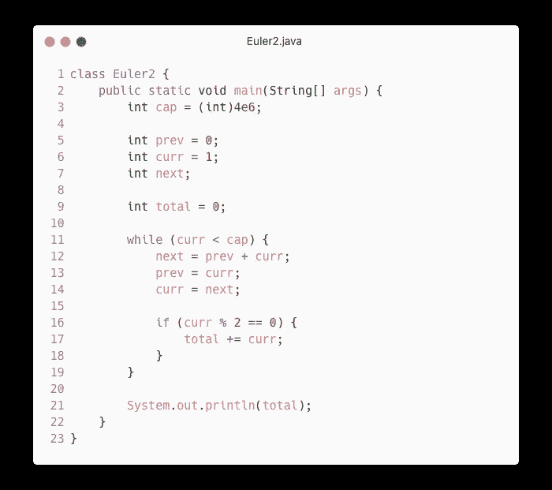
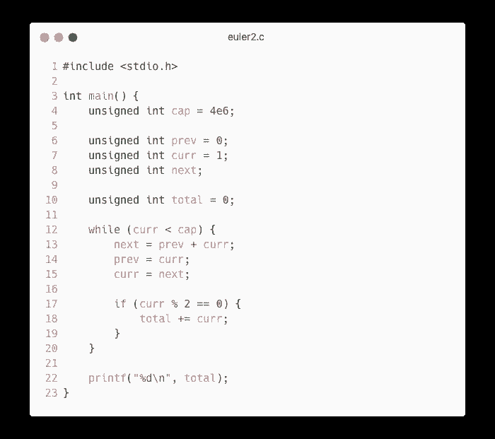

# 欧拉项目#2 解决方案:偶数斐波纳契数

> 原文：<https://javascript.plainenglish.io/project-euler-2-solution-even-fibonacci-numbers-2dc3809ccf7e?source=collection_archive---------9----------------------->

## Python、JavaScript/TypeScript、Java 和 C 语言的解决方案



> 欧拉项目是一系列具有挑战性的数学/计算机编程问题，解决这些问题需要的不仅仅是数学洞察力。虽然数学将帮助你找到优雅而有效的方法，但是使用计算机和编程技巧将是解决大多数问题所必需的。
> 
> 启动欧拉项目及其延续的动机是为探究的头脑提供一个平台，在有趣和娱乐的背景下深入研究不熟悉的领域并学习新概念。

⚠️ **剧透提示:**本文将揭示一个工程欧拉问题的解决方案。如果你想独自解决这个问题，就不要继续阅读了。只有当你不知道为什么你的答案不起作用或者你是个骗子时，才继续读下去。

# 问题描述

> 斐波纳契数列中的每一个新项都是通过将前两项相加而生成的。从 1 和 2 开始，前 10 项将是:
> 
> 1, 2, 3, 5, 8, 13, 21, 34, 55, 89, …
> 
> 考虑斐波纳契数列中值不超过四百万的项，找出偶数项的总和。

🔗[查看欧拉项目问题](https://projecteuler.net/problem=2)

# 该算法

这种算法需要计算斐波纳契数列、检查一个数是否是偶数以及累加的知识。

我们将有两个变量:`prev`和`curr`。我们将用`0`初始化`prev`，用`1`初始化`curr`。尽管斐波那契数列以`1 1 2 3...`开始，但这个问题清楚地表明我们应该忽略第一个`1`。

我们将使用一个`while`循环。当`curr < cap`在`cap = 4e6`(400 万)时，循环将继续。

每个循环将计算序列中的下一个值。`curr`的值将被分配给`prev,`，下一个值将被分配给`curr`。如果`curr`是偶数，我们把它加到累加器(`total`)。

```
**Psuedocode**cap := 4,000,000prev := 0
curr := 1total := 0while curr < cap:
    next := prev + curr
    prev := curr
    curr := next if curr is even:
        total := total + curr
```

# 解决方法

## 在 Python 中



```
Solution: 4613732
Runtime: 59 milliseconds
```

🙋‍♂️***9 号线是怎么回事？这是一个一次分配多个变量的简单方法。通常，您可以使用它来交换使用`x, y = y, x`的变量。在这种情况下，我用它将`prev`分配给`curr`，将`curr`分配给`curr + prev`。由于赋值操作符的右边首先被求值，`curr`和`prev`将在求值过程中保留它们的值，然后被赋值给正确的变量。***

## 在 JavaScript/TypeScript 中



```
Solution: 4613732
Runtime: 79 milliseconds
```

## 在 Java 中



```
Solution: 4613732
Runtime: 85 milliseconds
```

## 在 C 中



```
Solution: 4613732
Runtime: 8 milliseconds
```

*更多内容看* [***说白了。报名参加我们的***](https://plainenglish.io/) **[***免费周报***](http://newsletter.plainenglish.io/) *。关注我们关于*[***Twitter***](https://twitter.com/inPlainEngHQ)*和*[***LinkedIn***](https://www.linkedin.com/company/inplainenglish/)*。查看我们的* [***社区不和谐***](https://discord.gg/GtDtUAvyhW) *加入我们的* [***人才集体***](https://inplainenglish.pallet.com/talent/welcome) *。***