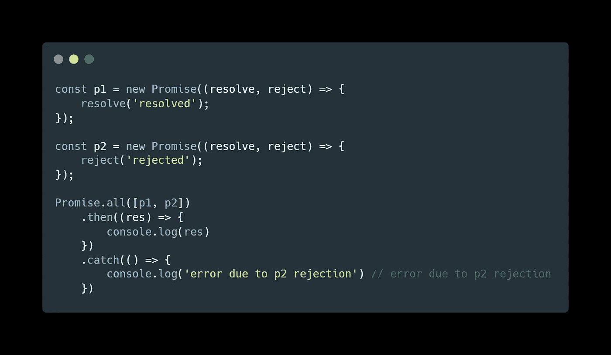
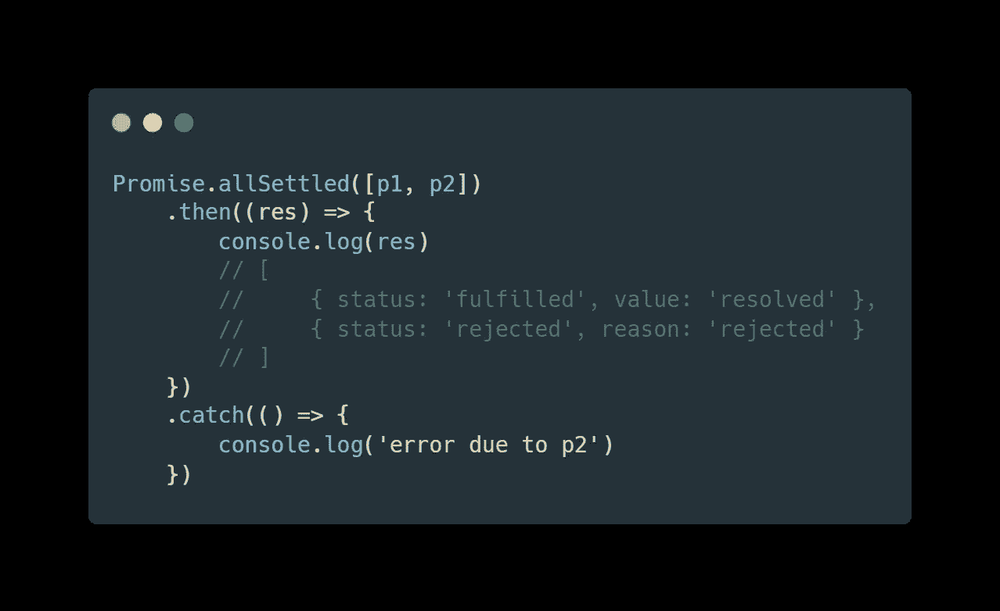
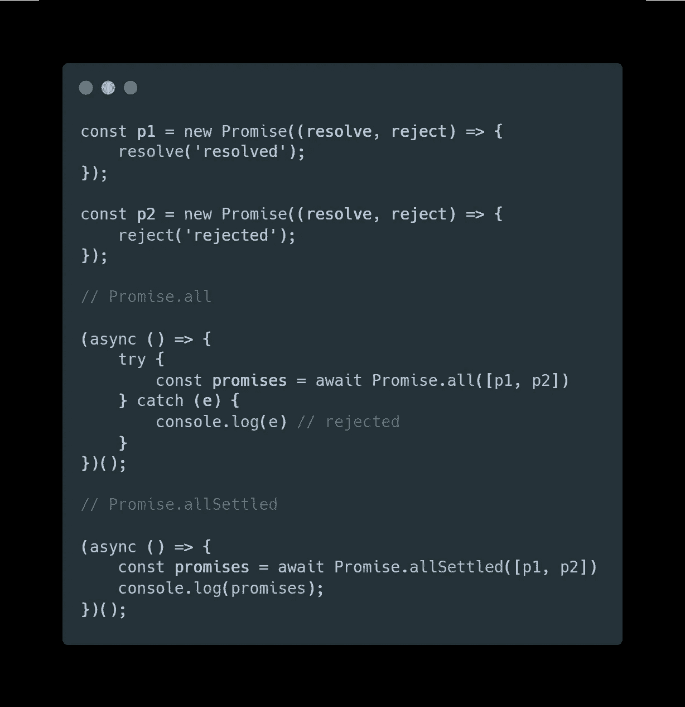
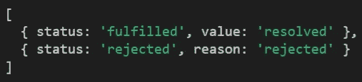

# 多个异步操作的 promise . all()v . promise . all settled()

> 原文：<https://javascript.plainenglish.io/promise-all-v-promise-allsettled-for-multiple-asynchronous-operations-239944c12ec7?source=collection_archive---------5----------------------->

## 解决多个异步操作的两种不同方法


Photo by [Marita Kavelashvili](https://unsplash.com/@maritafox?utm_source=medium&utm_medium=referral) on [Unsplash](https://unsplash.com?utm_source=medium&utm_medium=referral)

# 介绍

`Promise.allSettled`是一个相对较新的特性，目前大多数主流浏览器都支持它。该功能改善了`Promise.all`(ECMA 2015 中推出)的短路特性。当需要立即执行异步任务时，`Promise.all`是一个有用的操作员，但众所周知，当出现任何故障时，他会变得不耐烦(短路)。例如， ***例 1*** 即将失败，转到`.catch`子句，不等待其他异步任务。这就需要一种叫做`Promise.allSettled`的新方法，它会一直等到所有给定的承诺要么实现，要么被拒绝

**例 1**



# TL；速度三角形定位法(dead reckoning)

如果您将前一个示例**中的`Promise.all`示例 1** 更改为`Promise.allSettled`，则会转到`.then`子句，成功执行所有异步任务。换句话说，`Promise.allSettled`等待，直到所有承诺都被结算，而不管每个承诺是失败还是成功。

## Promise.all & Promise.allSettled 的共同特征

1.  当有多个相关的异步任务时，这两种方法都很有用
2.  两种方法都支持并发承诺，并发承诺的性能更好

## 使用的好处。一切都解决了。全部

1.  显式名称；allSettled 是指没有悬而未决的承诺
2.  更好的错误处理
3.  一些助手功能是可访问的



# 诺言的共同特征*。所有* &承诺

**1。当有多个相关的异步任务时，这两种方法都很有用**

这两种方法都接受一个承诺列表，当有多个相关的异步任务，而整个代码依赖于这些任务才能成功工作时，这两种方法都很有用。例如，如果`p1` & `p2`是相关的异步任务，都需要执行，我们可以用`Promise.all`或`Promise.allSettled`代替`[await p1, await p2]`

**2。两种方法都支持并发承诺，并发承诺的性能更好**

它们都支持并发承诺，并且非常有用，除非承诺 A 和 B 相互依赖。例如，如果您作为前端开发人员制作一个用户列表下拉 UI，而后端开发人员说他为用户维护两个独立的数据库(一个用于存档(旧)用户，一个用于活动用户)。如果查询存档数据库和活动数据库分别需要 5 秒和 3 秒，那么像`Promise.all`和`Promise.allSettled`这样的并发承诺可以帮助我们在 5 秒内(无论哪个更慢)使用这两个结果，而不是 8 秒(5 + 3)。让我们看看代码，比较顺序异步函数和并发异步函数

**输出:**

```
Q3Seconds execution: 3.009s
Q3Seconds execution: 3.004s
[ 'Archived user database', 'Active user database' ]
concurrentPromise execution: 5.013s
Q5Seconds execution: 5.010s
sequentialStart execution: 8.014s
```

# 使用的好处。一切都解决了。全部

**1。显式名称；allSettled 是指没有待定的承诺**

[ECMA 技术委员会](https://github.com/tc39/proposal-promise-allSettled#promiseallsettled)展示了引进`allSettled`这种新方法的一些想法和动机。它说`allSettled`之所以如此命名，是因为我们在谈论一个*已经确定的*而不是悬而未决的承诺。此外，许多图书馆已经采用了`allSettled`这个名字，而且它已经被一些著名的图书馆普遍使用，如

[](https://www.npmjs.com/package/promise.allsettled)**|*[*问*](https://www.npmjs.com/package/q)*

***2。更好的错误处理***

*`Promise.allSettled`更擅长错误处理。正如我们在前面的例子**例 1** 中所讨论的，当承诺中存在错误情况时，`Promise.all`的短路性质是不可选择的。如果有 5 个对服务器的请求，其中一个请求失败了，那么每个请求都会被抛出到一个`catch`子句。通常，我们希望确保每个请求都得到执行和解决，不管是否有失败的请求。通过这种方式，我们可以发现哪些请求特别失败，并且可能只重试失败的请求来获取正确的数据。*

*当使用`async / await`函数时，`Promise.allSettled`更好地处理错误情况变得更加突出。当我们对`Promise.all`使用`async / await`时，我们需要用`try ... catch`包装方法，担心错误情况会破坏代码流。*

*下面的例子显示了处理错误情况的`try ... catch`语句*

```
*(async () => {
  try { const promises = await Promise.all([p1, p2]);
  }
  catch (e) { console.log(e) // ERROR goes here
  }
})();*
```

*然而，`allSettled`的使用消除了用`try … catch`语句包装承诺的需要*

**

***3。一些辅助功能是可访问的***

*使用`allSettled`，失败的承诺返回状态`rejected`和失败原因`reason`，而成功的承诺返回状态`fulfilled`和`value`*

**

*利用这个特点，我做了一些辅助函数。请随意制作你自己的并在评论中分享*

# *摘要*

*`Promise.allSettled()`方法的工作方式与`Promise.all()`相似，但是它有一些改进，使得我们的编码工作更加容易。我建议您使用`Promise.allSettled()`，并随时向我提供反馈。我们随时欢迎您的反馈。谢谢大家！*

**更多内容看* [***说白了。报名参加我们的***](http://plainenglish.io/) **[***免费每周简讯***](http://newsletter.plainenglish.io/) *。在我们的* [***社区不和谐***](https://discord.gg/GtDtUAvyhW) *获得独家获得写作机会和建议。****