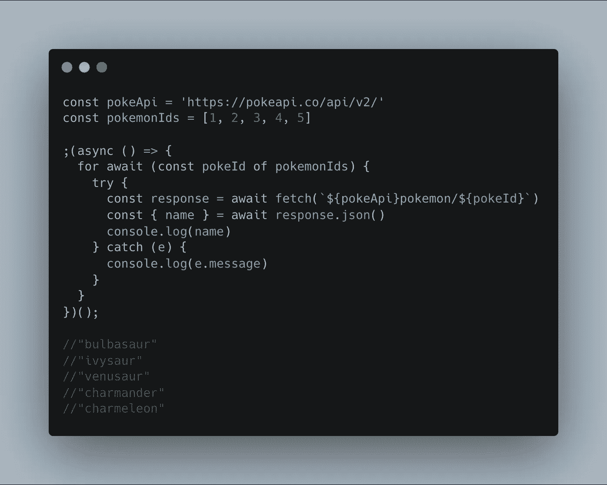
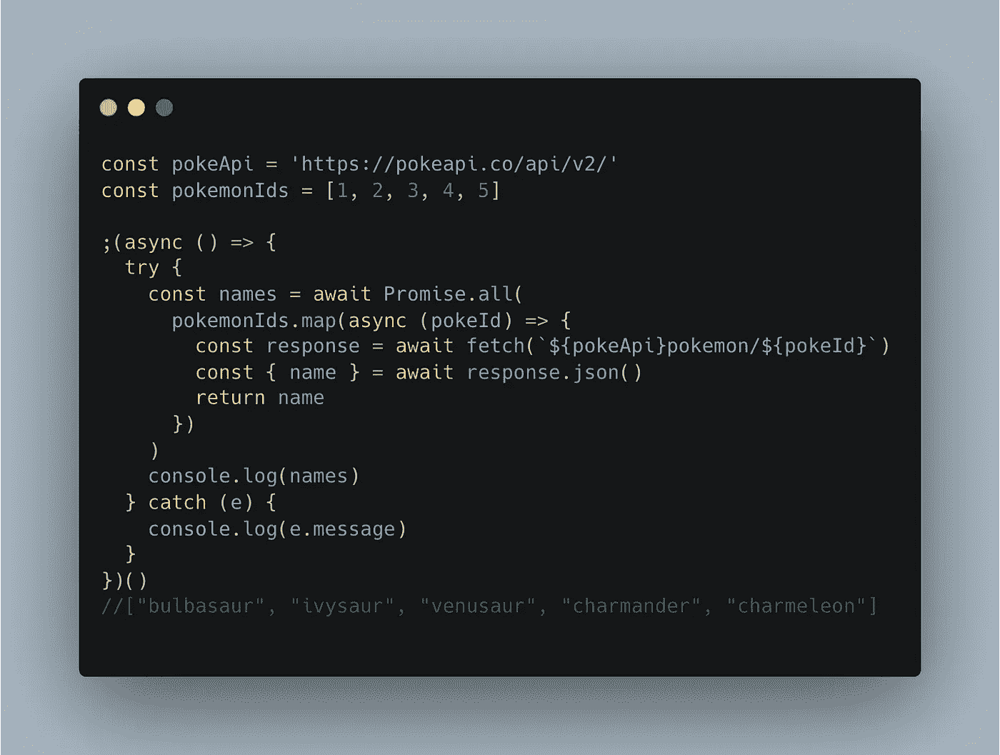
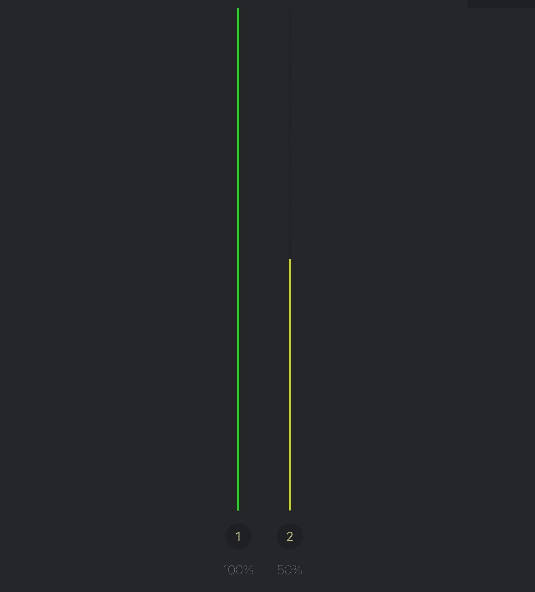
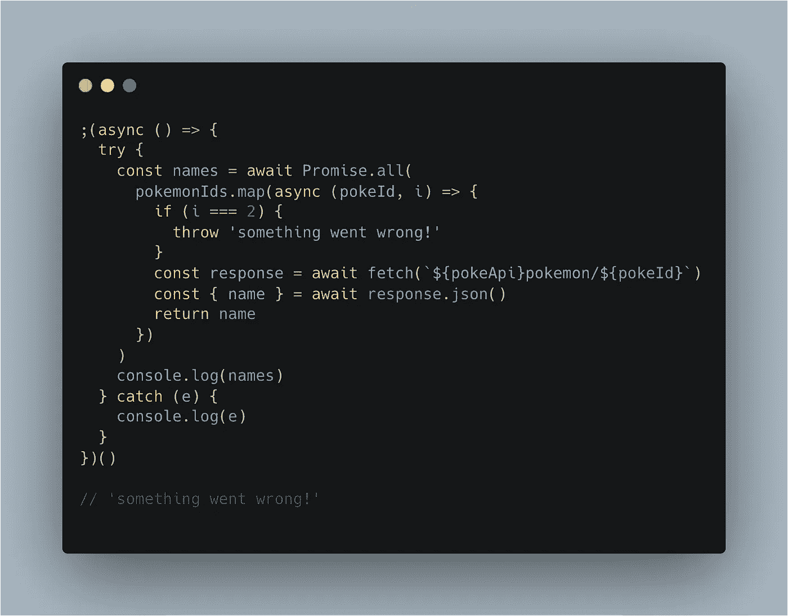

# Promise.all()与 Promise.allSettled()与 for await…of

> 原文：<https://javascript.plainenglish.io/promise-all-vs-promise-allsettled-vs-for-await-of-c32e1a327a20?source=collection_archive---------1----------------------->

## 如何处理异步迭代

Photo by [Radowan Nakif Rehan](https://unsplash.com/@radowanrehan?utm_source=unsplash&utm_medium=referral&utm_content=creditCopyText) on [Unsplash](https://unsplash.com/s/photos/computer-science?utm_source=unsplash&utm_medium=referral&utm_content=creditCopyText)

编写现代 JavaScript 大部分时间都涉及处理承诺。通常情况下，这涉及到处理大量的问题。处理承诺的选择是多方面的。武器装备里有很多枪。虽然你可能会用狙击手近距离击中目标，但选择正确的武器会让这项工作容易得多。

为了帮助你正确瞄准，我将讨论三种处理承诺的方法:`[Promise.all()](https://developer.mozilla.org/en-US/docs/Web/JavaScript/Reference/Global_Objects/Promise/all)`、`[Promise.allSettled()](https://developer.mozilla.org/en-US/docs/Web/JavaScript/Reference/Global_Objects/Promise/allSettled)`和`[for await...of](https://developer.mozilla.org/en-US/docs/Web/JavaScript/Reference/Statements/for-await...of)`。

## 等待…的

异步`For await...of`和它的同步兄弟`for of`非常相似:你可以像`Array`、`Map`或`Set`一样循环遍历一个可迭代的对象。`For await of`其与众不同之处在于能够在循环内处理异步代码。

所以让我们假设我们有一个包含 5 个口袋妖怪 id 的数组。使用 for await…of，我们可以逐个循环 id，并使用 [PokéApi](https://pokeapi.co/) 获取相关 Pokemon 的名称。如果其中一个调用出错，我们可以捕捉并处理它，然后继续循环的剩余部分。

## Promise.all()

那么我们如何使用`Promise.all()`来获取口袋妖怪的名字呢？这个函数接受一个可迭代的承诺作为它的输入参数。因此我们可以`.map`遍历 id，获取名称，并将异步映射作为输入提供给`Promise.all`。当所有承诺都实现时，该函数返回一个包含所有承诺结果的数组。

## “for await…of”和“Promise.all()”的主要区别

那么，*除了返回值略有不同外，*`*for await...of*`*`*Promise.all()*`*有什么大的区别呢。*最重要的区别是`Promise.all()`同时处理它的输入承诺，而`for await...of`一次解决一个。因此，例如，使用`for await...of`，一旦我们找到小火龙，我们将能够停止调用 *pokeApi* ，而`Promise.all()`将同时创建所有承诺，并且仅在所有承诺都解决后才完成。*

*使用`for await...of`，你可以更细致地控制承诺。因此，如果完成承诺的顺序对您很重要，那么`for await...of`是您的首选。然而，增强的控制并不是免费的。`for await...of`一个接一个地处理承诺，这使得它慢了很多。事实上，在我们的口袋妖怪抓取的情况下，几乎[比](https://perf.link/#eyJpZCI6IjFnc2V2YnkwMGlvIiwidGl0bGUiOiJGaW5kaW5nIG51bWJlcnMgaW4gYW4gYXJyYXkgb2YgMTAwMCIsImJlZm9yZSI6ImNvbnN0IHBva2VBcGkgPSAnaHR0cHM6Ly9wb2tlYXBpLmNvL2FwaS92Mi8nO1xuY29uc3QgcG9rZW1vbklkcyA9IFsxLCAyLCAzLCA0LCA1XTtcblxuXG5cbiIsInRlc3RzIjpbeyJuYW1lIjoiUHJvbWlzZS5hbGwoKSIsImNvZGUiOiJhd2FpdCBQcm9taXNlLmFsbChcblx0XHRwb2tlbW9uSWRzLm1hcChhc3luYyBwb2tlSWQgPT4ge1xuXHRcdFx0ICAgIGNvbnN0IHJlc3BvbnNlID0gYXdhaXQgZmV0Y2goYCR7cG9rZUFwaX1wb2tlbW9uLyR7cG9rZUlkfWApO1xuXHRcdFx0XHRcdGNvbnN0IHtuYW1lfSA9IGF3YWl0IHJlc3BvbnNlLmpzb24oKTtcbiAgICAgICAgICByZXR1cm4gbmFtZTtcbiAgICB9KSAgXHRcbiAgKSIsInJ1bnMiOls2OSw3Myw3Myw2OSw2OSw3Myw3Myw2OSw3Myw2OSw2OSw3Myw2OSw3Myw3Myw3Myw3Myw3Myw3Myw2OSw2OSw3Myw2OSw3Myw3Myw3Myw3Myw2OSw2OSw3Myw2OSw3Myw3Myw3Myw2OSw2OSw2OSw2OSw2OSw3Myw2OSw2OSw2OSw2OSw2NCw2NCw2NCw2NCw2MCw2NCw2NCw2MCw2NCw2NCw1Niw2OSw0Myw0Myw2MCw0Myw2OSw0Nyw2OSw2OSw1Niw2NCw2NCw2NCw2NCw2NCw2NCw2NCw2NCw0Nyw2OSw2NCw2MCwzNCw2NCw1MSwzNCw2MCw2OSw0Nyw2NCw2NCw1Niw0Nyw2NCw2NCw2NCw2NCw1Niw0Nyw1Niw1Niw2MCw2MCw2MCw2OV0sIm9wcyI6NjR9LHsibmFtZSI6IkZvciBhd2FpdCBvZiIsImNvZGUiOiJmb3IgYXdhaXQgKGNvbnN0IHBva2VJZCBvZiBwb2tlbW9uSWRzKSB7XG4gIHRyeSB7XG4gICAgY29uc3QgcmVzcG9uc2UgPSBhd2FpdCBmZXRjaChgJHtwb2tlQXBpfXBva2Vtb24vJHtwb2tlSWR9YCk7XG5cdFx0Y29uc3Qge25hbWV9ID0gYXdhaXQgcmVzcG9uc2UuanNvbigpO1xuICAgIGNvbnNvbGUubG9nKG5hbWUpO1xuICB9IGNhdGNoIChlKSB7XG4gIFx0Y29uc29sZS5sb2coZS5tZXNzYWdlKTtcbiAgfVxuXHR9IiwicnVucyI6WzM4LDM4LDM4LDM4LDM0LDM0LDM4LDM4LDM4LDM0LDM4LDM4LDM0LDM4LDM4LDM4LDM4LDM4LDM4LDM0LDM4LDM4LDM4LDM4LDM4LDM4LDM4LDM0LDM4LDM4LDM4LDM4LDM0LDM4LDM4LDM4LDM0LDM0LDM0LDM4LDM0LDM4LDM0LDM0LDMwLDM0LDMwLDM0LDMwLDMwLDM0LDMwLDMwLDM0LDI1LDM4LDE3LDIxLDMwLDIxLDM0LDI1LDM0LDM4LDMwLDMwLDMwLDMwLDMwLDMwLDM0LDMwLDM0LDIxLDM0LDMwLDMwLDE3LDMwLDI1LDE3LDMwLDM4LDIxLDMwLDMwLDI1LDIxLDM0LDMwLDMwLDMwLDI1LDIxLDI1LDMwLDI1LDI1LDMwLDM0XSwib3BzIjozMn1dLCJ1cGRhdGVkIjoiMjAyMi0wMi0yN1QwOTo1MjoxNy4yNzRaIn0%3D)慢两倍，如下图所示。所以作为一个经验法则，我推荐使用`Promise.all()`，只有在承诺的并发处理导致问题时才切换到`for await...of`。*

**

## *“Promise.all()”对“Promise.allSettled()”*

*到目前为止，我们对 PokéApi 的所有调用都是成功的。但是如果在获取一个口袋妖怪的时候出错了呢？使用`for await of`我们在每次迭代中捕捉错误。例如，如果获取 id 为 2 的口袋妖怪失败了，我们可以处理错误并进入下一次迭代。*

*相比之下，`Promise.all()`默认情况下会快速失败，这意味着如果调用失败，整个承诺都会被拒绝。因此，如果在获取第三个口袋妖怪时发生错误，执行就会停止，我们会收到一条错误消息。*

**

*在某些情况下*快速失效*非常方便。例如，假设需要所有口袋妖怪名称来执行后续操作。在这种情况下，快速失败是好的，因为您不想在剩余的调用上浪费资源。*

*然而，在其他情况下，您希望所有电话要么被拒绝，要么被满足。例如，如果获取的口袋妖怪被用于一个单独的后续任务，或者我们想要显示和访问每个调用的错误信息，快速失败是很麻烦的。*

*在这种情况下，`Promise.allSettled()`是更明智的选择。这个函数非常类似于`Promise.all()`，但是它不是快速失败，而是返回一个承诺，该承诺在所有给定的承诺完成或被拒绝后解决。前一个例子的结果，在`index === 2`有一个错误的调用，使用`Promise.allSettled()`将如下所示。我们看到四个呼叫被完成，但是索引为 2 的呼叫被拒绝。*

## *结论*

*总之，这三种方法都能够处理可重复的承诺，但在功能上略有不同。如果解决承诺的顺序对你很重要，使用`for await of`。如果订单不重要，并且您需要所有电话都成功，请使用`Promise.all()`。如果订单不重要，并且您并不绝对需要所有的单独电话才能成功，请使用`Promise.allSettled()`。*

## *资源*

*   *Promise . all():[https://developer . Mozilla . org/en-US/docs/Web/JavaScript/Reference/Global _ Objects/Promise/all](https://developer.mozilla.org/en-US/docs/Web/JavaScript/Reference/Global_Objects/Promise/all)*
*   *Promise . all settled():[https://developer . Mozilla . org/en-US/docs/Web/JavaScript/Reference/Global _ Objects/Promise/all settled](https://developer.mozilla.org/en-US/docs/Web/JavaScript/Reference/Global_Objects/Promise/allSettled)*
*   *for await…of:[https://developer . Mozilla . org/en-US/docs/Web/JavaScript/Reference/Statements/for-await...](https://developer.mozilla.org/en-US/docs/Web/JavaScript/Reference/Statements/for-await...of)的*
*   *https://pokeapi.co/*

**更多内容看* [***说白了就是***](https://plainenglish.io/) *。报名参加我们的* [***免费周报***](http://newsletter.plainenglish.io/) *。关注我们关于*[***Twitter***](https://twitter.com/inPlainEngHQ)*和*[***LinkedIn***](https://www.linkedin.com/company/inplainenglish/)*。加入我们的* [***社区***](https://discord.gg/GtDtUAvyhW) *。**