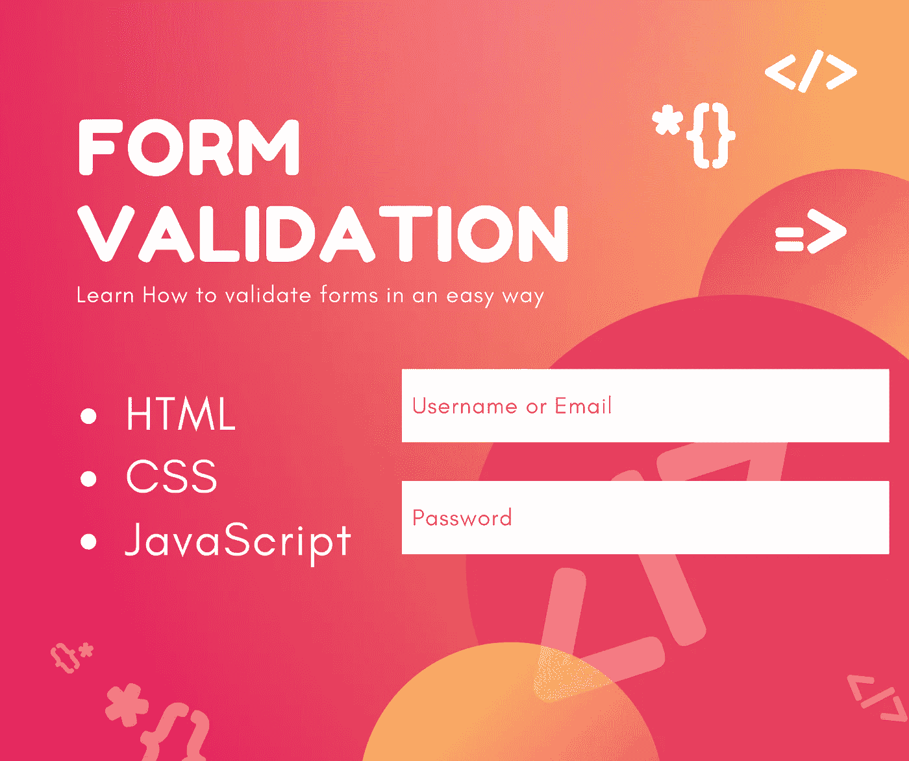
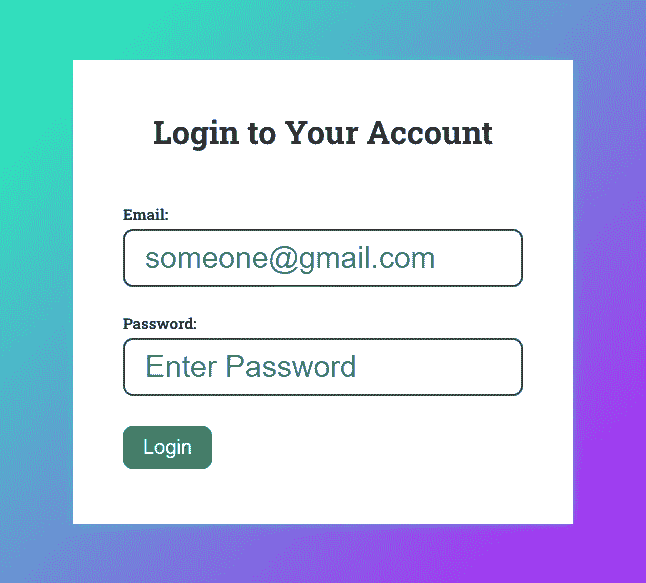
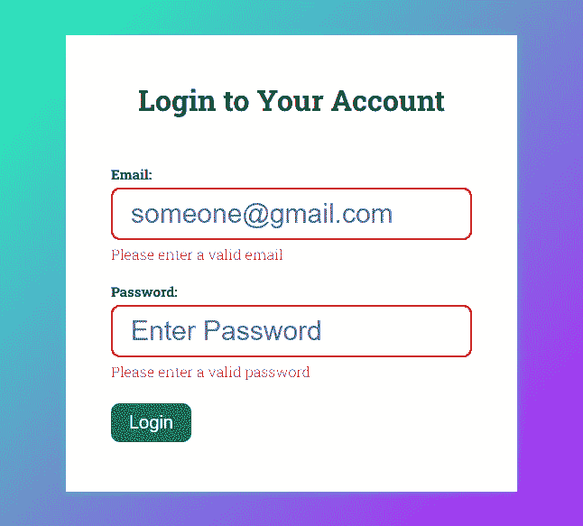

# 用代码进行正确的形式验证

> 原文：<https://javascript.plainenglish.io/proper-form-validation-with-code-ee7777bd2141?source=collection_archive---------9----------------------->

## 如何以更好、更安全的方式进行表单验证的指南。



如果你还不知道表单验证，那么你的网站就有风险。在本文中，我将向您展示如何以更好、更安全的方式进行表单验证。我会解释哪种方法有用，为什么有用。

**注:** *原载于 2022 年 3 月 14 日*[*【https://uprightcodes.com】*](https://uprightcodes.com/form-validation-with-code/)*。*

```
 · [What is form validation?](#af5f)
· [Importance of form validation](#9d15)
  ∘ [Client Side](#64de)
  ∘ [Server Side](#b595)
· [Writing the code](#168a)
  ∘ [Simple javascript form validation](#8f2d)
· [Explanation](#bef3)
· [Resources:](#f010)
```

# 什么是表单验证？

表单验证是通过不让任何恶意代码进入您的网站来确保表单输入安全的一种方式。表单验证通过以您希望的方式处理输入来限制用户。这意味着，如果您有一个要求用户名的输入，而您的用户输入了恶意代码。如果你不检查用户输入了什么，那么这会给你带来问题。这种情况经常发生，有时用户是故意这样做的。为了防止这种情况，您必须检查用户是否输入了正确的信息。

# 表单验证的重要性

网站最脆弱的部分是表单。攻击者可以通过使用简单的表单输入来操纵整个网站。为了防止对您的网站的恶意攻击，您需要制定策略来保护输入并使您的表单不那么容易受到攻击，您可以通过适当的表单验证来做到这一点。没有经过适当验证的表单就像为攻击者打开了一扇大门，您宝贵的数据可能会面临风险。

一个具有适当形式验证的网站有助于防止许多攻击，如[](https://en.wikipedia.org/wiki/Cross-site_scripting)*[***SQL 注入***](https://en.wikipedia.org/wiki/SQL_injection)*等。这些攻击非常普遍，它们会损害用户的隐私。就像我上面提到的，用户可以通过你的表单输入故意向你的网站注入恶意代码。我很确定你不希望这种事发生。**

**有两种类型的表单验证:**

## ****客户端****

**客户端验证是用 javascript 完成的。这基本上意味着它发生在提交输入数据之前。当您希望用户立即知道他们输入了不正确的数据时，这很有帮助。例如，当用户在表单中输入一个值时，一旦他们犯了一个错误，他们就会得到一个错误。这有助于避免向服务器发出不必要的请求。**

## ****服务器端****

**当用户在向服务器发出请求后提交输入数据时，就会发生这种情况。这是最重要的验证类型。因为，如果攻击者通过了客户端的验证，他们一定无法通过服务器端的验证。您必须确保存储在数据库中的任何数据都是干净的。**

# **编写代码**

**所以，现在你知道了表单验证的重要性，现在我来告诉你如何实现它。我将只做客户端验证。**

**做这件事有许多不同的方法。我在向你展示我是怎么做的。**

## ****简单的 javascript 表单验证****

**假设我在一个网站上有一个简单的登录表单，下面是表单的 HTML 和 CSS。**

****HTML****

```
**<!DOCTYPE html>
<html lang="en"><head>
  <meta charset="UTF-8">
  <meta http-equiv="X-UA-Compatible" content="IE=edge">
  <meta name="viewport" content="width=device-width, initial-scale=1.0">
  <title>Document</title>
  <link rel="stylesheet" href="style.css">
</head><body>
  <div class="wrapper">
    <div class="form-wrapper">
      <h2 class="title">Login to Your Account</h2>
      <form id="form" class="form">
        <div class="form-group">
          <label for="name">
            Email:
          </label>
          <input id="email" type="email" placeholder="[someone@gmail.com](mailto:someone@gmail.com)" required>
          <p id="emailError"></p>
        </div>
        <div class="form-group">
          <label for="password">
            Password:
          </label>
          <input id="password" type="password" placeholder="Enter Password" required>
          <p id="passwordError"></p>
        </div>
        <input type="submit" value="Login">
      </form>
    </div>
    <div class="success-msg-container">
      <h2 id="msg" class="msg">You have provided the correct details and your form will be processed</h2>
    </div>
  </div>
  <script src="script.js"></script>
</body></html>**
```

**我们还可以添加 CSS 来使表单在网页上看起来更好。**

****CSS****

```
**@import url("https://fonts.googleapis.com/css2?family=Roboto+Slab:wght@300;700&display=swap");* { padding: 0; margin: 0; box-sizing: border-box;}body { font-family: "Roboto Slab", serif;}.wrapper { width: 100%; min-height: 100vh; display: flex; justify-content: center; align-items: center; background-image: linear-gradient( 135deg, rgb(30, 250, 180), rgb(180, 30, 250) );}.form-wrapper { width: 100%; max-width: 500px; padding: 50px; background-color: white; box-shadow: 0 0 10px rgba(30, 250, 180, 0.4);}.title { margin-bottom: 50px; font-weight: bold; text-align: center; font-size: 2em; color: black;}.form-group { margin: 20px 0;}input { font-size: 30px; padding: 10px 20px; border-radius: 10px; border: none; outline: none; margin: 5px 0;}label { font-size: 15px; font-weight: bold;}input:not([type="submit"]) { width: 100%; border: 2px solid rgba(0, 0, 0, 0.7);}input[type="submit"] { background-color: rgb(8, 131, 92); color: white; font-size: 20px;}input[type="submit"]:hover { cursor: pointer; background-color: rgb(35, 235, 171);}input[type="submit"]:active { background-color: rgb(28, 80, 63);}.error #emailError,.error #passwordError { color: red;}.error input { border: 2px solid red;}.msg { display: none;}**
```

**添加 HTML 和 CSS 后，我们的网页看起来会像这样:**

****

**在 HTML 中，你可以看到我有一个简单的表单，有两个输入，要求输入电子邮件和密码。现在，我想做的是，如果用户输入了错误的电子邮件，它会显示一条消息*“请输入有效的电子邮件”*。同样，如果用户提交一个空表单，我会显示一条错误消息，告诉他们*“请填写详细信息”*。所以，现在是时候添加 javascript 了。**

****Javascript****

```
**const email = document.getElementById("email");const password = document.getElementById("password");const form = document.getElementById("form");const msg = document.getElementById("msg");// Function to validate the emailconst validateEmail = (inputEmail)=> inputEmail.value.match(/^(([^<>()\[\]\\.,;:\s@"]+(\.[^<>()\[\]\\.,;:\s@"]+)*)|(".+"))@((\[[0-9]{1,3}\.[0-9]{1,3}\.[0-9]{1,3}\.[0-9]{1,3}])|(([a-zA-Z\-0-9]+\.)+[a-zA-Z]{2,}))$/);// Function to validate passwordconst validatePassword = (inputPassword) => inputPassword.value.match(/^(([^<>()\[\]\\.,;:\s@"]+(\.[^<>()\[\]\\.,;:\s@"]+)*)|(".+"))@((\[[0-9]{1,3}\.[0-9]{1,3}\.[0-9]{1,3}\.[0-9]{1,3}])|(([a-zA-Z\-0-9]+\.)+[a-zA-Z]{2,}))$/);// Function used to display errorsconst generateError = (errorName, errorMsg) =>{ const emailError = document.getElementById("emailError"); const passwordError = document.getElementById("passwordError"); if(errorName == "email"){ emailError.innerText = errorMsg; }else if(errorName == "password"){ passwordError.innerText = errorMsg; }
}const formValidate = (inputEmail, inputPassword) =>{ if(!validateEmail(inputEmail)){ emailError = "please enter a valid email address"; generateError("email",emailError); return; } if(!validatePassword(inputPassword)){ passwordError = "please enter correct password"; generateError(generateError("password",passwordError)); return; } // This is where you can write your code that you want to run          once the user has entered the correct information.}//triggers when user submits the formform.addEventListener("submit",(e) => { e.preventDefault(); formValidate(email, password);});// Focusout event listener. Triggers when the user clicks anywhere else besides the inputemail.addEventListener("focusout", (e)=>{ if(!validateEmail(email)){ email.style.borderColor = "red"; generateError("email", "Please enter a valid email"); email.parentElement.classList.add("error"); }});// Focusout event listener. Triggers when the user clicks anywhere else besides the inputpassword.addEventListener("focusout", (e)=>{ if(!validatePassword(password)){ password.style.borderColor = "red"; generateError("password", "Please enter a valid password"); password.parentElement.classList.add("error"); }});**
```

# **说明**

**现在让我解释一下我在 javascript 中做了什么。首先，我们来谈谈邮件。很简单，我希望用户只输入电子邮件，而不是其他任何东西。一种简单的方法是输入 *type="email"* 。**

```
**<input id="email" type="email" placeholder="Enter email" required>**
```

**对于密码，您必须使用输入 *type="password"* 。**

```
**<input id="password" type="password" placeholder="Enter password" required>**
```

**接下来您可以做的是将用户是否输入了有效的电子邮件与 regex 代码进行匹配，以确保用户输入了有效的电子邮件地址。我还在输入标签中添加了 **" *required"*** 属性，这不会让用户在不提供细节的情况下进行进一步处理。**

**函数***validate email***和***validate password***用正则表达式匹配表单值，并根据结果返回 true 或 false。如果有错误，它将不再继续处理。**

**要显示错误消息，我只需使用“***generate error***”函数选择我想要放置错误消息的特定元素。**

```
**emailError.innerText = errorMsg;**
```

**这将是它的样子:**

****

**重要提示:有很多人没有正确地验证表单，这导致了对敏感数据的潜在威胁。因此，不仅要在客户端，还要在服务器端养成正确验证表单的习惯。服务器端验证非常重要！**

**你可以在 Codepen 上找到这个项目。如果您认为可以使代码看起来更好、更安全，请随意使用代码并做一些修改。这是我上面解释的代码的实际版本:**

**See the Pen [Form validation in javascript](https://codepen.io/tamur20/pen/zYEJYWQ) by [Tamur](https://codepen.io/tamur20)**

**现在你知道了。感谢您的阅读。**

***更多内容请看*[***plain English . io***](https://plainenglish.io/)*。报名参加我们的* [***免费周报***](http://newsletter.plainenglish.io/) *。关注我们关于*[***Twitter***](https://twitter.com/inPlainEngHQ)*和*[***LinkedIn***](https://www.linkedin.com/company/inplainenglish/)*。加入我们的* [***社区不和谐***](https://discord.gg/GtDtUAvyhW) *。***