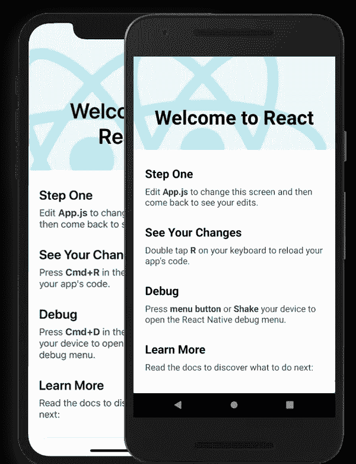

# 在 Web 开发中使用 React 的利弊

> 原文：<https://javascript.plainenglish.io/pros-and-cons-of-using-react-in-web-development-ffb81a6235b9?source=collection_archive---------14----------------------->

[React](https://www.mayhemcode.com/2022/07/pros-and-cons-of-using-react-in-web.html) 席卷了 web 开发社区。如今，大多数 web 应用程序都是使用这个库构建的。但是这项技术的优缺点是什么呢？

# 反应是什么？

为了理解 React 是如何工作的，我们需要知道 web 应用程序是如何构建的。大多数网站都是页面，使用后端服务器。我们需要记住 **React 只是一个前端库**。应该有一些其他技术，如 Express 或 React 框架，如 Next.js，来构建全栈 web 应用程序。React 应用程序以组件的形式构建。React 的主要吸引力来自这个特性，我们可以在应用程序的任何地方重用组件。**它是由脸书**开发的，而且还在不断更新中。

使用 React 可以轻松创建单页应用程序或 SPA。如果你想构建一个具有良好 UI 和功能的静态应用，React 是最好的选择。这是一项开源技术，拥有巨大的社区支持，你可以通过互联网找到任何问题的解决方案。React 中的数据流是单向的**,这意味着数据可以从上到下传递给组件，我们也可以使用不同的策略，比如 Redux 等其他库。**

# **为什么要用 React？**

**以前，大多数 web 应用程序都是用 PHP 或 Java 编写的，但是由于它们提供的功能和能力，它们正在转向 React 和其他技术。所有的遗留应用程序都被转移到 React。甚至像脸书、Instagram 和 Dropbox 这样的应用也是用 React 开发的。**

**这都是因为 Node.js 的革命性发展，它允许在浏览器之外使用 JavaScript。React 与 Node.js 和它的包管理器一起使用，增强了它的功能，因此我们可以使用 NPM 的其他库。但凡事有利有弊。我们来详细看看 React 的利弊。**

# **React 的优势**

*   ****基于组件:** React 应用是使用组件制作的；这些组件是可重用的，这意味着不需要为某些特定的东西重写代码。以前，像导航条、页脚或状态栏这样的东西需要添加到不同的页面上。通过使用组件，我们可以简单地**编写一次，然后在任何地方使用**。**

****

*   ****庞大的社区:** React 拥有庞大的社区支持。有许多开发人员试图解决问题，这个库中有不断的更新和错误修复。开发人员保持这项技术的更新和无误。您可以通过在 internet 上查找解决方案来解决应用程序中的任何问题。无论你遇到什么问题，你都可以确定你会找到解决的办法。**
*   ****简单易学:**反应肯定在开始时似乎有点复杂。但是在你理解了基本组件和它们的工作原理之后，整个过程看起来就非常简单了。使用这些简单的功能可以开发非常复杂的应用程序。但是我们需要记住，作为一项技术，React 是*易学难精通*。**
*   **大多数 web 应用程序也需要相同的移动应用程序版本。我们都知道开发一个移动应用有多难，对于两种不同的架构来说也是如此:Android 和 iOS。但这个问题也可以通过学习 React 来解决，因为有一种叫做 React Native 的技术，用于为 Android 和 iOS 构建移动应用。它使用与 React 类似的方法。所以学习 React 也有助于你更容易成为一名移动应用开发者。**

****

*   ****高可伸缩性和灵活性:** React 可以与许多其他提供各种功能和特性的库一起使用。我们需要理解这一点，因为 ReactJs 不是一个框架，而是一个库。这就是将它与其他库一起使用的优势所在。因为一个框架通常具有所有的特性，并且只需要用一种方式编写，而库可以根据开发人员的需要来使用。**

# **使用 React 的缺点**

*   ****陡峭的学习曲线:**它有一条陡峭的学习曲线。如前所述，学习 React 可能很容易，但很难掌握它。我们也可以说我们知道如何使用 React 构建应用程序。但是似乎总是缺少一些东西或者需要添加一些功能，这可能需要花费大量的时间和实践来掌握这项技术。**
*   ****前端库:**这只是一种前端技术，这意味着你需要学习另一种在后端工作的技术，比如 Express 或 React 框架，比如 Next.js，React 可以在我们想要开发单页面应用程序或静态应用程序时使用。**

****

*   **不支持搜索引擎优化:这是 ReactJs 的主要问题之一。像博客网站这样的 Web 应用程序不能使用 React 来制作，这意味着它不是非常 SEO 友好的。这可以通过一个简单的例子来理解。假设你给某人发了一个博客链接。当您发送链接时，将会看到一个小图片和说明。但是当使用 React 制作的应用程序需要被渲染时，所有的 JavaScript 都需要被处理。所以，所有的爬虫和谷歌机器人都无法读取我们博客的数据，这会降低我们博客的排名。这可以通过使用 Next.js 来解决，它使用服务器端渲染来解决这个问题。**
*   ****频繁变化:**如前所述，React 的 bug 和问题正在不断地被处理和修复。这也意味着在很短的时间内会有大量的更新。例如，引入 ES6 的更新实际上改变了 React 中的许多开发风格，这意味着我们需要不断更新，并将应用程序更改为当前版本。**

****更多关于 web 开发的文章:****

**[https://www.mayhemcode.com/search/label/web-tech](https://www.mayhemcode.com/search/label/web-tech)**

***原载于 2022 年 7 月 20 日 https://www.mayhemcode.com**的* [*。*](https://www.mayhemcode.com/2022/07/pros-and-cons-of-using-react-in-web.html)**

## **进一步阅读**

** [## 如何改进设计者和开发者的合作

### 随着远程/在家工作作为新的现状的出现，人员和预算紧缩，以及永恒的…

简明英语. io](https://plainenglish.io/blog/how-to-improve-designer-developer-collaboration-with-lifecycle) 

*更多内容请看* [***说白了就是***](https://plainenglish.io/) *。报名参加我们的* [***免费每周简讯***](http://newsletter.plainenglish.io/) *。关注我们* [***推特***](https://twitter.com/inPlainEngHQ) *和*[***LinkedIn***](https://www.linkedin.com/company/inplainenglish/)*。加入我们的* [***社区不和谐***](https://discord.gg/GtDtUAvyhW) *。***