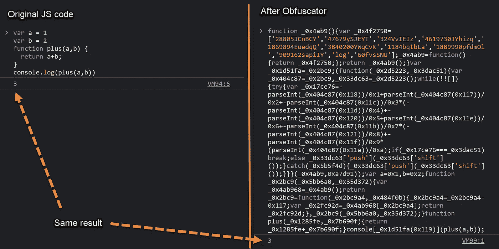

# 用混淆工具保护你的 JavaScript 代码

> 原文：<https://javascript.plainenglish.io/protect-your-javascript-code-with-obfuscation-tool-50a0155fa49c?source=collection_archive---------1----------------------->

## 防止别人窃取你作品的简单方法。


Photo by [Clint Patterson](https://unsplash.com/@cbpsc1?utm_source=medium&utm_medium=referral) on [Unsplash](https://unsplash.com?utm_source=medium&utm_medium=referral)

如今，只需一个普通的 web 浏览器，就可以轻松访问任何网站并从中提取 JavaScript 代码。在这篇文章中，我想介绍一个代码混淆工具，它以一种黑客无法理解的方式修改你的代码，但仍然是完全有效和可执行的。

*比如:*

*混淆后:*

哇，现在剧本看起来复杂多了。但是，在浏览器开发工具上测试后，他们在网络浏览器上给出了相同的结果！



## 直接在 Web 工具上使用 JavaScript 混淆器。

网址:

[](https://obfuscator.io/) [## JavaScript 混淆工具

### 为什么我要混淆我的 JavaScript 代码？保护您的代码是一个好主意的原因有很多…

混淆器. io](https://obfuscator.io/) 

这个工具是一个在线网络服务，你可以复制粘贴你的代码，你会立即得到模糊的版本。这个工具将适合如果你只是需要一个快速混淆你的小项目。

## 将混淆器作为模块/中间件包安装

你可以简单地用 Yarn 或 NPM 安装这个包，并把它添加到你的依赖项中。在[https://obfuscator.io/](https://obfuscator.io/)随意检查全部命令

```
$ npm install --save-dev javascript-obfuscator
or
$ yarn add --dev javascript-obfuscator
```

例如，在 Node.js 应用程序中，您可以将 JSObfuscator 作为一个模块进行加载，并将您的脚本作为要进行模糊处理的脚本进行传递，如下例所示:

或者，您可以将混淆器直接安装到您的自动化工作流或 CI/CD 管道中。以下是一些例子:

*   Webpack 插件: [webpack-obfuscator](https://github.com/javascript-obfuscator/webpack-obfuscator)
*   Webpack 加载器:[混淆加载器](https://github.com/javascript-obfuscator/obfuscator-loader)
*   gulp:[gulp-JavaScript-obfuscator](https://github.com/javascript-obfuscator/gulp-javascript-obfuscator)
*   咕哝:[咕哝-贡献-混淆器](https://github.com/javascript-obfuscator/grunt-contrib-obfuscator)
*   汇总:[汇总-插件-JavaScript-混淆器](https://github.com/javascript-obfuscator/rollup-plugin-javascript-obfuscator)
*   Weex: [weex-devtool](https://www.npmjs.com/package/weex-devtool)
*   马耳他:[马耳他-js-obfuscator](https://github.com/fedeghe/malta-js-obfuscator)
*   Netlify 插件:[netlify-plugin-js-obfuscator](https://www.npmjs.com/package/netlify-plugin-js-obfuscator)

使用这个易于使用的工具，您可以有效地保护 web 项目的 JS 代码免受黑客、破解者和竞争对手的攻击。我希望你喜欢这篇文章，并发现它对你的日常工作或项目有用。如果您有任何问题，请随时联系我。

[](https://medium.com/@joets/membership) [## 通过我的推荐链接加入 Medium-Joe t . Santhanavanich

### 作为一个媒体会员，你的会员费的一部分会给你阅读的作家，你可以完全接触到每一个故事…

medium.com](https://medium.com/@joets/membership) 

*更多内容看* [***说白了。报名参加我们的***](https://plainenglish.io/) **[***免费周报***](http://newsletter.plainenglish.io/) *。关注我们关于* [***推特***](https://twitter.com/inPlainEngHQ) *和****[***LinkedIn***](https://www.linkedin.com/company/inplainenglish/)*。加入我们的* [***社区***](https://discord.gg/GtDtUAvyhW) *。**