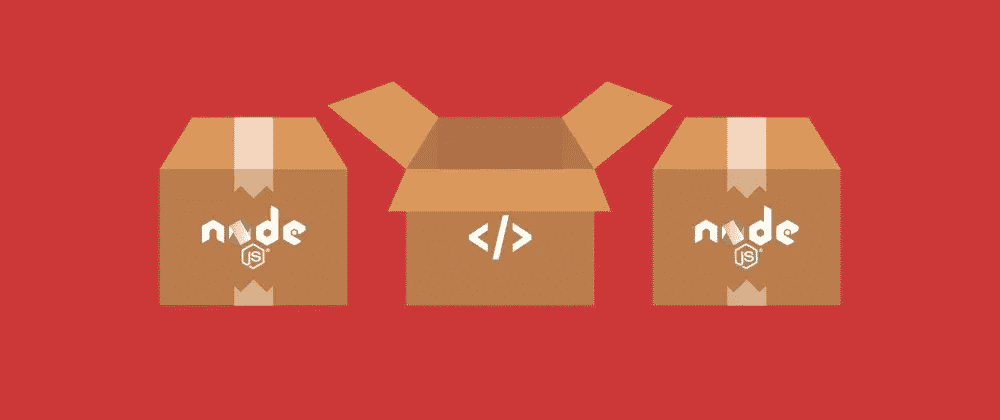

# 在 2022 年发布一个 npm 包

> 原文：<https://javascript.plainenglish.io/publish-a-npm-package-in-2022-40dbaaa5b92c?source=collection_archive---------12----------------------->

## 关于我如何创建 npm 包的简要指南

Npm packages

**剧透:**要发布一个好的包确实很难，需要做很多工作。如果你想让这个包易于使用，有良好的文档记录，并且经过良好的测试，除了创建包的核心逻辑之外，还需要做很多工作。

在接下来的几行中，我将简要介绍我是如何创建一个 npm 包的，我会及时对它进行改进。

## **创建 Github 回购:**

这很简单。你可以使用 [*这个*](https://github.com/emilhein/puppeteer-cmp-clicker) ，作为你的新 npm 包的一个非常基本的模板:

## 设置 CI/CD

对于这个小软件包，我将使用 [Travis-CI](https://www.travis-ci.com/) ，因为它是免费的并且非常容易使用。
它将被设置，所以我们在每次完成对 ***main*** 的提交时发布一个新版本的包。

1.  从您的 npm 帐户设置环境变量“npm_TOKEN”和“npm_EMAIL ”,以便您允许 Travis 发布到您的 npm 帐户

## **Your .travis.yml**

这将简单地运行“npm 测试”,然后发布你的 npm 包。

有些东西还取决于你的 package.json 文件，所以这里有一个这个包的例子:

现在，每当我提交到主分支时，包就会被发布。为了使 CI/CD 管道尽善尽美，还需要做更多的工作。

*   测试必须实际实现
*   需要设置某种类型的服务器版本
*   创建一个更有用的自述文件
*   扩展包功能
*   测试/覆盖的广告徽章等。

现在，在我的其他想要使用这个包的项目中，我需要做的就是将它包含在 package.json 文件中的依赖项中，然后 BUM！

npm 软件包可在以下位置找到:

 [## 木偶师

### 现在我只有一个功能 1。clickCmp({page，customKnownIds = []，customknownclass =[]})此函数采用…

www.npmjs.com](https://www.npmjs.com/package/puppeteer-cmp-clicker)  [## GitHub-emil hein/puppet eer-cmp-clicker:单击 CMP 弹出窗口小部件的辅助函数

### 现在我只有一个功能 1。

github.com](https://github.com/emilhein/puppeteer-cmp-clicker) 

*更多内容请看*[***plain English . io***](https://plainenglish.io/)*。报名参加我们的* [***免费周报***](http://newsletter.plainenglish.io/) *。关注我们关于*[***Twitter***](https://twitter.com/inPlainEngHQ)*和*[***LinkedIn***](https://www.linkedin.com/company/inplainenglish/)*。加入我们的* [***社区不和谐***](https://discord.gg/GtDtUAvyhW) *。*