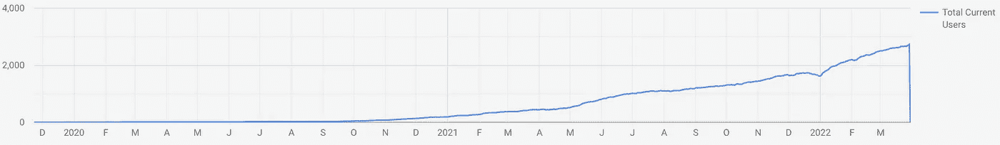

# 发布你的副业，现在！

> 原文：<https://javascript.plainenglish.io/publish-your-side-project-now-1e3bb170c079?source=collection_archive---------13----------------------->

## 如果你不为你的第一次发布感到尴尬，那你发布得太晚了。

Photo by [Caleb Woods](https://unsplash.com/@caleb_woods?utm_source=medium&utm_medium=referral) on [Unsplash](https://unsplash.com?utm_source=medium&utm_medium=referral)

在日常工作之外，大多数开发人员都有兼职项目。从事辅助项目为开发人员带来了许多好处。它们是学习新技术和提高现有技能的好方法。但是，最重要的是，根据你的想法从头开始开发一个项目是很有趣的。你可以释放你全部的创造力。你的全职工作没有任何限制。

> 对于许多开发人员来说，编程是一项热爱的工作。— [StackOverflow](https://insights.stackoverflow.com/survey/2015#profile-sideprojects)

根据 2015 年 [StackOverflow 调查](https://insights.stackoverflow.com/survey/2015#profile-sideprojects)，91.7%的开发者都有活跃的副业项目。对我来说，这是惊人的。不幸的是，调查没有显示他们中有多少人曾经公开过任何事情。在没有经验证明的情况下，我只能说只有很少的项目被发布。

> 开发人员平均每周花 7 个多小时在编码上。— [斯塔克伟福](https://insights.stackoverflow.com/survey/2015#profile-sideprojects)

在我看来，这是因为许多开发者多年来一直在开发他们的副业项目。他们花了几个小时创造了一个产品，但从未发布过。为什么？因为尽管梦想通过他们的产品赚钱，但推出一个没人喜欢的产品的真正潜力远比开发一个没人听说过的产品更可怕。

Image source ([commitstrip.com](https://www.commitstrip.com/en/2014/11/25/west-side-project-story/))

在我已经开始的几个兼职项目中，我只发布了一个——[Web Highlights Chrome extension](https://chrome.google.com/webstore/detail/web-highlights-pdf-web-hi/hldjnlbobkdkghfidgoecgmklcemanhm)。我非常清楚地记得，当我第一次在 Chrome 网络商店中发布扩展时。我担心没有人喜欢这个扩展吗？是的。我担心用户会抱怨 bug 吗？是的。

但更重要的是，在 Chrome 网上商店公开发布我的第一个兼职项目，我兴奋吗？是的，我是。发生了什么事？**我推出了没人喜欢的产品吗？**

 [## 我的第一个 9.99 美元之旅与我的副业

### Chrome 扩展带来的被动收入

medium.com](https://medium.com/@mariusbongarts11/my-journey-to-the-first-9-99-with-my-side-project-3edc13dd1f2d) 

让我们这么说吧:它本可以有一个更好的开始。一个月后，我有了四个用户——我、我的兄弟、我的妈妈和一个朋友。两个月后，我已经有了八个**用户——我、我哥哥、我妈妈和五个朋友。我哥哥过去是(现在仍然是)一个“bug 猎人”，总是给我发截图来修复东西，我的朋友们或多或少都用它来帮我一个忙。但是，我记得 2020 年 3 月 12 日这一天——第一个未知用户注册了。我再高兴不过了！**

一年后，我自豪地成为一个拥有 123 名活跃用户的扩展开发者。同时，有 2906 个活跃用户。这仍然不是一个巨大的数目。但对我来说更重要的是，许多用户和我一样喜欢这个应用程序。

Total current users of [Web Highlights](https://chrome.google.com/webstore/detail/web-highlights-pdf-web-hi/hldjnlbobkdkghfidgoecgmklcemanhm)

所以问问你自己:会发生什么？可能没人会注意到你的产品。又或许，用户会不喜欢你的产品，会再次抛弃它。你也可能会收到负面评价。那又怎样？

> *只有在我们愿意失败的事情上，我们才能真正成功。如果我们不愿意失败，那么我们也不愿意成功。—马克·曼森*

最好是建立一种心态，让失败不是一件坏事。事实上，失败是成长的必要条件。让我引用马克·曼森的话来强调这一点:

> 如果你想象一个小孩试图学习走路，这个小孩会摔倒并受伤上百次。但是那个孩子从来没有停下来想过，“哦，我想走路不适合我。我不擅长。”避免失败是我们在人生的某个阶段学到的东西。

将这一点投射到副业项目中意味着即使你的第一个副业项目不成功。也许你的第二个、第三个或第十五个是。永远不要放弃，要意识到在你所有项目的结尾——无论成功还是不成功，有偿还是无偿，完成还是未完成——你总是会赢的:新的经历，新的联系，和关于你自己的新发现！

> 我没有失败。我刚刚发现了一万种行不通的方法。——叶夫根尼·布里克曼

发布你的副业项目的另一个显著优势是有机会向他人展示你的工作。当面试开发工作时，被问及你是否完成了任何兼职项目并不罕见。在很多情况下，拥有一份 GitHub 简介也是意料之中的，潜在雇主可能会要求查看你的简介。我可以说，作为一名初级员工，在我的求职面试中，拥有一个运行着数百个用户的 Chrome 扩展让我感到惊讶。

# 最后的想法

开发人员经常接手一些兼职项目。然而，这是一个常见的场景，许多这样的项目将会被遗忘。你有副业吗？不要害怕表现出来！希望这篇文章能最终激励你发表你的副业。推出你的产品是迈向激动人心的未来的第一步。

如果你对我的 Web Highlights 副业的整个故事感兴趣，你可能想读一下我的副业 和我的第一个 9.99 美元之旅[。](https://medium.com/@mariusbongarts11/my-journey-to-the-first-9-99-with-my-side-project-3edc13dd1f2d)

我希望你喜欢阅读这篇文章。我总是很乐意回答问题，也乐于接受批评。请随时联系我😊

[这里是无限制访问 Medium](https://medium.com/@mariusbongarts/membership) 上所有内容的链接。如果你通过这个链接注册，我将免费为你赚一小笔钱。

 [## 通过我的推荐链接加入 Medium-Marius bong arts

### 作为一个媒体会员，你的会员费的一部分会给你阅读的作家，你可以完全接触到每一个故事…

medium.com](https://medium.com/@mariusbongarts/membership) 

关注我，不要错过我的下一篇文章。我写了关于 Typescript、Web 组件、前端框架、软件设计模式、Chrome 扩展以及更多的主题！🙏

# 关于作者

Marius Bongarts 是埃森哲互动公司的软件工程分析师。他还创建了 [Web Highlights Chrome 扩展](https://chrome.google.com/webstore/detail/web-highlights-%20-bookmark/hldjnlbobkdkghfidgoecgmklcemanhm)，允许成千上万的用户在每个网站上创建文本亮点和书签。通过提供标签和目录，您可以在[web-highlights.com](https://web-highlights.com/home)上的相应 web 应用程序中轻松重新找到您的 web 研究。看看吧！

通过**[**LinkedIn**](https://www.linkedin.com/in/marius-bongarts-6b3638171/)**联系我或者在 [**Twitter**](https://twitter.com/MariusBongarts) 上关注我。另外，如果你还没有的话，可以看看我的 [PDF &网页荧光笔 Chrome](https://chrome.google.com/webstore/detail/web-highlights-pdf-web-hi/hldjnlbobkdkghfidgoecgmklcemanhm) 扩展。****

*******如果你想支持我的写作，*** [***成为中等会员***](https://medium.com/@mariusbongarts/membership) ***。如果你这样做，我会得到一小笔佣金。非常感谢！*******

**** [## 通过我的推荐链接加入 Medium-Marius bong arts

### 作为一个媒体会员，你的会员费的一部分会给你阅读的作家，你可以完全接触到每一个故事…

medium.com](https://medium.com/@mariusbongarts/membership)  [## 如何构建一个 Chrome 扩展

### 按照这个循序渐进的指南创建你的第一个 Chrome 扩展

javascript.plainenglish.io](/how-to-build-a-chrome-extension-d165f5cde793)  [## Web 组件会取代前端框架吗？

### 它们是为解决不同的问题而构建的。

javascript.plainenglish.io](/will-web-components-replace-frontend-frameworks-535891d779ba)  [## 我们都是残疾人！

### 每个人都从可访问的万维网中受益。

medium.com](https://medium.com/@mariusbongarts11/we-are-all-disabled-2ea7aa7edaf7) 

*更多内容请看*[***plain English . io***](https://plainenglish.io/)*。报名参加我们的* [***免费周报***](http://newsletter.plainenglish.io/) *。关注我们关于*[***Twitter***](https://twitter.com/inPlainEngHQ)*和*[***LinkedIn***](https://www.linkedin.com/company/inplainenglish/)*。加入我们的* [***社区不和谐***](https://discord.gg/GtDtUAvyhW) *。*****