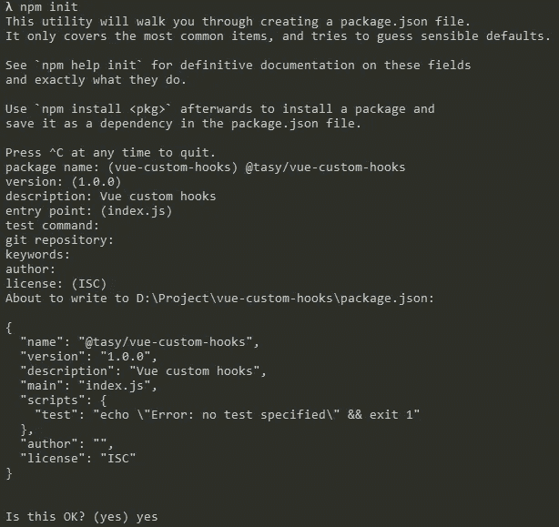
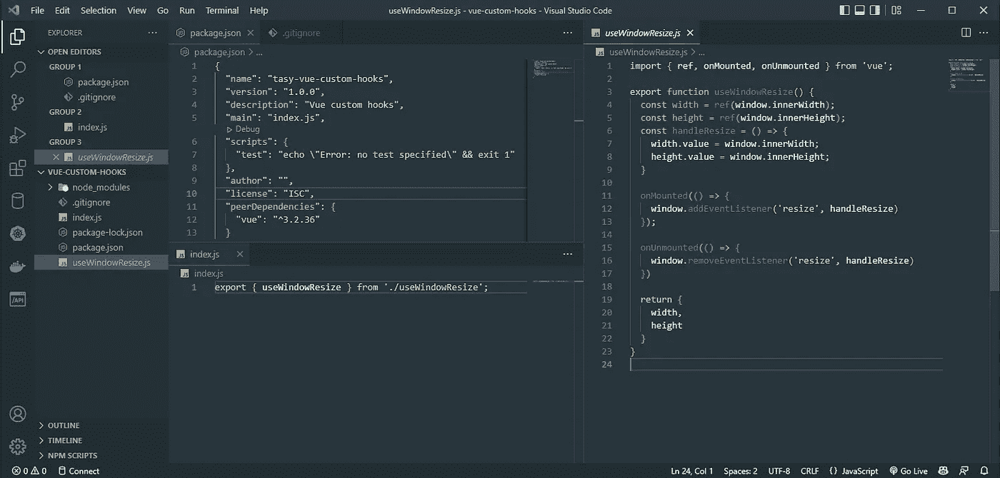
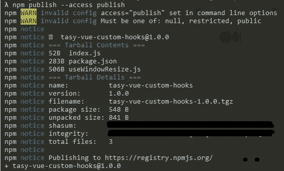
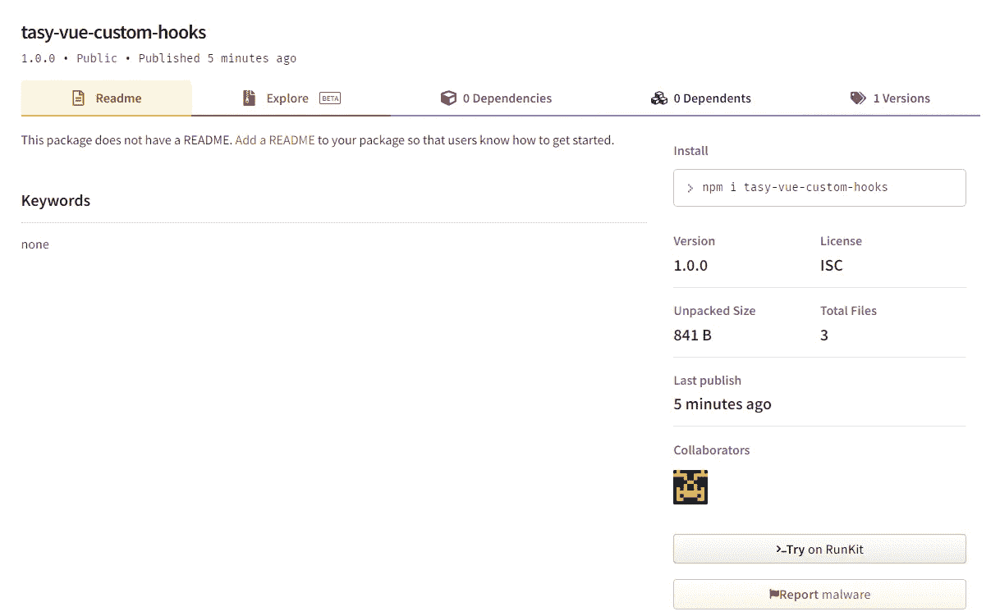
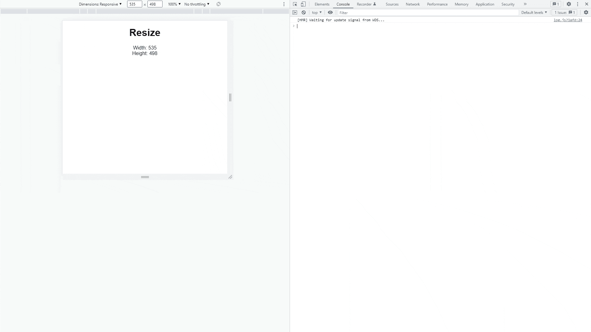

# 将您的 Vue.js 自定义挂钩发布为 NPM 包

> 原文：<https://javascript.plainenglish.io/publish-your-vue-js-custom-hooks-as-an-npm-package-890fd9b62ba?source=collection_archive---------16----------------------->

将你的文章作为 NPM 包发表的方法。


Photo by [Brandable Box](https://unsplash.com/@brandablebox?utm_source=unsplash&utm_medium=referral&utm_content=creditCopyText) on [Unsplash](https://unsplash.com/s/photos/package?utm_source=unsplash&utm_medium=referral&utm_content=creditCopyText)

带 Composition API 的 Vue 3 真的很有帮助。有了它，我们可以做很多事情，其中之一就是定制挂钩。我真的很喜欢 Vue 中带有 Composition API 的自定义钩子。这就是为什么我在这里写了一篇关于如何创建一些有用的自定义钩子的文章:

[](/10-useful-custom-hooks-with-vue-js-37f0fd42ce0d) [## Vue.js 的 10 个有用的自定义挂钩

### Vue.js 是我使用的第一个 JavaScript 框架。我可以说 Vue.js 是我打开进入的第一扇门之一…

javascript.plainenglish.io](/10-useful-custom-hooks-with-vue-js-37f0fd42ce0d) 

在本文中，我们不会讨论如何在 Vue 3 中制作自定义钩子。这篇文章的主要目的是学习如何将你的钩子发布为 NPM 包，这有助于我们的代码变得更加可重用。我们可以在任何项目中使用它们。

有一些步骤可以做到这一点。

# 登录 NPM

如果您想将自己的钩子作为 NPM 包发布，这是一个必需的步骤。挺简单的！如果我们没有 NPM 帐户，让我们在这里创建一个[。拥有账户后，你只需用你的账户登录 NPM。以下是登录的基本命令行:](https://www.npmjs.com/signup)

```
npm login
```

然后你只需要填写你的用户名，邮箱和密码就可以登录了。要测试您是否已成功登录，只需运行以下命令:

```
npm whoami
```

# 我们需要一个钩子

本文的重点是发布 Vue 自定义钩子的方式，所以我们至少需要一个自定义钩子来发布。如果我们没有任何钩子，只是想学习如何发布一个自定义钩子，你可以试试我的基本钩子。我也用这个钩子做例子。这是一个基本的钩子， **useWindowResize** 。下面是该挂钩的源代码:

# 初始化您的包

在我们登录 NPM 并发布了一些钩子之后，我们将开始进入主要步骤。第一步是初始化我们的包。我们需要一个文件`package.json`,里面有关于我们的包/项目的信息。我们可以手动为它创建和编写内容，但我建议您通过 npm 命令创建它。很简单:

```
npm init
```

运行`npm init`会询问您一些设置问题(例如，名称、描述……)。你只需要输入你的信息，然后按“回车”就可以了。



完成该命令后，`package.json`将被创建。下面是一个由上面的命令创建的示例文件:

```
{
  "name": "tasy-vue-custom-hooks",
  "version": "1.0.0",
  "description": "Vue custom hooks",
  "main": "index.js",
  "scripts": {
    "test": "echo \"Error: no test specified\" && exit 1"
  },
  "author": "",
  "license": "ISC"
}
```

在真实案例中，我们可以拥有比`package.json`更多的信息。但在这种情况下，我只是用较少的数据做了一个简单的例子。您应该知道的一些重要字段是“名称”、“版本”和“主要”:

*   名称:这是您的包名。当有人想安装你的软件包时，它会被调用。
*   版本:软件包的版本。
*   main:您可以将这个字段看作是一个端点，它是您的包的主要入口点。

# 安装所需的软件包

在这一步中，您需要添加一些与您的包相关的包。在这里，我们需要发布 Vue 自定义挂钩，所以我认为我们必须将 Vue 作为一个必需的包添加进来。如果你有其他需要的包，让我们安装它们。有了 Vue，我们只需要按正常方式安装它:

```
npm install vue
```

这里是安装 Vue 后的`package.json`:

```
{
  "name": "tasy-vue-custom-hooks",
  "version": "1.0.0",
  "description": "Vue custom hooks",
  "main": "index.js",
  "scripts": {
    "test": "echo \"Error: no test specified\" && exit 1"
  },
  "author": "",
  "license": "ISC",
  "dependencies": {
    "vue": "^3.2.36"
  }
}
```

在这一步，我有一个重要的注意事项。如你所见， **Vue** 放在“依赖项”里。当用户使用你的包时会产生一些问题。因为这样的话，我们在同一个项目中会有多个 Vue 实例。换句话说，我们使用的 Vue 实例不同于用户的 Vue 实例。要解决这个问题，您可以将“dependencies”更改为“peerDependencies ”,以确保我们使用与用户相同的实例。

# 编写您的代码

在这一步，您可以编写您的定制钩子，并将它们导出到您在`package.js`中定义的主文件中。在我的例子中，端点是`index.js`，所以我将在这个文件中导出我的钩子。但是我不会把我的钩子写在这个文件里。我将在这里用[的内容创建文件`useWindowResize.js`，并将其导入`index.js`。这是`index.js`的内容:](#4bb5)

```
export { useWindowResize } from './useWindowResize';
```

有了这些内容，用户可以这样使用`useWindowResize`:

```
import { useWindowResize } from 'your-package-name';
```

这是我在这一步的源代码。我想我们可以开始向 NPM 发行了。



# 将您的包发布到 NPM

这一步相当简单。如果你登录到 NPM，你只需要一个命令来发布你的包。

```
npm publish
```

以下是我从这个命令中得到的结果:



这意味着我们已经成功发布了我们的钩子。为了确保这一点，你可以在 NPM 的网站上查看你的包裹清单。以下是我发布后的包:



# 在 Vue 3 应用程序中测试我们的包

在这一步，我将创建一个简单的 Vue 应用程序，并用普通的 install 命令安装我们的包:

```
npm i tasy-vue-custom-hooks
```

然后，我将创建一个组件，它像这样使用我的钩子:

如你所见，我们可以像使用任何其他 NPM 包一样使用`tasy-vue-custom-hooks`中的`useWindowResize`。让我们检查一下这个钩子的结果:



这个挂钩工作正常！

# 结论

我想很多人会喜欢制作可重复使用的定制钩子，我们可以在很多项目中重复使用。将它们包装成 NPM 是一个很好的方法，我在这篇文章中做了一个简单的演示。除了我已经分享的，我们还有其他的东西来改进我们的包，比如 Git 库，Readme，license 等等。但是我只是尽可能的简单，你可以把它们添加到你自己的包里。这是本文中我的示例的源代码:

[](https://github.com/tasynguyen3894/tasy-vue-custom-hooks) [## GitHub-tasynguyen 3894/tasy-vue-定制挂钩

### 此时您不能执行该操作。您已使用另一个标签页或窗口登录。您已在另一个选项卡中注销，或者…

github.com](https://github.com/tasynguyen3894/tasy-vue-custom-hooks) 

还有另一个源代码，是一个有 10 个有用的 Vue 定制钩子的包。您可以在此处阅读示例:

[](https://github.com/tasynguyen3894/vue-composition-custom-hooks) [## GitHub-tasynguyen 3894/vue-composition-自定义-挂钩

### 在 GitHub 上创建一个帐户，为 tasynguyen 3894/vue-composition-custom-hooks 的开发做出贡献。

github.com](https://github.com/tasynguyen3894/vue-composition-custom-hooks) 

用于创建和发布限定范围的公共包的 NPM 文档:

[](https://docs.npmjs.com/creating-and-publishing-scoped-public-packages) [## 创建和发布限定范围的公共包| npm 文档

### 要在用户或组织命名空间中公开共享您的代码，您可以发布公共用户范围的或…

docs.npmjs.com](https://docs.npmjs.com/creating-and-publishing-scoped-public-packages) 

感谢阅读。希望这篇文章对你有帮助。


Photo by [Liza Rusalskaya](https://unsplash.com/@lizarusalskaya?utm_source=unsplash&utm_medium=referral&utm_content=creditCopyText) on [Unsplash](https://unsplash.com/s/photos/street?utm_source=unsplash&utm_medium=referral&utm_content=creditCopyText)

通过 [LinkedIn](https://www.linkedin.com/in/thaisangnguyen3894/) 或 [Twitter](https://twitter.com/tasyit) 联系我。

*更多内容看* [***说白了就是***](https://plainenglish.io/) *。报名参加我们的* [***免费周报***](http://newsletter.plainenglish.io/) *。关注我们关于*[***Twitter***](https://twitter.com/inPlainEngHQ)*和*[***LinkedIn***](https://www.linkedin.com/company/inplainenglish/)*。查看我们的* [***社区不和谐***](https://discord.gg/GtDtUAvyhW) *加入我们的* [***人才集体***](https://inplainenglish.pallet.com/talent/welcome) *。*