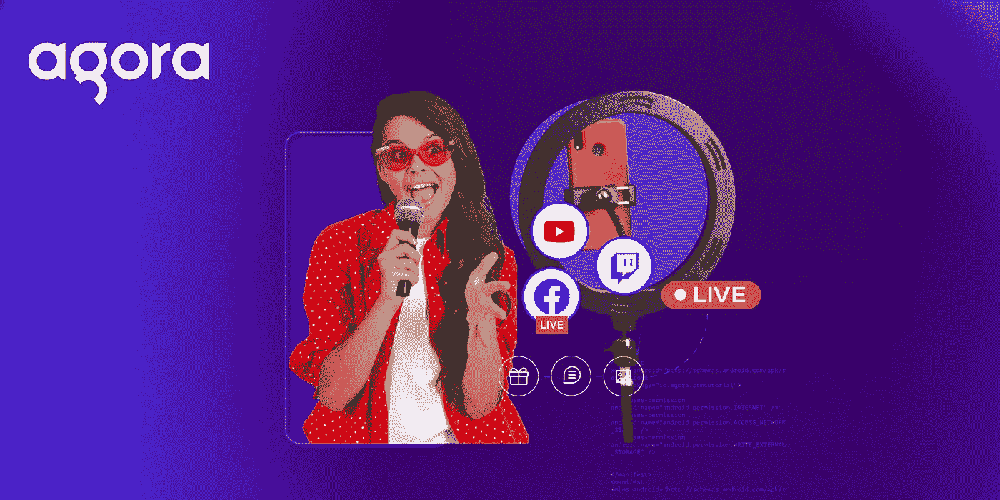
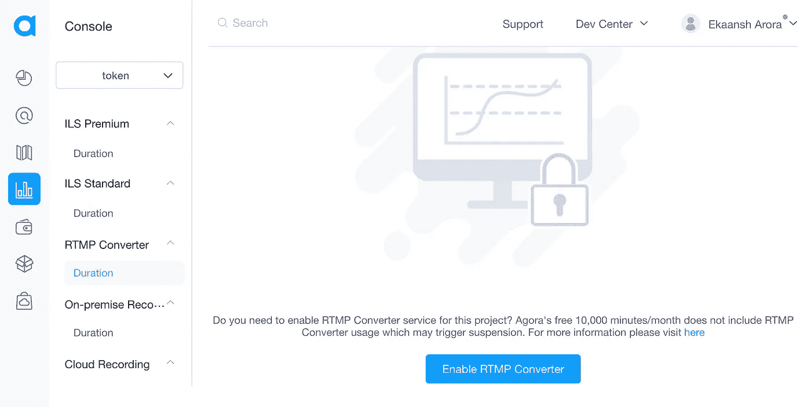

# 使用网络工具包和媒体推送将您的 Agora 直播发布到 YouTube、脸书或 Twitch

> 原文：<https://javascript.plainenglish.io/publishing-your-agora-livestream-to-youtube-facebook-or-twitch-using-the-web-uikit-media-push-b18e03f164ca?source=collection_archive---------11----------------------->

## 关于如何扩展 Web UIKit 以及如何向其添加媒体推送功能的教程。



Banner for Media Push with Agora Web UIKit

当主持直播时，很难选择一个单一的平台来播放你的内容。有了 Agora，你不必做出选择:你可以在自己的网站上托管直播流，并将其发布到多个第三方服务，如 YouTube、脸书直播、Twitch 等。使用 Agora 媒体推送服务可以做到这一点。

在本教程中，我们将讨论如何扩展 Web UIKit，以及如何为其添加媒体推送功能。你可以阅读关于 Web UIKit [发布](https://www.agora.io/en/blog/agora-web-uikit-add-video-calling-or-live-streaming-to-your-website-in-minutes/)和[深入](https://www.agora.io/en/blog/adding-video-chat-or-live-streaming-to-your-website-in-5-lines-of-code-using-the-agora-web-uikit/)的内容。

# 先决条件

*   一个 Agora 开发者账户(免费，[在这里注册！](https://sso.agora.io/en/signup?utm_source=medium&utm_medium=blog&utm_campaign=publishing-your-agora-livestream-to-youtube-facebook-or-twitch-using-the-web-uikit))
*   Node.js LTS 版本
*   对 React 的高级理解

# 设置

您可以在 [GitHub](https://github.com/EkaanshArora/Agora-Web-UIKit-RTMP) 上获得示例代码，或者您可以创建自己的 React 项目。打开终端并执行:

```
npx create-react-app demo --template typescript
cd demo
```

安装 Agora React 原生 SDK 和 UIKit:

```
npm i agora-react-uikit
```

***注:*** 撰写时，当前`agora-react-uikit`发布为`v0.0.5`。

在 Agora 控制台中，您必须为您的项目启用 RTMP 转换器。您可以转到“用法”选项卡，从下拉菜单中选择您的项目:



Agora Console

这就是设计。现在，您可以执行 npm start 来启动本地主机上的 web 服务器。

# 构建实时流

UIKit 为您提供了一个名为`<AgoraUIKit>`的高级组件，可用于呈现完整的视频通话或直播，UIKit 博客深入介绍了如何在无需编写太多代码的情况下定制 UI 和功能。我们将使用组成`<AgoraUIKit>`组件的组件来添加媒体推送功能。

我们将清除`App.tsx`文件，重新开始:

我们将创建一个名为 videocall 的状态变量。当它为真时，我们将呈现直播流，当它为假时，我们将呈现一个按钮来切换应用程序状态和启动流。我们还在直播旁边创建了两个按钮来切换角色和布局。

为了构建 Livestream，我们将使用`PropsContext`组件包装所有内容，以便将用户属性传递给 UIKit。我们将为`rtcProps`添加道具— Agora 应用 ID、频道名称、令牌、直播角色和布局。我们可以使用`styleProps`定制样式，并使用`callbacks`访问直播事件。当用户点击结束通话按钮时，我们将切换设置`videocall`状态为假。

然后我们将渲染`VideoCallUI`组件。我们将自己定义它，而不是使用带有`UIKit`的按钮来添加开始和停止流按钮。如果用户角色是 host，我们将用`TracksConfigure`组件包装它，该组件创建麦克风和摄像机轨迹并将它们传递给 UI。

***注意:*** 建议对生产环境中运行的所有 RTE 应用进行令牌认证。有关 Agora 平台中基于令牌的认证的更多信息，请参见本指南:【https://docs.agora.io/en/Video/token? 平台=所有% 20 平台。

让我们定义一下`VideoCallUI`组件:

我们将通过用处理 Livestream 逻辑的`RtcConfigure`组件包装一切来组合组件。我们将添加一个新的`RTMP`组件，根据状态渲染`GridVideo`或`PinnedVideo`，并在内部渲染`LocalControls`组件。

# 将流推送到 CDN

我们将创建一个名为`RTMP`的新组件，它将包含发布/取消发布来自 CDN 的流的代码:

我们将定义 RTMP 网址。例如，如果你正在使用 Twitch，你的 URL 应该是这样的:`rtmp://xxx.contribute.live-video.net/app/{your_stream_key}`，如果你正在使用 YouTube Live，它应该是这样的:`rtmp://a.rtmp.youtube.com/live2/{your_stream_key}`。我们还将定义直播流的高度和宽度:我使用的是 1280x720:

我们将存储流状态和按钮状态作为状态。然后，我们可以从`RtcContext`访问 SDK 客户端对象和本地用户的 uid ( `localUid`)。我们可以从`MaxUidContext`和`MinUidContext`访问流上的用户。这些将返回调用中所有主机的数组。

我们将创建一个`useEffect`钩子，每当用户加入或离开这个调用时，它就调用`transcode`函数。我们可以通过将最小和最大数组添加到依赖数组来实现这一点。只有当流被发布时，我们才会调用`transcode`。

在`transcode`函数中，我们创建了一个 config 对象来在网格中显示用户。可以自定义高度、宽度、x-y 位置、水印等。您还可以自定义视频属性，如比特率和帧速率。最后，我们将使用配置文件调用客户机对象上的`setLiveTranscoding`方法。

***注:*** 在单主机的情况下，Agora 不建议转码。可以跳过步骤 1，直接调用`enableTranscoding`设为 false 的`client.startLiveStreaming`。

我们将创建两个函数——`rtmpOn`和`rtmpOff`——来调用客户端对象上的`startLiveStreaming`和`stopLiveStreaming`方法，并更新组件状态:

我们将在一个带有空依赖数组的 useEffect 挂钩中添加错误和警告的事件侦听器。在组件返回中，我们将显示开始和停止向 CDN 流式传输的按钮，并进行一些样式设置。就这样，我们准备使用 UIKit 旁边的新 RTMP 按钮将直播视频流发布到 CDN。

# 结论

如果你认为 Agora Web UIKit 中有一些很好的特性可以让很多用户受益，那么你可以随意地添加资源库并添加一个 pull 请求。感谢所有的贡献！

# 其他资源

如果您在使用 Web UIKit 时有任何问题，我邀请您加入 [Agora 开发者 Slack 社区](https://agora.io/en/join-slack)，您可以在`#web-help-me`频道提问。请随意提出功能请求或报告 [UIKit Repo](https://github.com/AgoraIO-Community/Web-React-UIKit/issues) 或[项目 repo](https://github.com/EkaanshArora/Agora-Web-UIKit-RTMP) 上的错误。

*更多内容看* [***说白了。报名参加我们的***](http://plainenglish.io/)***[***免费周报***](http://newsletter.plainenglish.io/) *。在我们的* [***社区不和谐***](https://discord.gg/GtDtUAvyhW) *获得独家获取写作机会和建议。****