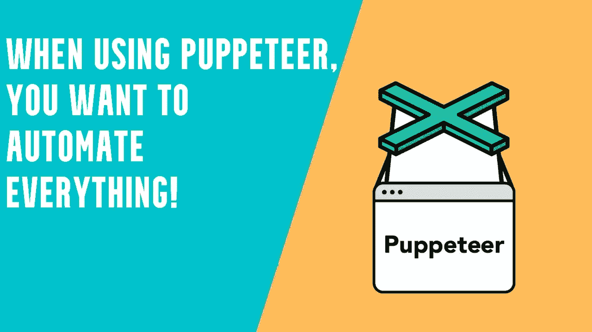
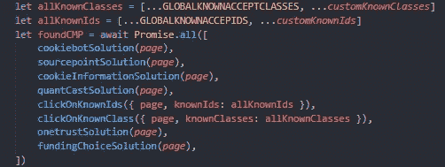

# 木偶师—单击所有 Cookie 弹出窗口

> 原文：<https://javascript.plainenglish.io/puppeteer-cookie-popup-click-a027ffe71ef7?source=collection_archive---------6----------------------->

## 如果你曾经使用过木偶师，你可能会遇到点击 cookie 弹出窗口部件的问题。我是来帮你的！

Puppeteer click popup

关于堆栈溢出，我读到过很多人在自动点击“未知”弹出窗口时遇到问题。您想要自动点击这些弹出窗口可能有各种各样的原因，但总体问题是一样的。

任何需要单击 cookie 同意弹出窗口的人都会出现此问题。这些通常被称为 CMP(同意管理平台)。在欧洲大部分地区，如果你想展示广告或以其他方式设置 cookies 来跟踪你的用户，这些都是法律要求。

最近，我需要为 100 多个网站动态点击这些同意弹出窗口，每个网站都可以独立地更改它们的 CMP。由于目前没有图书馆可以做到这一点，我决定开始创建自己的图书馆。

## **简介**

没有点击这些弹出窗口小部件的通用方法，因为有许多不同的实现方式。然而，我们想要点击的东西总是页面上的一些 HTML 元素。我还没有遇到过技术上不可能通过自动化点击的弹出窗口。

我以前写过如何让[木偶师与无服务器](https://awstip.com/serverless-puppeteer-on-aws-5162459a4c44)一起工作，因为我想自动化这一点，所以木偶师可以自动点击这些，我需要一种方法来指导木偶师如何点击这些。关于图书馆的细节可以进一步要求，我很乐意分享更多的细节。长话短说，我的木偶师“插件”的输出是这样的:

The CMP click result for 5 pages

为了达到上面的结果，我在这里创建了一个 npm 包:【https://www.npmjs.com/package/puppeteer-cmp-clicker

我是如何创建这个包的，在这里描述。基本的想法是，我希望人们做出贡献，所以不同的弹出窗口(主要是 CMP)和已知的 Id 和类选择器的“策略”的集合。目前，基本功能如下所示:

Known CMPs + ids and classes

目前，该库包含一个已知 CMP 的小列表，以及如何点击它们的特定策略。这可能是因为他们使用了 iframes 或其他“复杂”的结构。除此之外，id 选择器和类选择器的全局列表包含在包中。当您设置包时，这些列表是可扩展的，但是总的目标是在模块中包含尽可能多的已知策略、id 和类。

 [## GitHub-emil hein/puppet eer-cmp-clicker:单击 CMP 弹出窗口小部件的辅助函数

### 现在我只有一个功能 1。

github.com](https://github.com/emilhein/puppeteer-cmp-clicker) 

***将会更新。***

*更多内容请看*[***plain English . io***](https://plainenglish.io/)*。报名参加我们的* [***免费周报***](http://newsletter.plainenglish.io/) *。关注我们关于*[***Twitter***](https://twitter.com/inPlainEngHQ)*和*[***LinkedIn***](https://www.linkedin.com/company/inplainenglish/)*。查看我们的* [***社区不和谐***](https://discord.gg/GtDtUAvyhW) *加入我们的* [***人才集体***](https://inplainenglish.pallet.com/talent/welcome) *。*