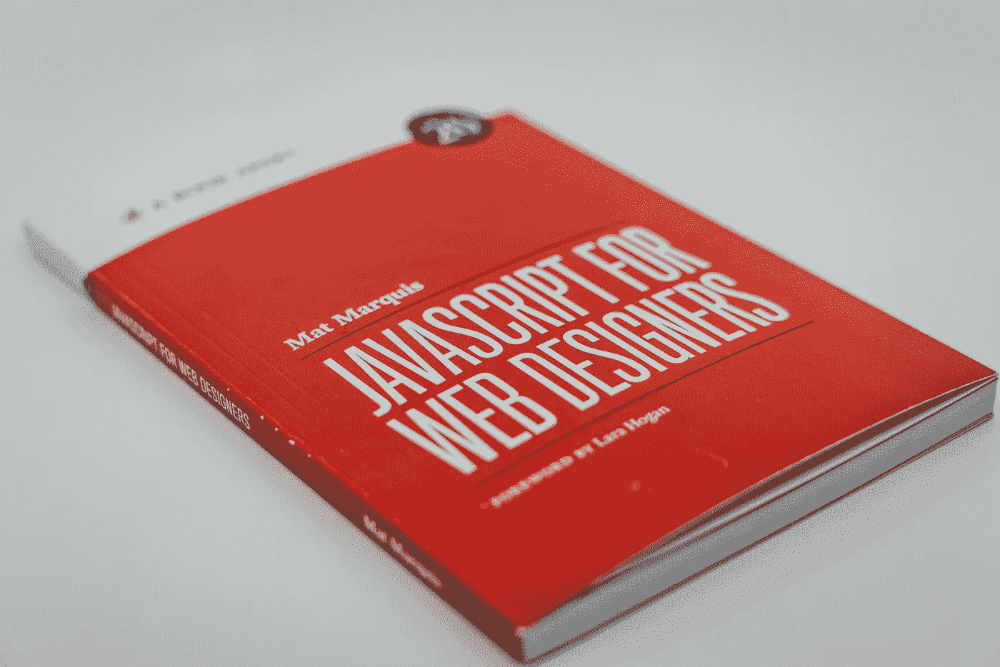

# JavaScript 中的纯函数和副作用——常见面试问题

> 原文：<https://javascript.plainenglish.io/pure-functions-and-side-effects-in-javascript-common-interview-questions-7e9db2487b91?source=collection_archive---------3----------------------->

## 理解 JavaScript 中纯函数和副作用的概念。最常见的面试问题。

Free Image of [Claudio Schwarz](https://unsplash.com/@purzlbaum) on [Unsplash](https://unsplash.com/photos/i25aqE_YUZs)

函数是 JavaScript 编程的基础。它为我们提供了一种通过减少代码重复来构建更大程序的方法。功能通常分为三类:

1.  因副作用而被调用的函数。
2.  因其返回值而被调用的函数。
3.  因副作用和返回值而被调用的函数。

# 副作用

简而言之，副作用是由我们的行为所产生的任何影响或反应。副作用最常见的例子有:

*   在控制台上书写
*   在屏幕上书写
*   修改外部/全局变量或属性

在良好的编程实践中，建议避免使用副作用。尽管如此，没有必要为使用它感到难过，因为副作用有时会有帮助。例如，在我们的应用程序中，经常需要使用发出 HTTP 请求的副作用。

## 例子

这里有一个例子来理解 JavaScript 的副作用。在这个例子中，我们将一些参数传递给名为 *printInventory()，*的函数，它将在控制台上记录这些数据，这在 JavaScript 中称为副作用。

# 纯函数

**纯函数**是 JavaScript 中特殊类型的产生值的函数，既不产生任何副作用，也不依赖于其他代码的副作用。例如，它不读取值可能改变的全局变量。*简单来说，如果一个函数对于相同的自变量产生相同的值，并且不做其他任何事情，那么你可以称之为* ***纯函数。***

## 优势

*   与直接执行副作用的函数相比，返回值的函数更容易以许多新的方式使用。
*   这种函数的另一个好处是它比非纯函数更容易测试。您可以通过简单地调用它来测试它，并确保如果它在该上下文中正常工作，它将在任何上下文中工作。

## 例子

这里有一个例子来理解纯函数在 JavaScript 中的定义和行为。示例中的 *discountedValue* 函数是一个纯函数，因为它既不使用/更改任何全局绑定，也不执行任何其他副作用，只是返回值。另一个函数 *printPrice* 使用 pure 函数返回的值在控制台上生成打印日志的副作用。

# 结论

文章的主要目的是帮助你理解 JavaScript 中副作用和纯函数的含义，这是面试中经常被问到的问题。请喜欢这篇文章，关注我并保持更新，以了解更多像这样有趣的东西。感谢您阅读这篇文章。

 [## 通过我的推荐链接加入 Medium-Yagnik Kardani

### 作为一个媒体会员，你的会员费的一部分会给你阅读的作家，你可以完全接触到每一个故事…

medium.com](https://medium.com/@kardaniyagnik/membership)  [## Yagnik Kardani 正在创建帮助他人成长的技术学习材料。

### 你好👋，我是一名媒体方面的技术作家。我喜欢学习并帮助他人在软件开发和云计算方面成长…

www.buymeacoffee.com](https://www.buymeacoffee.com/kardaniyagnik) 

*更多内容请看*[***plain English . io***](https://plainenglish.io/)*。报名参加我们的* [***免费周报***](http://newsletter.plainenglish.io/) *。关注我们关于*[***Twitter***](https://twitter.com/inPlainEngHQ)*和*[***LinkedIn***](https://www.linkedin.com/company/inplainenglish/)*。查看我们的* [***社区不和谐***](https://discord.gg/GtDtUAvyhW) *加入我们的* [***人才集体***](https://inplainenglish.pallet.com/talent/welcome) *。*