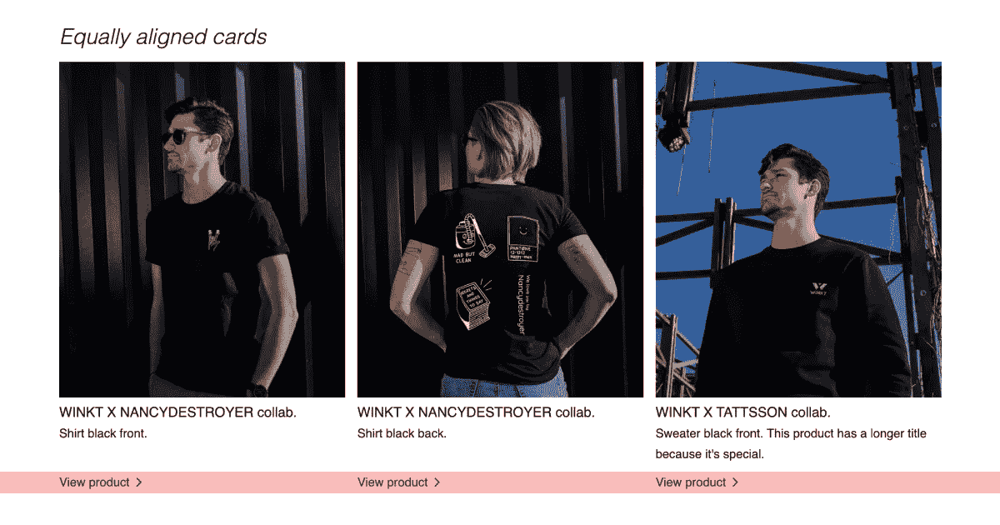
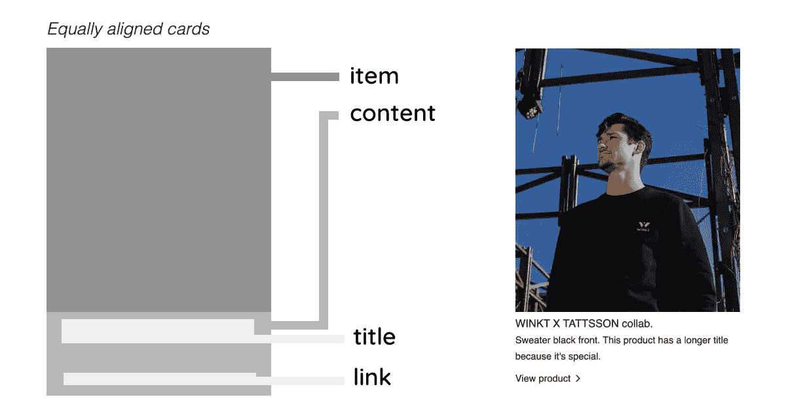
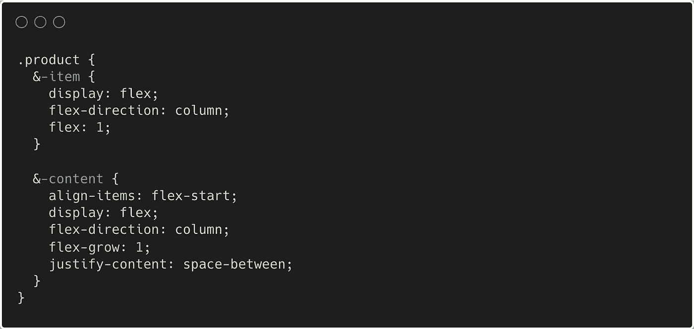

# 纯 HTML/CSS 系列:相等的列高

> 原文：<https://javascript.plainenglish.io/pure-html-css-series-equal-column-height-1087bb442b22?source=collection_archive---------13----------------------->

## 你准备好迎接纯 HTML/CSS 挑战了吗？

Nicely aligned links within product cards

欢迎来到本系列的第二篇文章。今天，我们将了解一种在卡片内对齐元素的方法。你可以在上面的图片中看到结果，链接(以红色突出显示)完全对齐。我见过 JavaScript 实现无数次；有一个通过所有标题的循环，最高标题高度被计算并应用于所有标题。这可能会导致界面出现故障。幸运的是，有一种方法可以在纯 CSS 中解决这个问题；我们开始吧！

**实现** 让我们通过下图来看看实现情况:

Structure of the cards

这里的魔字是`flexbox`。让我们来看看造型的重要部分:

Most relevant pieces of styling the equal columns

诀窍是对*项*和*内容*都应用一个`display: flex`和一个`flex-grow: 1`。这确保了*项目*和*内容*占据整个可用高度，从而对齐内容。通过设置`justify-content: space-between`将*内容*中的*标题*和*链接*推到*内容* div 的顶部和底部。

> `flex: 1`简写确保项目可以增长和收缩，并且`flex-basis`被设置为平均分配项目。

您可以在 CodePen 上查看完整的实现:

我希望你觉得这篇文章有用，并喜欢它。如果您想了解更多，请查看第一篇纯 HTML/CSS 文章，在这篇文章中，我们创建了一个 Read More-Less:

 [## 纯 HTML/CSS 系列:阅读更多-更少的功能

### 你准备好迎接纯 HTML/CSS 挑战了吗？](/pure-html-css-series-read-more-less-functionality-1237bc30066) 

*更多内容请看*[***plain English . io***](https://plainenglish.io/)*。报名参加我们的* [***免费每周简讯***](http://newsletter.plainenglish.io/) *。关注我们关于*[***Twitter***](https://twitter.com/inPlainEngHQ)*和*[***LinkedIn***](https://www.linkedin.com/company/inplainenglish/)*。加入我们的* [***社区不和谐***](https://discord.gg/GtDtUAvyhW) *。*