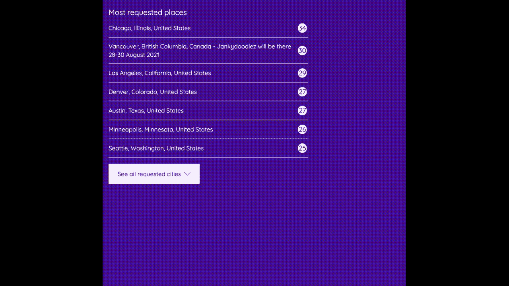
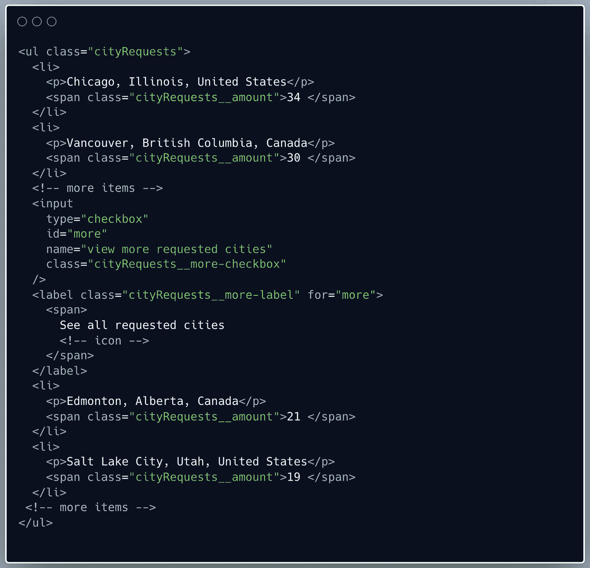
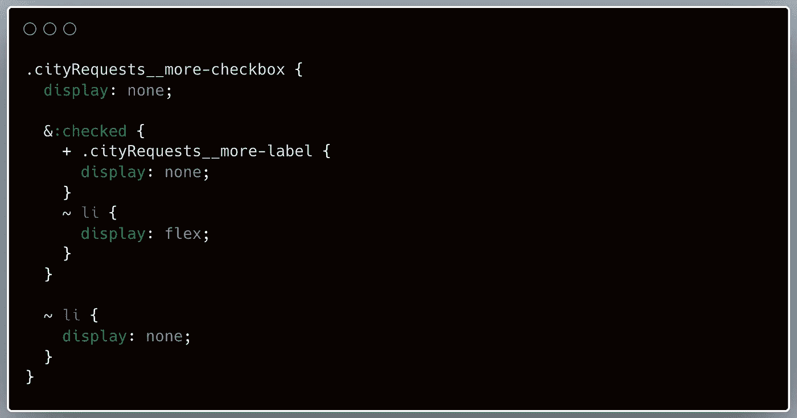

# 纯 HTML/CSS 系列:阅读更多-更少的功能

> 原文：<https://javascript.plainenglish.io/pure-html-css-series-read-more-less-functionality-1237bc30066?source=collection_archive---------8----------------------->

你准备好迎接纯 HTML/CSS 挑战了吗？

在这个系列中，我想用普通的 HTML 和 CSS 创建一些常见的 web 元素。为什么？有人可能会问。首先，我喜欢挑战，我认为在你的 HMTL/CSS 基础上工作很好。除此之外，并不是所有的项目都是用现代 JavaScript 框架构建的，在这些情况下，我相信我们有时会过快地默认基于 JavaScript 的解决方案。下面这张图片展示了我们要做的东西:

Read more functionality

让我们来看看 HTML 是如何构造的。

HTML structure read more functionality

请注意,“阅读更多按钮”由一个复选框和一个标签组成。当我们点击标签时，复选框输入将被选中(由标签上与输入的 *id* 匹配的的*完成)。默认情况下，我们将隐藏复选框后的所有< li >元素。选中“阅读更多”复选框后，我们隐藏“阅读更多按钮”并显示所有< li >元素。这样，我们就有效地创建了我们的阅读更多功能。让我们来看看 CSS 的(重要部分)。*

Styling bits of the read more functionality

CSS 清楚地显示复选框后的

*   元素是隐藏的。当复选框被选中时，它们被显示(带显示伸缩)。当复选框被选中时，我们隐藏标签(样式为 button ),因为不再需要它。

仅此而已！但是等等，我们的“少读”功能发生了什么变化？不用担心，HTML/CSS 来拯救！

“少读”的诀窍是将复选框和标签(样式为按钮)放在所有隐藏的

*   元素之前。这样，我们可以反过来应用相同的逻辑:当‘read less’复选框被选中时，我们隐藏‘read less’复选框后的所有*   元素。然后，使用 flexbox，我们可视地重新排列项目，以便我们的“少读”按钮出现在底部。

你可以在 CodePen 上查看完整的代码示例[。](https://codepen.io/wendydev/pen/BamKGvP)

你有使用 HTML/CSS“破解”的 web 元素吗？或者你希望看到更多的网页元素只用 HTML 和 CSS 来解决？很想听听你的想法。

*更多内容请看*[***plain English . io***](https://plainenglish.io/)*。报名参加我们的* [***免费周报***](http://newsletter.plainenglish.io/) *。关注我们关于*[***Twitter***](https://twitter.com/inPlainEngHQ)*和*[***LinkedIn***](https://www.linkedin.com/company/inplainenglish/)*。加入我们的* [***社区不和谐***](https://discord.gg/GtDtUAvyhW) *。*