# 使用 React 和 Firebase 推送通知

> 原文：<https://javascript.plainenglish.io/push-notifications-with-react-and-firebase-8f7cf9372ac7?source=collection_archive---------1----------------------->

## 如何接收推送通知


Photo by [Volodymyr Hryshchenko](https://unsplash.com/@lunarts?utm_source=unsplash&utm_medium=referral&utm_content=creditCopyText) on [Unsplash](https://unsplash.com/s/photos/notifications?utm_source=unsplash&utm_medium=referral&utm_content=creditCopyText)

推送通知是发送到用户设备或 web 应用程序的小型弹出消息，即使在应用程序未打开时也会出现。他们可以提醒实时更新或改变他们即将到来的计划，预订，交付和其他时间敏感的话题。

因此，我对如何轻松地将接收推送通知添加到我们的 web 应用程序很感兴趣。在今天的教程中，我将通过[Firebase Cloud Messaging(FCM)](https://firebase.google.com/products/cloud-messaging?gclid=Cj0KCQjw4omaBhDqARIsADXULuXjc3usXl7wxVaW_mdNdiv6CLc5p_lCc7Atsz_V6Icjg62Atj5WLmkaAqmKEALw_wcB&gclsrc=aw.ds)来完成。它是一个跨平台的消息传递解决方案，可以让您可靠地免费发送消息。

让我们开始一起做吧。

# 设置项目

首先，我将通过以下代码行创建一个新的 React 项目:

```
npx create-react-app firebase-push-notifications
cd firebase-push-notifications
npm run start
```

太好了，我们已经成功创建并发布了我们的 web 应用程序。

# 创建简单的 Web 应用程序

在用初始代码库创建了项目之后，我们有了主页面的`src/App.js`文件。我们需要更新它，使它看起来像这样:

我已经使用了`[react-toastify](https://www.npmjs.com/package/react-toastify)`烤面包机库来显示通知。您可以通过以下命令安装它:

```
npm install --save react-toastify
```

它看起来是这样的:

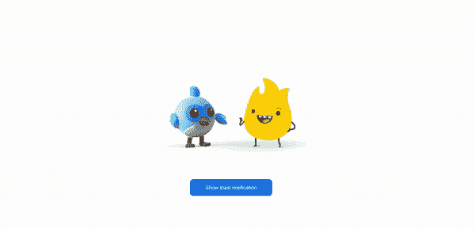

Main Page

# Firebase 设置

如果你还没有在`[Firebase](https://firebase.google.com)`的账户，你应该创建一个。成功创建帐户后，您将被重定向到`[Firebase Console](https://console.firebase.google.com)`，在那里您可以通过点击`Create a project`按钮并填写必填字段来创建一个项目。

如果您之前已经创建了一个项目，您将拥有一个项目卡片列表。这种情况下，需要点击`Add project`新建一个。

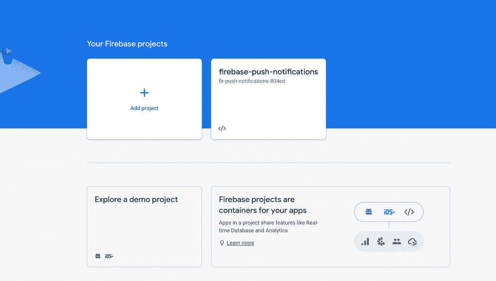

Create a project

点击`Add project`后，我们需要给项目起一个合适的名字。

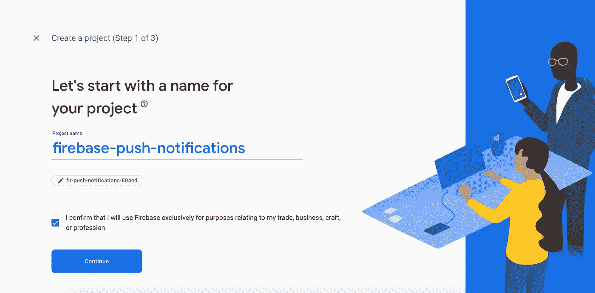

Project name

然后，我们必须根据您的偏好启用或禁用分析。

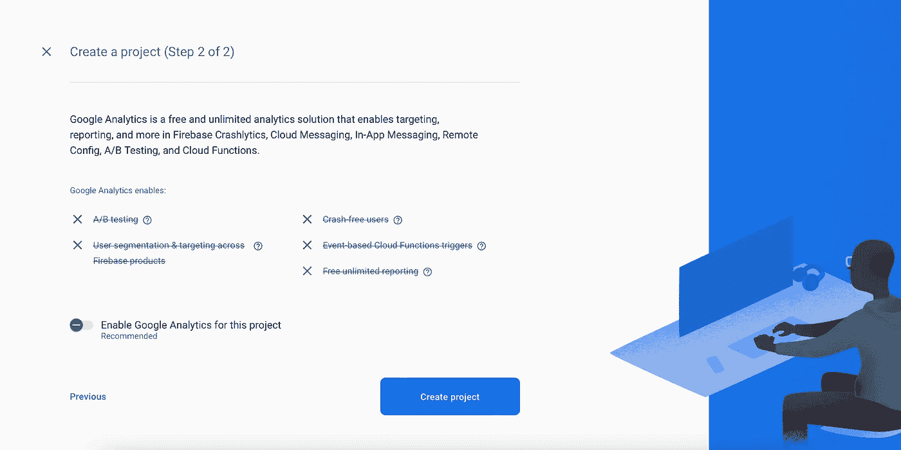

Project analytics

太棒了，我们做到了。这里我们有`iOS`、`Android`和`<>`网络选项。

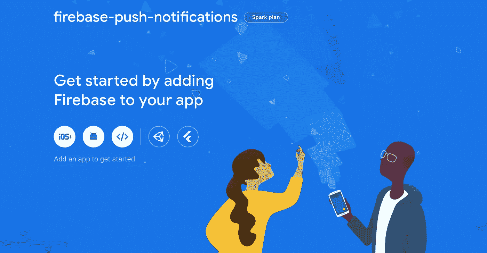

Project created

接下来，我们需要通过点击 web 选项`<>`按钮向 firebase 项目注册我们的 web 应用程序。然后它会生成一个 firebase 配置文件，我们很快会将它集成到 React 应用程序中。

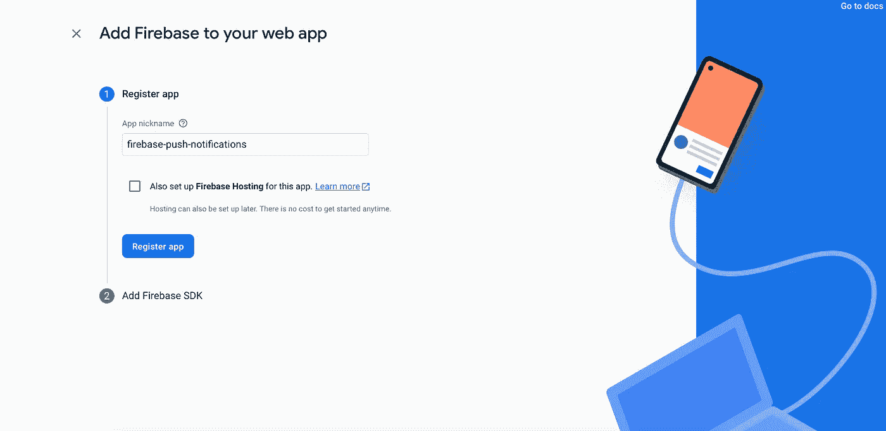

Register app

让我们使用`firebase-push-notifications`昵称。

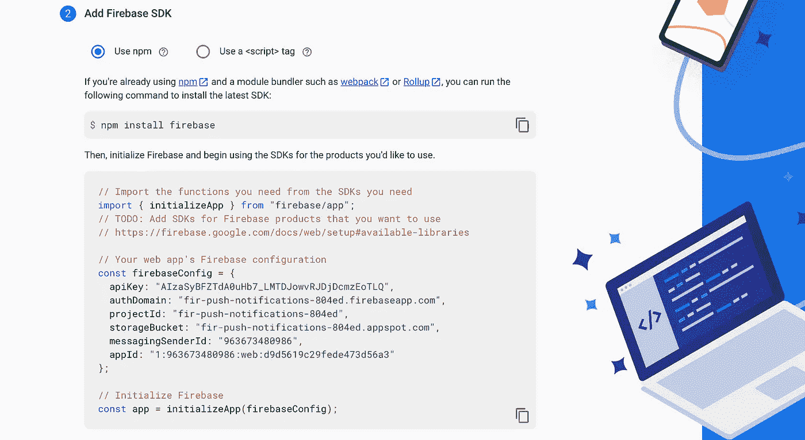

Firebase config

`firebaseConfig`将被集成到我们的 React 应用程序中，这将把它链接到这个特定的 Firebase 项目。

# 连接到 Firebase 云消息

为了连接到`Firebase Cloud Messaging`,我们需要通过运行以下命令来安装`[firebase](https://www.npmjs.com/package/firebase)`库:

```
npm install --save firebase
```

接下来，我将创建一个名为`firebase.js`的新文件，并添加以下代码行:

最后但同样重要的是，我们将创建一个名为`getFirebaseToken`的函数，它使用 Firebase `getToken`方法。这允许您接收推送通知。如果没有授予通知权限，此方法将请求用户授予通知权限。否则，它会返回令牌或因错误而拒绝承诺。

`getToken`方法需要参数。

**1。自愿应用服务器标识或无效密钥**

你可以在 Firebase 控制台中点击项目的`Project overview > Project settings > Cloud Messaging`，然后滚动到`Web configuration`部分。之后，您只需点击`Web Push certificates`选项卡中的`Generate key pair`即可。

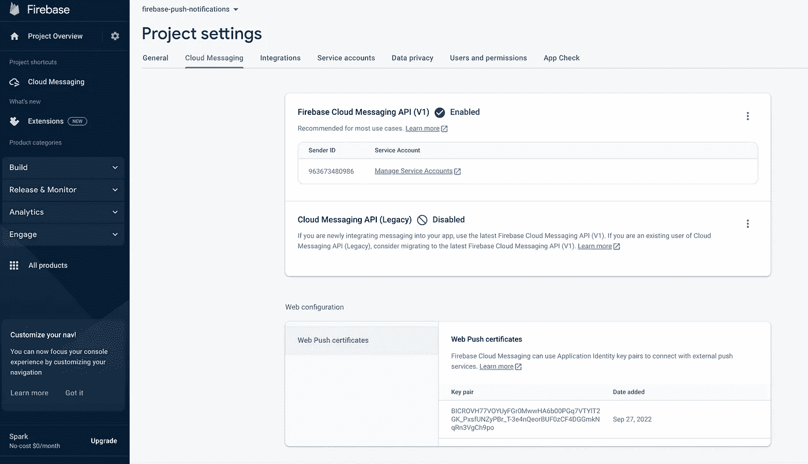

VAPID key

**2。服务人员注册**

我们将使用服务人员来处理推送通知。`[Service worker](https://developer.mozilla.org/en-US/docs/Web/API/Service_Worker_API/Using_Service_Workers)`是一个无需用户交互，在浏览器后台运行的脚本。我们现在没有服务人员，但是我们将在下一部分创建一个。

上面，我创建了一个`getOrRegisterServiceWorker`方法来尝试获取服务工作者，如果它存在，否则它将注册一个新的。

此外，我将在页面顶部添加一个横幅，以显示通知的权限。

我们检查了`Notification.permission`属性，该属性指示用户授予的显示 web 通知的当前权限。如果我们点击`enable push notifications`，它将获得一个 firebase 令牌并隐藏横幅。

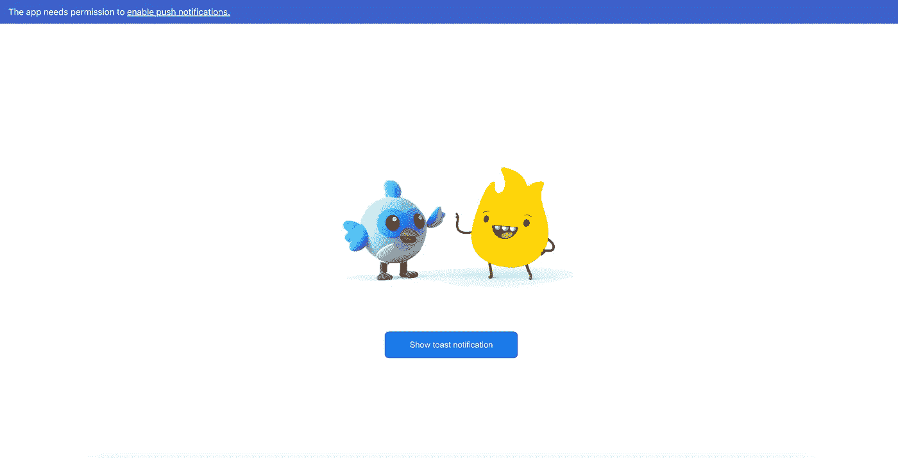

Notification permission banner

太好了，我们快完成了。

# 接收推送通知

## 在后台接收消息

为了在后台接收推送通知，我们应该使用以下代码在 React 应用程序的公共文件夹中创建一个`firebase-messaging-sw.js`服务工作者文件:

该服务人员将在后台处理应用程序收到的所有通知。

## 在前台接收消息

对于前台通知，我们需要将这段代码添加到`firebase.js`文件中:

最后，我们需要使用`App.js`文件中的`onForegroundMessage`:

现在我们可以在 React 应用程序中接收前台和后台通知了！

# 让我们测试我们的推送通知

我们可以去`Firebase Console > Cloud Messaging > Send First Message`测试。

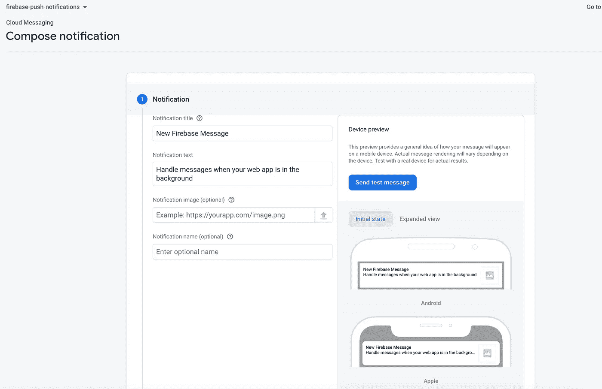

Send test message

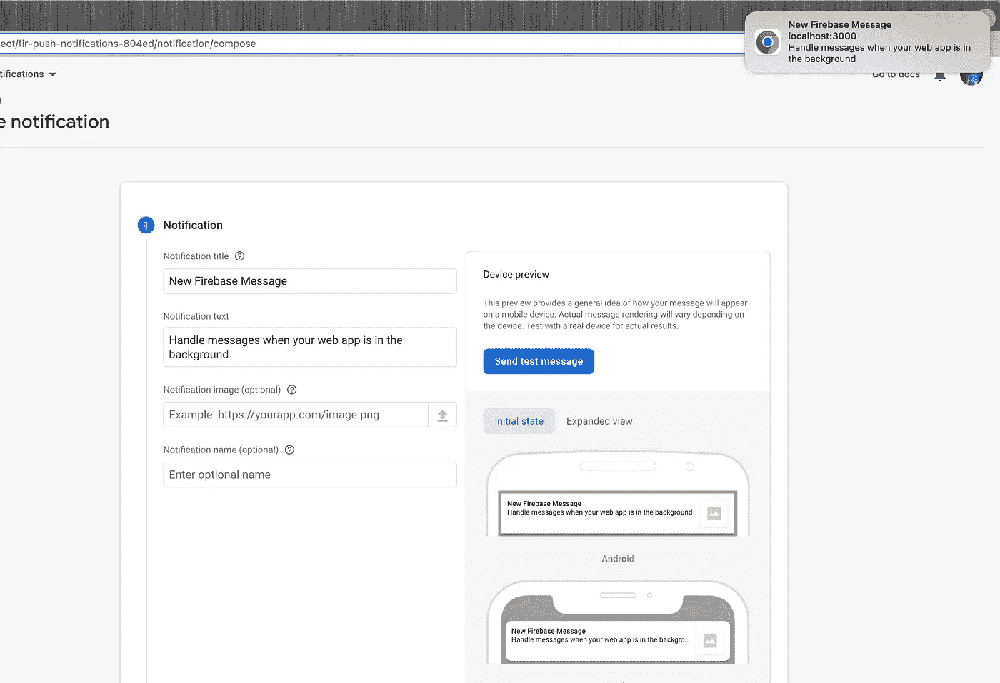

Background push notification

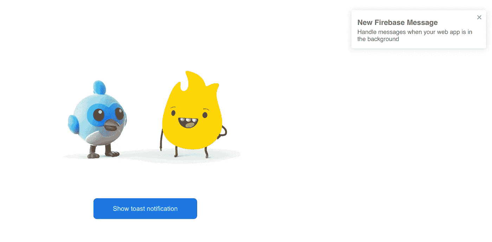

Foreground push notification

如果你想查看全部代码，这里有 [GitHub](https://github.com/Gapur/firebase-push-notifications) 的链接。

# 结论

感谢阅读——我希望这篇文章对你有用。编码快乐！

# 资源

[](https://blog.logrocket.com/push-notifications-react-firebase/) [## 使用 React 和 Firebase - LogRocket 博客推送通知

### 编者按:本文于 2022 年 3 月 17 日更新，包含了 Firebase 的最新变化。Firebase 是一个…

blog.logrocket.com](https://blog.logrocket.com/push-notifications-react-firebase/)  [## 在 JavaScript 客户端接收消息| Firebase 云消息

### 编辑描述

firebase.google.com](https://firebase.google.com/docs/cloud-messaging/js/receive) [](https://www.audreyhal.com/blog/push-notifications-with-firebase-in-react) [## React.js 中使用 Firebase 推送通知

### 推送通知是由应用程序“推送”到用户设备的提醒，即使这些应用程序没有打开。在…

www.audreyhal.com](https://www.audreyhal.com/blog/push-notifications-with-firebase-in-react) 

*更多内容看* [***说白了就是 io***](https://plainenglish.io/) *。报名参加我们的* [***免费周报***](http://newsletter.plainenglish.io/) *。关注我们关于* [***推特***](https://twitter.com/inPlainEngHQ) ， [***领英***](https://www.linkedin.com/company/inplainenglish/) *，*[***YouTube***](https://www.youtube.com/channel/UCtipWUghju290NWcn8jhyAw)*[***不和***](https://discord.gg/GtDtUAvyhW) *。对增长黑客感兴趣？检查* [***电路***](https://circuit.ooo/) *。**