# 将东西放在一起 GatsbyJS 页面的 CI/CD 管道

> 原文：<https://javascript.plainenglish.io/putting-things-together-ci-cd-pipeline-for-gatsbyjs-page-870f68151b77?source=collection_archive---------10----------------------->


Photo by [Markus Spiske](https://unsplash.com/@markusspiske?utm_source=medium&utm_medium=referral) on [Unsplash](https://unsplash.com?utm_source=medium&utm_medium=referral)

我邀请你和我一起体验一下 GatsbyJS 框架，结合 Auth0 认证服务，用 CodeceptJS 进行端到端测试。通过基于 GitHub 动作的 CI/CD 管道，所有东西都变得活跃起来，将页面交付给 Gatsby Cloud。

由于这样一个实验的范围可以很容易地从一篇博客文章变成书籍材料，我将触及每一篇文章的最基本部分。我将把重点放在把事情联系在一起，形成一个可行的概念证明，作为进一步实验的基础。我的主要目标是了解整个系统如何以最少的功能作为完全集成的堆栈协同工作。

尽管我使用了上面提到的框架和服务，这里的想法应该很容易适用于任何其他类型的网页——认证服务 here 测试设置。

你可以在这个回购里找到一个[的工作实例。](https://github.com/jploskonka/gatsby-auth0-codeceptjs)

# Auth0 设置

让我们从三个不同的 Auth0 租户(开发、测试、生产)开始，每个租户都有一个应用程序。

在开发和测试中，只允许他们使用用户名/密码登录方法。在生产，这将是谷歌，但没有用户名/密码。这将带来一个额外的挑战去解决，开启了一个有趣的解决方案的可能性。当您无法让测试环境 100%模拟生产环境时，您如何确保生产环境仍然正常运行？但是，让我们暂时把它放在一边…

为了了解更多关于 Auth0 租户的信息，我邀请您查看文档。正如它所说:

> 一切都始于 Auth0 租户。

登录到您的 Auth0 帐户([或创建一个](https://auth0.com/signup))并从顶部栏的下拉菜单中选择`Create tenant`选项。

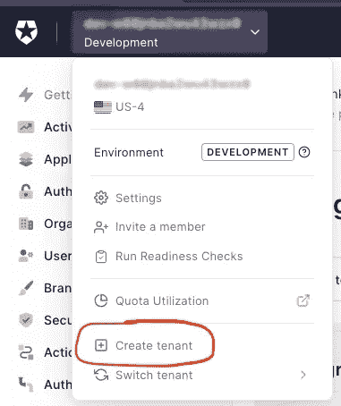

让我们创建三个租户，使用以下域和环境标记:

*   带有环境标签`Development`的域名`gatsby-auth0-codecept-dev`
*   带环境标签的域名`gatsby-auth0-codecept-test``Staging`
*   带有环境标签`Production`的域`gatsby-auth0-codecept-prod`

现在，对于每一个租户，我们都需要一个应用程序。从`Development`一个开始。确保您使用下拉菜单中的`Switch tenant`选项选择了合适的租户。然后在左侧菜单中选择`Applications`

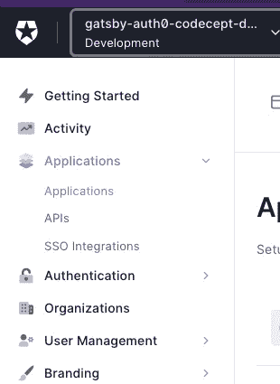

`Default app`已经在列表中，从下拉菜单中选择`Settings`即可。

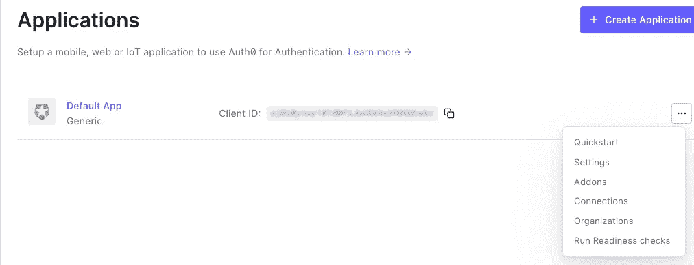

这里需要做一些改动:

*   把应用程序的名字改成有意义的，对我来说是`Gatsby Auth0 Codecept Dev`。
*   你会在名字下面找到`Domain`和`Client ID`字段。我们以后再去找他们。
*   然后在`Application Type`中选择`Single Page Application`。
*   在`Application URIs`部分输入以下内容:
    —应用程序登录 URI:留空
    —允许的回调 URL:`[http://localhost:8000](http://localhost:8000`)`
    —允许的注销 URL:`[http://localhost:8000](http://localhost:8000`)`
    —允许的 web 源:`[http://localhost:8000](http://localhost:8000`)`

点击底部的`Save changes`按钮。

## 禁用通过 Google 登录

我们在开发中不需要这个，再加上我想在`dev` & `production`环境中有一些区别。转到`Connections`选项卡，并解开`google-oauth2`

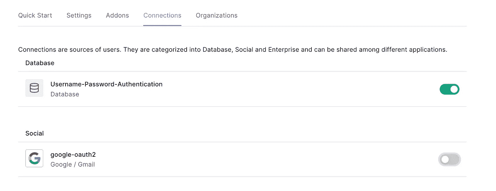

## 测试用户

转到左侧菜单中的`User Management -> Users`，然后转到`Create user`。输入凭证，点击`create`。

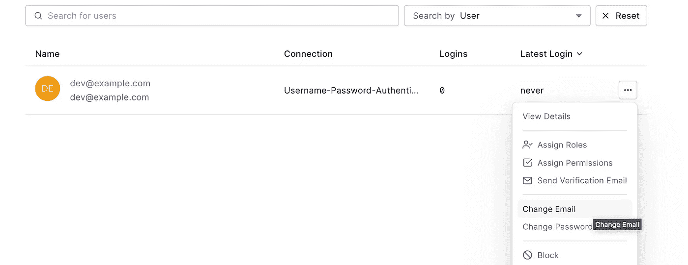

然后点击`Change email`选项和`Set email as verified`。

## 设置*-测试*租户

整个过程需要重复，只有一点不同 URLs 中使用的端口将是`9000`而不是`8000`，所以:

*   应用名称:`Gatsby Auth0 Codecept Test`。
*   然后在`Application Type`中选择`Single Page Application`。
*   在`Application URIs`部分输入以下内容:
    —应用程序登录 URI:留空
    —允许的回调 URL:`[http://localhost:9000](http://localhost:8000`)`
    —允许的注销 URL:`[http://localhost:9000](http://localhost:8000`)`
    —允许的 web 源:`[http://localhost:9000](http://localhost:8000`)`
*   google-oauth2 已禁用
*   记得创建一个测试用户，使用与`dev`不同的凭证

## 设置“生产”租户

这将在以后，因为我们还不知道网址。

# GatsbyJS 设置

使用他们最简单的入门模板创建一个新的 gatsby 项目:

```
$ npm init gatsby
```

脚本会询问你应用程序的名称，存储代码库的目录，如果你想使用 JavaScript 或 TypeScript，如果你想获得任何额外的功能或插件。我将使用 JavaScript，不添加任何内容。

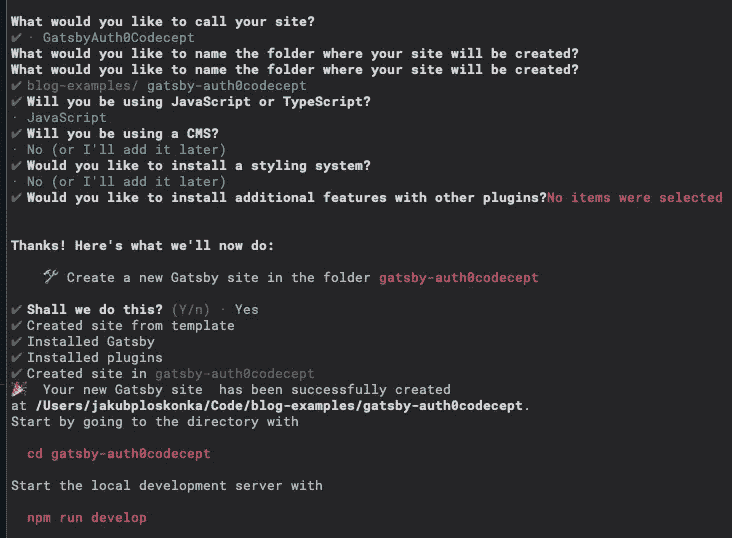

好了，让我们进入创建的目录，看看那里有什么:

```
$ cd gatsby-auth0codecept
$ tree -CI 'node_modules' # -C for colors, -I for ignore
# output:
.
├── README.md
├── gatsby-config.js
├── package-lock.json
├── package.json
└── src
 ├── images
 │ └── icon.png
 └── pages
 ├── 404.js
 └── index.js
3 directories, 7 files
```

我想你不能再简单了。两页(`index.js`和`404.js`)，一张图片(`icon.png`)，基本`gatsby-config.js`。

让我们现在运行它，并在 web 浏览器中查看它:

```
$ npm run develop
# now open localhost:8000 in your browser
```

您将看到一个包含大量链接的页面:

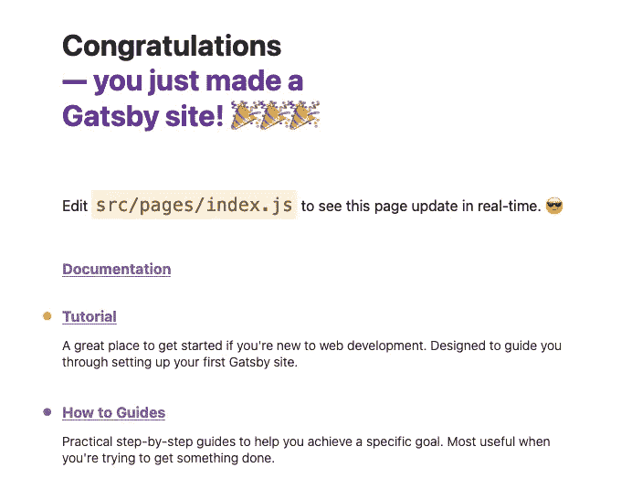

它非常简洁漂亮，但是对于这个例子来说，它仍然有多余的代码。让我们把`frontend/src/pages/index.js`文件变成一个更简单的形式:

```
import * as React from "react"

const IndexPage = () => {
  return (
    <main>
      <h1>
        Hello world
      </h1>
    </main>
  )
}

export default IndexPage
```

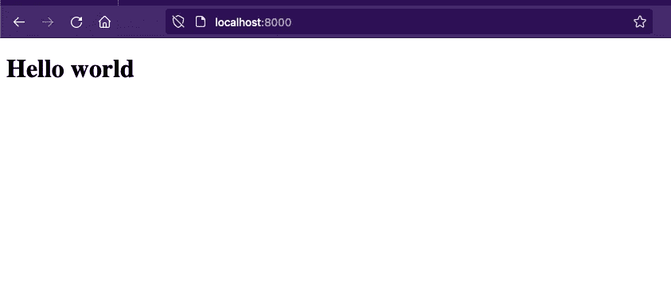

**好多了！**

# CodeceptJS 安装程序

让我们用高层次的规范来描述对页面进化的渴望。从添加`codeceptjs` 和`playwright`依赖项开始。

这里出现的第一个问题是——端到端测试放在哪里？在单个应用程序的世界中，最常见的方法是将它们放在应用程序所在的根目录中。将依赖关系放在同一个`package.json`文件中，并将测试和 web 应用程序视为一件事情。

这种方法非常适合这个演示规模的项目。考虑到现实世界，我建议将测试和应用程序视为独立的个体。有一组独立的依赖项，甚至可能存在于由不同团队维护的独立存储库中。

我不会在这里进行单独的回购(端到端测试的多回购设置是一个值得单独发布的主题)，但我将用两个主要目录来构建项目:`frontend`和`e2e`。

从把盖茨比应用程序移到`frontend`目录开始:

```
$ mkdir frontend
$ mv * frontend # move all visible files
$ mv .cache .gitignore frontend # move hidden files too
```

并在`e2e`目录中设置 CodeceptJS:

```
$ mkdir e2e
$ cd e2e
$ npm init -y # initialize npm package
$ npm add codeceptjs playwright
$ npx codeceptjs init
```

最后一个命令让您获得一个交互式项目启动器，类似于我们在 GatsbyJS 中看到的。它会问你一堆选择:

*   JS vs TS:这里用 JS
*   测试位置:按`Enter`获得默认值
*   要使用的助手:选择`Playwright`
*   对于日志、截图和报告位置:按`Enter`获取默认值
*   待测试页面的网址:`[http://localhost:8000](http://localhost:8000`)`
*   显示浏览器窗口:`Yes`
*   我们测试的浏览器:`chromium`很好

在初始设置之后，将会出现关于第一个要测试的特性的问题。我将使用`User authentication`和测试的默认文件名— `User_authentication_test.js`。

让我们看看我们从发电机里得到了什么:

```
$ ls -l | awk { 'print $9' } # print out filenames only

# output:
User_authentication_test.js
codecept.conf.js
jsconfig.json
node_modules
output
package-lock.json
package.json
steps.d.ts
steps_file.js
```

有道理，我要稍微清理一下:

```
$ rm jsconfig.json steps.d.ts steps_file.js # I won't use those files anyway
$ mkdir tests # I don't like `_test.js` files living in root dir
$ mv User_authentication_test.js tests
```

同时添加`dotenv`包，从`.env`文件中读取环境变量。我们将把用户凭证指定为 env 变量，这样会使开发体验稍微好一点。

```
$ npm install dotenv
```

之后`codecept.conf.js`需要一些调整:

```
// ...
// Gatsby comes with `dotenv` setup out of the box, 
// codecept needs this line to pick up `.env` files
require('dotenv').config();

exports.config = {
 // this changed to include `tests` directory
  tests: './tests/*_test.js', 
  output: './output',
  helpers: {
    Playwright: {
      // URL will differ in CI, so let's have a way to customize it
      url: process.env.TEST_PAGE_URL || 'http://localhost:8000',
      show: true,
      browser: 'chromium',
      waitForTimeout: 5000, // increase from default 1s
    }
  },
  include: { 
    // steps_file is removed
  },
  name: 'e2e'
}
```

## TDD 用户认证

打开`User_authentication_test.js`文件，描述认证是如何工作的:

```
Feature('User authentication');

// URLs that will be used in tests. I don't like using URLs directly in tests,
// for both readability and changeability
const rootUrl = '/'
const afterLoginUrl = '/'
const afterLogoutUrl = '/'

// I'll need to have some user credentials to test authentication with.
// This may differ in dev/test environments so will be provided
// as environment variables
const user = {
  login: process.env.TEST_USER_LOGIN,
  pass: process.env.TEST_USER_PASS
}

// In real world this function would either live in a custom steps file,
// or in some page object file. For this example, I'll keep it here.
const login = async (I, user) => {
  const acceptBtn = `button[value=accept]`

  I.click(`Log in`)
  I.fillField(`username`, user.login)
  I.fillField(`password`, secret(user.pass))
  I.click(`Continue`)

  // when user logs in for the first time with Auth0 account, they need to
  // authorize the app to access their account.
  const needsAuthorization = await I.grabNumberOfVisibleElements(acceptBtn) > 0
  if (needsAuthorization) { I.click(acceptBtn) }

  I.waitForText(`Log out`) // wait for page to load
}

// Scenario messages in such a test are perfect documentation of the project.
// Don't be afraid to get verbose here.
Scenario(`User logs in and lands on ${afterLoginUrl} page.`, async ({ I }) => {
  I.amOnPage(rootUrl)
  await login(I, user)

  I.see(user.login)
  I.seeCurrentUrlEquals(afterLoginUrl)
})

// One may say let's have this as one scenario where a user logs in, then logs
// out. It could work out, but if such a scenario fails it's hard to identify
// which part is broken.
Scenario(`User logs out and lands on ${afterLogoutUrl}`, async ({ I }) => {
  I.amOnPage(rootUrl)
  await login(I, user)

  I.click(`Log out`)
  I.waitForText(`Log in`)
  I.seeCurrentUrlEquals(afterLogoutUrl)
  I.dontSee(user.login)
})
```

然后将 Auth0 中创建的用户的凭证放入`e2e/.env`文件中:

```
TEST_USER_LOGIN=dev-user@example.com
TEST_USER_PASS=dev-user-password
```

注意:对于 GatsbyJS，这个文件叫做`.env.development`，这里只是`.env`。

重述登录—用户打开一个页面并点击`Log in`按钮。然后输入他们的凭证，我们期待重定向回来。此外，他们的电子邮件现在应该是可见的，连同`Log out`按钮。

注销——流程以同样的方式开始，因此用户打开页面，*登录*。然后点击`Log out`按钮。现在，应该不会再看到他们的电子邮件，应该会出现`Log in`按钮。

确保您的 Gatsby dev 服务器运行在`frontend`目录中，并运行测试。

```
# in frontend dir
$ npm run develop
# in e2e dir
$ npx codeceptjs run --steps
```

浏览器会闪烁一会儿，这两个场景都会失败，因为页面上缺少了`Log in`链接。让我们修理它。

# 把东西放在一起

使这些测试变绿的最小页面，在`frontend/src/pages/index.js`中:

```
import * as React from "react"
import { useAuth0 } from "@auth0/auth0-react"

const IndexPage = () => {
  // line below is added
  const { loginWithRedirect, isAuthenticated, user, logout } = useAuth0()

  return (
    <main>
      <h1>
        Hello world
      </h1>

      // below block is added
      { isAuthenticated ? 
        <div>
          {user.email}<br />
          <button onClick={() => logout({ returnTo: window.location.origin })}>
            Log out
          </button>
        </div>
        :
        <button onClick={() => loginWithRedirect()}>
          Log in
        </button>
      }
    </main>
  )
}

export default IndexPage
```

当然，要实现这一点，我们需要在`frontend`应用中添加`@auth0/auth0-react`包:

```
$ npm install @auth0/auth0-react
```

页面也需要用`Auth0Provider`包裹，所以添加`frontend/gatsby-browser.js`文件:

```
import React from "react";
import { Auth0Provider } from "@auth0/auth0-react";
import { navigate } from "gatsby";

const onRedirectCallback = (appState) => {
  navigate(`/user`);
}

export const wrapRootElement = ({ element }) => (
  <Auth0Provider
    domain={process.env.GATSBY_AUTH0_DOMAIN}
    clientId={process.env.GATSBY_AUTH0_CLIENT_ID}
    redirectUri={window.location.origin}
    onRedirectCallback={onRedirectCallback}
  >
    {element}
  </Auth0Provider>
)
```

并添加具有 Auth0 域&客户端 ID 的`frontend/.env.development`文件:

```
GATSBY_AUTH0_DOMAIN="foo"
GATSBY_AUTH0_CLIENT_ID="bar"
```

立即运行测试，享受绿色信息。

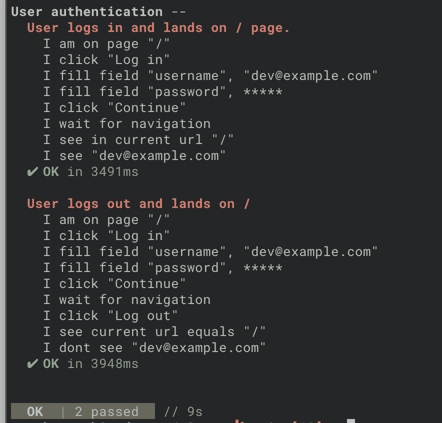

# 设置 CI-GitHub 操作

创建新的 GitHub repo，提交并推送到目前为止创建的代码。确保没有`.env*`和其他框架文件在版本控制下:

```
# .gitignore 
.env*
node_modules/
.cache/
frontend/public
e2e/output
```

将 git remote 添加到 repo 并推送`main`分支:

```
$ git remote add origin git@github.com:REPO_URL_FROM_GITHUB.git
$ git push -u origin main
```

然后在`.github/workflows/e2e.yml`创建 GitHub 动作配置文件:

```
# .github/workflows/e2e.yml
name: e2e tests
on:
  push:

env:
  HEADLESS: true
  TEST_PAGE_URL: http://localhost:9000
  TEST_USER_LOGIN: ${{ secrets.TEST_USER_LOGIN }}
  TEST_USER_PASS: ${{ secrets.TEST_USER_PASS }}
  GATSBY_AUTH0_DOMAIN: ${{ secrets.GATSBY_AUTH0_DOMAIN }}
  GATSBY_AUTH0_CLIENT_ID: ${{ secrets.GATSBY_AUTH0_CLIENT_ID }}

jobs:
  test:
    runs-on: ubuntu-latest
    steps:
      - uses: actions/checkout@v2

      - name: setup nodejs
        uses: actions/setup-node@v2
        with:
          node-version: 18.0.0

      - name: frontend - npm install
        working-directory: frontend
        run: npm install

      - name: frontend - build page
        working-directory: frontend
        run: npm run build

      - name: frontend - serve page in the background
        working-directory: frontend
        run: npm run serve &

      - name: e2e - npm install
        working-directory: e2e
        run: npm install

      - name: e2e - run tests
        working-directory: e2e
        run: |
          # wait for webserver to be running before starting tests
          while ! nc -z localhost 9000; do   
            echo "Waiting for webserver..."
            sleep 0.5
          done

          npx codeceptjs run --steps
```

并创建要在工作流中使用的存储库机密:

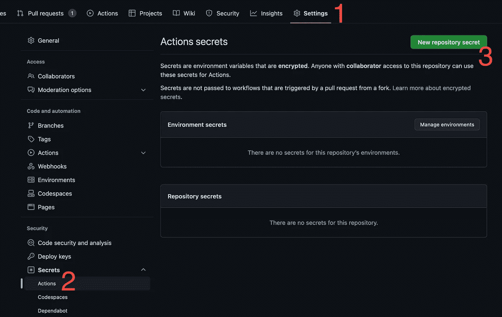

*   `TEST_USER_LOGIN` & `TEST_USER_PASS`:需要匹配在 Auth0 中为`Test`应用程序(`Staging`租户)创建的用户凭证
*   `GATSBY_AUTH0_DOMAIN` & `GATSBY_AUTH0_CLIENT_ID`:需要匹配`Test`应用(`Staging`租户)

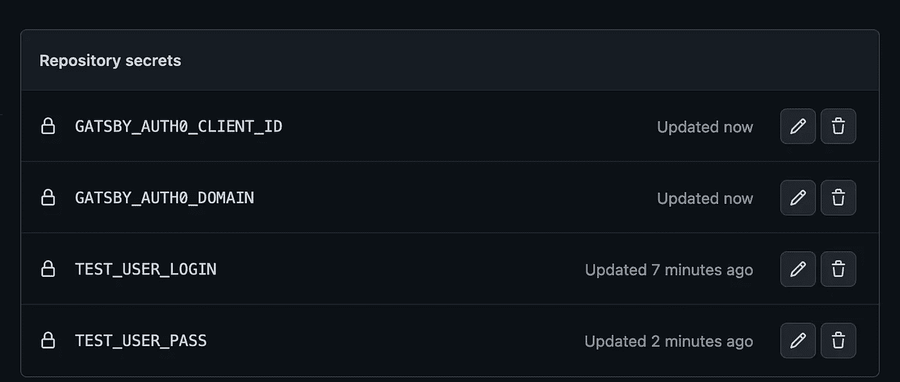

现在，推动您的更改，打开一个 PR，您将得到一个挂起的测试运行。

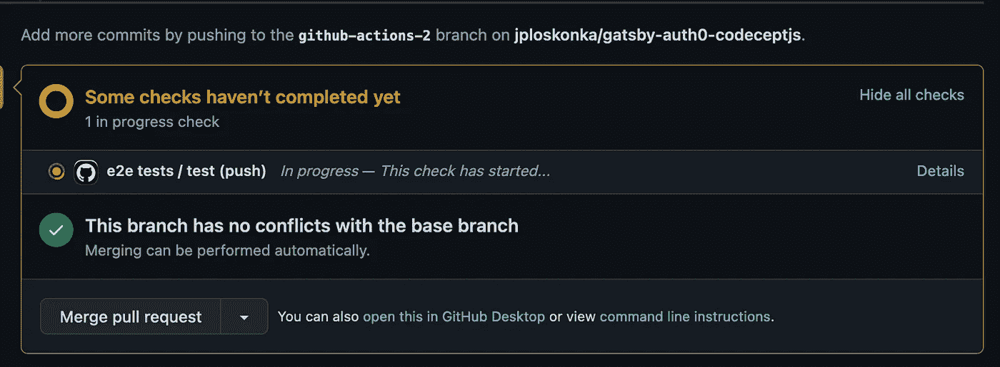

等一下…享受一个绿色标记，合并那个 PR。🎉

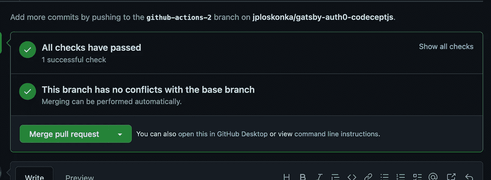

# 持续交付给盖茨比云

登录[盖茨比云](https://www.gatsbyjs.com/dashboard/sites)，点击`Add a site`按钮。选择您的回购并点击`Import`。

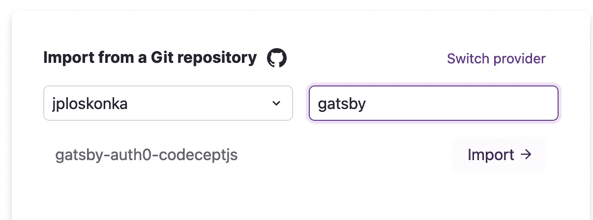

在下一个屏幕中输入`frontend`作为盖茨比根文件夹，并跳过`Connect integrations`部分。

从属于之前在 Auth0 中创建的`Production`租户的 app 中获取`domain` 和`clientId`。添加`GATSBY_AUTH0_CLIENT_ID`和`GATSBY_AUTH0_DOMAIN`环境变量并点击`Save`。

只填写`Build variables`，忽略`Preview variables`部分。

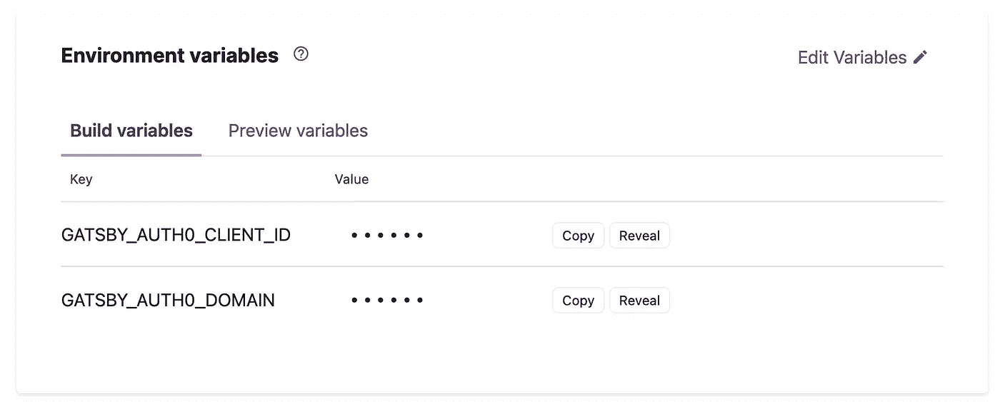

用`Build site`按钮完成设置。创建页面需要几分钟时间，因此现在是调整 Auth0 应用设置的好时机。

*   更改应用程序名称(在我的例子中是`Gatsby Auth0 Codecept Prod)`
*   将`Application Type`改为`Single Page Application`
*   对于真正的生产使用，你需要准备一个登录页面，并输入它的 URI。我将跳过它([查看文档了解更多信息](https://auth0.com/docs/authenticate/login/auth0-universal-login/configure-default-login-routes))。
*   现在，您将在 Gatsby Cloud 面板中找到您的 GatsbyJS 站点 URL。你可能想看看关于在实际生产中使用定制域的[文档。我将使用 GatsbyJS 中的默认域，并将其输入到`Allowed Callback URL`、`Allowed Logout URLs`和`Allowed Web Origins`字段中。](https://support.gatsbyjs.com/hc/en-us/articles/360063469873-Adding-a-Custom-Domain)
*   最后在`Connections`选项卡上禁用`Username-Password-Authentication`并启用`google-oauth2`

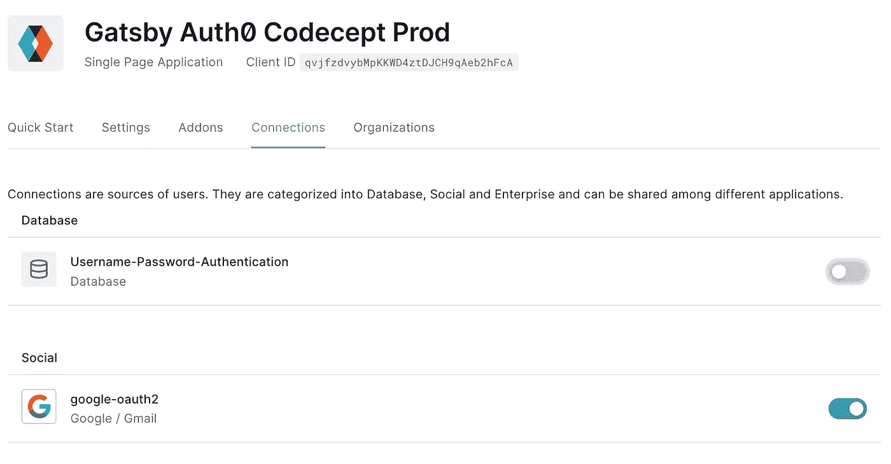

注意:[默认情况下，这将使用谷歌集成的开发者密钥，对于实际的生产使用，你需要提供自己的](https://auth0.com/docs/authenticate/identity-providers/social-identity-providers/devkeys)。

现在，您可以访问您的 GatsbyJS 站点，并在*产品*中使用登录功能🎉

# 部署检查后

经常说要相信外部服务，不要去测试。我有点同意。如果你真的没什么需要做的，那好吧。但即使是像 Auth0 这样的外部服务，也有很多地方可能出错。

例如，我可以在盖茨比的一个环境变量中打错字。或者，我可以在浏览器中打开多个选项卡，错误地禁用 google on production，而不是 test environments。一些新人可能来到团队，发现`dev`和`production`之间的漂移是一个错误，并启用用户名/密码认证方法。

为了获得一些安全，让我们在每次部署后运行一次检查，确保不可能使用用户名/密码登录，并且在生产应用程序上有一个通过 Google 登录的选项。我就不多说了——我足够信任 Auth0，认为只要他们的页面上有`Continue with Google`链接，它就能正常工作。

软件开发中的一个事实是，我们不应该在生产环境中运行测试。确实如此。但是这并不意味着我们不应该测试它，也不意味着唯一允许的测试是手工测试。

## 大意

当部署完成时，它会通过 webhook 触发一个 GitHub 操作任务。这将是一个 CodeceptJS 测试，它打开一个页面(是的，生产页面)，点击`Log in`按钮，并检查是否有通过 google 登录的选项。

## 盖茨比云的问题

在写这篇文章的时候，Gatsby Cloud [不支持任何外发通知](https://www.gatsbyjs.com/docs/how-to/cloud/outgoing-notifications/)的定制化。在某些事件之后，只能指定一个 URL 来从 Gatsby Cloud 获取带有标准有效负载的 POST 请求。为了通过 webhook 触发 GitHub 动作工作流，请求需要[具有特定的头和有效负载](https://docs.github.com/en/rest/repos/repos?apiVersion=2022-11-28#create-a-repository-dispatch-event))。这个不能直接设置在盖茨比云上。

可能有一些代理服务器接收 GatsbyJS 通知并进一步调用 GitHub 操作，但这超出了本实验的范围。

相反，在我的概念验证版本中，健康检查工作流将在将某些东西推送到`main`分支后被触发。这是当部署也被触发，所以听起来很合理。不管推送是通过 PR 合并还是直接推送。然后，在真正运行检查以确保部署完成之前，作业将休眠 5 分钟。这不是理想的情况，但对于这种情况来说已经足够好了。但总比没有好。

这里还有一点值得一提——GitHub 为外部服务提供了[部署 API](https://docs.github.com/en/rest/deployments/deployments) 来通知 repo 部署状态。那么[动作可以基于](https://docs.github.com/en/actions/using-workflows/events-that-trigger-workflows#deployment) `[deployment](https://docs.github.com/en/actions/using-workflows/events-that-trigger-workflows#deployment)` [事件](https://docs.github.com/en/actions/using-workflows/events-that-trigger-workflows#deployment)而不是使用 Webhooks 来触发。这也不会仅仅适用于 Gatsby Cloud，而是适用于不同的平台。

## CodeceptJS 运行状况检查

第一件事是用单独的`e2e/codecept.prod.conf.js`文件来保存这个配置:

```
const { setHeadlessWhen } = require('@codeceptjs/configure');
setHeadlessWhen(process.env.HEADLESS);

exports.config = {
  tests: './health_checks/*_check.js',
  output: './output',
  helpers: {
    Playwright: {
      url: process.env.PROD_PAGE_URL,
      show: true,
      browser: 'chromium',
      // when running on GitHub actions I experienced strangely long times
      // for the external page to load so waitForTimeout is increased
      waitForTimeout: 10000,
    }
  },
  include: { },
  name: 'e2e'
}
```

这几乎就像是测试的配置。它使用不同的目录来存储检查，并从`PROD_PAGE_URL` env 变量中获取页面 URL，没有默认值。我也跳过了这里的`dotenv`设置。

现在检查本身在`e2e/health_checks/auth_check.js`:

```
Feature('Authentication health check');

Scenario('User can login via google but not with username/pass', ({ I }) => {
  I.amOnPage('/')
  I.click(`Log in`)
  I.waitForText('Continue with Google')
  I.dontSeeElement('input[name=username]')
}).retry(5); 

// For some unknown to me reason, when using a real webpage, SOMETIMES
// line 5 clicks on `Log in` button (so the element is already loaded),
// but Auth0 flow doesn't start. I don't know exactly why, I suspect
// something about page loading taking longer in the real page than in local
// build. Luckily codecept comes with a handy `retry` method.
// I don't like this, but I accept it as good enough.
```

要在本地测试它:

```
# inside `e2e` directory
$ PROD_PAGE_URL=https://my-gatsby-page.io npx codeceptjs run -c codecept.prod.conf.js --steps
```

## GitHub 操作配置

在`.github/workflows/health_checks.yml`中添加新的工作流程:

```
name: Production page health checks
on:
  push:
    branches:
      - main

env:
  HEADLESS: true
  PROD_PAGE_URL: https://gatsbyauth0codeceptjsmain.gatsbyjs.io/

jobs:
  test:
    runs-on: ubuntu-latest

    defaults:
      run:
        working-directory: e2e

    steps:
      - uses: actions/checkout@v2

      - name: setup nodejs
        uses: actions/setup-node@v2
        with:
          node-version: 18.0.0

      - name: npm install
        run: npm install

      - name: sleep for 5 minutes to make sure deploy finished
        run: sleep 300

      - name: Run health checks
        run: |
          npx codeceptjs run -c codecept.prod.conf.js
```

现在合并 PR，如果你前往 GitHub repo 中的`Actions`选项卡，你会看到两个工作流正在运行——一个是常规 e2e 测试，另一个是健康检查。也许在工作流程 5 分钟后结束之前，这是一个起身伸展一下的好时机？

5 分钟过去了，体检也过去了。我们完成了:-)

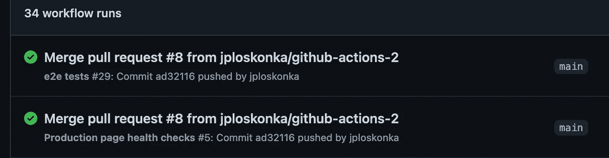

在实际使用中，您可能希望在健康检查作业结束时插入一些通知，例如使用 [GitHub Action slack。](https://github.com/marketplace/actions/slack-notification)

# 包裹

*   我们已经通过租户特性查看了三种不同环境的 Auth0 设置
*   在实现身份验证之前，我们创建了一系列高级测试来描述身份验证
*   通过一个简单的例子，我们已经看到了 Gatsby 使用 Auth0
*   GitHub 动作已经开始发挥作用，以方便设置 CI 管道
*   我们已经研究过 Gatsby Cloud，它(几乎)没有为页面托管任何配置
*   最后，我们查看了来自 Gatsby Cloud 的 GitHub Actions 方向的通信，并在生产页面上运行了一些健康检查。遗憾的是，没有简单的方法来实现适当的部署后工作流触发。

每个提到的应用和工具都有至少十几个可用的资源，涵盖了各种不同的使用环境。这里展示的每一件作品都有很大的改进空间，以便为生产做好准备。

希望有了这个概述，您可以获得一些进一步实验的起点。

玩得开心。

## 资源

*   盖茨比文件:[https://www.gatsbyjs.com/docs](https://www.gatsbyjs.com/docs)
*   CodeceptJS 文档:[https://codecept.io/](https://codecept.io/)
*   CodeceptJS 书籍和帖子:[https://github.com/codeceptjs/CodeceptJS/wiki/Books-&-帖子](https://github.com/codeceptjs/CodeceptJS/wiki/Books-&-Posts)
*   GitHub 操作文档:[https://docs.github.com/en/actions](https://docs.github.com/en/actions)
*   Auth0 租户:[https://auth 0 . com/docs/get-started/auth 0-overview/create-tenances](https://auth0.com/docs/get-started/auth0-overview/create-tenants)

对于 Gatsby & Auth0 的集成，您可以查看几个地方:

*   Auth0 博文:【https://auth0.com/blog/securing-gatsby-with-auth0/[](https://auth0.com/blog/securing-gatsby-with-auth0/)
*   来自 Auth0 的示例应用:【https://github.com/auth0-blog/gatsby-auth0 
*   盖茨比 Auth0 主题:[https://www.gatsbyjs.com/plugins/gatsby-theme-auth0/](https://www.gatsbyjs.com/plugins/gatsby-theme-auth0/)

*更多内容看* [***说白了。报名参加我们的***](https://plainenglish.io/) **[***免费周报***](http://newsletter.plainenglish.io/) *。关注我们关于* [***推特***](https://twitter.com/inPlainEngHQ) ，[***LinkedIn***](https://www.linkedin.com/company/inplainenglish/)*，*[***YouTube***](https://www.youtube.com/channel/UCtipWUghju290NWcn8jhyAw)*，以及* [***不和***](https://discord.gg/GtDtUAvyhW) ***。*****

***有兴趣缩放你的软件启动*** *？检查出* [***电路***](https://circuit.ooo?utm=publication-post-cta) *。*