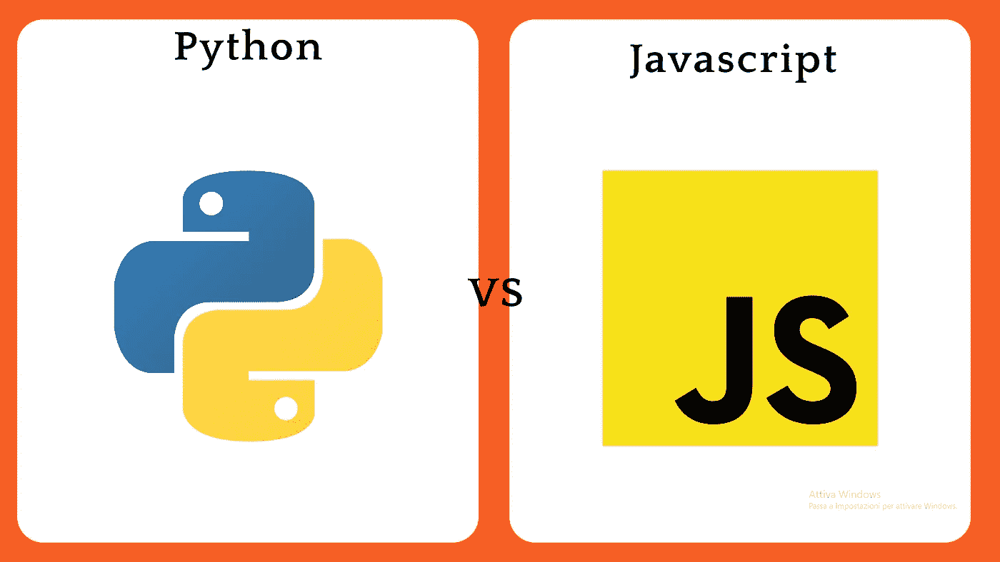
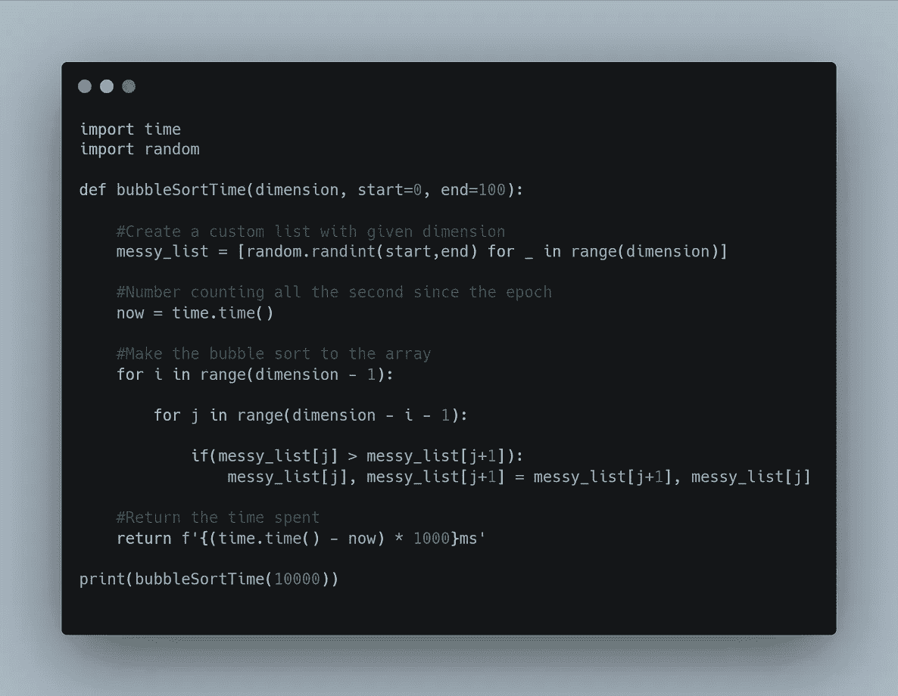
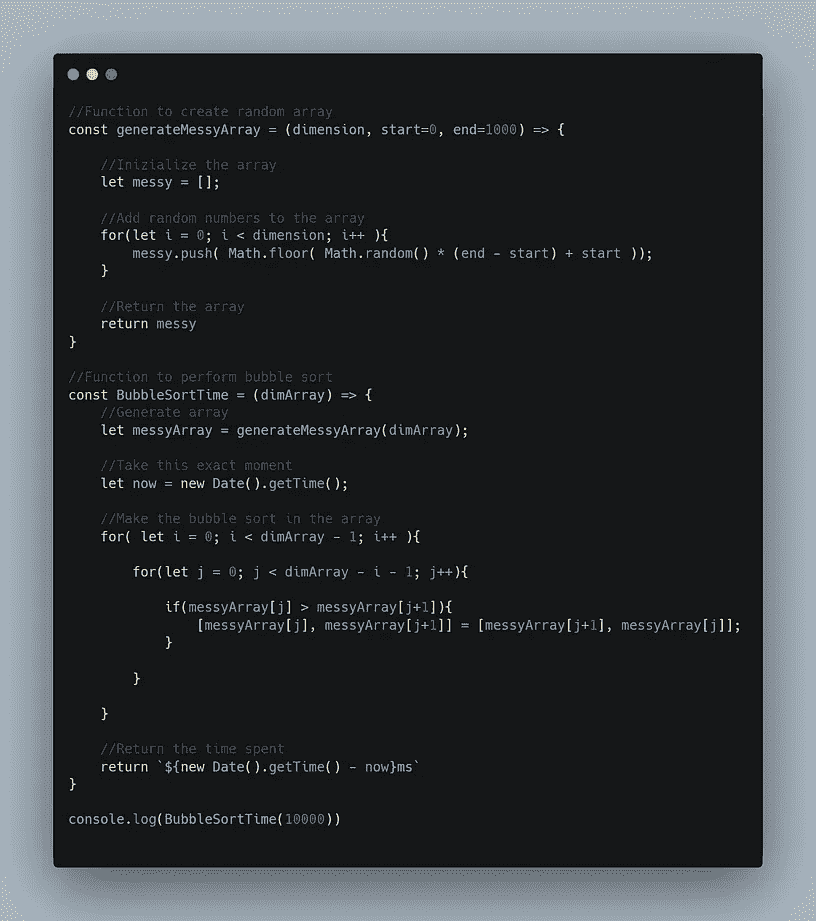
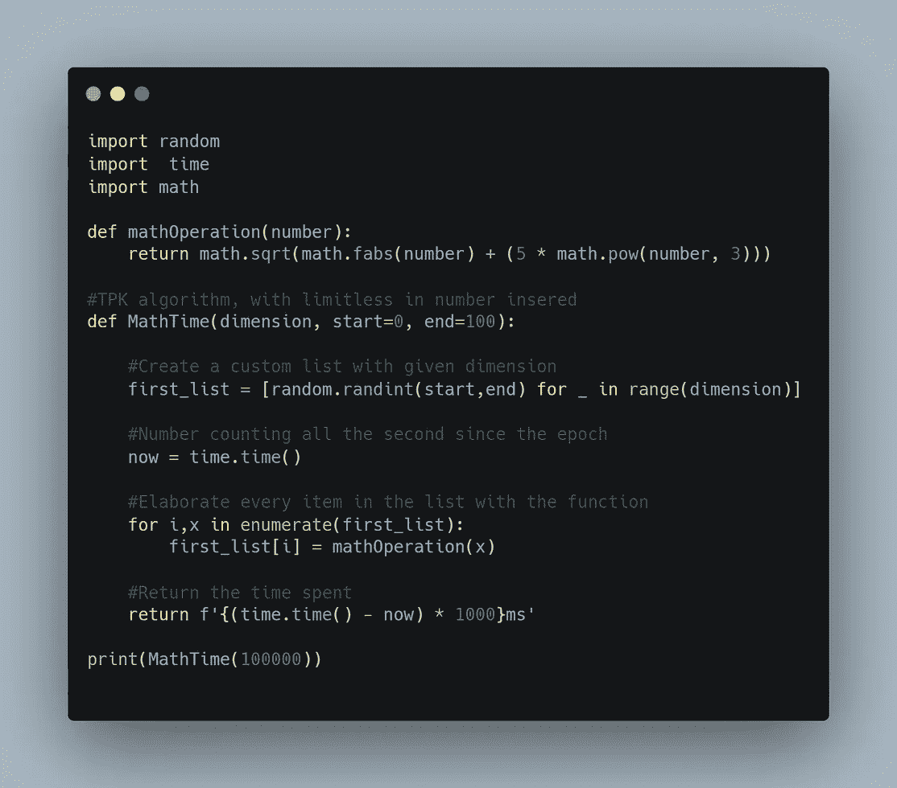
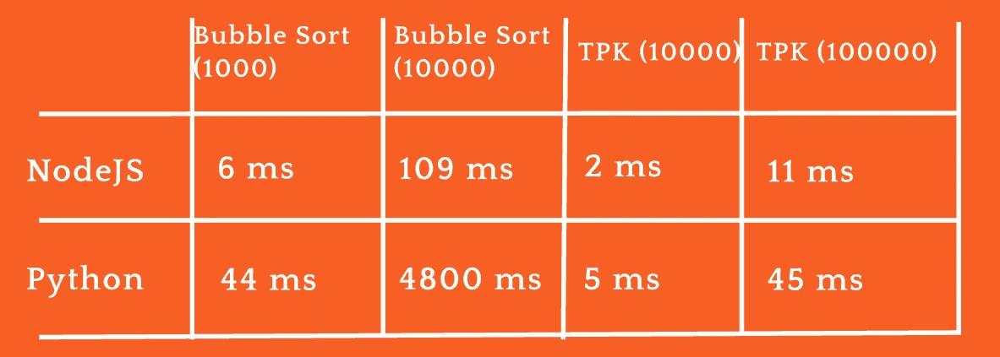

# Python 与 JavaScript:两种最流行的编程语言的比较

> 原文：<https://javascript.plainenglish.io/python-vs-javascript-e8590d346c3b?source=collection_archive---------4----------------------->

## *两种最重要的编程语言的历史和特点*

在本文中，我们将讨论这两种巨大技术的区别、特点、优缺点。在这里，您将发现这些编程语言是如何诞生的，以及它们是如何发展的。我们开始吧。

Python Vs Javascript

## **仿制历史**

首先，Python 是由 Guido van Russom 于 1991 年在荷兰创建的，现在它已经是第三个版本了。另一方面，JavaScript 于 1995 年由美国开发人员 Brendan Eich 发布，他也是 Mozilla Firefox 的创始人。Python 天生就有一种语法更好的语言，JavaScript 来增强 web。

Giudo van Russom and Brendan Eich

## **差异**

现在让我们来谈谈一些不同之处:Python 是强类型的，但也是动态的。这意味着变量的类型也可以改变，但它是被定义的。JavaScript 是弱类型的。这就是为什么在 JavaScript 中，当与数据类型交互时，你有很大的自由，但是总是有很多错误。

在 Python 中，我们使用缩进来划分语句，缩进是一种由空格和制表符组成的系统，而在 JavaScript 中则使用花括号和分号。

这两种编程语言都支持函数式编程和面向对象编程，所以它们都是多参数的。在 Python 中，你不能创建一个常量，但是如果一个变量不变，它的名字通常用大写字母写。JavaScript 使用关键字 const 来表示常量。

对于 Python 中的注释，您必须使用一个 hashtag，在 JavaScript 双斜杠中。继续，Python 可以在你的机器或服务器上运行，而 JavaScript 可以在浏览器上运行，除了节点运行时。

要安装一个包，在 Python 中可以使用 pip 或 conda，而 npm 用于 JavaScript。PIP 代表 Python 安装程序包，而 NPM 代表节点程序包管理器。

## **这些语言的用法**

Python 多用于服务器端应用、数据科学、AI，框架有 TensorFlow、Keras、pandas 等等。这就是用这种语言管理数据非常容易的原因。

另一方面，JavaScript 既用于前端和后端开发，也用于移动，使用 React、React Native、Angular 和 Node.js 运行时等技术。Node.js 本质上是让 JavaScript 在您的机器上运行的一种方式。

## **什么样的社区对 Python 和 JavaScript 有什么看法**

现在我们来看看社区对这两种语言的看法。根据 Stack Overflow 2021 调查，JavaScript 的受欢迎程度高于 Python，几乎是 65%对 48.24%。尽管如此，Python 比 JavaScript 有更好的爱恨比:几乎 68%的 Python 开发人员喜欢这种语言，只有 61%的 JavaScript one 对他们的语言也是如此。Python 的工资也更高，平均工资为 59454 美元，而 JavaScript 为 54049 美元。如果你对编程社区如何看待编程语言感兴趣，我建议你阅读完整的堆栈溢出调查，链接:[*https://insights.stackoverflow.com/survey/2021*](https://insights.stackoverflow.com/survey/2021)

## 表演

Bubble sort in python and javascript

但是性能呢？众所周知，Python 是一种非常慢的语言，而 javascript 却非常快。都是解释的，所以比编译的慢，像 C++等等。我们用两个模拟算法测试了这种语言的性能:冒泡排序和经典 TPK 的替代算法。这里你可以看到冒泡排序和 TPK 的两种语言的代码。

Alternative TPK in Python and Javascript

明确一下，我们对比了 Python 和 Node.js 的运行时，所以它会在同一台机器上运行，时间不取决于浏览器优化。对 1000 个元素进行冒泡排序，JavaScript 需要 6 ms，而 Python 需要 44 ms。对 10000 个元素进行排序，Node.js 只需要 109 ms，而 Python 需要 4800 ms。在对 10000 个元素进行 TPK 时，JavaScript 需要 2 ms，而 Python 需要 5 ms。在 100 000 个元素中，JavaScript 在 11 毫秒内结束，而 python 用了 45 毫秒。现在我们确信 JavaScript 更快。您也可以在自己的机器上做这个测试。

Time spent

## **利弊**

那么这些语言的优点是什么呢？Python 语法简单，编写和测试速度快，擅长处理数据，有一个庞大的社区，还有很多库和框架。另一方面，JavaScript 是网络标准，你可以用它做任何事情。这可能就是为什么它有一个伟大的社区。

它也有很多框架和其他语言来增强它，比如 TypeScript。现在，让我们来谈谈缺点。我们之前说过，Python 速度慢，而且也是单线程。这意味着它们本身不支持并行。像所有解释语言一样，它可能会有运行时错误，并且内存消耗很大。另一方面，JavaScript 解决了渲染问题，单一继承，几乎就像一个线程，浏览器中的代码可见性，这导致了安全问题，以及缺乏调试工具。

## **什么比较好？你应该选择哪一个？**

那么，到底什么更好呢？你应该选择什么？视情况而定:如果你想使用前端或全栈，建议使用 JavaScript。如果你想处理几乎所有的事情，包括只使用一种语言的手机，情况也是如此。

相反，如果您必须处理大量数据，Python 绝对是您的选择。对于机器学习和人工智能也是最好的。如果你是初学者，两者都很棒，但我建议你使用 Python。

最后，我们可以说这两种语言都很棒，令人敬畏的社区将是开始并继续用这两种语言提高自己的巨大动力。此时，选择什么就看你自己了。你只需要知道，你会做出正确的选择。

感谢阅读。请订阅未来关于技术和区块链的文章。

*更多内容请看*[***plain English . io***](http://plainenglish.io/)*。报名参加我们的* [***免费周报***](http://newsletter.plainenglish.io/) *。在我们的* [***社区***](https://discord.gg/GtDtUAvyhW) *获得独家获得写作机会和建议。*