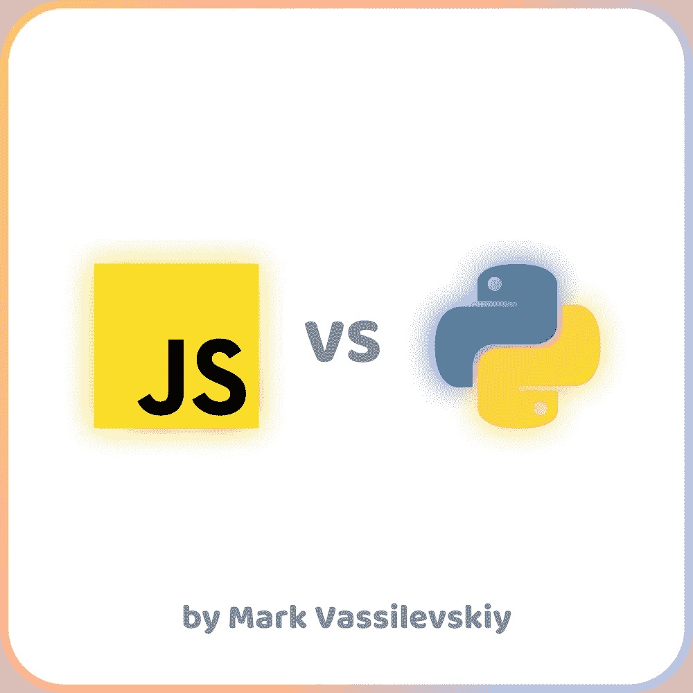

# Python vs JavaScript:哪个更好？

> 原文：<https://javascript.plainenglish.io/python-vs-javascript-which-one-is-better-927228f2731b?source=collection_archive---------12----------------------->

## 比较

## 如果你是初学者，想知道该学什么，那么这篇文章正适合你！

JavaScript 和 Python 是当今使用最广泛的编程语言，几乎所有程序员都曾在某个时候使用过它们。特别是与一些低级语言如 C++或 Java 相比，它们非常简单。然而，JS 和 Python 之间有一些差异，完全理解它们是至关重要的，尤其是对初学者来说，以避免浪费时间去学习一种将来不会用到的新技能。

# 你学它是为了什么？

你可以问自己的第一个问题也是最重要的一个问题是“我为什么要开始学习编程”或者“我到底想成为什么样的人？”。这些必不可少的问题会让你明白接下来要做什么，到底要学什么。因为所有这些语言都更擅长特定的任务，你肯定不会用 python 来创建一个 AAA 游戏(几乎所有的桌面游戏都是基于 C++构建的，因为它的可能性和直接与硬件一起工作。对于 Python 和 JS 来说是不可能的)。

Python 可以用于后端开发，构建机器学习和人工智能算法，以及一些简单的任务，如排序、自动化和网页抓取。也有很多库可以让你创建简单的游戏，比如 Snake 或 Mario，但是，这都是业余的，正如我前面提到的，你不能用 Python 来创建一个完全可用的游戏

JavaScript 也用于后端，然而，它是唯一一种在前端工作的语言。有了 JS，你可以构建跨平台的应用程序，甚至用它来创建机器学习和人工智能算法！

如你所见，它们非常相似。它们都用于 Web 开发，它们都有相同的库 TensorFlow 用于 ML 和 AI，它们都可以用来完成实际上每种编程语言都可以完成的小任务。但是在特定的领域里哪一个更好呢？这是我们的主要问题，我现在就来回答！

# **JavaScript 更适合 web 和移动开发**

JavaScript 显然比 Python 更擅长 Web 开发。我想你们很多人已经知道为什么了。它在前端工作，有一个更好的后端开发方式，你不仅可以为网络编写，也可以为桌面和移动应用程序编写。要构建一个桌面应用程序，你需要使用 Electron.js 库(顺便说一下，Discord、Whatsapp、Slack 和我们日常使用的许多其他大型应用程序都是在这个库上编写的)。对于移动开发，您可以使用 React Native，它让您能够编写相同的代码，并且可以同时在 iOS 和 Android 上运行。所以现在你不需要为了写一个 Android 应用而学习 Java，也不需要为了 iOS 而学习 Swift，JavaScript 为你做了一切！

此外，JavaScript 与 Web3.0 世界有更好的集成，几乎每个区块链开发者都希望将这些技术结合在一起。JavaScript 使得在你的浏览器中连接你的 Solidity 脚本和智能合同变得简单，提高了兼容性，为最终用户简化了事情。

# Python 更适合 ML

使 Python 成为基于机器学习和人工智能的项目的最佳选择的优势包括灵活性、平台自由、访问优秀的 ML 库和框架以及大型社区。这些提高了该语言在这个行业中的整体地位。

此外，每个人都可以很容易地学习 Python，因为它的语法实际上比 JS 的简单。因此，如果您想学习一种编程语言，只是为了自动化一些无聊的计算机程序，并且可能进行一点点实验，Python 是这些活动的最佳选择！

# 薪水和职业

没有一个统计数据可以肯定地告诉你这两种语言之间的区别，正如我前面提到的，它们几乎是相同的，有时可以一起使用。因此，高级开发人员的年薪在 10 万美元左右。很好，包括你可以用这些技术赚得更多

此外，你不需要担心几年后没有人会使用这些编程语言，你会因为它们的无用而失业。这是完全不真实的，它的受欢迎程度每天都在增长，而且很快会增长得更多。尤其是 JavaScript，根据 Stack Overflow 的 2020 年开发者调查， **JavaScript 目前是世界上最常用的语言(69.7%)** ，其次是 HTML/CSS (62.4%)、SQL (56.9%)、Python (41.6%)和 Java (38.4%)。

# 结论

我向你解释了这两种世界上最流行的编程语言之间的主要区别。我个人已经用 Python 工作了 2 年多，目前因为 Web3.0 转到了 JS。但是对于那些不想认真对待编程，只想完成一些基本任务之类的人来说，Python 仍然是最好的方式。如果你喜欢这篇文章，别忘了留下掌声并关注我:)

*更多内容请看*[***plain English . io***](https://plainenglish.io/)*。报名参加我们的* [***免费周报***](http://newsletter.plainenglish.io/) *。关注我们关于*[***Twitter***](https://twitter.com/inPlainEngHQ)[***LinkedIn***](https://www.linkedin.com/company/inplainenglish/)*[***YouTube***](https://www.youtube.com/channel/UCtipWUghju290NWcn8jhyAw)*[***不和***](https://discord.gg/GtDtUAvyhW) *。对增长黑客感兴趣？检查* [***电路***](https://circuit.ooo/) *。***