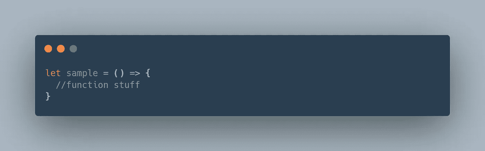
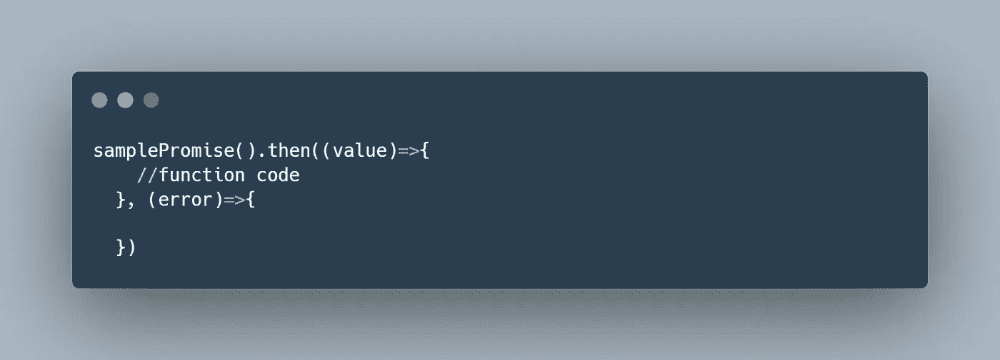

# JavaScript 中命名函数和匿名函数的快速概述

> 原文：<https://javascript.plainenglish.io/quick-1-minute-rundown-on-named-functions-and-anonymous-functions-in-javascript-shorts-7d8776ea61b0?source=collection_archive---------13----------------------->

## 跟我学 JavaScript 术语，这样我们看起来就像专业人士


早上好，朋友们，

到目前为止，我们已经讨论了[立即调用函数](https://medium.com/p/9afb9dc460c8)、[一级函数和高阶函数](https://medium.com/p/eea0c507263e)。我们正在加快步伐，以确保当我们未来的同事与我们交谈时，我们确切地知道他们在谈论什么。我们不想看起来像迷路的新手——这可能是不可避免的，但男人可以尝试。

今天，我们将学习更多的网络开发术语；更具体地说，我们将回顾命名函数和匿名函数。

所以让我们深入研究一下。让我们学些有趣的东西。

# 我们从命名函数开始

…我们从命名函数开始的原因是，它是不言而喻的，如果你曾经学习过 JavaScript 函数，你已经知道了你需要知道的一切。

命名函数是用名字初始化的函数。疯狂是吗？

这里有一个例子:


如您所见，所示的两个函数是用名称创建的。有`getName`和`setName`功能。

命名函数将始终采用这种格式:

```
function functionNameHere(){
    //...
}
```

# 匿名函数

正如人们可以得出的结论，匿名函数是没有指定名称的函数。它们可以有几种不同的形式。


如您所见，该函数没有名称。

你可能会想，“是的，确实如此。它的名字是`sample`，我知道这个名字是因为函数调用`sample()`可以工作。”

部分正确，年轻的学徒。在上面的场景中，我们设置变量`sample`来引用这个匿名函数。换句话说，我们给`sample`赋值，这个值是一个匿名函数。

所以当它们引用内存中的相同地址并产生相同的结果时，`sample`和匿名函数是分开的。对吗？因为在那个语句(`sample`的初始化)执行之后，匿名函数就不再存在了。`sample`作为一个函数会存在，但那个匿名函数已经不存在了。您不能重用匿名函数。这有意义吗？

只要你理解了匿名函数的概念，这些其他形式的匿名函数就会有意义。



以上，我们可以观察一个箭头函数。与前面的代码示例类似，该函数没有名称。因此，这是一个匿名函数。



以上，我们可以观察另一个箭头函数。当我们处理 try-catch 语句和异步 JavaScript 时，我们总是会看到箭头函数(甚至只是基本的匿名函数)。

最后，在处理立即调用的函数时，我们还会看到匿名函数。


如您所见，立即调用的函数也没有函数名。

*更多内容请看*[***plain English . io***](https://plainenglish.io/)*。报名参加我们的* [***免费周报***](http://newsletter.plainenglish.io/) *。关注我们关于*[***Twitter***](https://twitter.com/inPlainEngHQ)*和*[***LinkedIn***](https://www.linkedin.com/company/inplainenglish/)*。查看我们的* [***社区不和谐***](https://discord.gg/GtDtUAvyhW) *加入我们的* [***人才集体***](https://inplainenglish.pallet.com/talent/welcome) *。*