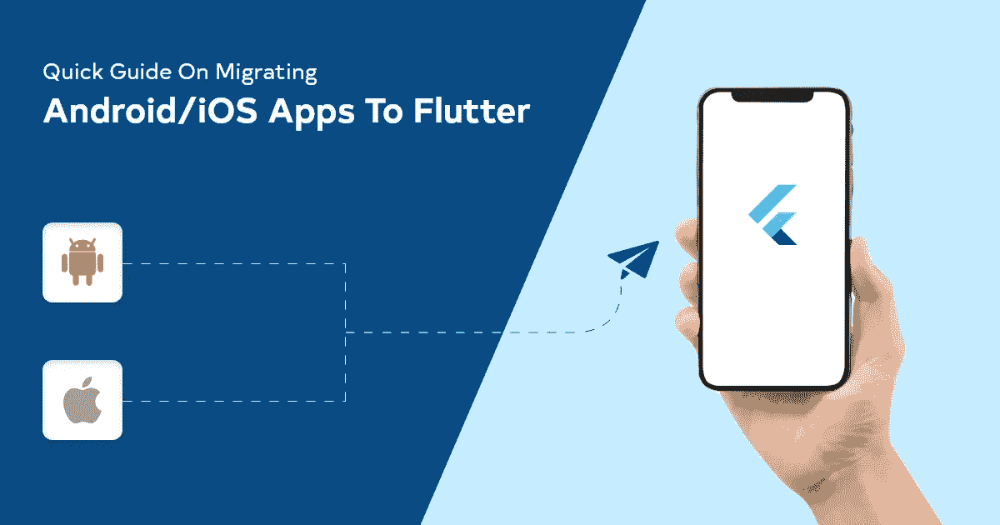

# 如何将 Android/iOS 应用迁移到 Flutter

> 原文：<https://javascript.plainenglish.io/quick-guide-on-migrating-android-ios-apps-to-flutter-dfafa866d0c2?source=collection_archive---------10----------------------->

## 将 Android/iOS 应用迁移到 Flutter 的快速指南

Image by: Milan On: Self create

当 Flutter 开始推动跨平台移动应用开发时，它引起了开发人员和企业家的极大关注。毕竟，谷歌的 brainchild Flutter 是一个出色的软件开发工具包，能够创建漂亮和高性能的跨平台应用程序。用 Flutter 构建的应用程序不仅提供了令人愉悦的用户体验，而且看起来和感觉上几乎与原生应用程序一样。

更不用说，Flutter 允许你从一个代码库为多达六个操作系统构建 Web、桌面和移动应用。我们可以整天数着选择这种跨平台框架和套件的理由。但是在 Flutter 中一次性重写整个应用程序似乎并不实际。

这就是 Flutter 将其集成到现有原生应用程序中的惊人功能派上用场的地方。如果你想利用 Flutter 的跨平台特性，你可以把它作为一个库或模块一点一点地添加到你现有的应用中。然后，你也可以将该模块导入到你现有的 Android 或 iOS 应用程序中，以在 Flutter 中呈现应用程序 UI 的一部分。

就像那样，只需几个步骤，你就可以将 Flutter 的表现力和生产力带入自己的 app。现在，让我们了解更多关于在现有的 Android 和 iOS 应用程序中添加 Flutter 的信息。

**将 Flutter 添加到现有的 Android 应用:**

步骤 1-打开现有项目

步骤 2-新建颤振模块向导

步骤 3-使用 Flutter Android APIs

步骤 4-构建和运行

第 5 步-连接和热重装。

**当集成到 Android 应用程序中时，Flutter 允许我们做的事情。**

*   您可以在 Gradle 脚本中添加一个 Flutter SDK 挂钩来自动构建和导入 Flutter 模块。
*   如果你想将 Flutter 模块集成到你自己的构建系统中，将你的 Flutter 模块构建到一个通用的 [Android Archive (AAR)](https://developer.android.com/studio/projects/android-library) 中，这也能更好地实现 Jetifier 与 AndroidX 的互操作性。
*   使用 [FlutterEngine](https://api.flutter.dev/javadoc/io/flutter/embedding/engine/FlutterEngine.html) API 独立启动和继续你的颤振环境。
*   模块导入/创建向导允许您在 Android Studio 中共同编辑 Android 和 Flutter 项目。
*   它支持用 Java 和 Kotlin 构建的应用程序。
*   颤振插件可以集成到现有的平台，并用于颤振模块与平台的互动。
*   使用 IDE 或命令行中的 flutter attach 函数，您可以连接到包含 flutter 的应用程序，并对其进行调试，或者使用有状态热重载来重载它。

**在现有的 iOS 应用中添加 Flutter:**

步骤 1-打开现有项目

步骤 2-创建颤振模块

步骤 3- CocoaPods 安装

步骤 4-使用 Flutter iOS APIs

步骤 5-构建和运行

第 6 步-连接和热重装。

当集成到 iOS 应用程序中时，Flutter 允许我们做的事情。

*   在您的 CocoaPods 和 Xcode 构建阶段添加一个 Flutter SDK 挂钩，以自动构建和导入 Flutter 模块。
*   它允许您在通用 iOS 框架中创建一个 Flutter 模块，以便您可以将该模块集成到您自己的构建系统中。
*   FlutterEngine API，用于独立于附加 FlutterViewController 来启动和保持您的 Flutter 环境。
*   它还支持两种类型的 iOS 应用程序 Objective-C 和 Swift。
*   让颤振模块使用[颤振插件](https://pub.dev/flutter)与平台交互。
*   使用 IDE 或命令行中的 flutter attach 函数，您可以连接到包含 flutter 的应用程序，并对其进行调试，或者使用有状态热重载来重载它。

如果您对何时应该选择这种转换感到困惑，这里有一些例子；

1.  当你在 Android 或 iOS 中已经有一个应用程序，并且该更新了。
2.  您现有的应用程序正面临技术问题，无论如何，您必须发布一个更新。
3.  当你希望顺应潮流，希望发布一个全功能的应用程序时。

然而，迁移到 Flutter 来提供卓越的用户界面和体验设计是值得的。但是在很多方面你必须小心。因此，建议 [**聘请具备将原生 app 迁移到 Flutter 的实践经验的 Flutter 开发者**](https://kodytechnolab.com/hire-flutter-app-developer) 。

如果你期待用 Flutter 升级你的应用，请告诉我。我们很乐意帮助你！

*更多内容看* [***说白了。报名参加我们的***](https://plainenglish.io/)***[***免费周报***](http://newsletter.plainenglish.io/) *。关注我们*[***Twitter***](https://twitter.com/inPlainEngHQ)*和*[***LinkedIn***](https://www.linkedin.com/company/inplainenglish/)*。加入我们的* [***社区***](https://discord.gg/GtDtUAvyhW) *。****