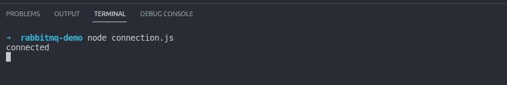

# 使用 Node.js 的 Rabbitmq

> 原文：<https://javascript.plainenglish.io/rabbitmq-with-nodejs-part-1-introduction-3351c1ca06d7?source=collection_archive---------11----------------------->

## 第 1 部分:简介——rabbit MQ 是一个消息代理，可以比作邮局和邮递员。


rabbitmq

Rabbitmq 是一个消息代理，rabbitmq 可以比作邮局和邮递员。他将接收发送者发送的消息，然后将消息转发给接收者。这意味着消息具有异步行为，发送方不必等待应答，即发送的消息已经发送到接收方，以便继续其他过程。发送方只需向消息代理发送一条消息，然后消息将由消息代理处理。其机制是消息由消息代理获取，然后存储在队列中，消息将一个接一个地转发给接收者。这种方法的优点之一是可以保证发送方发送的消息会被接收方接收到。与同步相反，在同步中，发送方必须等待，直到有对已经发送的消息的应答/响应，以便执行其他过程。*来源*[*https://medium . com/@ acep . abdurohman 90/messaging-dengan-message-broker-rabbit MQ-Dan-Java-menggunakan-spring-framework-E0 FB 4 e 98 a 428*](https://medium.com/@acep.abdurohman90/messaging-dengan-message-broker-rabbitmq-dan-java-menggunakan-spring-framework-e0fb4e98a428)

我们什么时候用 rabbitmq？使用 rabbitmq monolith 并不总是必须是微服务，也可以这样做，因为目标是节省请求过程，而不必等待或进行后台处理。

## Rabbitmq 安装

在 rabbitmq 网站上，有几个安装选项，要么独立安装，要么使用 docker，你可以在这里阅读

## Nodejs 与 Rabbitmq 的连接

好的，接下来我们将在 amqlib 包[https://www.npmjs.com/package/amqplib](https://www.npmjs.com/package/amqplib)的帮助下，尝试使用 nodejs with 到 rabbitmq 的连接。安装所需的包:

```
yarn add dotenv amqplib
```

然后创建一个名为***connection . js***的文件，并像这样填写代码:

connection.js

```
node connection.js
```

如果您的成功配置显示如下消息:



ping connection

第 2 部分:**即将发布！**

第三部:**即将上映！**

感谢您的阅读！

*更多内容请看*[***plain English . io***](https://plainenglish.io/)*。报名参加我们的* [***免费周报***](http://newsletter.plainenglish.io/) *。关注我们关于*[***Twitter***](https://twitter.com/inPlainEngHQ)[***LinkedIn***](https://www.linkedin.com/company/inplainenglish/)*[***YouTube***](https://www.youtube.com/channel/UCtipWUghju290NWcn8jhyAw)*[***不和***](https://discord.gg/GtDtUAvyhW) *。对增长黑客感兴趣？检查* [***电路***](https://circuit.ooo/) *。***