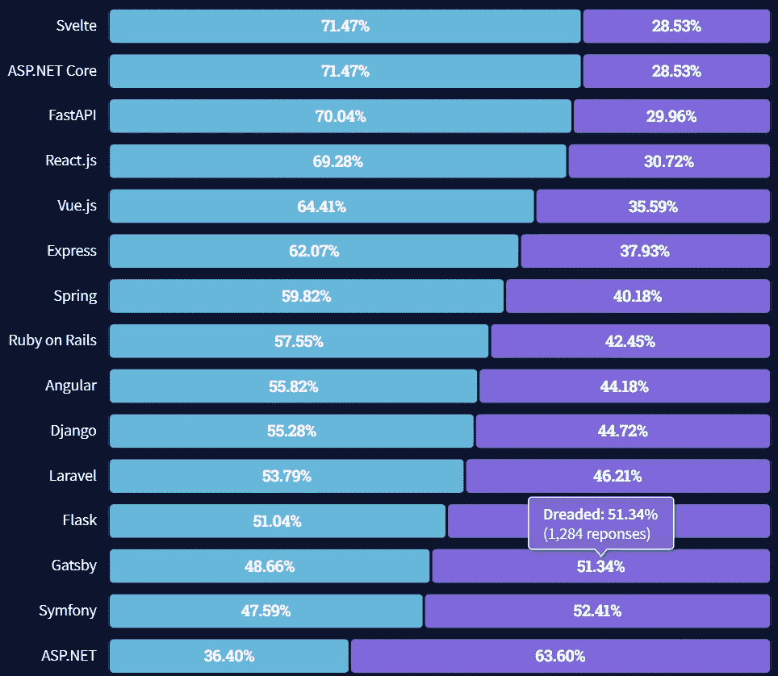
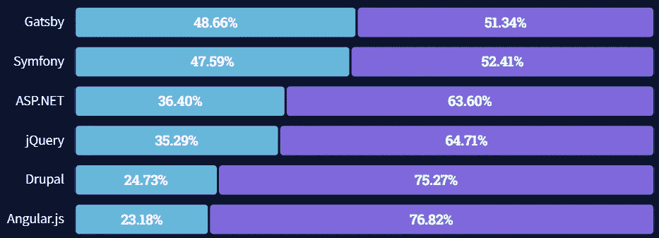
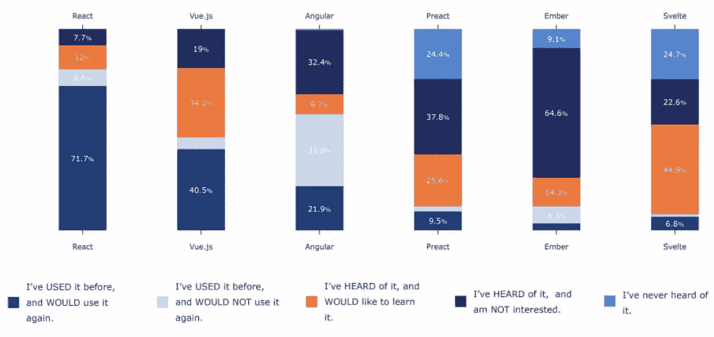

# 根据流行程度对 JavaScript 框架进行排名

> 原文：<https://javascript.plainenglish.io/ranking-javascript-frameworks-by-popularity-34f758d5264c?source=collection_archive---------10----------------------->

## 2022 年最流行的 JavaScript 框架。

无论您的经验水平如何，您都可能有自己喜欢的 JavaScript 框架。

出于各种原因，大多数开发人员都有自己的偏好。

受欢迎程度、可用性、支持、特性和灵活性都是开发人员给出的选择其中一个的原因。而且，当你找到一个有效的方法时，为什么还要出去学习越来越多的选择呢？

虽然每个开发人员可能需要考虑不同的变量，但受欢迎程度无疑是非常重要的。

但是为什么人气至关重要呢？

我们不会让这成为一场流行竞赛，因为我们使用了[微前端](https://www.fathym.com/blog/articles/2022/march/2022-03-14-a-simple-micro-frontends-explainer)，所以我们是框架不可知的。

然而，受欢迎是很重要的，原因有很多。

首先，如果你和你的团队正在进行一个长期的大项目，你需要确保你所使用的框架将贯穿整个过程。想象一下，开始一个重要的网站建设，而框架突然从地球上消失，那将是一场噩梦。

其次，这种受欢迎程度保证了更多的开发人员知道如何使用这个特定的框架。如果你的第一个开发人员离开了，你应该可以用另一个团队成员来填补他们的位置。或者，在我们的微前端的情况下，您可能希望同一个团队中的多个成员了解同一个框架。他们可以合作，互相帮助，创造一些特别的东西。

如果你的公司扩张，你将能够找到使用流行框架的新开发人员。

考虑到这一点，让我们看看哪些框架在 2022 年最受欢迎。

根据 [Stack Overflow 的 2021 年调查](https://insights.stackoverflow.com/survey/2021#most-loved-dreaded-and-wanted-webframe-love-dread)，Svelte 是所有框架中最受欢迎的，71.47%的受访开发者说他们喜欢它。

在我们即将发布的文章“2022 年你应该知道的 4 个微前端框架”中，我们注意到 React 排名第四(69.28%)，Vue 排名第五(64.41%)，Angular 排名第九(55.82%)。以下是前 15 名:

另一方面，调查中列出的六种框架令人生畏，却不招人喜欢。

不要和 Angularjs 混淆，Angular js 是最可怕的，76.82%的人说他们不喜欢它多于喜欢它。Drupal 以 75.27%的可怕票数紧随其后，接下来是 jQuery (64.71%)和 ASP.NET(63.6%)。

当谈到最受欢迎的开发人员——没有使用该框架，但想使用它的开发人员——React 是明显的赢家，有 25.12%的人想要它。Vue 第二(16.69%)，Angular 第四(8.47%)，Svelte 第五(6.57%)。(Django 排名第三，占 9.21%)

这是另一种形象化的方法。它结合了那些使用过一个框架并且会/不会再次使用它的人，那些听说过/没听说过它并且想要学习它的人，以及那些没有听说过某个特定框架的人。

React 仍然是最受欢迎的 JavaScript 框架，尤其是在 NPM 下载方面。它可以用于较大或较小的项目，这有助于它保持流行。然而，Svelte 和 Vue 可能是街区里的新成员，但他们在受欢迎程度的增长方面已经看到了大时代的数字。此外，就应用程序的平均大小而言，它们都要小得多，这意味着对于最终用户而言，它们在速度方面更具性能。而且 Angular 依然很强，即使几年前就被 React 超过了。

与旧框架(React 和 Angular)相比，新框架(Vue.js 和 Svelte)的另一个特点是，与更健壮的框架相比，它们的学习曲线没有那么陡峭。因此，Vue 和 Svelte 的受欢迎程度只会增加，而且这种更容易使用的方式消除了雇佣新开发人员的一些担忧。

最后，你可以选择在你的项目中使用哪一个。这里列出的四个主要框架都不会很快出现，所以您可以放心地使用它们。

来到 Fathym，开始使用微前端，在这里你可以自由地使用我们在这里讨论的任何或所有框架。由于微前端的工作方式，你甚至可以在一个项目中使用多个不同的框架。

我们希望你今天就来[在 Fathym 建立一个网站。](https://www.fathym.com/dashboard)

【https://www.fathym.com】最初发表于**。**

**更多内容请看*[***plain English . io***](https://plainenglish.io/)*。报名参加我们的**[***免费周报***](http://newsletter.plainenglish.io/) *。关注我们关于*[***Twitter***](https://twitter.com/inPlainEngHQ)*和*[***LinkedIn***](https://www.linkedin.com/company/inplainenglish/)*。加入我们的* [***社区***](https://discord.gg/GtDtUAvyhW) *。***