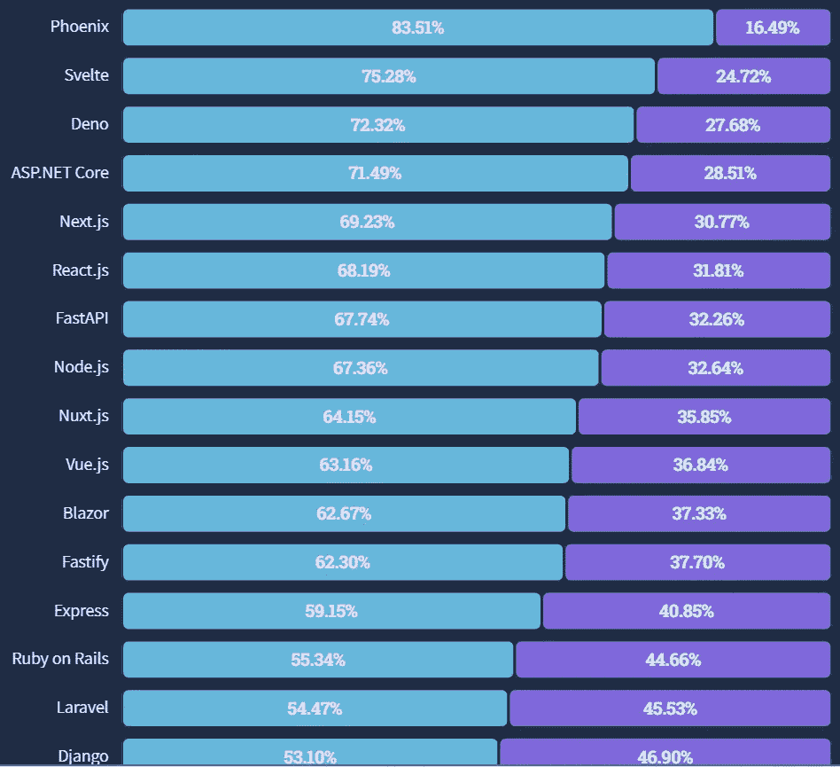
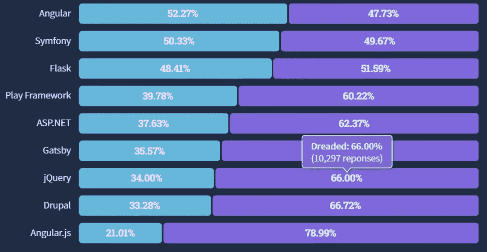
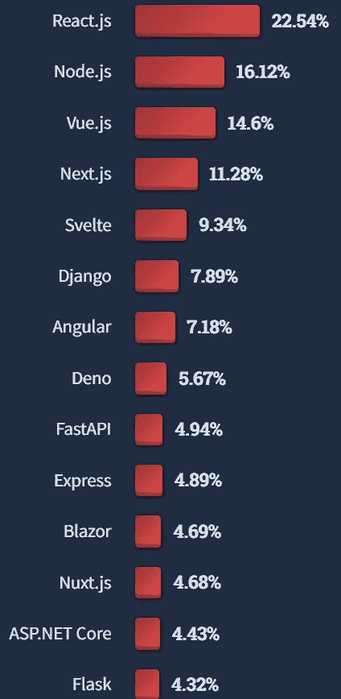
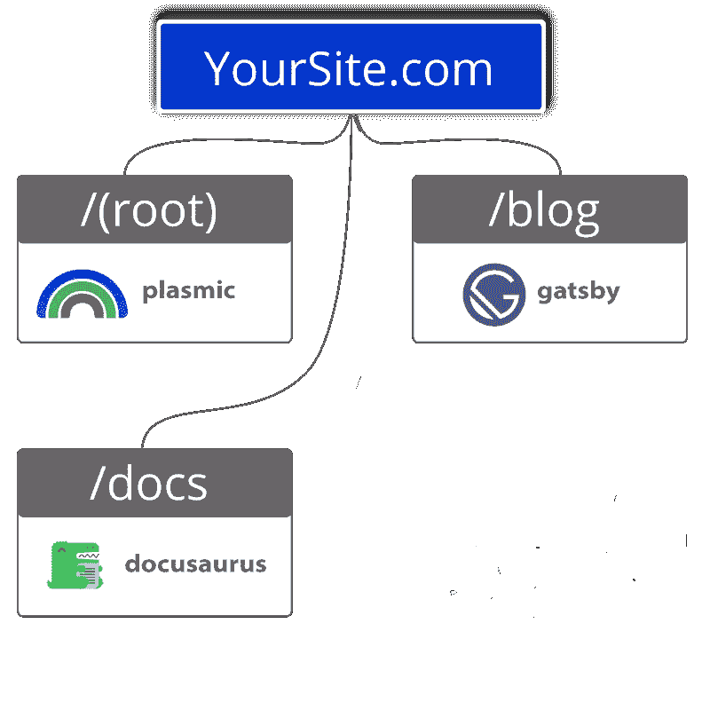

# 2022 年 JavaScript 框架流行度排名

> 原文：<https://javascript.plainenglish.io/ranking-javascript-frameworks-by-popularity-for-2022-db08548870ef?source=collection_archive---------2----------------------->

## 又到了一年一度的 StackOverflow 开发者调查发布的时候了。今年来了很多新人，还有一个新的№1！

又到了一年中的这个时候，StackOverflow 的开发者调查发布了。这意味着是时候更新 2022 年最流行的 JavaScript 框架了。[点击这里，阅读 2021 年最受欢迎的电影。](https://www.fathym.com/blog/articles/2022/april/2022-04-13-micro-frontend-popularity)

无论您的经验水平如何，您都可能有自己喜欢的 JavaScript 框架。

出于各种原因，大多数开发人员都有自己的偏好。

受欢迎程度、体验、可用性、支持、特性和灵活性——这些都是开发人员给出的他们选择其中一个的原因。而且，当你找到一个有效的方法时，为什么还要出去学习越来越多的选择呢？

虽然每个开发人员可能需要考虑不同的变量，但受欢迎程度无疑是非常重要的。

但是为什么人气至关重要呢？

## 流行

我们不会让这成为流行竞赛，因为我们采用模块化/微前端，所以我们是框架不可知的。

然而，受欢迎是很重要的，原因有很多。

首先，如果你和你的团队正在进行一个长期的大项目，你需要确保你所使用的框架将贯穿整个过程。想象一下，开始一个重要的网站建设，而框架突然从地球上消失，那将是一场噩梦。

其次，这种受欢迎程度保证了更多的开发人员知道如何使用这个特定的框架。如果你的第一个开发人员离开了，你应该可以用另一个团队成员来填补他们的位置。或者，在我们的微前端的情况下，您可能希望同一个团队中的多个成员了解同一个框架。他们可以合作，互相帮助，创造一些特别的东西。

如果你的公司扩张，你将能够找到使用流行框架的新开发人员。

考虑到这一点，让我们看看哪些框架在 2022 年最受欢迎。

## 最受喜爱

有趣的是，从今年的 StackOverflow 调查来看，Svelte 已经从第一的位置上跌落，被 Phoenix 取代。令人吃惊的是，83.51%的受访者喜欢这个框架，这使得它成为唯一一个达到 80%的框架。Phoenix 已经存在了一段时间，但是最新版本在今年一月发布，开发者们都很喜欢它。Phoenix 引以为豪的是提高了开发人员的工作效率，以及改进的性能和高度可伸缩的框架。

接下来是 Svelte，以 75.28%的比例保持强劲，其次是 Deno 的另一位新人(72.32%)，ASP.NET 核心(71.49%)，以及 Next.js 的另一位新人(69.23%)。与去年相比，今年的 16 大框架中总共有 8 个新框架。除了我们提到的前三个，请关注 Node.js、Next.js、Blazor、Fastly 和 Laralevel，因为它们将继续受到开发人员的审查和评估。

同样值得注意的是，我们没有看到 react . js——许多人仍然认为它是最广泛使用的框架——直到列表的第六位。Angular 已经掉到第 17 了。

## 最可怕的

在这个列表的另一端，是“可怕的”少数人。

请记住，Angular 和 Symfony 只是评估的有利方面。

其他开发者害怕使用的还有 Flask (51.59%)、Play Framework (60.22%)、Gatsby(64.43%)、jQuery (66%)和 Drupal (66.72%)。

## 最想要的

最想要的框架呢？

StackOverflow 还询问开发人员想要使用哪些框架，但他们目前没有使用。

我们看到 React.js 在列表中再次上升，表明它可能仍然是最受欢迎的框架之一。甚至有可能，开发人员在去年转移到一个新的框架，并想回去重新作出反应。

然后，排在第二的是 Node.js (16.12%)，第三是 Vue.js (14.6%)，第四是 Next.js (11.28%)，以此类推。似乎名单上的许多人都是“最受喜爱”名单的新人，这表明开发人员可能听说他们有多棒，然后说，“嘿，我想试试！”

## 结论

当我们开始这一年的时候，我们写了很多关于[棱角分明，反应，脆弱](https://www.fathym.com/blog/articles/2022/february/2022-02-28-angular-vs-react-vs-vue-you-choose)和苗条的东西。这四个框架仍然很受欢迎，Svelte 在 2021 年飙升至顶部，并在 2022 年保持强劲。

实际上，React 仍然被认为是世界上最流行的框架(库)之一。尤其是对于较大规模的项目。当你雇佣开发人员时，他们很有可能会做出反应。这不一定是凤凰城的情况，因为它对游戏来说太新了。不过，如果它继续这么受欢迎，明年情况可能会有所改变；一大批开发人员将会学习它。

Angular 似乎正在慢慢消失，虽然，还有一些仍然挂在旧的，健壮的框架上。

与此同时，街区里新来的孩子是众多令人兴奋的选择。

Next.js 工作在 React 之上，由于静态网站生成，它可以生成高性能的网站，并且具有易于定制和使用 SEO 的特点。Node.js 易于学习，具有很好的可伸缩性——参见:面向未来的堆栈——并为实时应用程序提供高性能。

最后，Nuxt 构建于 Vue.js 之上，但它不是创建单页应用程序(spa ),而是在客户端和服务器端都进行渲染。这意味着在服务器端预加载页面并发送预呈现的 HTML。这提高了搜索引擎优化，因为谷歌可以阅读页面，而不是一个空白页，就像其他温泉。

想学习一个流行的 JavaScript 框架？反应似乎是最好的选择。然而，有许多很好的选择，框架似乎与日俱增。

## 在 Fathym 的网站上使用多种框架

有没有最喜欢的 JavaScript 框架，您想专门用它来构建？您可以在 Fathym 开发您的网站，我们将利用我们的 Microsoft Azure 云进行托管。

或者，也许你想尝试一个新的框架？多个新框架？多个框架和一个无代码的站点生成器并存？由于 Fathym 的 JAMstack 模块化工作流程，您可以在一个网站上完成所有这些工作。

很惊讶，对吧？

今天就试用我们的模块化前端，并免费注册！

*最初发表于*[T5【https://www.fathym.com】](https://www.fathym.com/blog/articles/2022/july/2022-07-13-ranking-javascript-frameworks-by-popularity-2022)*。*

*更多内容看* [***说白了。报名参加我们的***](https://plainenglish.io/)***[***免费周报***](http://newsletter.plainenglish.io/) *。关注我们* [***推特***](https://twitter.com/inPlainEngHQ)**和*[***LinkedIn***](https://www.linkedin.com/company/inplainenglish/)*。查看我们的* [***社区不和谐***](https://discord.gg/GtDtUAvyhW) *加入我们的* [***人才集体***](https://inplainenglish.pallet.com/talent/welcome) *。*****