# 10 个没人用的罕见 HTML 标签

> 原文：<https://javascript.plainenglish.io/rare-html-tags-bf8e2e7cd4ea?source=collection_archive---------0----------------------->

## 探索 HTML 中一些最不为人知和利用最少的标签，尽管不太流行，但对高级和特定的用例很有用。

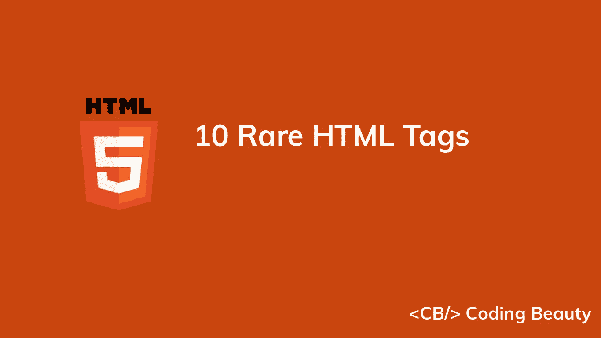

当你第一次学习 HTML 的时候，你可能会接触到许多网站中使用的最常见的标签，这些标签足以满足绝大多数情况。想必每个 web 开发者都听说过无处不在的标签，比如`<html>`、`<body>`、`<p>`、`<a>`，当然还有`<div>`。

然而，与编程语言类似，HTML 不仅仅是基础。除了这些著名的标记之外，还有许多罕见的标记，尽管它们不太受欢迎，但对于更高级和特定的用例来说非常有用。

通过学习这些很少使用的标签来增加我们的 HTML 知识是有好处的，我们将在这篇文章中讨论其中的 10 个。

# 1.`<abbr>`标签

标签定义了一个缩写或首字母缩略词，如 HTML、CSS、PHP、JS、CS、CB 等。

```
I'm reading about
<abbr title="Hypertext Markup Language">HTML</abbr>
tags at
<abbr title="Coding Beauty">CB</abbr>
```

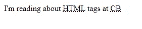

The abbreviation is indicated with a dotted line by default.

我们使用`<abbr>`标签的`title`属性，当您将鼠标悬停在元素上时，显示缩写/首字母缩略词的描述:

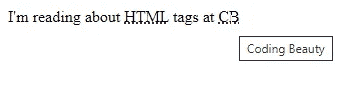

Hovering over an <abbr> element.

# 2.`<q>`标签

`<q>`标签表示其中的文本是一个短的行内引用。

```
<q>Coding creates informative tutorials on Web Development technologies</q>
```

现代浏览器通常通过用引号将文本括起来来实现该标签:

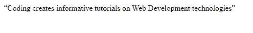

# 3.`<s>`标签

我们使用`<s>`标签来呈现带有一条线(删除线)的文本。这对于表示不再相关或不准确的事物很有用。

```
Buy for <s>$200</s> $100
```

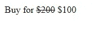

Indicating a change in price with the <s> tag.

与`<s>`相似的是`<del>`标签，它也显示删除线文本，但是它与`<ins>`标签一起使用，表示已经发布的文档中的编辑更改。

```
<!DOCTYPE html>
<html lang="en">
  <head>
    <style>
      del {
        background-color: lightsalmon;
      } ins {
        text-decoration: none;
        background-color: lightgreen;
      }
    </style>
  </head>
  <body>
    My favorite programming language is <del>JavaScript</del>
    <ins>TypeScript</ins>
  </body>
</html>
```

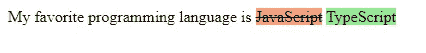

Indicating editorial changes in a document with the <del> and <ins> tags.

# 4.`<mark>`标签

我们使用`<mark>`标签来定义应该被标记或高亮显示的文本。

```
Coding <mark>Beauty</mark> Website
```

默认情况下，`<mark>`对包含的文本应用亮黄色背景:

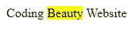

当您使用`Find on Page`工具时，这个标签对于突出显示文档中的文本搜索结果非常有用，就像许多浏览器所做的那样。

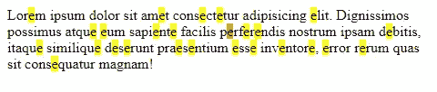

Displaying search results for the letter “e” with the `<mark>` tag.

# 5.`<wbr>`标签

标签定义了文本中可以添加换行符的位置。

当文本在浏览器中换行时，换行后的单词可能太长，并在错误的位置断开。

```
<p>this-is-a-very-long-text-created-to-test-the-wbr-tag</p>
```

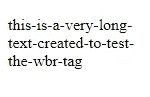

The text is broken at a location chosen by the browser.

缩小浏览器窗口后，上面的文本在浏览器选择的点被换行和断开，这可能不是我们想要的。

通过标签`<wbr>`,我们指定了单词中可以被破坏的确切位置。

```
<p>this-is-a-very-long-te<wbr />xt-created-to-test-the-wbr-tag</p>
```

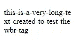

The text is broken at the location set by the <wbr> tag.

# 6.`<details>`标签

使用`<details>`标签，我们可以在一个公开小部件中指定网页上的附加细节，用户可以根据需要查看或隐藏这些细节。

```
<details>
  <summary>Lorem Ipsum</summary>
  Lorem ipsum dolor sit, amet consectetur adipisicing elit. Deleniti eos
  quod fugiat quasi repudiandae, minus quae facere. Sed, quia? Quod
  cupiditate asperiores neque iste consectetur tempore eum repellat incidunt
  qui.
</details>
```

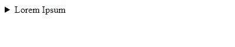

The disclosure widget is closed (default state).

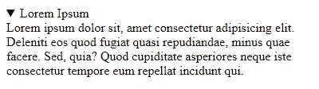

The disclosure widget is open.

# 7.`<optgroup>`标签

`<optgroup>`标签将相关选项组合在一个`<select>`元素中。当选项列表很长时，这可以使用户更容易理解他们的选择。

```
<select name="country" id="countries">
  <optgroup label="North America">
    <option value="us">United States</option>
    <option value="ca">Canada</option>
  </optgroup>
  <optgroup label="Europe">
    <option value="uk">United Kingdom</option>
    <option value="fr">France</option>
  </optgroup>
</select>
```

在这里，我们将列表中的国家按照它们的大洲进行分组。

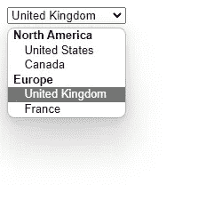

# 8.`<datalist>`标签

我们使用`<datalist>`元素为`<input>`元素指定一个预定义选项列表。它包含一组`<option>`元素，代表推荐或允许的选项，用户可以从中选择。

```
<form>
  <label for="lang">Choose a language:</label>
  <input list="langs" name="lang" id="lang" /> <datalist id="langs">
    <option value="English" />
    <option value="French" />
    <option value="Spanish" />
    <option value="Chinese" />
    <option value="German" />
  </datalist>
</form>
```

为了链接一个`<input>`元素和一个`<datalist>`元素，我们在`<datalist>`上设置了一个`id`属性，并将`<input>`的`list`属性设置为相同的 id。

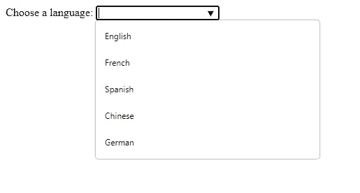

A list of available options for the input is displayed in a dropdown list.

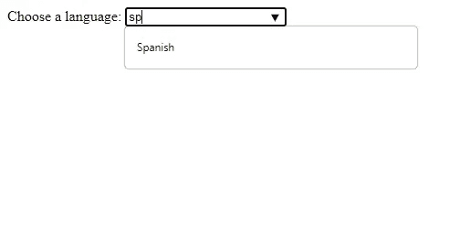

The available options change according to what the user types in the input.

# 9.`<fieldset>`标签

`<fieldset>`元素用于将一个表单中的多个相关元素分组。这个元素提供的视觉分离可以让用户更容易理解你的表单。

```
<form>
  <fieldset>
    <legend>Name</legend> <label for="fname">First Name:</label>
    <input type="text" id="fname" name="fname" /><br />
    <label for="mname">Middle Name:</label>
    <input type="text" id="mname" name="mname" /><br />
    <label for="lname">Last Name:</label>
    <input type="text" id="lname" name="lname" />
  </fieldset>
  <br />
  <label for="email">Email:</label>
  <input type="email" id="email" name="email" />
  <br /><br />
  <label for="password">Password:</label>
  <input type="password" id="password" name="password" />
</form>
```

我们使用`<legend>`标签来定义`<fieldset>`元素的标题。

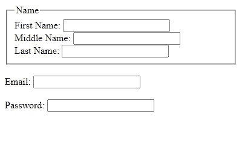

# 10.`<sup>`和`<sub>`标签

我们使用`<sup>`标签来定义应该显示为上标的文本。上标文本通常比正常行高半个字符，字体较小。

另一方面，下标文本出现在正常行下半个字符*处。它也有一个较小的字体，我们使用`<sub>`标签来显示它。*

```
<p>This text contains <sub>subscript</sub> text</p>
<p>This text contains <sup>superscript</sup> text</p>
```

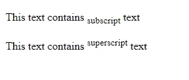

这里有一个更实际的例子:

```
&#x1D465;<sup>2</sup> - 3&#x1D465; - 28 = 0\. Solve for &#x1D465;. <br />
<br />
H<sub>2</sub>SO<sub>4</sub> + NaOH &#8594; Na<sub>2</sub>SO<sub>4</sub> +
H<sub>2</sub>O
```

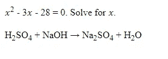

# 结论

在本文中，我们探索了 HTML 中一些最不为人知和利用最少的标签。这些罕见的标签在特定情况下非常有用，尽管它们的使用率很低。

*最初发表于*【codingbeautydev.com】

# *JavaScript 做的每一件疯狂的事情*

*一本关于 JavaScript 微妙的警告和鲜为人知的部分的迷人指南。*

**

*[**报名**](https://cbdev.link/d3c4eb) 立即免费领取一份。*