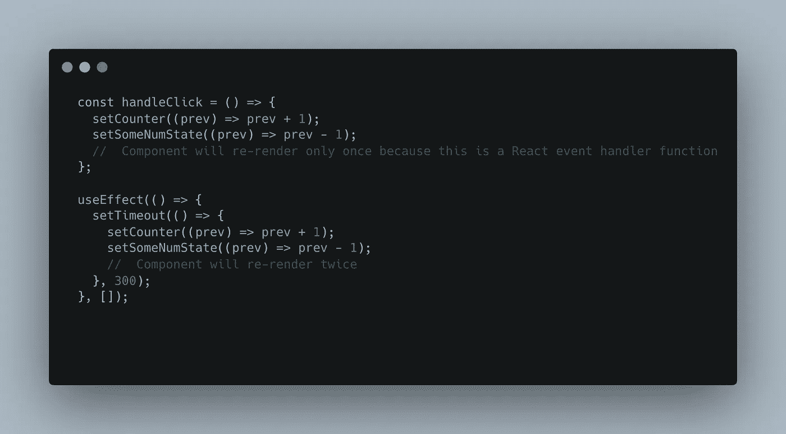
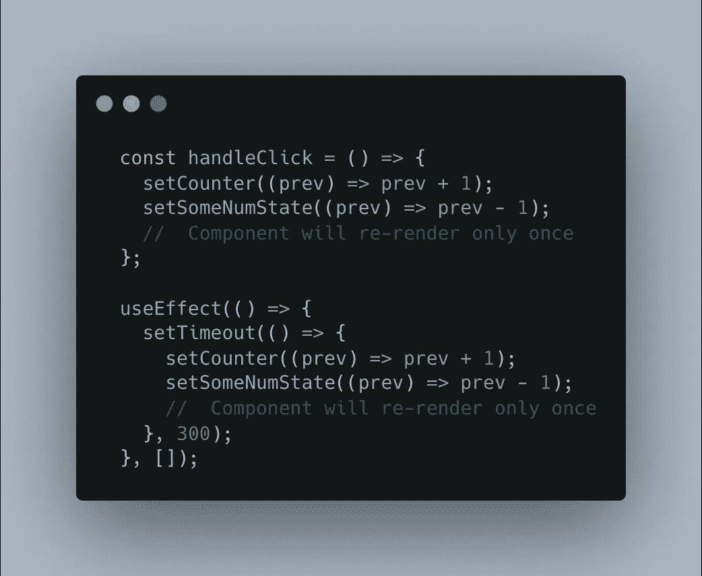
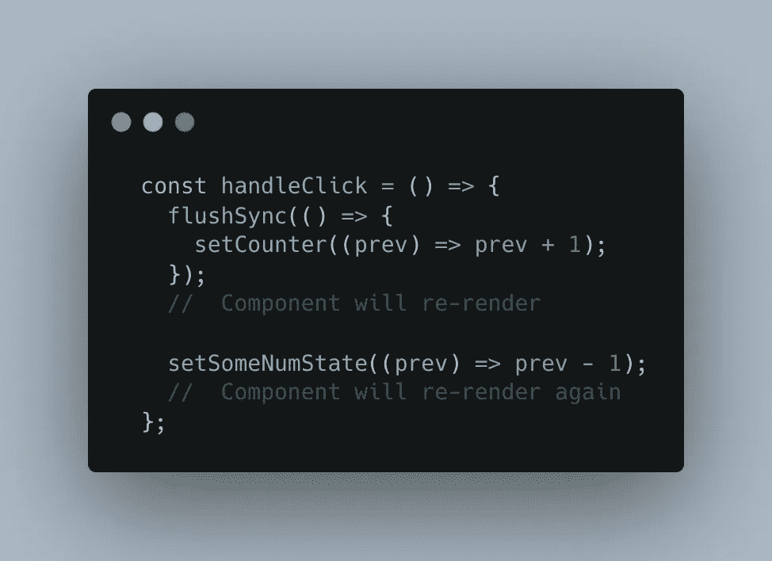
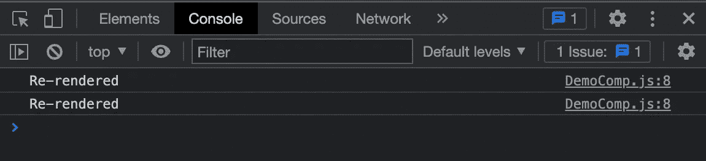

# 反应 18:自动配料

> 原文：<https://javascript.plainenglish.io/react-18-automatic-batching-3cf7bf545ab6?source=collection_archive---------8----------------------->

React 18 有一些很棒的特性，其中之一是自动批处理的概念。在本文中，您将了解什么是批处理，React 以前是如何处理批处理的，以及自动批处理如何改变我们的生活。

让我们从基础开始。

**React 中的批处理是什么？**

批处理只是 React 对多个状态更新进行分组并只重新呈现组件一次以获得更好的性能的方式。

这对于小型应用程序来说并不重要，但是当您有一个更大的应用程序时，每一次不必要的重新渲染都会对您的性能造成负担。

**批处理是 React 的新事物吗？**

不，不是的。React 在版本 18 之前就已经在批处理了。但是只在 React 事件处理程序中批处理多个状态更新。它没有对超时、承诺等情况下发生的状态更新进行批处理。

Batching Before React 18

**版本 18 后的批处理(自动批处理):**

在 React 18 中，promises、setTimeout、本地事件处理程序或任何其他事件中的更新都是自动批处理的。最棒的是，你不必在代码中添加任何东西来使用自动批处理，React 会在你将项目的 React 版本升级到 18 后自动执行。

React 18 — Automatic Batching

**我们可以停止自动配料吗？**

有些情况下，您可能希望在每次状态更新后重新渲染组件，因此不希望 React 自动批处理状态更新。React 引入`flushSync()`功能，在必要时停止自动配料。可以从`react-dom`导入。

让我们看看这在一个真正基础的应用程序上是如何工作的。我们有一个组件，它在每次再次运行时记录“重新呈现”,并且该组件有一个按钮，它像任何普通按钮一样抛出一个单击事件。

Our really basic application 😄

当你点击那个按钮时，两个状态将在处理函数中被更新。为了停止自动批处理，我们将用`flushSync`函数包装其中一个状态更新。

React 18 — flushSync

当我们单击该按钮时，我们可以检查我们的控制台，并看到“重新呈现”被记录了两次，因为我们停止了自动批处理，并为每个状态更新重新呈现组件。

感谢阅读🙂

**参考文献:**

[https://react js . org/blog/2022/03/08/react-18-upgrade-guide . html](https://reactjs.org/blog/2022/03/08/react-18-upgrade-guide.html)

*更多内容请看*[***plain English . io***](https://plainenglish.io/)*。报名参加我们的* [***免费周报***](http://newsletter.plainenglish.io/) *。关注我们关于*[***Twitter***](https://twitter.com/inPlainEngHQ)*和*[***LinkedIn***](https://www.linkedin.com/company/inplainenglish/)*。查看我们的* [***社区不和谐***](https://discord.gg/GtDtUAvyhW) *加入我们的* [***人才集体***](https://inplainenglish.pallet.com/talent/welcome) *。*