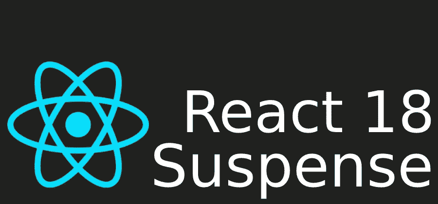
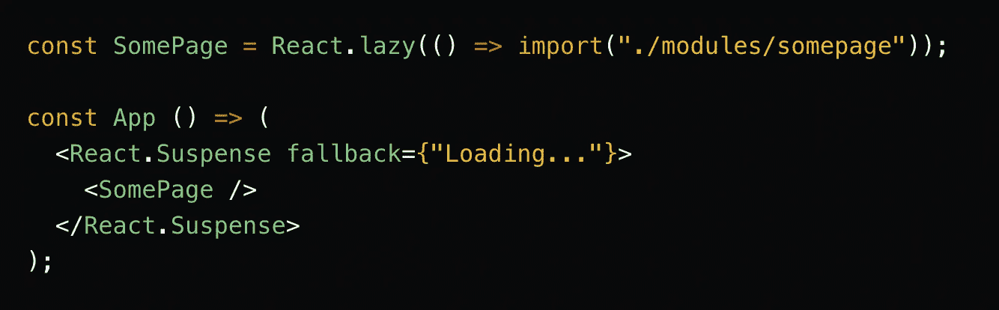
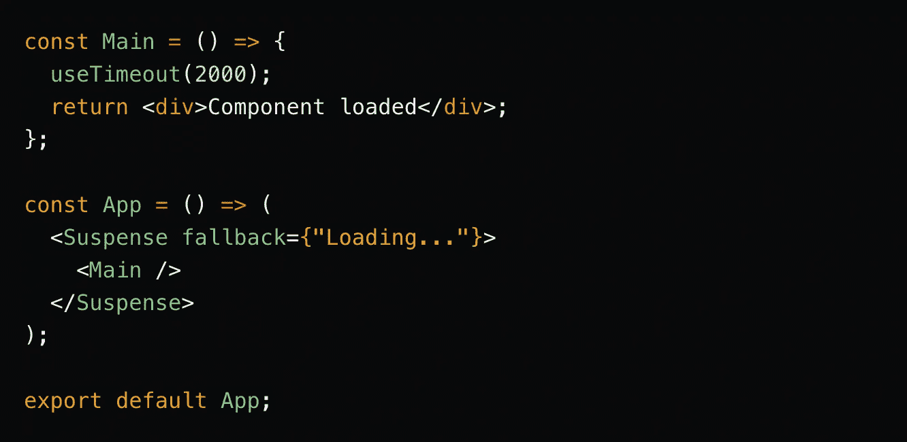
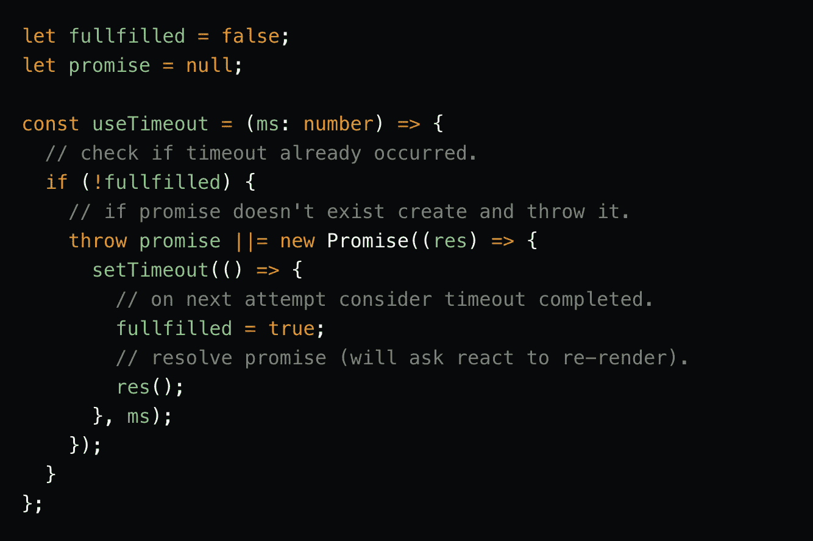

# 反应 18 悬念最小的例子

> 原文：<https://javascript.plainenglish.io/react-18-suspense-minimal-example-775f786ba24?source=collection_archive---------1----------------------->

在 React 的当前版本中(`17.0.2`在本文创建时)，`Suspense`是一个组件，它允许开发人员延迟加载应用程序部分。它接受`fallback`属性，并显示内容，而子组件是延迟加载的。

然而，从 React 18 开始，将有可能使用`Suspense`获取数据。这意味着,`fallback`将一直显示，直到组件获取所有需要的数据。或者一般来说，组件预期的所有事件都会发生。假设我们只想显示占位符 2 秒钟:

如你所料，`Loading...`将显示 2 秒钟，然后显示`Component loaded`。

然而，当我第一次看到上面的代码时，我不明白*怎么会这样...`useTimeout`挂钩的神奇机制是什么？简言之，它必须:*

1.  停止组件代码执行。
2.  让`Suspense`知道组件还没有准备好
3.  通知`Suspence`何时应该重新尝试渲染组件。

要停止代码执行，您需要使用`throw`语句。为了让`Suspense`知道它是预期的，抛出的值需要是一个`Promise`。`Suspense`会抓住这个承诺并订阅它，重新尝试渲染。请注意:下面的代码只是为了演示:

*(一头雾水* `*||=*` *？查看* [*本文档*](https://developer.mozilla.org/en-US/docs/Web/JavaScript/Reference/Operators/Logical_OR_assignment) *)*

事实证明，悬念使用了非常简单的机制，但有一个困难的部分。你可能会问为什么`fullfilled`和`promise`不能存储在 ref 中，这样钩子就可以重用了:

事实证明，当组件没有被加载时，钩子不能被真正使用。在渲染完成之前，组件将在每次渲染尝试时被卸载/装载，而不会抛出承诺。因此，为了弄清楚，如果这个组件实际上已经开始了数据加载过程，我们应该依赖一个全局可用的缓存。(在我们简化的例子中，它只是`fullfilled`变量)。当然，在现实世界的例子中，这种简单的方法是行不通的(这个钩子只工作一次)。

这就是为什么建议使用支持悬念的好库(比如 [SWR](https://swr.vercel.app/) )。

[上面例子的全部代码](https://codesandbox.io/s/suspense-timeout-example-4g7rh)。

👋

*更多内容看* [***说白了就是***](http://plainenglish.io/) *。报名参加我们的* [***免费周报***](http://newsletter.plainenglish.io/) *。在我们的* [***社区获得独家访问写作机会和建议***](https://discord.gg/GtDtUAvyhW) *。*