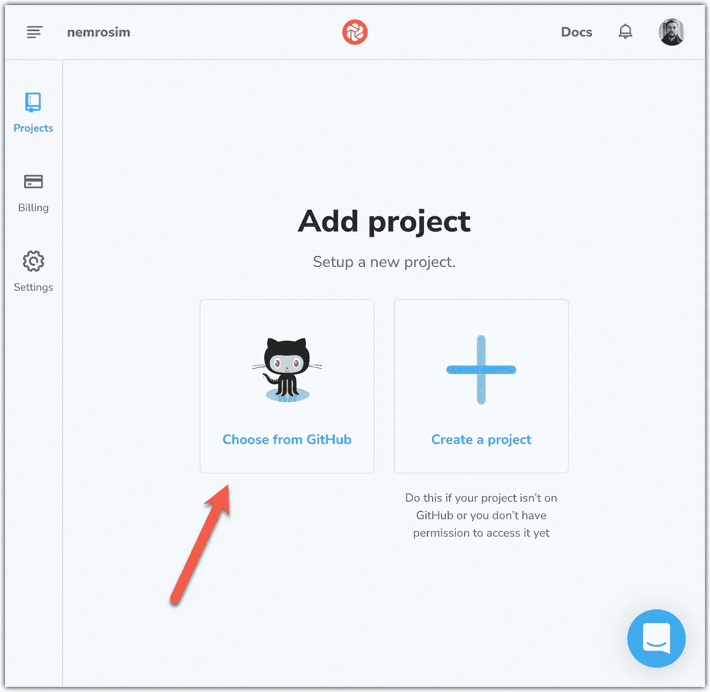

# 具有反应和色度的自动视觉回归测试

> 原文：<https://javascript.plainenglish.io/react-and-chromatic-automated-visual-regression-testing-22551b8ebc93?source=collection_archive---------5----------------------->

## 使用 React 和 colonial 进行自动视觉回归测试的分步指南


# 什么是自动视觉回归测试？

**见**一次胜过**听**一百次。我发现了一个很好的 GIF，它很好地解释了什么是“自动视觉回归测试”。可在[故事书视觉测试](https://storybook.js.org/docs/react/writing-tests/visual-testing)页面找到:


Storybook visual regression testing example

# 保险范围是什么

*   先决条件
*   彩色装置
*   首轮放映
*   彩色和 GitHub 动作
*   批准/拒绝更改

# 先决条件

在我们开始之前，我们将需要一个创建-反应-应用程序，将故事书故事部署到 GitHub 存储库中。我将把这个存储库用于示例目的:

[](https://github.com/nemrosim/react-visual-regression-testing-example) [## git hub-nem rosim/react-目测-回归-测试-示例

### 您现在不能执行该操作。您使用另一个选项卡或窗口登录。您在另一个选项卡上注销，或者…

github.com](https://github.com/nemrosim/react-visual-regression-testing-example) 

`Button.stories.tsx`文件内容:

正是这些故事将被部署到 colonial。

如果您不熟悉[故事书](https://storybook.js.org/)，您可以在这里查看更多:

[](https://medium.com/litslink/storybook-in-examples-beginners-guide-6179cf83e1b6) [## 例子中的故事书。初学者指南

### 故事书是一个独立构建用户界面组件和页面的开源工具。它简化了用户界面开发…

medium.com](https://medium.com/litslink/storybook-in-examples-beginners-guide-6179cf83e1b6) [](https://medium.com/litslink/storybook-decorators-and-context-in-examples-daa4edadaf1a) [## 故事书。例子中的装饰者和语境

### 装饰者是用额外的“渲染”功能来包装故事的一种方式。许多插件定义装饰者来增加你的…

medium.com](https://medium.com/litslink/storybook-decorators-and-context-in-examples-daa4edadaf1a) 

# 彩色装置

首先，打开彩色主页:

[](https://www.chromatic.com/) [## 自动审阅、测试和记录故事书

### UI 开发人员负责组件开发、测试、审查和文档记录。这通常是手动完成的…

www.chromatic.com](https://www.chromatic.com/) 

…并注册。


然后，从 GitHub 中选择一个存储库:



正如我之前提到的，我将选择这个:

[](https://github.com/nemrosim/react-visual-regression-testing-example) [## git hub-nem rosim/react-目测-回归-测试-示例

### 您现在不能执行该操作。您使用另一个选项卡或窗口登录。您在另一个选项卡上注销，或者…

github.com](https://github.com/nemrosim/react-visual-regression-testing-example) 

按照 colonial 的说明进行安装和首次运行:


将[彩色](https://www.npmjs.com/package/chromatic) npm 包添加到您项目的开发依赖项中:

```
yarn add chromatic -D
```

# 首轮放映

将 colonial 安装到您的项目后，运行此命令:

```
npx chromatic --project-token=<*token*>
```

第一次运行时，colonial CLI 工具将自动配置您的项目，并将您的故事书故事部署到您的 colonial 项目中。让我们看看结果:


现在，打开彩色仪表板页面。您将看到您的第一部出版的故事书故事:


让我们对我们的`<Button/>`组件做一个小小的 CSS `background-image`更改:


Before/After

提交更改，然后再次运行 colonial CLI 命令:

```
npx chromatic --project-token=<*token*>
```

让我们之后检查结果。Chromatic 将通知我们它发现了两个视觉变化:


此外，您还会收到一封包含以下信息的电子邮件:


此外，您可以在“彩色仪表板”页面上更详细地调查视觉变化:


# 半音阶和 GitHub 动作

将`tests.yaml`文件添加到`.github/workflows`文件夹。


`tests.yaml`文件内容:

添加`CHROMATIC_PROJECT_TOKEN`秘密到你的回购。


您可以在**管理** → **配置**页面找到项目令牌值:


提交更改并推送。

你会看到，即使过了 33 分钟，我们的流动还没有结束。“问题”是什么？


# 批准/拒绝更改

打开半音阶仪表板，你会看到我们有所改变。


打开最后一个版本，点击`Review changes`:


你会看到变化，点击`Deny`:


回到你的回购。


这对于`master`分支来说不是很有用，但是对于`Pull Request`来说却是一个非常强大的功能，如果设计者不批准你的更改，拉取请求将不会被合并。很酷，不是吗？

相关故事:

[](https://artem-diashkin.medium.com/react-automated-visual-regression-testing-716da2132e9e) [## 做出反应。自动化视觉回归测试

### 使用“jsdom-screenshot”库进行自动化可视化回归测试的快速指南

artem-diashkin.medium.com](https://artem-diashkin.medium.com/react-automated-visual-regression-testing-716da2132e9e) 

如果你喜欢这个故事，你也可以查看“我所有故事的列表”，也许你会找到另一个有趣的故事。编码快乐！

*更多内容看* [***说白了就是***](https://plainenglish.io/) *。报名参加我们的* [***免费周报***](http://newsletter.plainenglish.io/) *。关注我们* [***推特***](https://twitter.com/inPlainEngHQ) *和**[***LinkedIn***](https://www.linkedin.com/company/inplainenglish/)*。加入我们的* [***社区不和谐***](https://discord.gg/GtDtUAvyhW) *。**