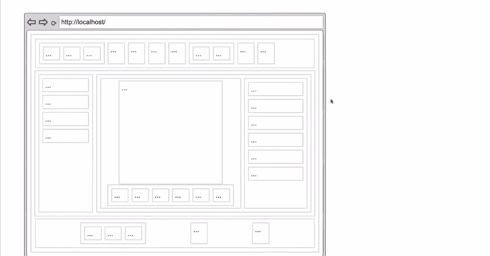

# 做出反应，Next.js 就死了——新的东西(终于)取代了它(永远地)

> 原文：<https://javascript.plainenglish.io/react-and-next-js-is-dead-something-new-is-finally-replacing-it-for-good-c792c48806f6?source=collection_archive---------0----------------------->

这是 JavaScript 框架下一次革命的开始吗？显然，是的！

Photo by [JC Gellidon](https://unsplash.com/@jcgellidon?utm_source=medium&utm_medium=referral) on [Unsplash](https://unsplash.com?utm_source=medium&utm_medium=referral)

web 开发中的悖论是，需要更多的 JavaScript 来实现您的客户想要的特性。然而，让您的站点快速加载所需的 JavaScript 更少。

作为一名开发人员，你总是会在试图在这两者之间取得平衡时被压在中间。

如果我告诉你，你可以想写多少 JavaScript 就写多少——几十亿字节——而不用担心你的应用程序的性能，那会怎么样？

如果我告诉你，到目前为止，你所使用的每一个著名的 web 框架都存在设计上的根本缺陷，你会怎么想？他们期望你的行为会让你的生活变得困难。

JavaScript 是 ***必然*** 。

是时候接受这个现实，简化你的生活(变得更好)了。

# 我们所处的困境(没人告诉你)

> 大众总是错的……智慧就是做大众没有做的一切。你所做的只是颠倒他们学习的总体，你就拥有了他们寻找的天堂。
> 
> —查尔斯·布可夫斯基

我们太顽固了，不承认 web 开发情况(目前)是一团糟的事实。

我们很久以前就得出结论(一个错误),发送 HTML(客户端到服务器)太昂贵，并开始开发(甚至更糟)的替代品。

这些年来，我们一直在开发各种框架——我们一直在与建立网络的*基础*抗争。

请允许我向你展示整个画面，你就会明白我的意思。

在一个典型的 web 应用程序中，我们将服务器端呈现的 HTML 发送给客户端(愿上帝怜悯那些 SPA 人士)，客户端呈现它(在此之前，它是惰性的)——你*不能* **与之交互**。

浏览器做的下一件事是:它为您的页面下载应用程序(JavaScript 部件)。

最后，它执行应用程序(附加监听器)——现在你*可以* **与之交互**。

The browser executes the application means it is attaching listeners (visualized as black boxes) which gives us interactivity.

尽管将整个结构(包括视图)发送给客户端，我们仍然需要等待它变得可交互。

整个过程不必要地增加了启动时间*——这肯定是个问题，不是吗？*

**

*网站加载时间如此之长的主要原因是每次都要从头开始。*

*我们称之为 ***水合*** (我们对每件事都有别出心裁的名字)——我们的意思是浏览器正在读取 JavaScript 部分，并确定代码的哪些部分属于网页上的哪个位置(附加监听器)。*

*嗯，Som——如果这就是问题所在，我们能不能通过延迟加载所有内容来解决这个问题？(听得出来你这么说)。*

*我们可以这样做，但这不是解决方案(正如大多数人所想的那样)。*

*在我们发送服务器端 HTML，客户端下载并执行它之后，我们尝试以特定的块来延迟加载 web 应用程序。*

**

*WebApp (with Lazy load) doesn’t load applications all at once.*

*你猜怎么着？*

*当系统遇到延迟加载的边界时，因为组件是可见的*，它别无选择，只能返回请求延迟加载的组件，下载它们并完成水合。**

****

**这不符合我们最初使用惰性负载的目的**

**延迟加载只在现有的系统中有用，并且对于当前不在你的渲染树中的组件有用，因为在这种情况下你不需要上下文。**

**对于当前位于渲染树中的组件，延迟加载会分散注意力。**

**人们没有意识到这一点，当你说你的应用程序太大时。他们会说“*啊！把所有东西都懒的装进去就好了。***

**其实他们没有意识到，并不是说*容易，具体是因为我们刚才讨论的问题。***

***我们也有这些岛式建筑(由 Astro 推广)***

***在这里，我们不是一开始就对所有东西进行水合处理(这有点昂贵)，而是在客户与特定组件进行交互时进行水合处理。***

***因此，如果我与菜单交互，我只是想水合菜单，如果我与任何特定的组件交互，我只是水合它，而不是整个应用程序。***

******

***Astro***

***这是一个*改进*。***

**但是这些岛还是比较大的。岛间通信成为一个问题，因为你只是把你的组件变成了一个岛，一个岛就是一个应用。现在您有了一个应用程序间的通信问题，您需要以某种方式解决它。**

**现在，Qwik 出现了。**

**当我与一个特定于*的*组件交互时，只有那个特定于*的*组件被解析。**

****

**具体来说，注意到在这个实例中****和*** 组件的子组件都不需要被解析(与 Astro 的情况不同)。***

**Qwik 说，“我只需要做这个人，其他什么都不需要做。”**

**Qwik 还足够智能，能够识别一个组件何时依赖于另一个组件(想象一下电子商务应用程序中的 ***添加到购物车* 🛒** 按钮)并唤醒依赖的组件。**

****

**Qwik Solves the inter-island communication problem**

**如果我们打开 Network 选项卡，我们会发现初始页面加载时没有 JavaScript。**

****

**这个特殊的页面上没有显示 JavaScript，这并不令人印象深刻。任何框架都可以做到这一点(如果你要求的是静态页面)。**

**QWIK 的特别之处在于它自己解决了这个问题。**

**实际上，它只是查找您的代码，然后说，“*实际上，您在这里不需要任何 JavaScript，我甚至不打算发送它。***

**您会注意到，在我们单击按钮之前，JavaScript 不会加载。**

****

**When I click `Hello`, only the piece of code that contains the `console.log(Hello)` shows up. Nothing else!**

**JS 的一个“撒”不用多久就会变成瀑布。随着您的 sprinkles 增长，您的加载时间不会。Qwik 让您随心所欲地编写尽可能多的 JavaScript，而没有包大小或缓慢性能的负担。**

****

**Next.js vs Qwik (on a 3G network)**

**此外，它还很聪明地在后台为网络缓慢的用户预取*文件。***

******

***Qwik-powered apps are interactive from the start.***

***你可以实现不可思议的应用性能，甚至不用考虑它。***

******

# ***独创性常常被伪装成魔法***

***当我开始了解虚拟机时，这对我来说是一个神奇的时刻。” ***什么？这不可能——你可以在一个操作系统中运行一个操作系统？****我心想。****

***但是在我看来神奇的是背后的纯技术。***

***我可以在我的 Windows 机器上启动 Linux，这对我来说是不可思议的。***

***但那不是让我兴奋的事。***

***你可以启动 Linux，登录，打开一个应用程序(比如文字处理器)，开始输入，然后在某个时候，你保存虚拟机，并把你保存的文件发送给你的朋友。***

***当我的朋友打开文件并重启机器时，机器就在我离开的地方。***

***您不必再次经历启动过程。你不需要打开文字处理器，不需要输入字母，你只需要*准确地说是*我离开的地方，打开字母，准备输入下一个字符。***

**这就是吸引我注意力的地方。**

**这正是 QWIK 在这里发生的事情。**

**应用程序在服务器上启动。它让自己处于一种特殊的状态。我们对状态进行快照，将状态以 HTML 的形式发送到客户端，在客户端，我们从停止的地方继续，对吗？**

**本质上，如果你考虑网站启动缓慢的原因，是因为我们必须启动。速度慢的原因是你要为启动——水合作用——付费，正如我们已经看到的。**

**我们说，“*哦！网站仍在加载"*但从根本上说，网站正在启动，这是正在发生的事情，不是吗？**

**QWIK 应用程序快速启动的原因是它们跳过了启动，它们让您回到它在服务器上的确切状态，并从您停止的地方继续。**

**它包含我们想要执行的代码，还可以访问词法环境来更新可能被其他组件共享的状态，这本身来自另一个惰性加载的块。**

> **“最好的代码是根本没有代码”**

**Qwik 之所以快，不是因为效率高，而是因为善于规避工作！**

**它为表格带来了一个全新的渲染范例，称为***resu ability***(它消除了水合的需要。)**

****

**How we develop (now) ***vs*** the way **Qwik** is offering**

**这正是我们在网上播放电影的方式，但在这里，我们采用的是非线性方式。用户决定在时他们**想要** *和* **哪个部分——这就是为什么我们称之为*可恢复*。****

**Qwik 打开了一个充满可能性的全新世界。例如，您可以在多个后端边缘服务上呈现您的页面，并将其组装为单个响应。**

**Watch This 👆 If you want to be a part of the future of web development!**

# **结论**

**几千年前，乔达摩——佛陀告诉我们选择一条中间道路。我们开发商太固执了，我们还是选择走极端。**

**有一个部落告诉你不要使用 JavaScript(每隔一个 SPA)，有一个部落告诉你根本不要选择 JavaScript(基于 WebSocket 的框架，比如 LiveView)，还有其他部落让你在使用 JS 时承受了捆绑包的负担(并且是以性能为代价的)。**

**Qwik 在所有这些方面都是一种新鲜空气，它与我们以前使用过的任何东西都不一样。**

**我在这里不是要宣扬任何框架，但我们必须承认，这种方法是革命性的。**

**我希望有更多的框架能提出这种方法。**

**这种方法是前进的方向，否则，我们将永远处于循环中。**

# **感谢信**

**我想借这个最后的机会说谢谢。**

**谢谢你能来！没有像你这样跟随并带着这种信念去阅读我的帖子的人，我将无法做我所做的事情。**

**我希望你能和我一起在我未来的博客中留下来，因为我认为我们这里有很棒的东西。我希望在未来的许多年里，我能够帮助你继续你的职业生涯！**

**下次见。再见！**

***更多内容请看*[***plain English . io***](https://plainenglish.io/)*。报名参加我们的* [***免费周报***](http://newsletter.plainenglish.io/) *。关注我们关于*[***Twitter***](https://twitter.com/inPlainEngHQ)[***LinkedIn***](https://www.linkedin.com/company/inplainenglish/)*[***YouTube***](https://www.youtube.com/channel/UCtipWUghju290NWcn8jhyAw)*[***不和***](https://discord.gg/GtDtUAvyhW) *。对增长黑客感兴趣？检查* [***电路***](https://circuit.ooo/) *。*****