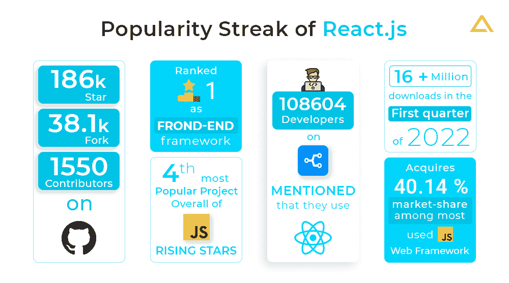
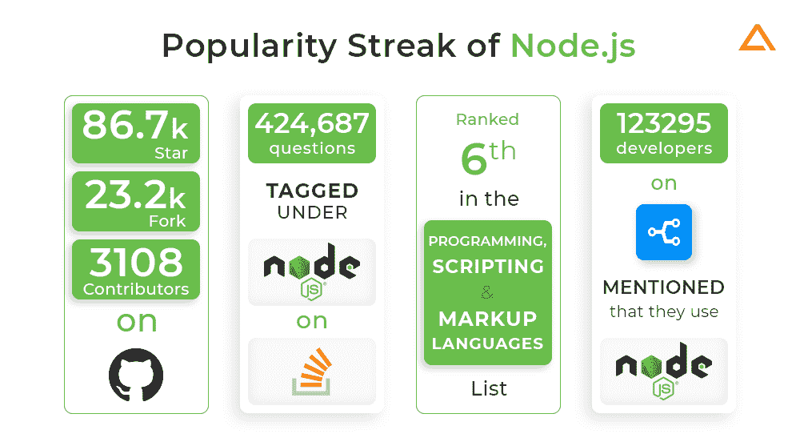
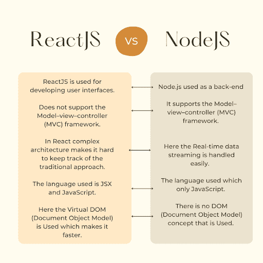
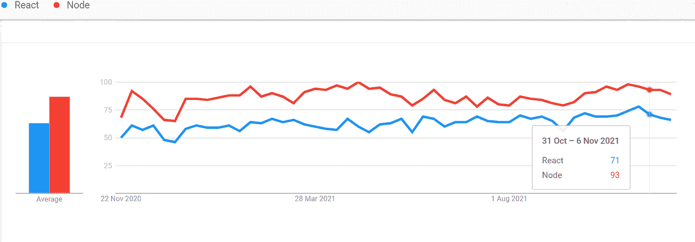
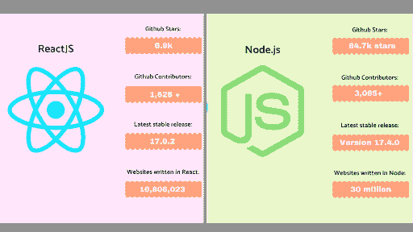

# react & node . js:Web 应用程序开发的致命组合

> 原文：<https://javascript.plainenglish.io/react-and-node-js-a-deadly-combination-for-web-application-development-a175acc51613?source=collection_archive---------4----------------------->

## 探索 React & Node.js 的集成如何成为 web 应用程序开发的最佳组合之一。

Photo by [Shahadat Rahman](https://unsplash.com/@hishahadat?utm_source=medium&utm_medium=referral) on [Unsplash](https://unsplash.com?utm_source=medium&utm_medium=referral)

React 构建用户参与的界面，而 Node.js 可以开发具有高功能和最小响应时间的灵活 web 应用。

开发人员已经见证了一种趋势，他们将 React 与 Node.js 集成在一起，以创建高性能的功能丰富的应用程序。

据 [w3techs](https://w3techs.com/technologies/details/js-react) 统计，3.6%的网站使用 React 我们所知的其 JavaScript 库。这是所有网站的 2.9%。同样， [85%](https://webtribunal.net/blog/node-js-stats/#gref) 的开发者使用 Node.js 进行 web app 开发，它可以将 app 的性能提升 50%。

这两种工具的集成是轻松构建模块化复杂 web 应用程序的杀手级组合之一。

值得注意的是，React 和 Node.js 在 web 应用开发中的结合正在显示出令人印象深刻的效果。

在这篇博客中，我们将深入探讨如何将两种技术结合起来。

React 是希望构建本机、混合和健壮的应用程序的开发人员的一个流行选择。

让我们拥抱 React 的特性，并确定为什么它是 Node.js 的最佳配对之一

[**Image Source**](https://1qkeyv41u1op36vgbm47q0i6-wpengine.netdna-ssl.com/wp-content/uploads/2022/04/Popularity-of-Reactjs.png)

## React 的特性

对于 web 应用程序开发，React 提供了一系列出色的特性，使其成为最受青睐的库。让我们深入探讨它的特点。

*   包括导入到唯一组件中的多个组件。每个组件都是 UI 设计的一个元素，拥有自己的逻辑和控制。这些组件是可重用的。
*   遵循单向数据绑定方法。因此，数据单向流动，从上到下传输，即从父节点到子节点。
*   允许开发者一起编写 HTML 和 JavaScript。使用 JavaScript 语法扩展(JSX)扩展。
*   有一个虚拟的 DOM 来提高应用程序的性能。随着应用程序的每一次变化，虚拟 DOM 都会更新全面的用户界面。
*   它有一个声明性的 UI 来增强代码的可读性，同时简化调试。

## React 的优势

*   它是构建 SEO 友好的 web 应用程序的一站式解决方案。
*   代码可重用性允许开发人员在开发和调试中节省宝贵的时间和精力。
*   数据绑定使开发人员能够监控对任何特定数据段所做的更改。
*   遵循基于组件的方法。使用普通 JavaScript 简化了对它的掌握。结合 HTML 和 JavaScript 形成 JSX 语法来简化其功能。
*   开发人员可以在客户端和服务器端使用它的应用程序部件来加速开发过程。
*   该库旨在交付高性能应用。虚拟 DOM 和服务器端渲染允许复杂的应用程序快速运行。

## 节点. js

以前，我们已经深入研究了 React.js 的特性和优点，现在让我们来看看 Node.js 的属性和实用程序。

Node.js 是用 JavaScript 开发的开源编程语言。它可以在多个平台上运行，从而最大限度地减少开发时间和过程。由于其可伸缩性，它正成为开发人员的理想选择。使用 Node.js 开发者可以构建基于 WebSockets 和微服务的高级应用。

你知道所有网站中有 [2.0%](https://w3techs.com/technologies/details/ws-nodejs#:~:text=js%20is%20used%20by%202.0,whose%20web%20server%20we%20know.) 使用 Node.js 我们知道是谁的 web 服务器吗？你没感到惊讶吗？甚至像 Twitter 和沃尔玛这样的科技巨头也使用 Node 进行后端开发。

[**Image Source**](https://1qkeyv41u1op36vgbm47q0i6-wpengine.netdna-ssl.com/wp-content/uploads/2022/04/Popularity-of-Nodejs-1.png)

## Node.js 的特性

*   兼容各种平台，如移动、Linux、Unix、Windows 和 Mac OS X。
*   它的轻量级特性支持应用程序的快速开发和部署。由于它允许快速数据处理，我们也可以在微服务开发中使用它。
*   它可以同时执行和上传文件。因此，它提高了数据流的速度。
*   无论是前端开发还是后端开发，都可以使用统一编码语言。因此，开发人员必须使用最少的文件，同时消除语言之间的转换。
*   它拥有一个集群模块来处理所有运行 CPU 的负载平衡。

## Node.js 的优势

*   与其他服务器相比具有可扩展性。允许水平和垂直方向的缩放。
*   使用微服务，开发人员可以将他们的应用程序分成较小的组件。因此，他们可以指定任务，并将它们分配给不同的团队，以便快速开发、部署和维护。
*   遵循单线程架构 with‌事件循环模型。事件机制允许服务器以非阻塞格式响应，并使其具有可伸缩性。此外，它可以同时处理多个请求。
*   由于使用了 V8 JavaScript 运行时马达，因此能够快速执行代码。它将 JavaScript 特性拆分成机器码，简化了执行过程。
*   它的包管理器 NPM(节点包管理器)拥有用于 [app 开发](https://www.resourcifi.com/blog/app-development)的模块和工具的动态存储。

## 我们可以将 Node.js 与 React 一起使用吗？

当然可以。Node.js 是为 React 应用程序托管和运行 web 服务器的一个可接受的平台。

原因是:

*   Node.js 与 NPM 注册中心协作，通过 NPM CLI 进行软件包和更新安装。
*   It 群集将应用程序反应到一个独特的文件中。它使用节点模块和 web 包来简化编译。

[**Image Source**](https://miro.medium.com/max/1024/1*byyhjIHjPstHJGcFQcsnOA.png)

此外，使用 Node.js 托管和运行 web 服务器可以在几个方面提供帮助。

*   V8 引擎的集成有助于响应批量请求。使用回调函数来管理这些请求，以监督质量和数量。
*   开发新手可以在 Node.js 环境中运行 React 代码。
*   React DOM 的组件被相应地设计为与 Node.js 一起工作，以最小化代码并简化服务器端呈现。

比如沃尔玛整合了 React 和 Node.js 进行他们的前端开发。这提高了他们的网站性能。

## 使用 React 和 Node.js 的五大理由

**高服务器负载:**它们的组合允许开发人员处理请求并保持服务器负载平衡。

**实时数据:**开发者可以拥有持续稳定的服务器连接，以防他们的应用是实时和数据密集型的。

**JSON API:**node . js 允许为应用程序高效地构建 JSON API。代码可重用性使其能够与 React.js 共享。

**MERN 栈:**可以集成 MERN 栈(MongoDB、React、Node.js、Express)。

**单页面应用:**简化了单页面应用的开发。而且通过回调函数形成了异步加载的轻量级的、有活力的后端模型。

既然您已经了解了这两种编程语言的优点，那么让我们来确定 Node.js 与 React 的融合会引发什么样的火花。

[**Image Source**](https://cdn.devdojo.com/images/december2021/image6.png)

## React 和 Node.js 结合用于 Web 应用程序开发的好处

**实时数据:** Node.js 的事件驱动结构有助于开发实时应用。与 Node.js 后端交互将提高应用程序管理流量的可信度。如果您打算开发一个数据流应用程序，或者您的应用程序处理实时数据管理，Node.js 是构建该应用程序的完美解决方案。

**可伸缩性:**带有 React 的 Node.js 允许开发动态的、数据驱动的、响应迅速的、模块化的 web 应用程序。它带来了大规模项目的可伸缩性，并提高了网站性能。

**快速开发:**React 与 Node.js 的致命结合可以提高你的投资回报率，为你节省宝贵的时间和金钱。由于其代码可重用性和跨平台兼容性，该协会是构建易于维护和快速运行的网站的优秀平台。

**服务器端和客户端都使用独特的语言:**是时候避免使用复杂的后端语言了。React 用于前端，Node.js 用于后端，消除了 web 应用程序开发中不同框架和语言之间的切换。

[**Image Source**](https://miro.medium.com/max/1024/1*6G17YgLNyPNVQx3nxIu6Ag.png)

**高服务器负载:**这个二元体拥有管理高服务器负载和请求的能力。因此，它允许开发人员在开发操作过程中轻松工作。

**更好的应用性能:**由于 React 和 Node 内置的模块化架构，开发者经常会体验到快速的响应和页面加载时间。部署 Node.js 后，PayPal 的平均页面响应时间下降了 [35%](https://webtribunal.net/blog/node-js-stats/#gref)

## 关键要点

尽管有不同的功能，开发人员还是喜欢将 React 和 Node.js 结合起来构建可重用的 UI 模块。无论您是构建一个全新的应用程序还是更新现有的应用程序，React with Node.js 后端集成正在 web 开发中创造奇迹。

React with Node.js 提供了一个平台来快速构建健壮的 web 应用程序，同时带来高性能的设备。

据 [Statista](http://statista.com/statistics/1124699/worldwide-developer-survey-most-used-frameworks-web/) 统计，React.js 已经成为使用最多的框架，2021 年有 40.14%的开发者报告使用 React。此外，全球有[3000 万](https://webtribunal.net/blog/node-js-stats/#gref)网站使用 Node.js 进行 web 应用程序开发。

这两只独角兽在编程语言领域都有着杰出的表现。使用 React 和 Node.js 进行全栈开发可以提升您网站的性能，加快您的业务运作。因此，使用这种致命组合的科技巨头在不断增长的竞争市场中生存了下来。

## 常见问题

**node . js 和 React 是什么？**

Node.js 是一个用于开发服务器端应用程序的开源平台。而 React 是一个用于创建 web 应用程序的开源前端框架。

**React 最好的后端是什么？**

Node.js 是 React 最喜欢的后端。它创建微服务，适用于实时数据密集型应用。

**node . js 可以和 React 一起工作吗？**

是的，Node.js 可以使用 React。Node.js 是一个方便的平台，为基于 React 构建的应用程序托管和运行 web 服务器。

*更多内容请看*[***plain English . io***](https://plainenglish.io/)*。报名参加我们的* [***免费周报***](http://newsletter.plainenglish.io/) *。关注我们关于*[***Twitter***](https://twitter.com/inPlainEngHQ)[***LinkedIn***](https://www.linkedin.com/company/inplainenglish/)*[***YouTube***](https://www.youtube.com/channel/UCtipWUghju290NWcn8jhyAw)*[***不和***](https://discord.gg/GtDtUAvyhW) *。对增长黑客感兴趣？检查* [***电路***](https://circuit.ooo/) *。***