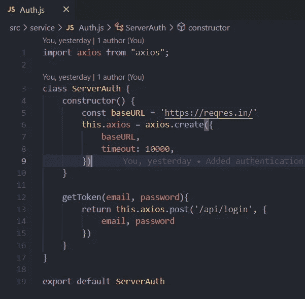
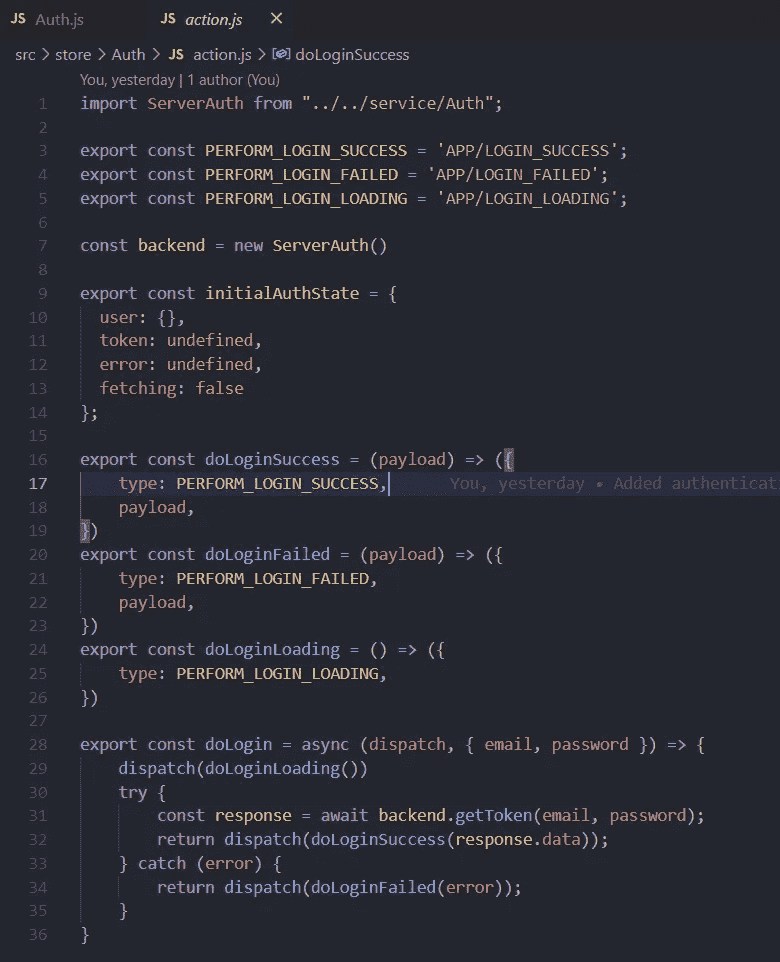
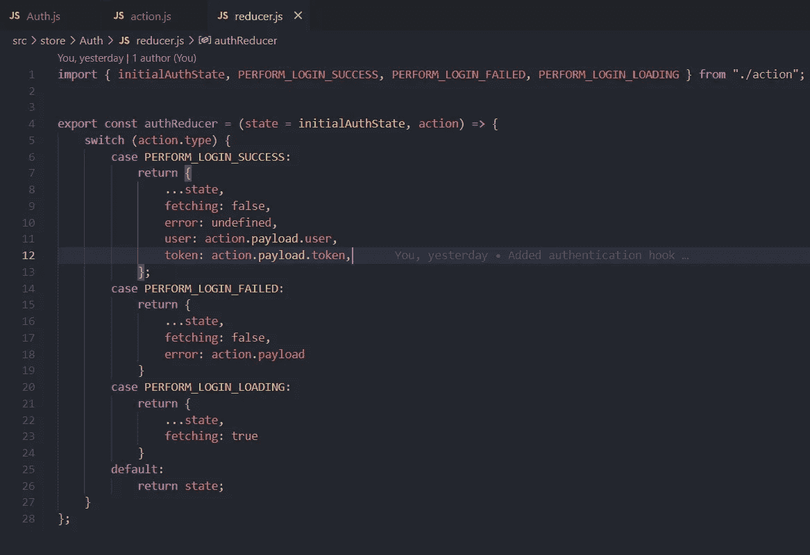
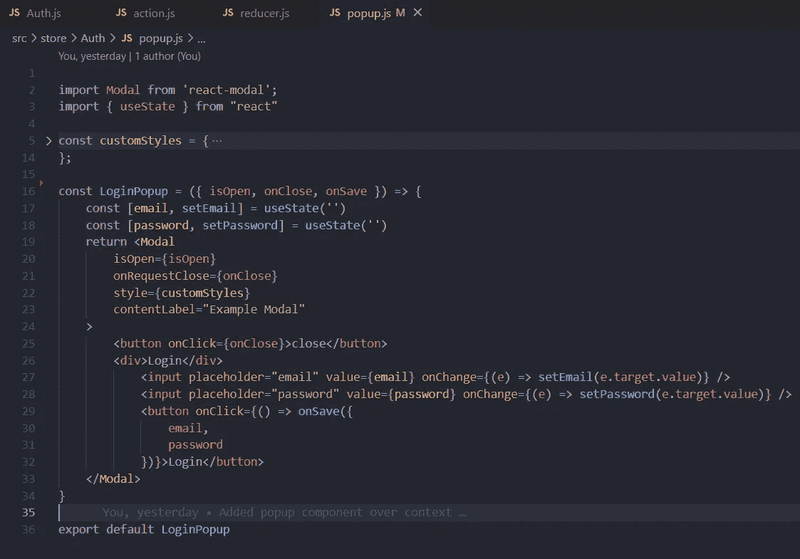
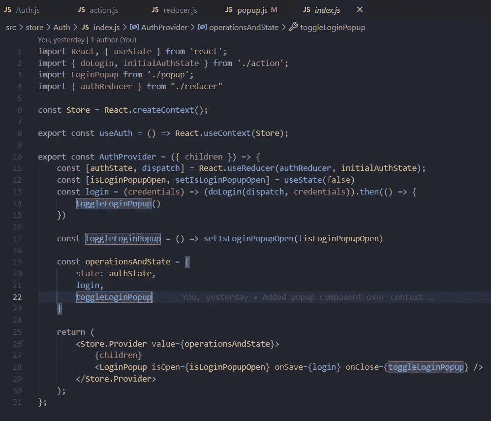
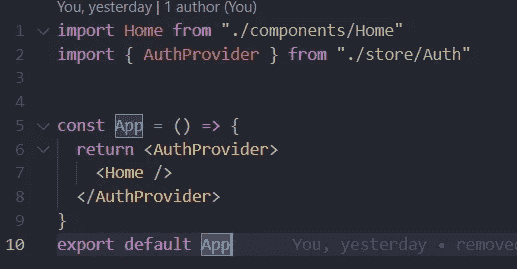
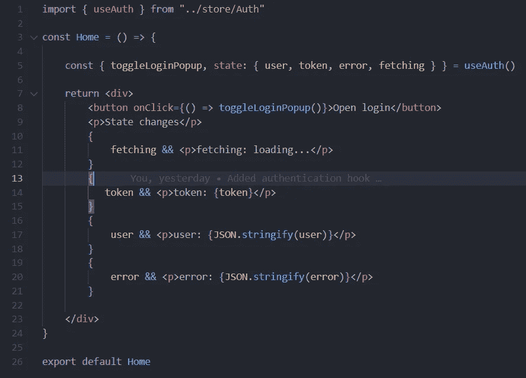

# React Auth Hook —上下文 API 和 useReducer

> 原文：<https://javascript.plainenglish.io/react-auth-hook-context-api-and-usereducer-8567a2ef0d89?source=collection_archive---------0----------------------->

## 创建一个自定义钩子，在 React 和 expose 方法中实现更好的身份验证版本，以更新提供者，就像 MSAL 身份验证一样。


Photo by [Markus Spiske](https://unsplash.com/@markusspiske?utm_source=medium&utm_medium=referral) on [Unsplash](https://unsplash.com?utm_source=medium&utm_medium=referral)

如果管理不当，在任何前端应用程序中处理身份验证都会变得很麻烦。一些应用程序根据其需求有不同的情况。例如，每当会话或令牌过期时触发弹出窗口，或者获取令牌以更新任何其他服务或单个位置，您可以在其中清除缓存和本地存储等。

## 目标

本文的目标是创建一个自定义组件提供程序，它在内部处理 auth API 并管理其状态。此外，公开获取令牌和切换登录弹出窗口的方法。

## 定义

**上下文 API** 是一种跨组件传递属性的机制，无需创建道具树和道具钻取。点击这里阅读官方文档了解背景[以获得更深入的理解。](https://reactjs.org/docs/context.html)

**useReducer** 用于处理复杂的状态逻辑，为我们提供了状态和动作两个基本思路来管理状态。useState 的替代方法，用于调度。点击阅读官方文档[中关于 useReducer 的更多信息。](https://reactjs.org/docs/hooks-reference.html#usereducer)

## 开始

在我们跳到代码之前，如果你想看完整的代码，那么你可以看看这个[回购和源代码](https://github.com/Piyush-Use-Personal/react-auth-hook.git)。

**引导应用程序**

我使用 create-react-app 来引导项目，但是当然，你可以在现有的应用程序或其他程序中实现它。此外，我清理了本文上下文中不需要的文件。

现在假设您对存储、上下文和钩子的定义有了基本的概念，让我们开始编写代码。

在从本文的[中得出的`src/service/Auth.js`内的源代码中添加了一个服务类。](/how-to-handle-different-endpoints-in-axios-and-nodejs-8b288d92e940?source=your_stories_page-------------------------------------)



Auth.js based on reqres

我正在使用一个名为 [reqres](https://reqres.in/) 的在线服务，但是你应该使用你的认证提供者或者后端来处理这个类。

这个类的功能是管理 auth 操作并生成一个令牌，同时在构造函数本身中传递默认的 Axios 属性。

**创建商店**

让我们用以下文件创建另一个名为`store`的文件夹

*   `action.js` —该文件将创建改变状态所需的动作
*   `reducer.js` —基于不同动作控制状态的文件
*   `popup.js` —基于状态变化触发某些用户界面的外部文件
*   `index.js` —整个俱乐部的文件和商店

我们将在创建完商店的所有骨架后，最终触摸到`index.js`。

***在 action.js 文件*** 中，我们将首先创建将触发一些 reducer 方法的所有 action _ TYPES，以及处理错误、成功和加载状态的更少的 ACTION，但是您可以根据您的需要和特性添加和更新这些。

在 doLogin 方法中，我们根据需要分派动作来触发不同的状态变化。



action.js

***在 reducer.js 文件*** 中，我们将导入动作，并根据传入的类型更新状态和还原更少的状态(如果响应成功，则停止加载并清除错误)。



reducer.js

***在 popup.js 文件*** 中，我正在创建一个在上下文中被全局触发的弹出窗口。在弹出窗口中，我放置了一个只更新里面道具的表单，在关闭、提交和打开弹出窗口时，它将对家长保持关闭。

我要了类似`isOpen, onClose and onSave`更新界面的参数。该表单包含两个字段，用于输入电子邮件和密码，以提交到我们在启动阶段开始时创建的后端服务中。

你可以根据你的应用程序版本来更新结构，比如导航到某个页面，或者稍微改变布局等等。



popup.js

**整合我们刚刚创造的一切**

为了将我们刚刚创建的所有内容整合到一个地方，我们添加了一个文件名`index.js`，它将作为 Auth 的父存储。

首先，我们将导入动作、缩减器、弹出文件和内容，以及我们在动作文件中创建的初始状态。导入所有东西后，我用方法`React.createContext`创建了一个存储，并用它`React.useContext`公开一个钩子来使用。

现在，让我们创建一个提供者组件，只将一个道具作为子组件，然后使用我们刚刚创建的与 React `useReducer`函数同名的 reducer，并将 authReducer 和 initialAuthState 作为属性传递给它。

要触发弹出窗口，使用常规的`useState`并在方法中切换它。为了更新动作，我创建了一个名为`login`的方法，并在调度我们之前为异步操作创建的相同方法时公开该方法，并在它发出成功响应后切换该方法。



index.js

设置好所有方法后，让我们创建一个自定义对象来包装状态和方法，并从组件获取控制来调度任何方法。

```
const operationsAndState = { state: authState, login, toggleLoginPopup}
```

这一部分将向组件及其方法公开。在返回时，组件用我们刚刚创建的子窗口和登录弹出窗口包装提供者，并将各自的属性传递给它。

因为我们将它放在子组件级别，所以我们可以从所有子组件中切换它。

**如何使用**

要使用我们刚刚创建的提供者，我们需要将其包装在父组件上。现在，组件树将可以从上下文中访问所有状态。



App.js

要更新状态并触发它，首先，让我们创建一个名为`home.js`的文件，导入我们创建的钩子，并从组件析构中获取触发它的状态和方法。



home.js

这将和我们创造的一样美好。当你运行应用程序时，你可以在点击按钮时切换模式，当你填写细节时，你会同时看到状态的变化。

根据[要求](https://reqres.in/)使用此凭证进行成功检查。

```
{
    "email": "eve.holt@reqres.in",
    "password": "cityslicka"
}
```

## 结论

总结这篇文章，我希望你学到了一些好的东西，并将其应用到你的项目中。尝试创造最适合自己的方法和途径。

对于那些错过了源代码的人来说，可从[这里获得](https://github.com/Piyush-Use-Personal/react-auth-hook.git)。祝你有美好的一天和更好的运气。谢了。

*更多内容请看*[***plain English . io***](https://plainenglish.io/)*。报名参加我们的**[***免费周报***](http://newsletter.plainenglish.io/) *。关注我们关于*[***Twitter***](https://twitter.com/inPlainEngHQ)*和*[***LinkedIn***](https://www.linkedin.com/company/inplainenglish/)*。加入我们的* [***社区***](https://discord.gg/GtDtUAvyhW) *。**