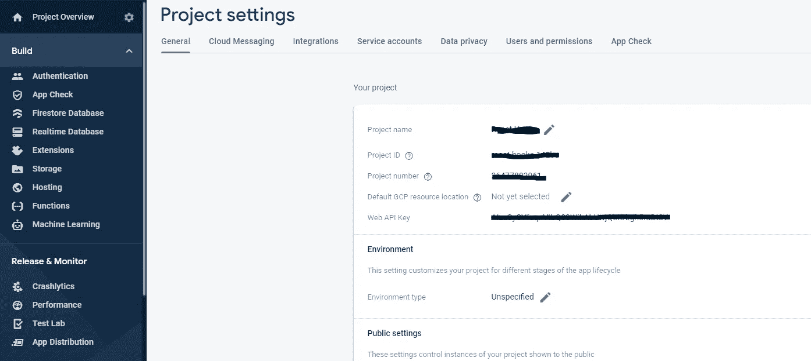
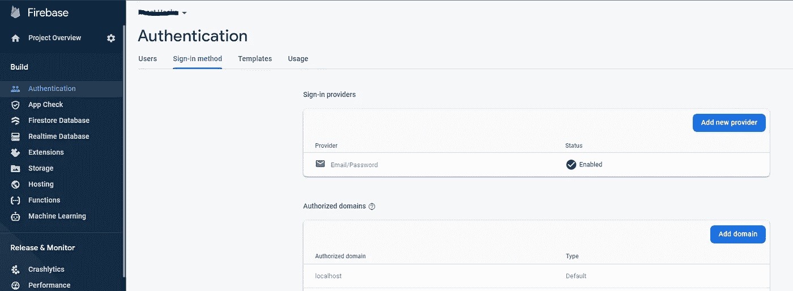
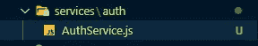
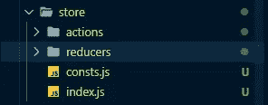
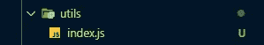
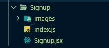
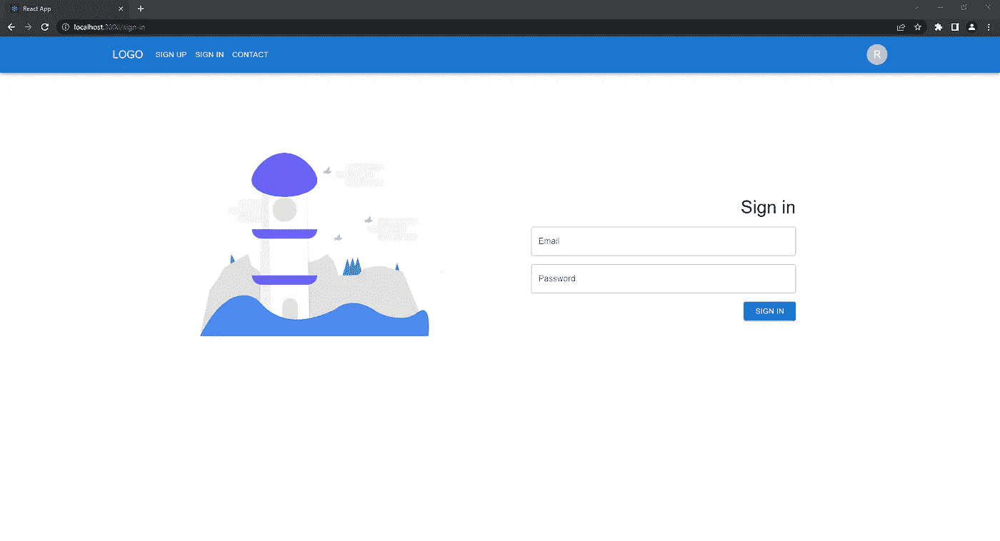
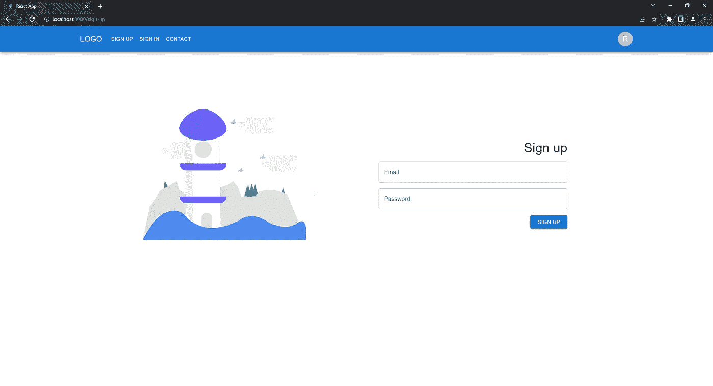
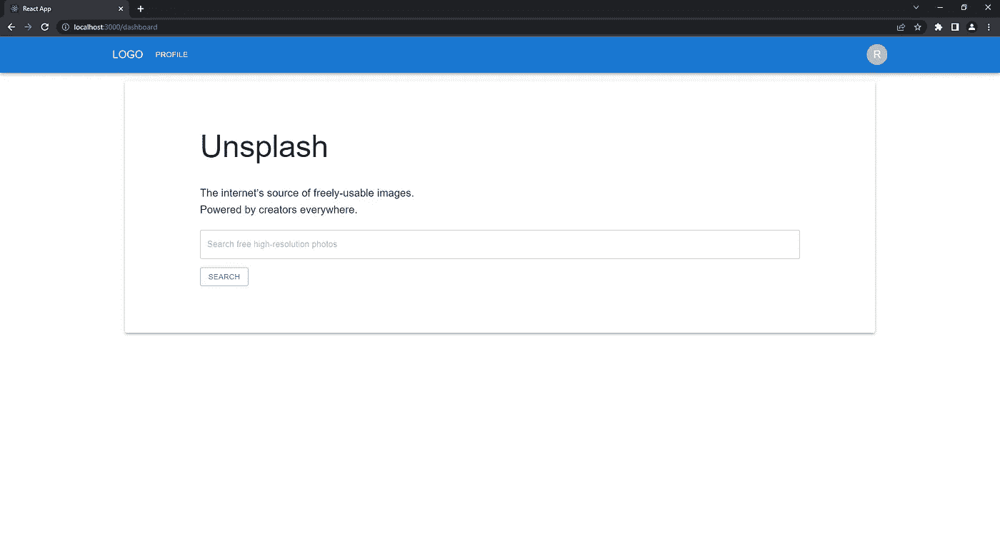

# 使用 Firebase、Redux、Formik、React Router V6 和 Material UI 从头开始进行 React 身份验证

> 原文：<https://javascript.plainenglish.io/react-authentication-from-scratch-with-firebase-redux-formik-react-router-v6-and-material-ui-dc719739a9d6?source=collection_archive---------3----------------------->

## ***在这篇博客中，我们将使用 Firebase、Redux 和 Material UI 实现 React 认证。***

Photo by [Daria Shevtsova](https://unsplash.com/@daria_shevtsova?utm_source=medium&utm_medium=referral) on [Unsplash](https://unsplash.com?utm_source=medium&utm_medium=referral)

***Firebase*** 用于后端认证。 ***Redux*** 用于存储整个 app 的认证状态。 ***材质 UI*** 用于美观的签到和注册屏幕， ***Formik*** 用于维护表单状态。

**你会学到:**

*   如何在 React.js app 中实现一个 ***认证*** 机制？
*   如何在 React.js app 中使用[***Firebase REST API***](https://firebase.google.com/docs/reference/rest/auth)进行认证？
*   如何使用[***Redux***](https://react-redux.js.org/)在 React.js app 中 ***存储和维护认证状态*** 。
*   如何创建 ***保护路由*** 和使用路由与 [***反应路由器 V6*** 。](https://reactrouter.com/)
*   如何 ***构建*** ，**验证**， ***维护*** 表单状态使用[***Formik***](https://formik.org/)***。***
*   如何 ***设计漂亮的*** 使用 [***素材 UI 进行签到和报名屏幕。*T83**](https://mui.com/)

## 我们开始吧。

## 步骤 1 —初始设置和所需的软件包安装

使用 [***创建 React App***](https://reactjs.org/docs/create-a-new-react-app.html)*:*
`npx create-react-app auth-react`设置 React.js 项目

`cd auth-project`

`npm start`

首先， ***安装*** 本项目中 ***所需的软件包*** 。

`npm i @mui/material @emotion/react @emotion/styled formik axios js-cookie react-redux`

## 步骤 2 —建立 Firebase 项目

1.  前往:[https://console.firebase.google.com/](https://console.firebase.google.com/)
2.  设置完成后，从 ***项目设置*** 中抓取 ***Web API 键***

3.现在进入认证菜单，并启用来自签名提供商的电子邮件/密码。

## 步骤 3—认证服务

接下来，编写我们的认证服务代码。这些将保存 HTTP 请求。

此外，在 sessionStorage 中存储令牌。

*   在`src`中创建一个名为`services`的新目录。
*   在`services`目录下，创建`AuthService.js`文件。

AuthService.js

src/services/AuthService.js

## 步骤 4 —设置 Redux 商店

*   在`src.`中新建一个名为`store`的目录
*   在`store`目录下，创建`action, reducers`目录。
*   同样，在同一个`store`目录中，创建`index.js`。

Store Directory

现在，让我们创建一些动作常数，

在`actions`目录中，创建`authActions.js .`

src/store/actions/authActions.js

在`reducers`目录中，创建`authReducers.js`，它将保存 redux 状态更新功能和初始状态所需的所有代码。

src/store/reducers/authReducers.js

我们将在项目中使用更多的减速器，因此我们需要使用`combineReducers() .`将它们组合起来

接下来，在同一个`reducers`目录中创建`index.js`。

src/store/reducers/index.js

现在，我们可以创建基于 API 请求更新身份验证状态的操作。

在此之前，创建一个用于格式化错误的函数。

在`src`中，创建一个`utils`目录，放入`index.js`文件。

src/utils/index.js

src/utils/index.js

开始行动吧，

这里，我们使用`authService`来执行 API 请求。

src/store/actions/authActions.js

现在我们可以配置我们的商店，

在`src/store`目录中，创建`index.js`文件来存放商店和中间件。

src/store/index.js

接下来，将`store`传递给应用程序

首先，我们需要从`react-redux`导入`Provider`组件

确保您正在导入`store`

然后用`Provider`把所有 JSX 包起来，通过`store`作为道具。

src/index.js

## 步骤 5 —自定义反应挂钩

我们将实现一个 React 钩子来检查用户的认证状态。

我们将在`sessionToken`中检查`token`是否存在。

自定义钩子的主要优点是我们可以在多个组件之间重用它。

在`src`中创建一个`hooks`目录，并新建一个文件名为`useAuth`的文件

src/hooks/useAuth.js

## 步骤 5-注册组件

现在让我们实现不同的组件，如`Signup`、`Signin`、`Header`、`Protected Route`和`Dashboard`。

可以免费下载背景图片:[https://undraw.co/](https://undraw.co/)

先从 ***报名组件说起。***

在`src/components.`中创建`Signup`目录

`src/Components/Signup/Signup.js`

在这一步中，我们创建了一个注册组件。我们有两个文本输入，一个用于电子邮件，一个用于密码。我们使用 Formik 来处理和验证表单数据。一旦用户提交了电子邮件和密码，我们将发送`signUpAction.`该操作将调用来自`AuthService,`的 API。如果服务器响应成功，我们将重定向到登录页面，否则将显示一条错误消息。

现在，导出这个组件。

在同一目录下创建新的`index.js` 即`components/Signup/index.js`。

`src/Components/Signup/index.js`

## 步骤 6-登录组件

同样，我们有一个 ***的签到组件。***

`src/Components/Signin/Signin.js`

我们有与注册相同的组件，但这里我们在成功认证后发送`signInAction,`，我们将重定向到仪表板。

## 步骤 7-创建受保护的路由

现在在`src/Components/ProtectedRoute/ProtectedRoute.js`中创建 ***保护路由*** 组件

`src/components/ProtectedRoute/ProtectedRoute.js`

使用自定义钩子，我们检查认证状态，如果用户没有登录，我们重定向到登录页面，否则我们呈现一个受保护的路由。

应该在父路由元素中使用一个`<Outlet>`来呈现它们的子路由元素。这允许在呈现子路线时显示嵌套的 UI。

## 第 8 步—设计其余组件

还有两个组件 ***Dashboard、Header*** 和一个 ***容器*** 页面。

在`src/pages/Container/Container.js`中创建目录。

`src/pages/Container/Container.js`

让我们快速设计它们。

他们两人，分别居住在`src/Components/Dashboard/Dashboard.jsx`和`src/Components/Header.jsx`。

`src/Components/Dashboard/Dashboard.jsx`

`src/Components/Header.jsx`

在标题中，我们根据身份验证状态更改菜单。

不要忘记导入组件。

`src/Components/Dashboard/index.js`

`src/Components/Dashboard/index.js`

`src/Components/Header/index.js`

src/Components/Header/index.js

## 步骤 9-路由和 App.js 设置

现在我们来到了项目的最后一部分！

创建一个名为`src/helpers/helpers.js`的新文件

src/helpers/helpers.js

让我们在`App.js`中实现路由。

src/App.js

现在，使用`npm start`运行应用程序。

Sign in

Sign up

Dashboard

*更多内容请看* [***说白了就是***](https://plainenglish.io/) *。报名参加我们的* [***免费每周简讯***](http://newsletter.plainenglish.io/) *。关注我们*[***Twitter***](https://twitter.com/inPlainEngHQ)*和*[***LinkedIn***](https://www.linkedin.com/company/inplainenglish/)*。查看我们的* [***社区不和谐***](https://discord.gg/GtDtUAvyhW) *加入我们的* [***人才集体***](https://inplainenglish.pallet.com/talent/welcome) *。*