# 使用 React 进行自动化视觉回归测试

> 原文：<https://javascript.plainenglish.io/react-automated-visual-regression-testing-716da2132e9e?source=collection_archive---------4----------------------->

## 使用'`jsdom-screenshot`'库进行自动化可视化回归测试的快速指南


# 什么是自动化视觉回归测试？

**见**一次胜过**听**一百次。我发现了一个很好的 GIF，它很漂亮地解释了什么是“自动化视觉回归测试”。这是在[故事书视觉测试](https://storybook.js.org/docs/react/writing-tests/visual-testing)页面上找到的:

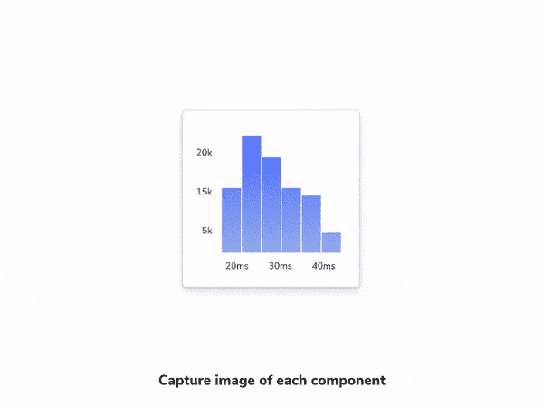

Storybook visual regression testing example

# 将涵盖哪些内容:

*   先决条件；
*   安装；
*   配置；
*   第一次测试；
*   多次测试；
*   测试状态更新更改；

# 先决条件

我已经创建了一个 React 项目，它是由[**create-React-app**](https://create-react-app.dev/)用 TypeScript 模板创建的:

```
npx **create-react-app** my-app --template typescript
```

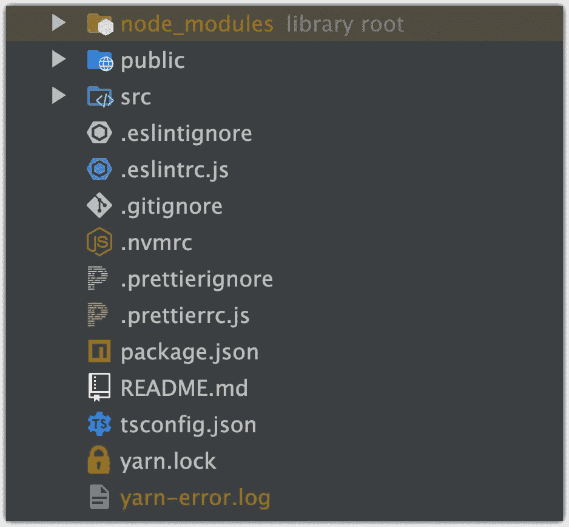

…以及带有 [**样式的组件**](https://www.npmjs.com/package/styled-components) npm 包:

[](/styled-components-with-examples-quick-start-guide-90b398e54cad) [## 开始使用样式组件

### 带示例的样式组件快速入门指南。

javascript.plainenglish.io](/styled-components-with-examples-quick-start-guide-90b398e54cad) 

接下来，我们将创建一个简单的`<Button/>`组件:

按钮样式是从[这里抄来的](https://getcssscan.com/css-buttons-examples)，`***Button 41***`举例:

[](https://getcssscan.com/css-buttons-examples) [## 漂亮的 CSS 按钮示例- CSS 扫描

### 所有这些按钮最初都是使用 CSS Scan 复制的(单击此处尝试免费演示)。使用 CSS 扫描，您可以…

getcssscan.com](https://getcssscan.com/css-buttons-examples) 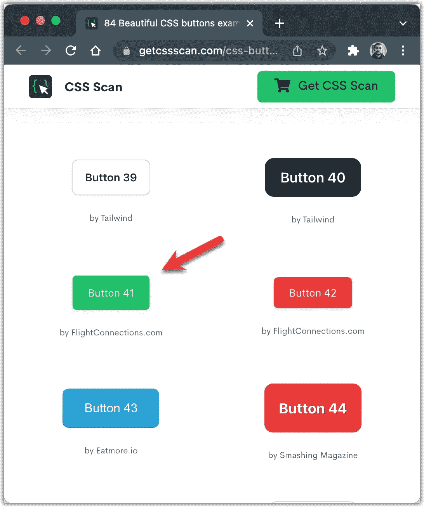

# 装置

对于本地测试，我们将使用 **jsdom-screenshot** 包:

[](https://www.npmjs.com/package/jsdom-screenshot) [## jsdom-截图

### 生成 JSDOM 的截图。⚠️这个包对于可视化回归测试很有用，但是实验性很强。如果你…

www.npmjs.com](https://www.npmjs.com/package/jsdom-screenshot) 

**来自官方文档- >** `jsdom-screenshot`包对可视化回归测试有用**但实验性很强**。

如果你只想进行可视化回归测试，我推荐使用 CI 服务(我们将使用 [Chromatic](https://www.chromatic.com/) 来实现这个目的)。否则，由于不同的操作系统、字体渲染、动画甚至 GPU，您将运行不同的程序。

安装所需的软件包:

```
yarn add jest-image-snapshot @types/jest-image-snapshot jsdom-screenshot @types/jsdom-screenshot -D
```

结果:

```
"jest-image-snapshot": "^4.5.1",
"jsdom-screenshot": "^4.0.0",
"@types/jest-image-snapshot": "^4.3.1",
"@types/jsdom-screenshot": "^3.2.1",
```

# 配置

接下来，我们将需要更新`**setupTests.ts**`文件:

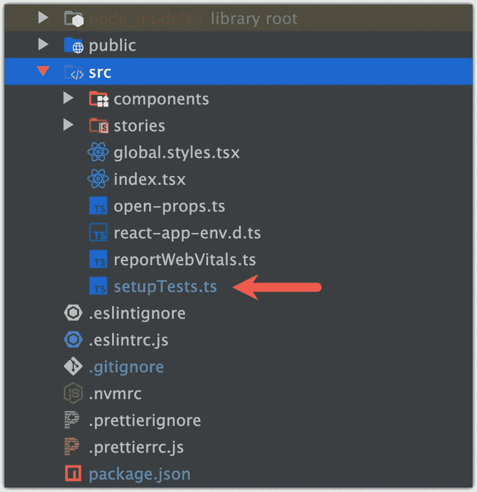

内容:

# 首次测试

现在我们已经准备好添加我们的第一个测试了。创建`Button.spec.tsx`文件:

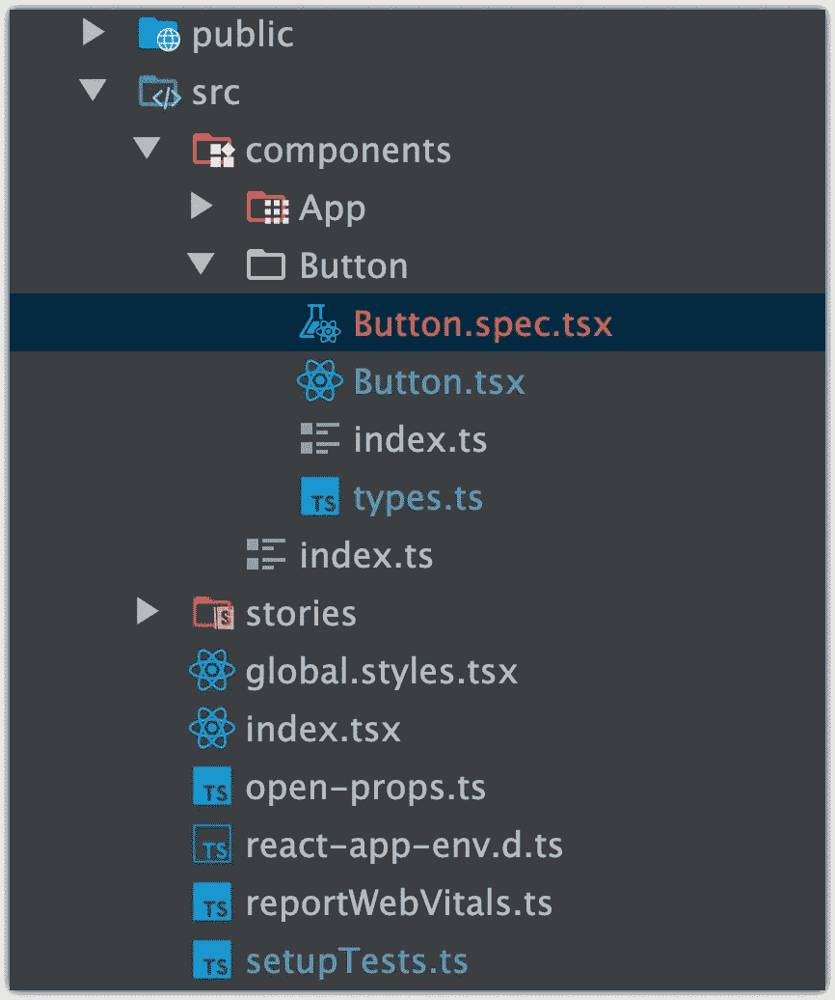

`Button.spec.tsx`文件的内容:

如果您是第一次运行该测试→将创建包含`button-spec-tsx-should-render-button-1-snap.png`文件的文件夹:

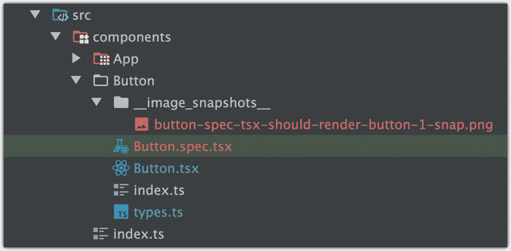

这是我的按钮在应用程序中的外观:

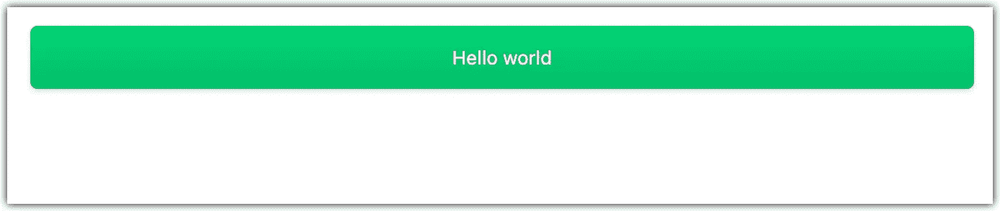

Image of the Button component look on storybook page

这就是`jsdom-screenshot`将为我们产生的结果。快照图像:

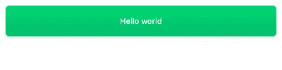

Snapshot image of the “`button-spec-tsx-should-render-button-1-snap.png`” file

如果你一遍又一遍地运行这个测试，什么也不会发生，但是…

让我们将按钮文本的颜色从**白色**改为**黑色:**

```
**// before**
color: #ffffff;**// after**
color: #000000;
```

让我们再次运行测试:

我们将得到一个错误:

```
**Error**: Expected image to match or be a close match to snapshot but **was 0.415% different from snapshot** (166 differing pixels).
See diff for details: *<project-path> +*
/src/components/Button/__image_snapshots__/__diff_output__/button-spec-tsx-should-render-button-1-diff.png
```

并且会创建一个`__diff_output__`文件夹，里面有`button-spec-tsx-should-render-button-1-diff.png`文件；

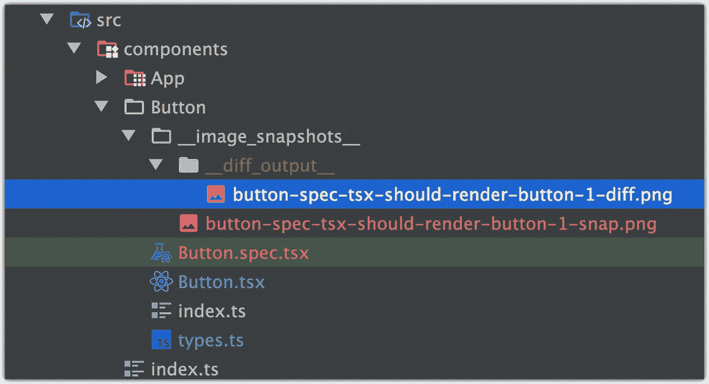

让我们检查一下图像:

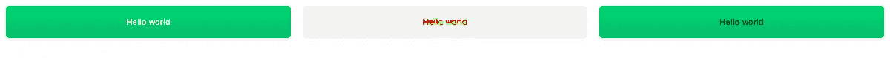

Image snapshot of Component before, Diff and Component after

# 多重测试

我们可以用不同的案例创建尽可能多的测试。让我们更新一下我们的`.spec`测试文件:

⚠️ **注意**:更新样式组件的悬停颜色时会出现问题，所以我们需要显式渲染悬停按钮，以便正确应用样式:

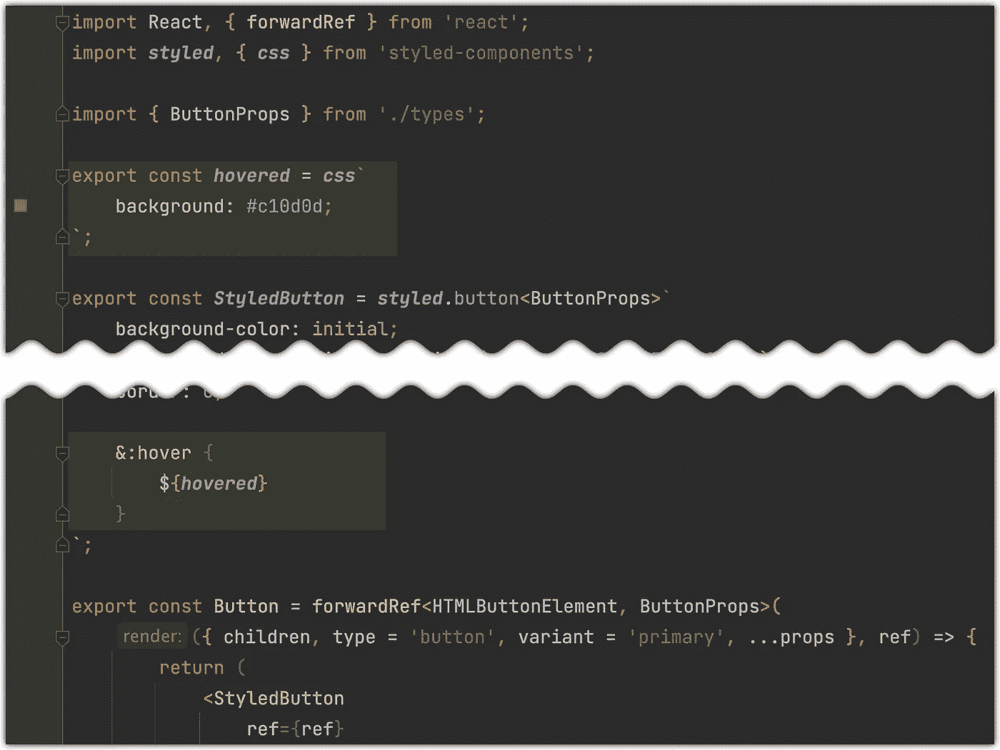

删除以前的快照并再次运行测试:

结果:

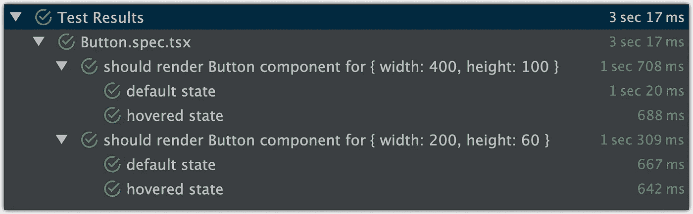

…将创建新文件:

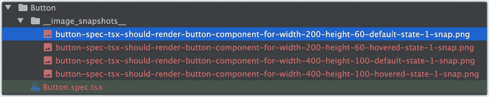

图像:

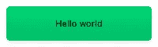

button-spec-tsx-should-render-button-component-for-width-200-height-60-default-state-1-snap

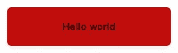

button-spec-tsx-should-render-button-component-for-width-200-height-60-hovered-state-1-snap

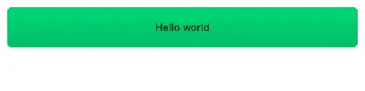

button-spec-tsx-should-render-button-component-for-width-200-height-60-hovered-state-1-snap


button-spec-tsx-should-render-button-component-for-width-200-height-60-hovered-state-1-snap

# 测试状态更新更改

让我们添加一个带有“Hello”的新组件，该组件将在用户单击之前创建的按钮后呈现:

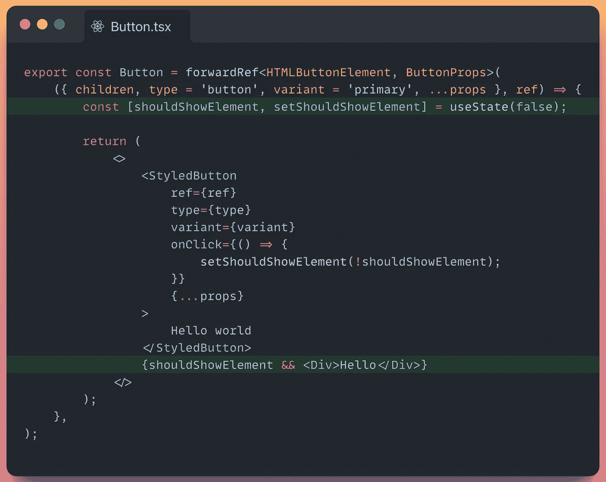

在以下时间后添加新测试:

运行测试:

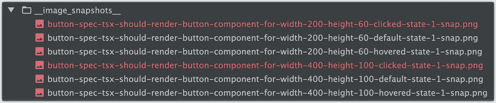

新文件:

*   `button-spec-tsx-should-render-button-component-for-width-200-height-60-clicked-state-1-snap.png`
*   `button-spec-tsx-should-render-button-component-for-width-400-height-100-clicked-state-1-snap.png`

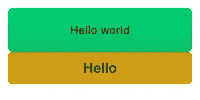

Image snapshot of “button-spec-tsx-should-render-button-component-for-width-200-height-60-clicked-state-1-snap.png” file


Image snapshot of “button-spec-tsx-should-render-button-component-for-width-400-height-100-clicked-state-1-snap.png” file

⚠️ **注意**:这种方法对于**本地**开发和本地测试非常**有用。尤其是在执行命令之前运行这些测试是一个好主意，但是如果你想在 CI 上获得更多特性，并且不想面对性能问题，我建议你使用[彩色](https://www.chromatic.com/)。你可以在这里查看更多信息:**

[](https://artem-diashkin.medium.com/react-and-chromatic-automated-visual-regression-testing-22551b8ebc93) [## 反应和色度。自动化视觉回归测试

### 一步一步的自动化视觉回归测试

artem-diashkin.medium.com](https://artem-diashkin.medium.com/react-and-chromatic-automated-visual-regression-testing-22551b8ebc93) 

Github 资源库链接:

[](https://github.com/nemrosim/react-visual-regression-testing-example) [## GitHub-nemrosim/react-visual-regression-testing-example

### 此时您不能执行该操作。您已使用另一个标签页或窗口登录。您已在另一个选项卡中注销，或者…

github.com](https://github.com/nemrosim/react-visual-regression-testing-example) 

如果你喜欢这个故事，你也可以查看“我所有故事的列表”，也许你会找到另一个有趣的故事。编码快乐！

*更多内容请看*[***plain English . io***](https://plainenglish.io/)*。报名参加我们的* [***免费周报***](http://newsletter.plainenglish.io/) *。关注我们关于*[***Twitter***](https://twitter.com/inPlainEngHQ)*和**[***LinkedIn***](https://www.linkedin.com/company/inplainenglish/)*。加入我们的* [***社区***](https://discord.gg/GtDtUAvyhW) *。**