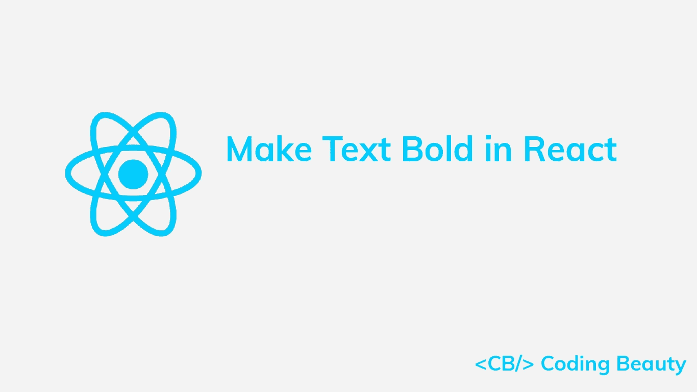
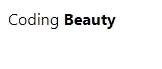
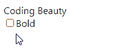

# React 中加粗文本的 3 种简单方法

> 原文：<https://javascript.plainenglish.io/react-bold-text-49687160dd18?source=collection_archive---------10----------------------->



要在 React 中使文本加粗，请用`span`元素将文本换行，并将`span`的`fontWeight`样式属性设置为`bold`。

例如:

**App.js**

```
export default function App() {
  return (
    <div>
      Coding{' '}
      <span style={{ fontWeight: 'bold' }}>Beauty</span>
    </div>
  );
}
```



我们使用内嵌样式来加粗文本。React 元素的`style`属性接受带有 camelCased 属性的 JavaScript 对象，而不是 CSS kebab 大小写字符串。所以，`fontWeight`设置了`font-weight` CSS 属性。

如果我们不需要用一个条件来控制粗体，那么我们可以用一个`b`元素来包装文本。

**App.js**

```
export default function App() {
  return (
    <div>
      Coding <b>Beauty</b>
    </div>
  );
}
```

# 带内嵌样式的有条件加粗文本

有时，我们可能希望只有在某个条件为`true`时才加粗一段文本。我们可以这样做:

**App.js**

```
import { useState } from 'react';export default function App() {
  const [bold, setBold] = useState(false); const handleBoldChange = (event) => {
    setBold(event.target.checked);
  }; return (
    <div>
      Coding{' '}
      <span
        style={{ fontWeight: bold ? 'bold' : 'normal' }}
      >
        Beauty
      </span> <br></br> <input
        name="bold"
        type="checkbox"
        value={bold}
        onChange={handleBoldChange}
      ></input> <label htmlFor="bold">Bold</label>
    </div>
  );
}
```


The text is bold only if the checkbox is checked.

我们使用一个名为`bold`的状态变量来存储复选框的当前选中状态，并确定相关文本是否应该加粗。

我们给`onChange`事件附加了一个事件监听器，所以当复选框被选中或取消选中时，它会被调用。在这个监听器中，我们使用`setBold`函数来更新`bold`的值，并更改文本的粗细。

# 带有自定义组件的粗体文本

如果我们经常需要加粗文本，我们可以将逻辑抽象成一个可重用的定制组件。

**App.js**

```
function BoldText({ children }) {
  return (
    <span style={{ fontWeight: 'bold' }}>{children}</span>
  );
}export default function App() {
  return (
    <div>
      Coding <BoldText>Beauty</BoldText>
    </div>
  );
}
```

这段代码将在网页上产生相同的结果。


放置在`<BoldText>`和`</BoldText>`标签中的任何文本都将使用粗体。

# 带有自定义组件的有条件加粗文本

要使用自定义组件有条件地加粗文本，我们可以创建一个布尔属性`bold`,它将决定组件的子文本是否应该加粗。

**App.js**

```
import { useState } from 'react';function BoldText({ children, bold }) {
  return (
    <span style={{ fontWeight: bold ? 'bold' : 'normal' }}>
      {children}
    </span>
  );
}export default function App() {
  const [bold, setBold] = useState(false); const handleBoldChange = (event) => {
    setBold(event.target.checked);
  }; return (
    <div>
      Coding <BoldText bold={bold}>Beauty</BoldText> <br></br> <input
        name="bold"
        type="checkbox"
        value={bold}
        onChange={handleBoldChange}
      ></input> <label htmlFor="bold">Bold</label>
    </div>
  );
}
```



The text is bold only if the checkbox is checked.

# 带类别的粗体文本

或者，我们可以在 React 中通过在 CSS 文件中定义一个`bold`类来使文本加粗，例如`App.css`:

**App.css**

```
.bold {
  font-weight: bold;
}
```

然后，我们将导入`App.css`文件，并将`bold`类应用于`span`元素，使其中的所有文本都变为粗体。

**App.js**

```
import './App.css';export default function App() {
  return (
    <div>
      Coding <span className="bold">Beauty</span>
    </div>
  );
}
```

这将产生与前两种方法完全相同的结果:


# 带类的有条件加粗文本

下面是我们如何使用一个类名来使文本加粗，如果一个特定的条件是`true`:

**App.js**

```
import { useState } from 'react';
import './App.css';export default function App() {
  const [bold, setBold] = useState(false); const handleBoldChange = (event) => {
    setBold(event.target.checked);
  }; return (
    <div>
      Coding{' '}
      <span className={bold ? 'bold' : ''}>Beauty</span> <br></br> <input
        name="bold"
        type="checkbox"
        value={bold}
        onChange={handleBoldChange}
      ></input>

      <label htmlFor="bold">Bold</label>
    </div>
  );
}
```

使用三元运算符，如果`bold`变量是`true`，我们将`className`属性设置为`bold`类。否则，我们将`className`设置为空字符串(`''`)。


The text is bold only if the checkbox is checked.

**提示:**您可以使用 NPM 的 [clsx](https://www.npmjs.com/package/clsx) 实用程序来代替三元运算符，以便更容易地根据 React 中的一组条件构造类名。

*最初发表于*[*codingbeautydev.com*](https://cbdev.link/ac7495)

# JavaScript 做的每一件疯狂的事情

一本关于 JavaScript 微妙的警告和鲜为人知的部分的迷人指南。


[**报名**](https://cbdev.link/d3c4eb) 立即免费领取一份。