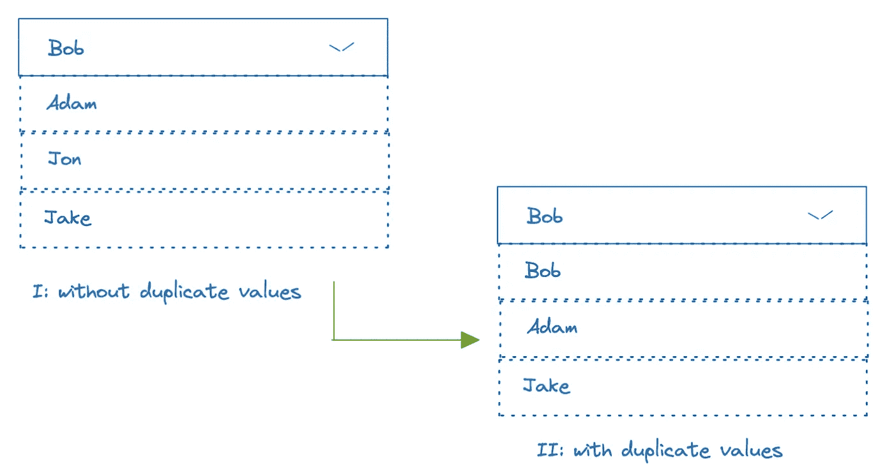
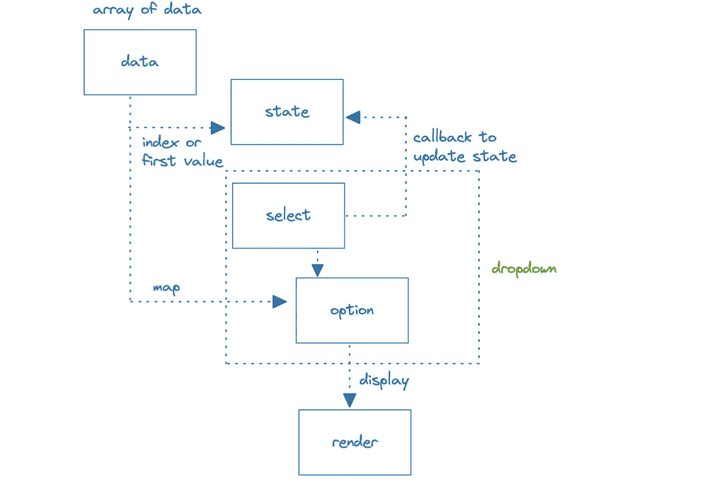
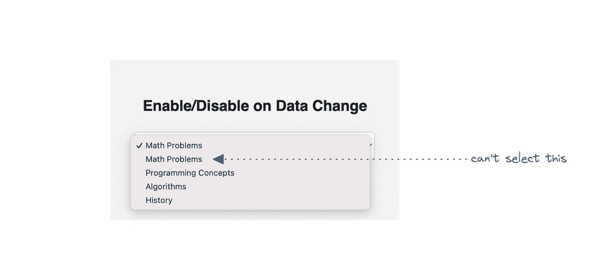

# React:构建下拉组件

> 原文：<https://javascript.plainenglish.io/react-building-dropdown-component-9dbab1966632?source=collection_archive---------9----------------------->

## 在下拉组件中选择重复值

fig(1): building dropdown component

## 介绍

在这篇博客中，我们将构建一个 React 组件，允许用户从下拉列表中选择值，然后处理值相同的情况。为了保持博客的简单，数据集被硬编码在组件中，但是在您的情况下，您可以从 API 获取这些数据，或者将它们作为道具接收。

## 动机

我们的 SPA 允许用户在不同的组和子组之间复制内容，但是如果子组有相同的内容标题，那么我们的下拉列表总是默认为列表中的第一个值。这防止了用户复制第二内容。可能的解决方案是:

*   不允许用户创建具有相同内容标题的内容
*   不要再显示重复的内容标题
*   允许用户毫无问题地选择相同标题的内容

## 数据

## 设计

fig(2): dropdown data flow design

## 密码

首先，我们将重点构建负责列出数据并允许用户选择感兴趣的值的组件。在后面的部分中，我们将修改同一个组件来处理重复值。

请随意用上述代码替换代码沙盒代码，以重现该问题。如果你这样做，我们可以看到用户不能选择第二个重复的值(即数学问题)。

fig(3): listing data in dropbox with duplicates [issue replication]

更新了代码以处理重复值:

这里是 [codesandbox](https://codesandbox.io/s/handle-select-with-duplicate-values-yyg95l?file=/src/components/Form.js:0-1173) 中的完整例子。

**奖励**:我们可以采取额外的步骤，将下拉逻辑提取到它自己的组件中，这样它就可以发布到可重用组件库中。

**我之前的三篇博客:**
1。[React:AWS Cloud](/react-spa-with-path-based-routing-in-aws-cloud-2e5b0e4739b6)
2 中基于路径路由的 SPA。 [React:搜索组件设计](/react-search-component-design-6b0e618dbf5f)
3。 [React | Node:为什么要关心依赖关系？](https://citta-lab.medium.com/react-node-why-should-we-care-about-dependencies-a8d3e904689b)

*更多内容请看*[***plain English . io***](https://plainenglish.io/)*。报名参加我们的* [***免费周报***](http://newsletter.plainenglish.io/) *。关注我们关于*[***Twitter***](https://twitter.com/inPlainEngHQ)[***LinkedIn***](https://www.linkedin.com/company/inplainenglish/)*，以及* [***不和***](https://discord.gg/GtDtUAvyhW) *。*