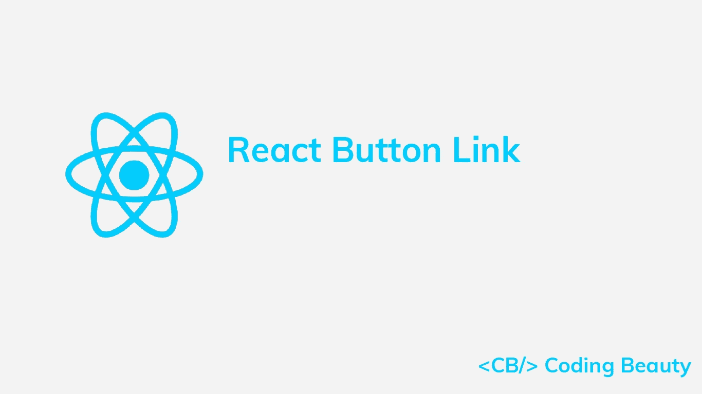
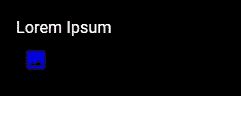
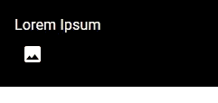

# 如何在 React 中使用按钮作为链接

> 原文：<https://javascript.plainenglish.io/react-button-link-35b107239233?source=collection_archive---------7----------------------->

## 了解如何创建按钮链接，使浏览器在单击时导航到新的 URL。



# HTML 锚元素

要在 React 中将按钮用作链接，请将按钮放在锚(`<a>`)元素中。单击链接按钮将使浏览器导航到指定的 URL。

```
export default function MyComponent() {
  return (
    <div>
      {/* Anchor link */}
      <a href="/posts">
        <button>Posts</button>
      </a>
    </div>
  );
}
```

# react-router-dom 链接组件

如果您使用 React Router，那么将按钮包装在`Link`组件中，使浏览器导航到指定的路线，而无需在单击按钮时刷新页面。

```
import { Link } from 'react-router-dom';export default function MyComponent() {
  return (
    <div>
      <Link to="/posts">
        <button>Posts</button>
      </Link>
    </div>
  );
}
```

`react-router-dom` `Link`组件呈现一个锚元素，因此它的工作方式与第一个例子类似。

我们也可以使用自定义按钮组件作为链接，方法是用锚元素或`Link`组件包装它们。例如:

```
import { Link } from 'react-router-dom';function MyCustomButton({ children }) {
  return <button>{children}</button>;
}export default function MyComponent() {
  return (
    <div>
      <Link to="/posts">
        <MyCustomButton>Posts</MyCustomButton>
      </Link>
    </div>
  );
}
```

# 使用材质 UI 按钮作为链接

当使用材质 UI 时，我们可以使用`href`属性为`Button`组件指定一个链接。

```
import { Button } from '@mui/material';export default function MyComponent() {
  return (
    <div>
      <Button href="/posts">Posts</Button>
    </div>
  );
}
```

# 材质 UI 组件属性

要用作反应路由器`Link`，我们可以使用`Button`的`component`道具。

```
import { Button } from '@mui/material';
import { Link } from 'react-router-dom';export default function MyComponent() {
  return (
    <div>
      <Button component={Link} to="/posts">
        Posts
      </Button>
    </div>
  );
}
```

其他材质 UI 组件像`IconButton`也有一个`component`道具。当我们希望 button 组件从其父组件继承其颜色时，设置此属性非常有用。

在这种情况下，如果我们用`Link`包装组件，它将从`Link`而不是预期的父组件中继承它的颜色。例如:

```
import { IconButton, Box, Typography } from '@mui/material';
import { Link } from 'react-router-dom';
import { Photo } from '@mui/icons-material';export default function MyComponent() {
  return (
    // We want the IconButton to inherit its parent color (white)
    <Box sx={{ backgroundColor: 'black', color: 'white', padding: 2 }}>
      <Typography>Lorem Ipsum</Typography> {/* But this wrapping makes it inherit from this Link */}
      <Link to="/photos">
        <IconButton color="inherit">
          <Photo />
        </IconButton>
      </Link>
    </Box>
  );
}
```



The Button inherits its color from the Link (blue) instead of the Box (white).

我们可以通过将`component`属性设置为`Link`而不是换行来解决这个问题:

```
import { IconButton, Box, Typography } from '@mui/material';
import { Link } from 'react-router-dom';
import { Photo } from '@mui/icons-material';export default function MyComponent() {
  return (
    <Box sx={{ backgroundColor: 'black', color: 'white', padding: 2 }}>
      <Typography>Lorem Ipsum</Typography> {/* Setting the "component" prop to a "Link" component */}
      <IconButton component={Link} to="/photos" color="inherit">
        <Photo />
      </IconButton>
    </Box>
  );
}
```



The Button inherits its color from the Box.

*最初发表于:*[*codingbeautydev.com*](https://cbdev.link/8286ee)

# JavaScript 做的每一件疯狂的事情

一本关于 JavaScript 微妙的警告和鲜为人知的部分的迷人指南。


[**报名**](https://cbdev.link/d3c4eb) 立即免费领取一份。