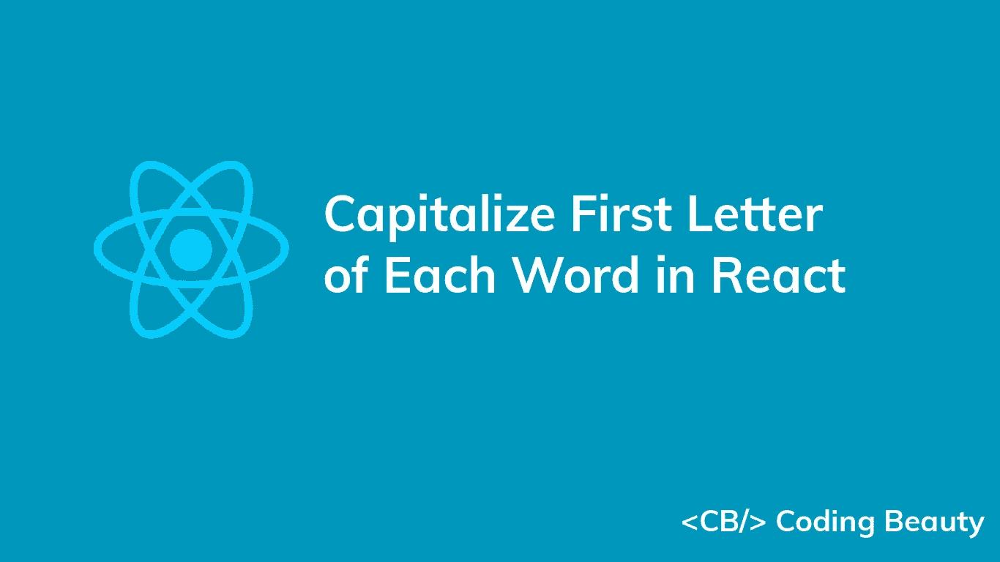
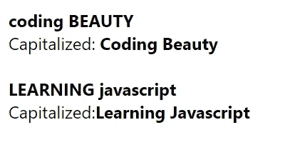

# 如何将 React 中每个单词的首字母大写

> 原文：<https://javascript.plainenglish.io/react-capitalize-first-letter-of-each-word-4fbf277e584b?source=collection_archive---------3----------------------->



要在 React 中将字符串中每个单词的首字母大写:

1.  用`.split('')`将字符串拆分成单词数组。
2.  用`.map()`迭代单词数组。
3.  对于每个单词，返回一个新单词，该单词的第一个字母的大写形式加上单词的其余部分，即`word.charAt(0).toUpperCase() + word.slice(1)`。
4.  用`.join(' ')`将单词数组连接成一个字符串。

例如:

`App.js`

```
export default function App() {
  const capitalizeWords = (str) => {
    return str
      .toLowerCase()
      .split(' ')
      .map((word) => word.charAt(0).toUpperCase() + word.slice(1))
      .join(' ');
  };

  const str1 = 'coding BEAUTY';

  const str2 = 'LEARNING javascript';

  return (
    <div>
      <b>{str1}</b>

      <br />

      Capitalized: <b>{capitalizeWords(str1)}</b>

      <br />
      <br />

      <b>{str2}</b>

      <br />

      Capitalized:

      <b>{capitalizeWords(str2)}</b>
    </div>
  );
}
```



Strings, along with the result of capitalizing the first letter of each of their words.

`capitalizedWords()`函数获取一个字符串并返回一个所有单词都大写的新字符串。

首先，我们使用`[toLowerCase()](https://developer.mozilla.org/en-US/docs/Web/JavaScript/Reference/Global_Objects/String/toLowerCase)`方法将整个字符串小写，确保每个单词只有第一个字母是大写的。

```
// coding beauty
console.log('coding BEAUTY'.toLowerCase());
```

**提示**:如果每个单词中剩余的字母不需要小写，可以去掉对`toLowerCase()`方法的调用。

然后我们调用字符串上的`[String](https://developer.mozilla.org/en-US/docs/Web/JavaScript/Reference/Global_Objects/String/split)` [](https://developer.mozilla.org/en-US/docs/Web/JavaScript/Reference/Global_Objects/String/split)`[split()](https://developer.mozilla.org/en-US/docs/Web/JavaScript/Reference/Global_Objects/String/split)`方法将所有单词拆分成一个数组。

`App.js`

```
// [ 'welcome', 'to', 'coding', 'beauty' ]
console.log('welcome to coding beauty'.split(' '));
```

在创建单词数组之后，我们对它调用`[map()](https://developer.mozilla.org/en-US/docs/Web/JavaScript/Reference/Global_Objects/Array/map)`方法，并使用一个回调函数作为参数。该函数由`map()`调用，并为数组中的每个单词返回一个结果。

在函数中，我们用`[charAt()](https://developer.mozilla.org/en-US/docs/Web/JavaScript/Reference/Global_Objects/String/charAt)`获取单词的第一个字符，用`[toUpperCase()](https://developer.mozilla.org/en-US/docs/Web/JavaScript/Reference/Global_Objects/String/toUpperCase)`将其转换为大写，并将其与字符串的其余部分连接起来。

我们用`[String](https://developer.mozilla.org/en-US/docs/Web/JavaScript/Reference/Global_Objects/String/slice)` [](https://developer.mozilla.org/en-US/docs/Web/JavaScript/Reference/Global_Objects/String/slice)`[slice()](https://developer.mozilla.org/en-US/docs/Web/JavaScript/Reference/Global_Objects/String/slice)`的方法得到字符串的剩余部分。将`1`传递给`slice()`会使它返回从第二个字符到末尾的那部分字符串。

**注意:**字符串(和数组)索引是从零开始的 JavaScript，所以字符串中的第一个字符在索引 0 处，第二个在 1 处，最后一个在`str.length-1`

最后，我们用`[Array](https://developer.mozilla.org/en-US/docs/Web/JavaScript/Reference/Global_Objects/Array/join)` [](https://developer.mozilla.org/en-US/docs/Web/JavaScript/Reference/Global_Objects/Array/join)`[join()](https://developer.mozilla.org/en-US/docs/Web/JavaScript/Reference/Global_Objects/Array/join)`方法将单词连接成一个字符串

向`join()`传递一个空格(`' '`)会在结果字符串中用空格分隔单词。

```
// Welcome To Coding Beauty
console.log(['Welcome', 'To', 'Coding', 'Beauty'].join(' '));
```

在创建了`capitalizeWords()`函数之后，我们调用它，因为组件是通过在我们的 JSX 代码中用花括号(`{ }`)将它括起来呈现的。

`App.js`

```
return (
    <div>
      <b>{str1}</b>

      <br />

      Capitalized: <b>{capitalizeWords(str1)}</b>

      <br />
      <br />

      <b>{str2}</b>

      <br />

      Capitalized:

      <b>{capitalizeWords(str2)}</b>
    </div>
  );
```

该函数被调用，其结果呈现在花括号所在的位置。

*原载于【codingbeautydev.com】[](https://cbdev.link/df43b0)*

# *JavaScript 做的每一件疯狂的事情*

*一本关于 JavaScript 微妙的警告和鲜为人知的部分的迷人指南。*

**

*[**报名**](https://cbdev.link/d3c4eb) 立即免费领取一份。*