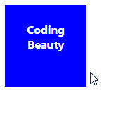

# 如何在 React 中改变悬停时的元素样式

> 原文：<https://javascript.plainenglish.io/react-change-style-on-hover-96e53178ce12?source=collection_archive---------9----------------------->


要在 React 中的悬停上更改元素的样式，请在元素上设置一个`className`，并设置其`:hover`伪类的样式。

例如:

`App.js`

```
import './App.css';

export default function App() {
  return (
    <div>
      <div className="box">
        <p>Coding Beauty</p>
      </div>
    </div>
  );
}
```

`App.css`

```
.box {
  height: 100px;
  width: 100px;
  background-color: blue;
  color: white;
  font-weight: bold;
  padding: 8px;
  text-align: center;
}

.box:hover {
  background-color: yellow;
  color: black;
}
```



Hovering over the element changes its style.

当用户将鼠标指针悬停在元素上时，我们使用`:hover`伪类来设计元素的样式。

# 使用内嵌样式更改悬停时的元素样式

我们还可以在悬停时使用内嵌样式和元素的`style`属性来改变元素的样式。为此，我们需要创建一个状态来决定是否将悬停样式应用于元素。我们还需要为`mouseenter`和`mouseleave`添加事件监听器，并更改其中的状态值。

例如:

`App.js`

```
import { useState } from 'react';

export default function App() {
  const [hover, setHover] = useState(false);

  const handleMouseEnter = () => {
    setHover(true);
  };

  const handleMouseLeave = () => {
    setHover(false);
  };

  return (
    <div>
      <div
        style={{
          height: '100px',
          width: '100px',
          backgroundColor: hover ? 'yellow' : 'blue',
          color: hover ? 'black' : 'white',
          fontWeight: 'bold',
          padding: '8px',
          textAlign: 'center',
        }}
        onMouseEnter={handleMouseEnter}
        onMouseLeave={handleMouseLeave}
      >
        <p>Coding Beauty</p>
      </div>
    </div>
  );
}
```

我们使用`[useState](https://reactjs.org/docs/hooks-state.html)`钩子来创建布尔状态变量，该变量将决定悬停样式是否应该应用于元素。`useState`返回两个值的数组。第一个是存储状态的变量，第二个是在被调用时更新状态的函数。

我们使用`onMouseEnter`属性来监听`[mouseenter](https://developer.mozilla.org/en-US/docs/Web/API/Element/mouseenter_event)`事件，以检测鼠标何时进入元素的边界。

**注意**:虽然我们也可以监听`mouseover`事件来检测悬停，但是这个事件是在 DOM 树中的一个元素和它的每一个祖先元素上触发的(即它冒泡)，这可能会在深层层次结构中导致严重的性能问题。`mouseenter`不会冒泡，所以我们可以放心使用。

类似地，我们使用`onMouseLeave`属性监听`[mouseleave](https://developer.mozilla.org/en-US/docs/Web/API/Element/mouseleave_event)`来检测鼠标何时离开元素的边界。

我们使用三元运算符根据布尔状态有条件地设置样式。

# 使用自定义组件在悬停时更改元素样式

如果您经常使用内联样式方法来更改悬停时的元素样式，那么将逻辑封装到自定义组件中会更好，这样您就可以在代码库中的多个位置重用它，并避免不必要的重复。

这种组件应该是这样的:

`Hover.jsx`

```
import { useState } from 'react';

export default function Hover({ children }) {
  const [hover, setHover] = useState();

  const handleMouseEnter = () => {
    setHover(true);
  };

  const handleMouseLeave = () => {
    setHover(false);
  };

  return (
    <div
      style={{ display: 'contents' }}
      onMouseEnter={handleMouseEnter}
      onMouseLeave={handleMouseLeave}
    >
      {children(hover)}
    </div>
  );
}
```

`Hover`组件将一个回调函数作为其子组件。它将存储悬停状态的状态变量传递给这个回调，以便您可以使用它来更改从回调返回的元素的样式。`Hover`调用回调来呈现这个元素。

它用一个`div`包装元素，在元素上监听`mouseenter`和`mouseleave`事件来更新状态变量。我们在包装器上将`[display](https://developer.mozilla.org/en-US/docs/Web/CSS/display-box)` CSS 属性设置为`contents`，因为它在页面上没有视觉作用。它只是用来探测悬停的。

下面是我们如何使用定制的`Hover`组件。

`Hover.jsx`

```
import Hover from './Hover';

export default function App() {
  return (
    <div>
      <Hover>
        {(hover) => (
          <div
            style={{
              height: '100px',
              width: '100px',
              backgroundColor: hover ? 'yellow' : 'blue',
              color: hover ? 'black' : 'white',
              fontWeight: 'bold',
              padding: '8px',
              textAlign: 'center',
            }}
          >
            <p>Coding Beauty</p>
          </div>
        )}
      </Hover>
    </div>
  );
}
```

*原载于*[*codingbeautydev.com*](https://cbdev.link/f48f00)

# JavaScript 做的每一件疯狂的事情

一本关于 JavaScript 微妙的警告和鲜为人知的部分的迷人指南。


[**报名**](https://cbdev.link/d3c4eb) 立即免费领取一份。