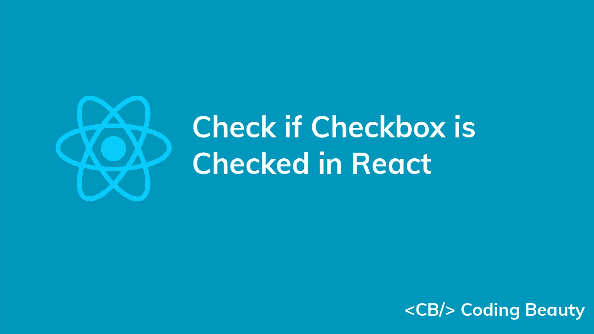
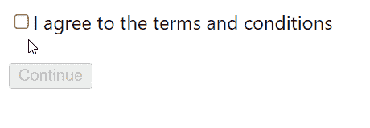
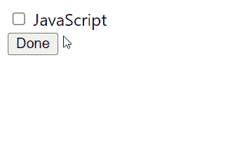

# 如何在 React 中检查复选框是否被选中

> 原文：<https://javascript.plainenglish.io/react-check-if-checkbox-is-checked-834a50ff16ec?source=collection_archive---------4----------------------->



要检查 React 中的复选框是否已选中，请执行以下操作:

1.  创建一个布尔状态变量来存储复选框的值。
2.  在输入复选框上设置一个`onChange`事件监听器。
3.  在监听器中，使用事件对象的`target.checked`属性来检查复选框是否被选中。
4.  将`checked`值存储在一个状态变量中，以便能够从事件监听器外部检查复选框是否被选中。

`App.js`

```
import { useState } from 'react';

export default function App() {
  const [agreement, setAgreement] = useState(false);
  const handleChange = (event) => {
    setAgreement(event.target.checked);
  }
  return (
    <div>
      <div id="app">
        <input
          type="checkbox"
          name="agreement"
          onChange={handleChange}
        />
        <label for="agreement">
          I agree to the terms and conditions
        </label>
        <br /><br />
        <button disabled={!agreement}>Continue</button>
      </div>
    </div>
  );
}
```



The button is disabled depending on the checkbox’s checked value.

事件对象的`target`属性代表复选框`input`元素；它的`checked`属性的值表示复选框是否被选中。

事件对象被传递给`onChange`监听器，每当复选框被选中或取消选中时，这个监听器都会被调用。

我们使用`[useState](https://reactjs.org/docs/hooks-state.html)` React 钩子来存储复选框的选中状态。`useState`返回两个值的数组；第一个是存储状态的变量，第二个是在被调用时更新状态的函数。

所以每次勾选或取消勾选复选框时，`agreement`状态变量会自动切换到`true`或`false`。

当`agreement`分别为`true`和`false`时，我们将按钮的`disabled`属性设置为`agreement`的反相来禁用和启用它。

# 检查是否勾选了参考复选框

我们可以创建一个[非受控](https://reactjs.org/docs/uncontrolled-components.html)复选框，并检查它是否被 [ref](https://reactjs.org/docs/refs-and-the-dom.html) 选中，而不是用 React 状态控制复选框的选中值。

例如:

`App.js`

```
import { useState, useRef } from 'react';

export default function App() {
  const [message, setMessage] = useState('');
  const checkbox = useRef();
  const handleClick = () => {
    if (checkbox.current.checked) {
      setMessage('You know JS');
    } else {
      setMessage("You don't know JS");
    }
  }
  return (
    <div>
      <div id="app">
        <input
          type="checkbox"
          name="js"
          ref={checkbox}
        />
        <label for="js"> JavaScript </label>
        <br />
        <button onClick={handleClick}>Done</button>
        <p>{message}</p>
      </div>
    </div >
  );
}
```



A message depending on the checkbox’s checked value is displayed.

受控输入中的数据由 React state 处理，但是对于非受控输入，它由 DOM 本身处理。这就是为什么上例中的`input`复选框没有设置`value`道具或`onChange`事件处理程序。相反，我们检查复选框是否被 React ref 选中。当用户切换复选框时，DOM 更新选中的值。

我们创建一个带有`[useRef](https://reactjs.org/docs/hooks-reference.html#useref)`钩子的 ref 对象，并将其分配给复选框`input`的`ref`道具。这样做将 ref 对象的`current`属性设置为代表 checkbox 的 DOM 对象。

`useRef`返回一个可变对象，当组件更新时，该对象保持其值。此外，修改该对象的`current`属性的值不会导致重新渲染。这不同于从`useState`钩子返回的`setState`更新函数。

尽管 React 文档建议使用受控组件，但非受控组件也有一些优势。如果表单非常简单，不需要即时验证，并且只需要在提交表单时访问值，那么您可能更喜欢使用它们。

*最初发表于*[*codingbeautydev.com*](https://cbdev.link/a242a1)

# JavaScript 做的每一件疯狂的事情

一本关于 JavaScript 微妙的警告和鲜为人知的部分的迷人指南。


[**报名**](https://cbdev.link/d3c4eb) 立即免费领取一份。