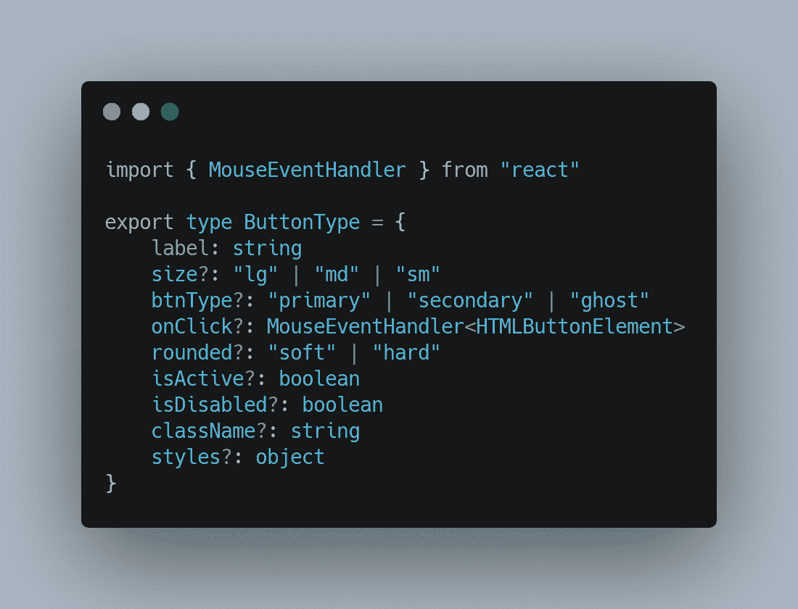

# 使用 TypeScript 和 Rollup 构建您的 React 组件库

> 原文：<https://javascript.plainenglish.io/react-component-library-with-ts-and-rollup-77aca0c727bf?source=collection_archive---------1----------------------->

## 构建 React 组件库以节省宝贵开发时间的简单指南。

Photo by [Arnold Francisca](https://unsplash.com/@clark_fransa?utm_source=medium&utm_medium=referral) on [Unsplash](https://unsplash.com?utm_source=medium&utm_medium=referral)

# 为什么要付出努力？

在进入整个过程之前，让我们先思考一下这项工作背后的原因？为什么你或者任何人想要制作一个 React 组件库？嗯，答案是简单明了的，你是愿意一次又一次地努力做一些像按钮一样简单的东西，还是像导航条一样复杂的东西，还是愿意一次又一次地努力然后简单地使用它？我知道你的答案会是什么；显然是后者。

# 入门指南

每当我开始一个新的 React 项目时，我喜欢确定所有需要的组件，并创建一个单独的组件文件夹，就像我自己的本地组件库一样。如果你也做类似的事情，我相信你会像我一样有兴趣做一个自己的图书馆。

**GitHub →**

 [## GitHub-aa kash 1103 jha/React-component-lib:React…

### React 项目的不同 UI 组件的集合，用 TypeScript 编写。反应打字稿故事书-为…

github.com](https://github.com/Aakash1103Jha/react-component-lib.git) 

**先决条件**

使用 TypeScript 创建这些组件才有意义。使用 TypeScript 将帮助我们创建这些组件的类型，这在我们以后使用它们时肯定会派上用场。为了捆绑这些组件，我们将使用 Rollup。虽然它对我来说有点新——我更习惯使用 web pack——但在使用 Rollup 之后，我确实感到惊讶。对于样式，我使用 CSS 来保持简单。基于这里所需要的，了解一点 TypeScript 以及它如何与 React 一起使用是一个好主意。对 Rollup 了解很多并不是一个很大的要求，但是当然，有一些想法将是一件好事。

# 目录结构

让我们简单地从一个`Button`组件开始。项目根目录下有所有的配置文件和 src 目录。每个目录都有一个`index.ts`文件来处理导入和导出，这样当包被创建并且有人使用这个库时，他们可以直接从库中导入组件，而不必在里面挖掘。

`src`目录下有一个`components`目录，其中又有一个`index.ts`文件和每个组件的文件夹——现在，只有一个按钮文件夹。

# 构建按钮组件

## Button.tsx

Button.tsx

如果您熟悉 React 和 TypeScript，这里没有什么是新的。但是如果你不是，我们需要在这里使用`@types`,告诉 TypeScript 这个`Button`是什么——一个反应功能组件。因此我们将类型指定为`Button: React.FC<ButtonType>`以及组件将接收的道具的类型，如`ButtonType`。

## 按钮.类型. ts

Button.types.ts

这里，我们再次为每个道具指定类型。当我们开始使用这个组件时，这就是我们将在后面看到的智能场景。

## 按钮. css

Button.css

一个简单的按钮，没有风格，用起来会很无聊；甚至看一眼。这里我们看到一个默认的`.button`类，它一直应用于按钮。然后我们有很多其他的类，它们是根据传递的道具来添加/删除的。

到目前为止，一切都很简单，看起来简单而熟悉。但是我之前说的`index.ts`档呢？它们是如何使用的？

## index.ts 文件

**./src/components/Button/index.ts**

**./src/components/index.ts**

**./src/index.ts**

## `TypeScript Configurations`

我们需要 TypeScript 做一些事情，并在编译成 JavaScript 时生成——为所有的`.ts`文件生成映射文件。

**tsconfig.json**

这就是我们需要做的一切，至少在 React 端，来制作一个组件，并把我们带到下一步，把所有的东西捆绑在一起。现在，汇总接管。

# 带有汇总的捆绑

为了更好地了解可供开发者使用的所有捆绑器，我建议你阅读由 Paul Sweeney 撰写的这篇文章。我发现 Rollup 有点奇怪，也让我着迷的是，正如 Paul 所说:

> *它不懂 Node.js 模块导入，它不知道 CSS 做什么，它当然看不懂图片。相反，它没有试图实现它认为捆绑不同类型资产的最佳方式，而是将这完全留给开发人员来决定。*

# 安装汇总

很简单，运行`npm i --save-dev rollup`即可。更多关于这个[这里](https://rollupjs.org/guide/en/#installation)。至于 rollup.config.json，下面的代码片段是我们所需要的，用来处理样式表、类型定义、映射、cjs 和 ES6 模块创建。

# rollup .配置. js

# 修改`package.json`文件

如果没有更改或添加`package.json`中的`build`脚本，或者构建脚本中没有`tsc`，现在就应该对其进行更改，以便汇总接管。

有几件事是我们的库正常工作所需要的。参考前面显示的目录结构，这几个字段在我们的`package.json`中是必须的。

*   `main` -此库的入口文件的位置。
*   `modules`-es6 模块入口文件的位置。
*   `types` -所有其他类型定义文件的入口文件位置。
*   `files`-NPM 捆绑发布时必须包括的所有文件和文件夹的列表。
*   `peerDependencies` -由于使用此库自然需要 reaction，因此最好将库使用的版本作为 peerDependency，以避免与用户可能使用的版本发生任何冲突。
*   `scripts` -主脚本是使用我们的`rollup.config.json`的`build`脚本(就像我们会指定如果我们使用的是 webpack)。另外还有一个`rollup-watch`脚本，它让 rollup 在 watch 模式下持续运行，以监视我们所做的更改。

# 最后一步`build`

现在我们要做的就是在我们的终端运行`npm run build`命令，静观其变，希望我们没有犯任何错误，并观看神奇的事情发生。如果你和我没有犯愚蠢的拼写错误或者错过任何配置，你会在库的根看到一个`dist`文件夹。如果是的话，深呼吸，庆祝一下！我们成功了！

# 消费图书馆

## 在本地

在本地使用库需要两步过程。首先，打开一个新的终端窗口，导航到你的项目根并运行`npm link`。然后，打开另一个终端窗口并导航到要在其中使用库的项目。然后运行`npm run <package_name>`。套餐名称与您的`package.json`相同。瞧。我们又做到了！更多关于 npm 链接[这里](https://docs.npmjs.com/cli/v6/commands/npm-link)

## 发布到 npm 注册表

将你的库推送到 npm 需要你有一个[npmjs.com](http://npmjs.com)的账户，如果你没有，你可以在这里免费创建它。请记住，一个免费账户将只允许你发布公共包——你的`package.json`中的`private`字段应该设置为`false`。下一件要记住的事情是，每次你决定将你的包推送到 npm，你必须改变你的`package.json`中的版本号，否则你会得到一个错误。考虑到这一切，

*   用`npm build`构建你的项目
*   运行`npm publish`，它将使用`files`字段，我们之前在`package.json`中添加的字段，来决定应该将哪些文件推送到注册表中。

瞧啊。我们又一次成功了！！

感谢您花时间阅读这篇长文。我希望这对你有帮助，你确实创建了你的库。

如果您遇到任何问题，或者这篇文章的代码部分有问题，请不要犹豫，让我知道，我会确保纠正它。

如果你知道我们刚才做的事情的更好的方法，请联系我，因为我也想学。谁不想用更好的方式做事呢？

> 结束。再次感谢。

## 进一步阅读

 [## 使用位添加提取和重用预先存在的组件

### 最后，您完成了为应用程序中的输入创建一个奇妙的输入字段的任务。你对……很满意

比特云](https://bit.cloud/blog/-extracting-and-reusing-pre-existing-components-using-bit-add-l28qlxpz) 

*更多内容请看*[***plain English . io***](https://plainenglish.io/)*。报名参加我们的* [***免费周报***](http://newsletter.plainenglish.io/) *。关注我们关于*[***Twitter***](https://twitter.com/inPlainEngHQ)[***LinkedIn***](https://www.linkedin.com/company/inplainenglish/)*[***YouTube***](https://www.youtube.com/channel/UCtipWUghju290NWcn8jhyAw)***，以及****[***不和***](https://discord.gg/GtDtUAvyhW) *对成长黑客感兴趣？检查* [***电路***](https://circuit.ooo/) ***。*****