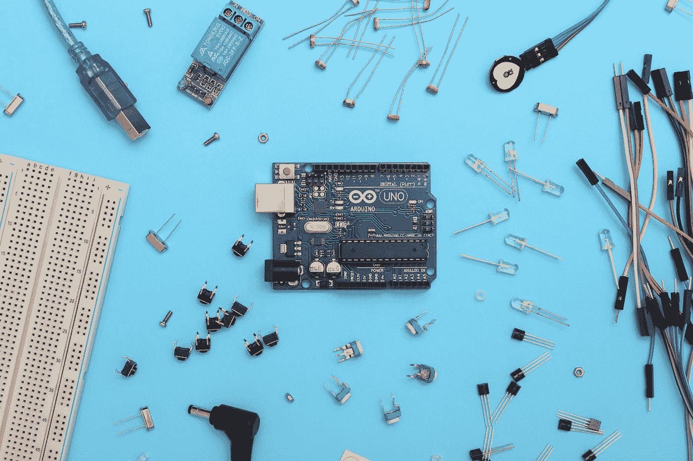

# React 组件:类与函数

> 原文：<https://javascript.plainenglish.io/react-components-class-vs-function-ff13d13a2640?source=collection_archive---------18----------------------->

## React 组件的两种类型，如何创建它们，以及类组件和函数组件之间的区别



Photo by [Sahand Babali](https://unsplash.com/es/@sahandbabali?utm_source=medium&utm_medium=referral) on [Unsplash](https://unsplash.com?utm_source=medium&utm_medium=referral)

正确使用 React 组件可以成为 web 开发人员最好的朋友。它们有助于避免页面上重复元素的重复代码，是创建动态界面的强大工具。理解什么是 React 组件以及如何声明一个 React 组件是释放 React 库威力的第一步。

这篇文章将研究两种不同类型的 React 组件，并讨论它们应该在哪些场景中使用。

*注意:如果你正在寻找开始你的第一个 React 项目，并且不确定从哪里开始* [*查看我最近的帖子*](https://medium.com/@simply_stef/leave-tutorial-mode-behind-and-build-your-own-react-app-207d405d1) *。*

# 什么是反应组件

一个 *React 组件*是一小段可重用的代码，它应该(根据定义)负责一项工作——通常包括 HTML 的呈现。

组件可以通过两种方式之一创建为函数或类，一旦创建，就可以导入并在 react 项目中的其他地方声明。

# 类别组件

类组件的编写方式与任何其他 JavaScript 类相同。要创建一个 React 类组件，有必要将其创建为子类，并始终扩展 React 中组件**的类。**

```
import React from 'react'class MyComponent extends React.Component { 
    render (  
         <div>
            <h1>My Title</h1>
            <h2>Subtitle</h2>
         </div>
       )
     }
```

一旦创建了类，就可以在其中编写许多不同的函数(内置的和自定义的)。

有一个**强制属性**供组件运行，那就是`render`方法。

每当组件被调用时(在初始加载和后续更新中), render 方法就会运行，并且它必须包含一个`return`语句——通常返回一个 JSX 表达式。

如果向组件传递属性(props ),那么构造函数方法也可以像标准 JavaScript 类一样使用。

**重要提示:**反应组件的名称**必须**大写。如果它以小写字母开头，React 将不会识别它，也不会渲染。

**重要提示 2** :如果使用一个构造函数类，在列出任何要定义的新属性之前，`super(props)`的声明是一个强制性的包含。

# 功能组件

函数组件以与 JavaScript 箭头函数相同的格式编写。组件是使用大写字母 camel case、括号之间传递的任何输入和定义的函数内容来定义的。

一般来说，功能组件是无状态组件，这意味着不可能在其中定义构造函数。

下面的例子显示了如何创建一个基本的头组件。

```
const HeaderComponent = () => {
  return (
    <header>
    <h1>Main Title</h1>
    <h2>Subtitle</h2>
    </header>
  )
}
```

从例子中可以看出，语法比定义一个类组件简单得多，而且可读性很高。

# 在它们之间选择

您应该使用的组件类型将取决于您的功能的应用和内容。

对于纯粹的表示性组件，它接受一些输入属性并在屏幕上呈现 HTML 元素，那么功能性组件的简化语法是首选的。

当创建交互组件时，创建的组件根据用户交互有许多不同的状态，类组件是最通用的。如上所述，类组件带有许多内置方法(生命周期方法),当与组件交互时会自动调用这些方法。

然而，当 React 16.8 推出时，它包括了挂钩的添加。钩子允许用户处理状态和其他 React 特性，而不需要编写类。钩子的加入增加了功能组件的受欢迎程度，因为它使它们更加通用。

就个人而言，我仍然在学习钩子的全部潜力，我所学的课程是从介绍类组件开始的，所以我仍然使用两者的混合。

# 摘要

总之，当使用遗留 React 脚本时，通常会发现所有需要在不同状态下进行更改的交互组件都将被编写为类组件，而功能组件则被保留用于纯粹的表示元素。用 React 16.8 及更高版本(2019 年年中推出)创建的现代脚本更倾向于使用函数类作为默认，并包含挂钩来处理类组件之外的状态。

简而言之，功能组件提供了设置更简单的好处，而类组件有许多用于动态更新的内置方法。

***如果你喜欢这个帖子并想阅读更多，请务必查看我的个人资料或*** [***订阅***](https://medium.com/subscribe/@simply_stef) ***的类似帖子。***

***考虑成为媒介会员，获得无限接触最好的创意和作家的机会。*** [***如果你通过这个链接加入 Medium，我会从你的费用中收取很少的一部分——而且不会额外增加你的费用！***](https://medium.com/@simply_stef/membership)

***感谢阅读！***

*更多内容请看*[***plain English . io***](https://plainenglish.io/)*。报名参加我们的* [***免费周报***](http://newsletter.plainenglish.io/) *。关注我们关于*[***Twitter***](https://twitter.com/inPlainEngHQ)*和*[***LinkedIn***](https://www.linkedin.com/company/inplainenglish/)*。查看我们的* [***社区不和谐***](https://discord.gg/GtDtUAvyhW) *加入我们的* [***人才集体***](https://inplainenglish.pallet.com/talent/welcome) *。*