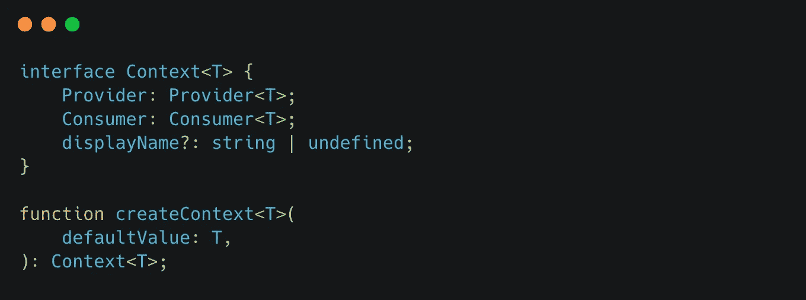
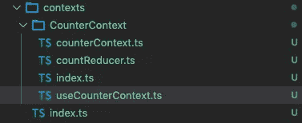
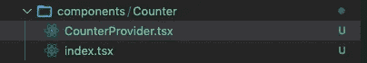

# 反应上下文最佳架构实践

> 原文：<https://javascript.plainenglish.io/react-context-best-architecture-practice-c7988c82d539?source=collection_archive---------3----------------------->

React Context — Made by [Carbon](https://carbon.now.sh/)

> 首先，我假设你已经对[反应上下文](https://beta.reactjs.org/learn/passing-data-deeply-with-context#step-1-create-the-context)有所了解

过去几天一直在用 React Context，所以总结了一个非常有用的通用架构。

好吧，让我们开始吧！

## 准备

*   我们将使用[打字稿](https://www.typescriptlang.org/)。
*   基于 [Next.js](https://nextjs.org/docs/getting-started) 创建项目结构。
*   为了获得更好的可视化体验，我们建议您安装 [React-Dev-Tools](https://chrome.google.com/webstore/detail/react-developer-tools/fmkadmapgofadopljbjfkapdkoienihi?utm_source=chrome-ntp-icon) 。

## 初始化项目

1.  在您的终端上输入`npx create-next-app@latest`
2.  按照提示输入适当的选项
3.  正在等待安装依赖项

## 改善项目结构

*   在根目录下创建一个名为 *contexts* 的新文件夹
*   然后，我们在 contexts 内部创建一个名为 *CounterContext* 的新文件夹，并在 contexts 文件夹的同一层创建一个 *index.ts* 文件(用于导出我们在工作中创建的所有上下文——也适用于其他业务模块)
*   类似地，在 CounterContext 文件夹中创建一个名为 *index.ts* 的新文件
*   好了，让我们在*count context*文件夹中创建另一个*count context . ts*文件、countReducer.ts、use count context . ts
*   到目前为止，您的项目结构应该如下所示

React context project structured

## 编码

*   在 *counterContext.ts、*中，我们定义了上下文所需的一些类型，值得注意的是，我们使用了 [useReducer](https://beta.reactjs.org/learn/extracting-state-logic-into-a-reducer#step-3-use-the-reducer-from-your-component) ，因此这些类型看起来有点像 redux，但不要担心，并没有那么复杂:

*   然后，这里我们使用 useReducer 作为触发上下文状态的函数，它可以让我们非常清楚地知道状态的变化:

*   事实上，我们已经可以通过使用`CounterContext.Consumer`来使用这个反上下文(它也适用于类组件)，但是为了更好地使用钩子，我们可以包装它:

## 使用

*   让我们在根目录下创建一个名为*组件*的新文件夹，并在其中创建一个名为*计数器*的新文件夹

Context Folder E.G

*   在 *CounterProvider.tsx，*中，我们使用 useReducer 作为提供者包装反上下文(你也可以把它放在入口文件中)，顺便说一下，我们在 useReducer 中传入了两个通用参数，看看发生了什么，传入的类型是我们之前正式定义的，这让我们非常清楚谁在使用它，这对维护一个大中型项目至关重要。

*   在 *Counter/index.tsx，*中，我们使用`dispatchCount`触发了对上下文状态的更新，此时我们打开了浏览器，看到它成功运行了！🎉 🎉 🎉

## 结论

在本文中，我们基于 Next.js 创建了一个项目，并使用 Context、useReducer、TypeScript 来维护我们的代码，并标准化一个包含*上下文*的目录来管理 React 上下文。

好了，我希望这篇文章能帮助你，如果你有任何问题，你可以联系我，谢谢你的阅读！

以上代码可以在 [my GitHub](https://github.com/iseekTo/react-context-demo) 上找到

## 了解更多信息

 [## 反应文档测试版

### 我们重写了 React 文档，但有一些不同:所有的解释都是用钩子写的，而不是…

beta.reactjs.org](https://beta.reactjs.org/)  [## GitHub-iseekTo/React-Context-demo:React 上下文最佳架构实践

### 此时您不能执行该操作。您已使用另一个标签页或窗口登录。您已在另一个选项卡中注销，或者…

github.com](https://github.com/iseekTo/react-context-demo) 

*更多内容看* [***说白了。报名参加我们的***](http://plainenglish.io/) **[***免费周报***](http://newsletter.plainenglish.io/) *。在我们的* [***社区不和谐***](https://discord.gg/GtDtUAvyhW) *获得独家获取写作机会和建议。***