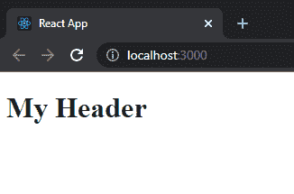
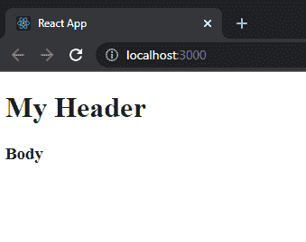
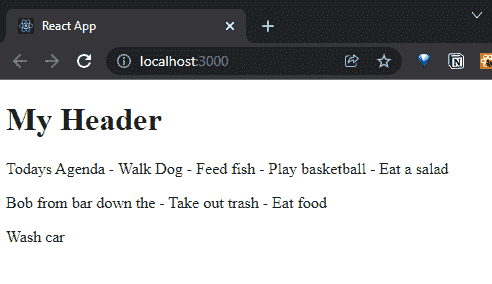

# React 速成班—组件、页面和道具

> 原文：<https://javascript.plainenglish.io/react-crash-course-components-pages-and-props-4650081684d0?source=collection_archive---------7----------------------->

## 第 3 部分:构建组件和使用数据


Photo by [Lautaro Andreani](https://unsplash.com/@lautaroandreani?utm_source=medium&utm_medium=referral) on [Unsplash](https://unsplash.com?utm_source=medium&utm_medium=referral)

*Live dev 笔记由*[*Dennis Ivy*](https://www.youtube.com/channel/UCTZRcDjjkVajGL6wd76UnGg)*——*[*React JS 速成班*](https://www.youtube.com/watch?v=6fM3ueN9nYM)

> 在第 3 部分中，我们开始构建组件(借助快捷方式)，将它们嵌套到页面组件中，并通过 props 传递数据。

你也可以参考我的 Github repo:

[](https://github.com/emilyyleung/notesapp/tree/Part-3/Components-Pages-Props) [## GitHub-Emily leung/notes app at Part-3/Components-Pages-Props

### 在 GitHub 上创建一个帐户，为 Emily leung/notes app 的开发做出贡献。

github.com](https://github.com/emilyyleung/notesapp/tree/Part-3/Components-Pages-Props) 

# 创建我们的第一个组件

为了保持整洁和一致，我们将首先在`src`文件夹中创建一个名为`components`的文件夹。我们的第一个组件将是`Header.js`。

> 注意它是一个在命名约定中使用大写字母的 JavaScript 文件。

```
notesapp
├── public
│   └── index.html
└── src
    ├── components // New folder
    │    └── Header.js // New component
    ├── App.css
    ├── App.js
    └── index.js
```

因为我们使用函数来定义组件，所以有两种方法可以使用函数来创建组件:

*   正则函数
*   箭头功能

> 在本教程中，我们所有的组件都将使用箭头函数，只有 App 组件将使用常规函数。当我们开始整合道具时，箭头功能会对我们有所帮助，稍后会有更多的介绍。

就像组件文件的名称一样，确保函数的名称以大写字母开头。

```
// notesapp > src > components > Header.jsconst Header = () => {
    return (
        <div>
            <h1>My Header</h1>
     </div>
    )
}export default Header;
```

为了将`Header`组件引入我们的应用程序，我们首先需要导入它。

```
// notesapp > src > App.jsimport './App.css';
import Header from './components/Header' // Import componentfunction App() {
  return (
    <div className="App">
      <Header />
    </div>
  );
}export default App;
```



同样，让我们创建一个`Body.js`组件。这次我们将使用我们在第 2 部分中安装的 ES7 React snippets 插件提供的快捷方式。要创建具有箭头功能的 react 组件，请使用快捷键:

```
rafce
```

这将创建以下代码片段供我们填写:

```
// notesapp > src > components > Body.jsimport React from 'react'const Body = () => {
    return (
        <div>

        </div>
    )
}export default Body
```

> 请注意，使用此快捷方式时，我们不再需要手动输入组件名称。它自动知道使用大写字母，因为它是从文件名中获取的。
> 
> 此外，通过使用快捷方式，它将为 React 添加`import`语句。因为我们使用 create-react-app，所以不再需要该语句。因此，这可以删除。

使用另一个快捷方式，我们可以通过使用下面的快捷方式在`App.js`中导入我们的`Body`组件:

```
imp + tab
```

这一次，它将突出显示我们提供组件位置的占位符文本，准备好供我们覆盖。再次按下键盘上的 tab 键会将焦点转移到组件的名称上，以便我们声明我们想要导入哪个组件。

```
import moduleName from 'module'
```

导入后，我们可以将我们的`Body`组件引入到应用程序中。

```
// notesapp > src > App.jsimport './App.css';
import Header from './components/Header'
import Body from './components/Body' // Import componentfunction App() {
  return (
    <div className="App">
      <Header />
      <Body />
    </div>
  );
}export default App;
```



# 构建组件时要记住的一些事情:

*   每个组件必须有一个父元素来包装所有其他的组件
*   不使用`<div>`作为父节点，你可以使用片段(例如`<></>`)但是，片段不能有分配给它们的类

# 添加页面

React 中的页面与组件相同，但是为了跟踪它们，我们将它们放在自己的文件夹中。让我们在`src`中创建一个名为`pages`的新文件夹。在其中，我们将创建一个新的页面组件`NotesListPage.js`，它将作为 notes 应用程序的主页。

```
notesapp
├── public
│   └── index.html
└── src
    ├── pages // New folder
    │    └── NotesListPage.js // New file
    ├── components
    │    ├── Header.js
    │    └── Body.js
    ├── App.css
    ├── App.js
    └── index.js
```

同样，我们将使用快捷键来创建导出组件:`rafce`

在页面组件内部，我们将赋予它一些内容。

```
// notesapp > src > pages > NotesListPage.jsconst NotesListPage = () => {
    return (
        <div>
            Notes
        </div>
    )
}export default NotesListPage
```

为了向您展示互换组件是多么容易，我们可以简单地从`App.js`中移除我们之前制作的`Body`组件，并用新的页面组件替换它。确保将导入位置更改为指向`pages`文件夹。

```
// notesapp > src > App.jsimport './App.css';
import Header from './components/Header'
import NotesListPage from './pages/NotesListPage'function App() {
  return (
    <div className="App">
      <Header />
      <NotesListPage />
    </div>
  );
}export default App;
```

# 使用数据

到目前为止，我们已经对 notesapp 的所有内容进行了硬编码。研究如何呈现存储在其他地方的数据将是一件好事。现在，我们将使用存储在本地数据文件中的数据。

创建一个名为`data.js`的新文件，它位于一个新文件夹`assets`中

```
notesapp
├── public
│   └── index.html
└── src
    ├── assets // New folder
    │    └── data.js // New file
    ├── pages
    │    └── NotesListPage.js
    ├── components
    │    ├── Header.js
    │    └── Body.js
    ├── App.css
    ├── App.js
    └── index.js
```

在`data.js`内部，我们将创建一个包含 3 个属性的 note 对象数组:`id`、`body`和`updated`

```
// notesapp > src > assets > data.jslet notes = [
 {
  id: 1,
  body: "Todays Agenda\n\n- Walk Dog\n- Feed fish\n- Play basketball\n- Eat a salad",
  updated: "2021-07-14T13:49:02.078653Z",
 },
 {
  id: 2,
  body: "Bob from bar down the \n\n- Take out trash\n- Eat food",
  updated: "2021-07-13T20:43:18.550058Z",
 },
 {
  id: 3,
  body: "Wash car",
  updated: "2021-07-13T19:46:12.187306Z",
 },
];export default notes;
```

要访问`data.js`，我们需要导入它。然后创建一个容器，通过 JavaScript map 函数列出所有注释的正文内容。

> 注意花括号不仅用于插入 JavaScript，还用于访问每个注释的属性。

```
// notesapp > src > pages > NotesListPage.jsimport notes from '../assets/data' // Import dataconst NotesListPage = () => {
    return (
        <div>
            <div className='notes-list'>
                {notes.map(note => (
                    <p>{note.body}</p>
                ))}
            </div>
        </div>
    )
}export default NotesListPage
```



此时，`NotesListPage`页面组件正在呈现数据。然而，我们想把每个音符变成它自己的组成部分。所以我们将创建一个新的组件`ListItem.js`，我们可以从页面组件中单独定制它。

```
notesapp
├── public
│   └── index.html
└── src
    ├── assets
    │    └── data.js
    ├── pages
    │    └── NotesListPage.js
    ├── components
    │    ├── Header.js
    │    └── ListItem.js // New file
    ├── App.css
    ├── App.js
    └── index.js
```

在它里面，我们将创建并赋予它一个独特的价值，以区别于我们当前的元素。

```
// notesapp > src > components > ListItem.jsconst ListItem = () => {
    return (
        <div>
            <h3>List Item</h3>
        </div>
    )
}export default ListItem
```

接下来，我们将把`ListItem`组件导入页面并替换段落标签。

```
// notesapp > src > pages > NotesListPage.jsimport notes from '../assets/data'
import ListItem from '../components/ListItem'const NotesListPage = () => {
    return (
        <div>
            <div className='notes-list'>
                {notes.map(note => (
                    **<ListItem/>**
                ))}
            </div>
        </div>
    )
}export default NotesListPage
```


# 小道具

目前，我们看不到我们的注释，因为没有数据传递给`ListItem`组件。要做到这一点，我们需要使用一些叫做道具的东西。

在 React 中，有两种不同类型的数据:

*   **Props:** 是一种不可变的数据形式。这意味着一旦它被传递下来，就不能被修改
*   **状态:**是我们可以更新的数据(稍后会详细介绍)

因为我们使用函数来构建组件，所以 props 将充当属性或参数，我们可以将它们传递给每个子组件。类似于函数如何通过实参传递参数，我们在这里也可以这样做。

让我们看看当我们在`ListItem`组件中`console.log`props 对象时会发生什么。

```
// notesapp > src > components > ListItem.jsconst ListItem = (props) => {

    **console.log("PROPS:", props)**

    return (
        <div>
            <h3>List Item</h3>
        </div>
    )
}export default ListItem
```


您首先会注意到有一个警告错误。这个错误的原因是因为在`NotesListPage.js`内部，我们循环遍历并返回每个`ListItem`。然而，当我们这样做时，React 需要识别虚拟 DOM 中的每个列表项。因此，每当我们更新一个项目，而不是更新每个项目，它会根据`key`属性知道需要更改哪个项目。

为了解决这个问题，我们将通过在 map 函数中添加括号来提取索引，并将索引作为属性`key`的值传递。索引将总是从 0 开始递增。

```
// notesapp > src > pages > NotesListPage.jsimport notes from '../assets/data'
import ListItem from '../components/ListItem'const NotesListPage = () => {
    return (
        <div>
            <div className='notes-list'>
                **{notes.map((note, index) => 
                    <ListItem key={index} />
                )}**
            </div>
        </div>
    )
}export default NotesListPage
```

您将注意到的第二件事是，对于每个列表项，props 值是一个空对象。类似于`key`属性，我们可以像添加自定义 HTML 属性一样传入注释内容。在这种情况下，由于我们已经通过 map 函数提取了注释，我们可以将注释对象传递给`ListItem`来访问它的内容。

```
// notesapp > src > pages > NotesListPage.jsimport notes from '../assets/data'
import ListItem from '../components/ListItem'const NotesListPage = () => {
    return (
        <div>
            <div className='notes-list'>
                {notes.map((note, index) => 
                    **<ListItem key={index} note={note}/>**
                )}
            </div>
        </div>
    )
}export default NotesListPage
```

看一看我们的`console.log`中的 props，显示 props 不再是空的，而是返回每个 note 对象。


为了在子组件中呈现每个注释的内容，我们将跳回到`ListItem.js`来指定我们希望从注释对象中得到哪个参数。

要访问该参数，程序如下:
`props` → `attribute` → `key/parameter of object`

```
// notesapp > src > components > ListItem.jsconst ListItem = (props) => {
    console.log("PROPS:", props)
    return (
        <div>
            <h3>**{props.note.body}**</h3>
        </div>
    )
}export default ListItem
```


## 破坏道具

使用 props 的一个快捷方式是析构对象。在这种情况下，我们用“note”替换 props，这意味着我们不需要每次在开始时都键入“props”。

```
// notesapp > src > components > ListItem.jsconst ListItem = **({note})** => {
    return (
        <div>
            <h3>**{note.body}**</h3>
        </div>
    )
}export default ListItem
```

*更多内容看* [*说白了。报名参加我们的*](http://plainenglish.io/) [*免费每周简讯*](http://newsletter.plainenglish.io/) *。在我们的* [*社区*](https://discord.gg/GtDtUAvyhW) *获得独家写作机会和建议。*