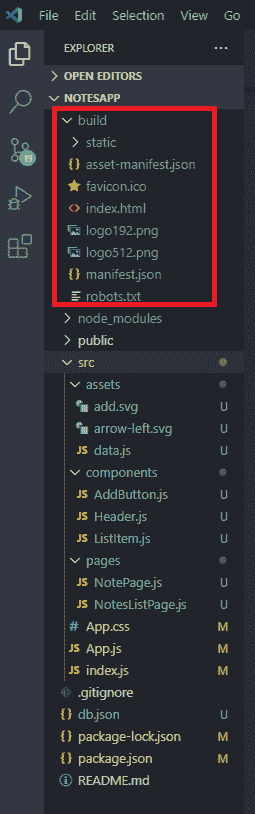
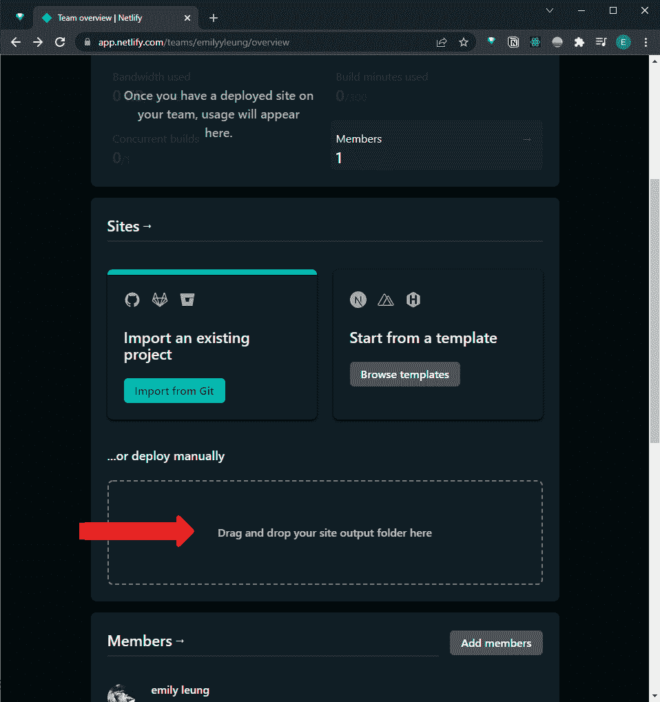
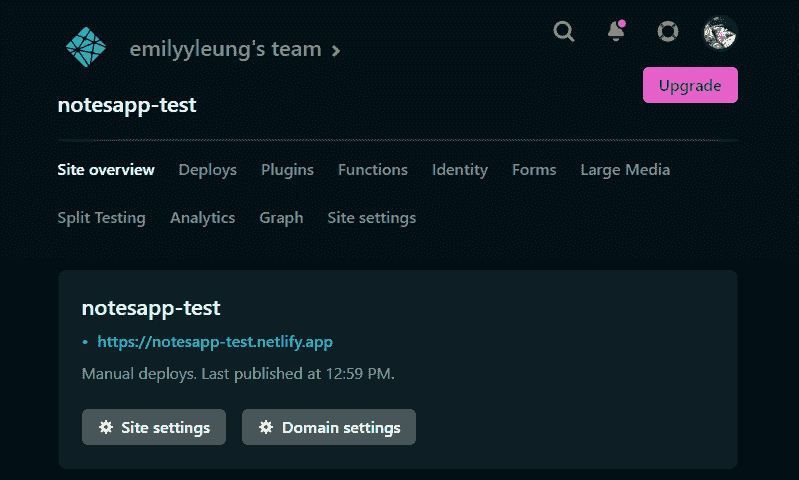
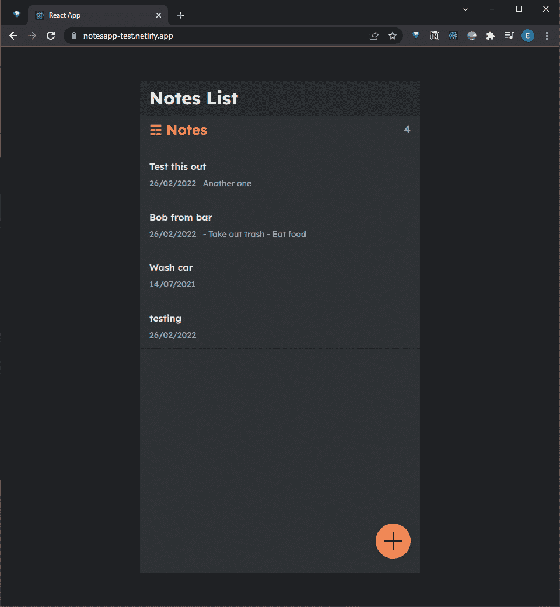
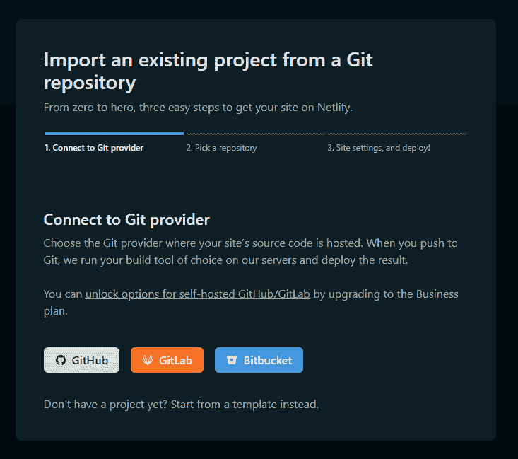
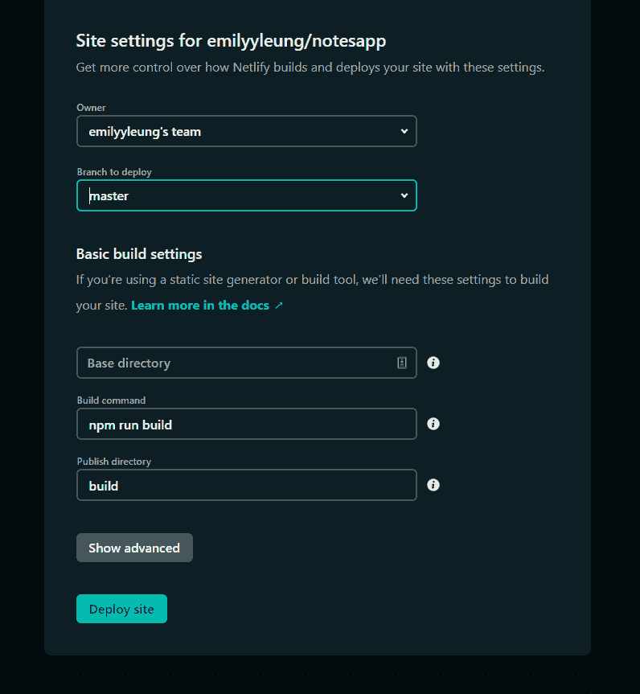
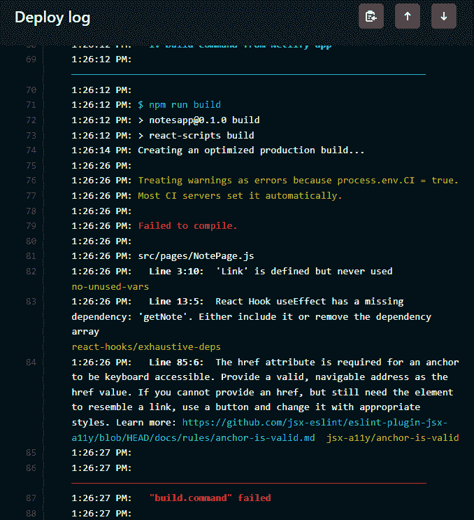
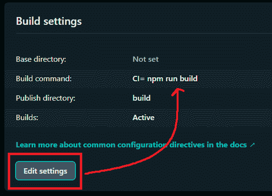

# React 速成班—部署到网络生活

> 原文：<https://javascript.plainenglish.io/react-crash-course-deploying-to-netlify-80cee518a3cc?source=collection_archive---------20----------------------->

## 第 12 部分:让 React 应用程序准备好在 Netlify 上部署


Photo by [Lautaro Andreani](https://unsplash.com/@lautaroandreani?utm_source=unsplash&utm_medium=referral&utm_content=creditCopyText) on [Unsplash](https://unsplash.com/@lautaroandreani?utm_source=unsplash&utm_medium=referral&utm_content=creditCopyText)

*Live dev 笔记由*[*Dennis Ivy*](https://www.youtube.com/channel/UCTZRcDjjkVajGL6wd76UnGg)*——*[*React JS 速成班*](https://www.youtube.com/watch?v=6fM3ueN9nYM)

在这个速成系列课程的最后一部分，我们将研究如何构建 React 应用程序，以便为部署做好准备。在这个过程中，我们将研究测试构建以及部署到 Netlify 和处理可能出现的错误的方法。

# 构建我们的 React 应用

在我们将 React 应用程序部署到 Netlify 上之前，我们需要测试当我们构建应用程序时，它是否与开发中一样工作。为此，我们将首先运行以下命令:

```
npm run build
```

这将创建一个应用程序的优化版本，它由一系列 HTML、CSS 和 JS 文件(也称为静态文件)组成，这些文件位于我们项目中新创建的`build`文件夹中。



随着 React 应用程序的构建，我们可以通过首先全局安装`serve`包来测试它是否真的在工作。

```
npm install -g serve
```

安装静态服务器后，让我们使用以下命令测试我们构建的项目:

```
serve -s build
```

但是，如果您当前仍然在默认端口 3000 上运行您的开发项目，那么您可以使用`-p`标志指定一个端口来服务构建的项目。在本例中，它被设置为端口 5000

```
serve -s build -p 5000
```

**注意:**我们对位于`src`文件夹中的工作文件所做的任何更改都不会自动出现在我们构建的应用程序中。为了看到这些变化，我们需要重新构建我们的应用程序来重新捆绑和替换我们当前的静态文件。

随着我们构建的项目成功地服务和测试，让我们部署到 Netlify。在我们开始之前，请确保拥有 Netlify 帐户。

# 网络部署选项 1 —拖放

部署到 Netlify 最简单(但效率最低——长期而言)的方法是创建一个新项目，然后将`build`文件夹直接拖放到项目中。



一旦它完成上传，网站将自动生成，蓄势待发！

**注意:**当在 Netlify 上创建一个站点时，它将被创建在一个随机的 URL 下。但是您可以通过域设置来更改它。只是要确保你想要的名字没有被占用！



如果您的本地 JSON 服务器仍然在后台运行，那么部署的应用程序将继续获取这些笔记。否则，默认情况下，如果该站点与其他人共享，他们将无法正确使用该应用程序，因为他们无法通过端口 8000 连接到您的本地服务器。



# Netlify 部署选项 2 —从 Github 部署

第二种方法的设置时间稍长一些，但是在进行更改时，这是长时间部署的理想过程。

为了开始，您需要将项目代码提交到 Github 存储库中。您也可以通过创建一个空的 Github 存储库来实现这一点，该存储库将提供一个使用 Github CLI 将现有代码推送到存储库的指令列表。

从这里，我们将返回 Netlify，并通过选择“从现有项目导入”来创建一个新项目。



在这种情况下，我们将选择 Github，它将引导我们登录 Github 并提供 Netlify 访问我们项目的权限。在我的例子中，我只授予它对 notes 应用程序存储库的权限。

接下来，我们将看到应用程序的站点设置。向下滚动，我们会看到 Netlify 为我们提供了一个 build 命令——与我们用来构建 React 应用程序的命令相同。这意味着当我们部署应用程序时，它将调用 build 命令，这样我们就不必这样做了。它所需要的是我们到目前为止一直在处理的项目文件。此外，由于我已经为 node 包含了一个`.gitignore`文件，它已经有了一个内置引用，当我将任何更改推送到 Github 存储库时，它会忽略构建文件夹。

我还确保选择了`production`分支(在截图中显示为`master`)。这样，当我在主/主分支上工作时，我可以保持构建工作流是独立的。



在这一点上，点击`Deploy Site`是有意义的——我们就是这样。但事实是，Netlify 很可能会返回一些错误(当我们在开发中检查它们时，这些错误实际上是警告)。



为了解决这个问题，我们将把 Netlify 提供的持续集成环境变量更新为 false，因为它目前将这些警告视为错误。任何像一个没有使用的包一样小的东西在 React 中都被认为是一个警告，因此它会导致 Netlify 将其视为 Netlify 部署过程中的一个错误。

来自 Netlify 的这些错误的目的是帮助我们更好地维护我们的代码——但是对于一个小的测试项目来说，这不是一个需要解决的关键问题。

为了让 Netlify 忽略这些小警告，我们将前往:

`Site settings`>`Build & deploy`>

在我们的 build 命令中，我们将在开头包含以下内容:

```
**CI=** npm run build
```

这将有效地将持续集成设置为 false。



随着 build 命令的更新，我们现在可以重新部署应用程序了。

这是我的现场演示:

 [## React 应用

### 使用 create-react-app 创建的网站

notesapp-test.netlify.app](https://notesapp-test.netlify.app/) 

以下是我的 Github 回购:

[](https://github.com/emilyyleung/notesapp) [## GitHub-Emily leung/notes app

### 在 GitHub 上创建一个帐户，为 Emily leung/notes app 的开发做出贡献。

github.com](https://github.com/emilyyleung/notesapp) 

# 总结想法

这一系列教程的重点是用 create-react-app 创建一个简单的 notes 应用程序。在这个过程中，我们学习了如何创建使用 JSON 数据的 React 组件、页面和路由。为了测试这个应用程序能否与后端一起工作，我们用`json-server`包创建了一个模拟 API 服务器。

因为后端是使用模拟 API 服务器创建的，该服务器将数据存储在一个 JSON 文件中，所以我们部署的最终应用程序被认为功能不全。相反，只有在端口 8000 上有一个本地 JSON 服务器打开时，它才能工作。

当然，另一种选择是将源代码从本地 JSON 服务器更改为使用 localStorage API，我在这里的“便笺——业务逻辑”中已经提到过:

[](/sticky-notes-business-logic-f69253fb45fd) [## 便笺——业务逻辑

### 第 2 部分:JavaScript 应用程序——构建时没有框架

javascript.plainenglish.io](/sticky-notes-business-logic-f69253fb45fd) 

*更多内容尽在* [***说白了. io***](https://plainenglish.io/) *。报名参加我们的**[***免费周报***](http://newsletter.plainenglish.io/) *。关注我们关于*[***Twitter***](https://twitter.com/inPlainEngHQ)*和*[***LinkedIn***](https://www.linkedin.com/company/inplainenglish/)*。加入我们的* [***社区不和谐***](https://discord.gg/GtDtUAvyhW) *。**